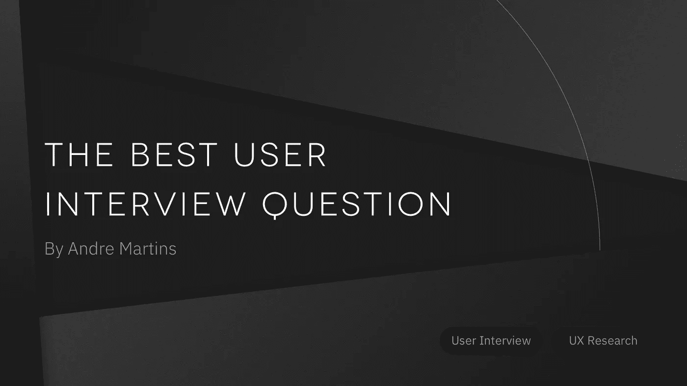

# 最佳用户面试问题

> 原文：<https://medium.com/hackernoon/the-best-product-ux-interview-question-e621445d0f02>

用户访谈很牛逼。

在很多情况下，它们是我倡导的第一批 UX 研究策略之一。他们可以帮助我们理解问题是什么，为什么会发生，甚至发现机会。

我们可以问用户很多问题，每个项目都有其独特之处。然而，从我的个人经验来看，有一个问题适用于各种情况。我喜欢它。这是迄今为止我所知道的最好的用户面试问题。我在这里分享我的宝贝，不再多说。

# 最佳用户访谈问题是:

> 告诉我你最后一次 ____。

就是这样。

这是我通常问的第一个问题。我可能会做一个小时的采访，一切都源于这个问题。而**它总能产生洞见**。没有例外。我称之为 **LTQ** ，或者说**上次的问题**。不，这不是问题。从技术上来说，这是一个请求，但这个人会回答你。

# *好的 Andre，但是为什么 LTQ 这么牛逼？*

因为它符合一个好的面试问题的所有主要标准:

*   它询问的是个人观点，而不是对错(减少受访者对被评估的焦虑)
*   它**开放式**并为对话创造空间(允许我们探索话题并发现我们雷达之外的事物。如果我们不知道问题的存在，我们就无法解决它。
*   这是**不偏不倚的**，允许用户自由发言(与小心眼的*你有问题 X* 或水仙’*我的产品有多好*相对)
*   这是关于 T21 的过去，而不是未来(人们不擅长预测自己的未来)
*   它讲的是一个具体的真实案例，而不是假设的行为(比邀请人们表达他们的理想自我而不是现实的行为要好得多)
*   这是一个**按时间顺序排列的问题**(它可以让用户轻松地记住事情，并让我们了解完整的客户旅程，包括体验前后发生的事情)。
*   它谈论的是问题、欲望和行为，而不是解决方案(“如果我问人们想要什么，他们会说是更快的马。”—错误地归因于亨利·福特，但仍然是一个很好的比喻)
*   它有一个**连锁反应**问题(您可以从这个请求中获得几十个主题进行探索)。

# 好吧，Andre，但是这种 LTQ 策略是如何运作的呢？

完美，让我们来想几个例子:

## **案例#01(新产品):素食主义者/食物过敏 Yelp**

我正在开始 *FindRightFood* ，这是一款帮助有饮食限制的人找到餐馆和美食的新产品。

**提问:** (问他们饮食有什么限制然后):

> **说说你上一次出去吃饭的情况。**

## **案例#02(现有产品):打车 App**

我在打车 App*UBR*上工作。我想看看整体体验如何，哪些有效，哪些无效。该团队没有任何数据，我不知道从哪里开始。

**问题:** (了解这个用户是否使用打车，使用频率然后):

> 告诉我你最后一次需要乘出租车的时间。
> 和
> **告诉我你最后一次需要乘坐 UBR 出租车的时间。**

## **案例#03(颠覆性市场概念):区块链 ID**

我正在开发 *MyTron，*一种新产品，它允许人们通过区块链密码来创建自我主权身份。这将允许他们拥有隐私并获得其数字身份的所有权，但他们不知道这是什么以及为什么这很重要。我该如何开始？

**问题:** (可以问他们在上个月安装了多少应用程序，或者他们通过智能手机/台式机/任何设备访问网络的频率如何):

> 请告诉我您最后一次在智能手机上登录应用程序的时间。
> 
> **告诉我你最近一次需要在网站上创建个人资料是什么时候。**

# 但是 Andre，我应该什么时候做 LTQ 问题？是为了我的产品吗？是给我的吗？

关于您的**产品**:

*   开始一个**新产品？动手吧。**
*   正在开发一款**现有产品？动手吧。**
*   产品可能需要一个**大支点？动手吧。**
*   你知道这个问题的答案模式吗？然后降低频率。然而，**定期做**(每 3-6 个月)以确保它保持一致。

LTQ 是一种用户访谈的方法，对**了解问题特别有用。**为了验证解决方案，用户测试等其他策略可能更好。

它**适用于任何行业**，包括乐趣比解决痛点更重要的情况(例如:娱乐、游戏)或新的颠覆性技术(现在是 2019 年的自动驾驶汽车、虚拟现实或联网家庭)。

关于**你** :
LTQ 将帮助你建立这些事情的基础:
(职位职责可能不同或重叠，但就是这样)

*   如果你是一名**产品经理**或**创始人**:识别行为、问题和愿望，发现新的商业机会，交叉销售或追加销售，为工作故事(JTBD)或用户故事收集信息，定义关键指标，问题和功能在 Sprint 和 Backlog 上的优先排序，路线图，产品愿景，为行业自我颠覆做准备(即将到来)。
*   如果你是一名 **UX 研究员**或**设计师**:关于行为、问题和欲望的见解，同理心地图和人物角色的基础，用户故事，优先排序和客户旅程映射。

这是一个在大多数情况下由这些角色完成的策略，但是我向每个人推荐它:开发人员、用户界面设计人员、质量保证测试人员等等。你会对谁是你的客户、你的产品是什么以及为什么它应该存在有一个新的观点。

# 告诉我安德烈，我应该问谁？

任何属于你的观众的人。

也就是说，你有很多团队可以探索，他们每个人可能都有不同的观点:

*   没有解决方案或解决方案不完善的用户
*   知道你的产品的用户和不知道的用户
*   竞争对手的客户
*   客户(付费、非付费、高收入群体)
*   以前的客户(不要粘人)

你不必立即与每一组人交谈，但了解你在与谁交谈是很重要的。

# 嗯，Andre，我提出 LTQ 问题后会发生什么？

这个问题问得好。这些年来，我已经看到了清晰的模式，所以这里有一些策略来最大限度地利用它。开始前也有一些事情要准备。

我将使用*findreghtfood*(素食者/食物过敏饮食限制餐馆搜索者)作为这些评论的例子。

## 夏洛克心态

我们的想法是获得这次旅程的每一个细节。记住，你还不知道黄金宝藏在哪里。

利用他们留给你的所有时间。如果他们有一个小时，继续调查。

如果你看到一些新的东西(在其他采访中没有提到)，就进入主题。要善良，要好奇。

## 为一天做准备

列出你想浏览的主题，如果可能的话，按时间顺序组织。这可以包括时刻、问题、行为、欲望或其他任何东西。

*FindRightFood* 示例:

*   发现:他如何决定，他如何寻找，有多难，他是否经常尝试新的地方，什么是可能的障碍，他具体检查什么，…
*   餐厅体验:与服务员的互动如何，与没有限制的朋友的互动如何，他们在菜单上有多少选择，…
*   事后:整体体验，如何记住最好的地方，他们在网上写评论吗，…

## 从头开始

我们倾向于直接进入人们开始使用产品或有体验的时刻。然而，在此之前发生了许多事情。

*FindRightFood* 示例:提出以下问题:

> 你是怎么决定去那家餐馆的？你在和别人计划吗？你已经知道那家餐馆了吗？这是你第一次去那里吗？

## 拖住他们

用户会尽量客观回答。通常，他们想尊重你的时间。每时每刻多问一些问题，让他们慢下来。表现出你对细节感兴趣。

*FindRightFood* 例如:用户可能会说:

> “我去了伯格斯克。这很好。”

用打破僵局的问题来回答:

> 有意思！怎么样？你怎么去的？你要座位了吗？还有，菜单怎么样？有显示素食选项吗？

## 识别行为、问题和愿望

*   **行为**是他们与话题互动的方式。没有好坏之分，只是他们做事的方式。
*   问题是人们想要停止的负面体验。
*   欲望是人们追求的美好体验。
*   如果你看到任何问题或愿望，试着识别**频率**和**强度**。这将有助于确定优先级。
*   试着找出受访者之间的**相似之处**和**不同之处**。

*FindRightFood* 示例:

> 哦，我明白了，他们把菜单上的选项去掉了。当你在餐厅发现这个的时候，你感觉如何？

然后

> 此外，在过去 12 个月中，您经历过多少次这种情况？

## 只有在没有其他事情发生时才停止

和开头一样的案例:努力寻找每一个可能的最后事件，互动或者和故事相关的事实。

*FindRightFood* 举例:

> 对！回家的旅程怎么样？你有任何健康反应吗？你又去那里了吗？你考虑过这个选择吗？

## 对所有事情都做笔记

我通常记录或记笔记。或者两者都有。或者我们作为一个团队去:一个辅导员和一个记录员。找到处理信息的方法很重要。会有很多东西需要消化。

# 最后一个问题安德烈，我应该采访多少人？

做采访很有趣，直到你可以预测用户将要说什么，也就是说，你已经确定了观众行为的共同模式。你只需要小船过河。

如果你需要一个数字，先从 5 次面试开始，看看会怎样。10 绝对可以更有见地。

# 结论

无论你是想找出问题的细节，了解如何优先考虑先做什么，还是发现新的商机， **LTQ** 或**上次问题**都是一个很好的工具。你自己试试看。

我希望它对你的旅程有所帮助！祝你的产品通过解决正确的问题和期望而成长。

# 然后

如果你想提高你的 **UX 技能**或者**成为一名 UX 设计师** :
我推荐你去 Springboard.com 大学学习 UX 课程。这里有一个[折扣](https://www.springboard.com/invite/3SDL6)。

如果你想看一些很酷的**内容，比如这个** :
在[媒体](/@andre_martins)、 [LinkedIn](https://www.linkedin.com/in/andremartinslinkedin/) 或 [Twitter](https://twitter.com/andretweeting) 上关注我。

**如果你在产品的研究/UX/用户界面/管理方面需要实际帮助:** 在 [LinkedIn](https://www.linkedin.com/in/andremartinslinkedin/) 上添加我并给我发消息。
让我们制造伟大的产品。

从公司内部的 UX 开始，你有什么问题或挑战吗？
在下面发评论吧！