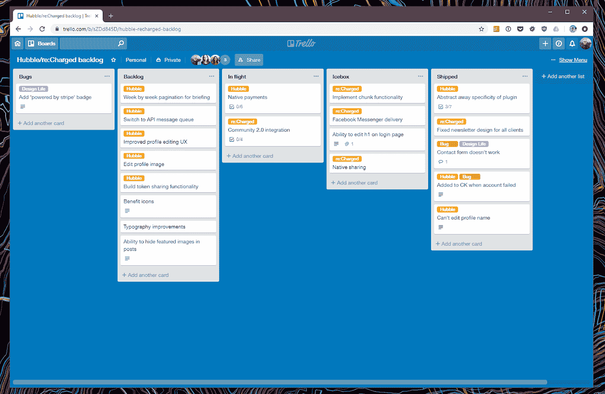
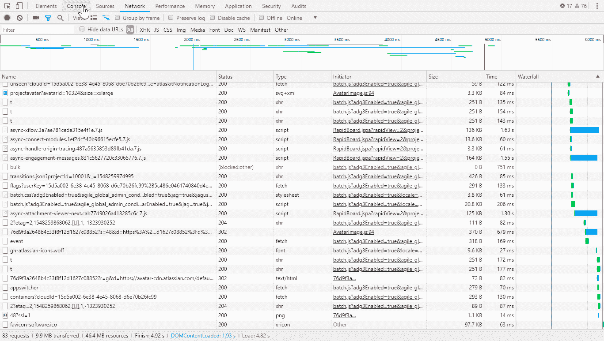
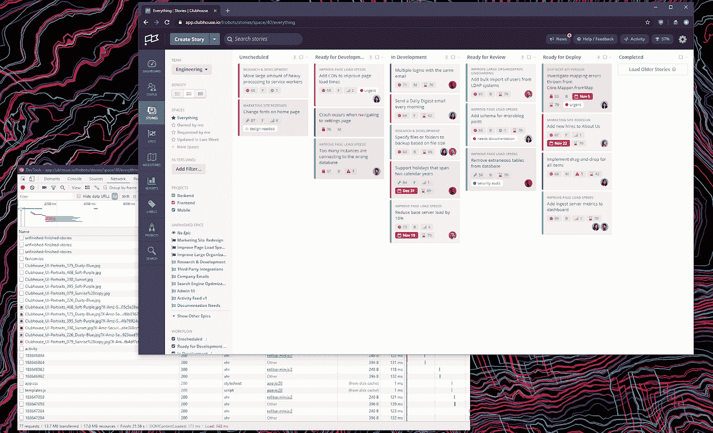
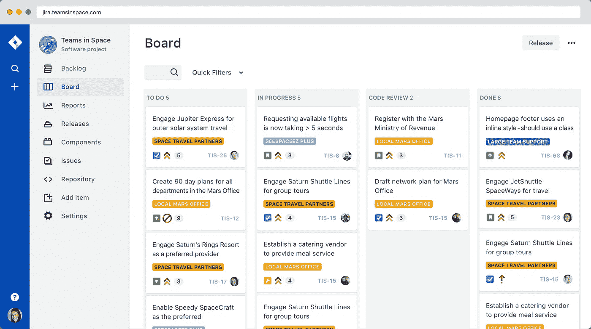

# 最佳软件开发项目管理工具，比较

> 原文：<https://medium.com/hackernoon/the-best-software-development-project-management-tools-compared-8027f66ad0a0>

Photo by [Danial RiCaRoS](https://unsplash.com/@ricaros?utm_source=medium&utm_medium=referral) on [Unsplash](https://unsplash.com?utm_source=medium&utm_medium=referral)

每年，我都会听到开发人员的集体抱怨，因为是时候回去工作了，他们在休息后第一次登录到他们旧的、缓慢的项目管理工具。没有比年初更好的时间来考虑使用其他东西进行软件开发冲刺了，有这么多的选择，这是选择新东西的好时机。

当我们的工具碍事时，完成的工作会更少，所以我想看看为现代开发人员提供的软件项目管理工具，以及他们应该考虑的问题:它应该帮助您的整个团队更快地完成更多工作，而不会使用起来令人沮丧。

我想比较最常用的工具，以及哪些最适合各种用例。这篇文章着眼于最好的规划工具，包括 JIRA、Clubhouse 和 Trello，使用性能、易用性、集成以及该工具如何适应现代软件开发理念。

# 易用性

对现代开发人员工具最常见的抱怨是，它可能很快变得太复杂，开发人员无法处理。他们不去写代码，而是可能被困在更新票或者弄清楚如何在虚拟冲刺之间移动东西。

Trello’s user interface is simple, sharp and easy to understand

[**特雷罗**](https://trello.com) 擅长于简单，很大程度上是因为它是为所有*类型的工作而设计的，这意味着默认情况下它更加平易近人。该工具易于学习和理解，只需少量工作就可以完成足够复杂的调度和优先级，同时保持可调整性，适用于公司中所有类型的用例。*

然而，Trello 并不是专门为软件团队的用例而设计的，所以除此之外，它并没有提供太多的功能来帮助，也没有进行优化来适应您的工作流。由你来定义你的工作方式，无论是好是坏，并找出如何在你的团队中建立它。

[**club house**](http://clubhouse.io)**进一步发展了 Trello 的可视化拖放规划，通过泳道和标签提供了类似看板风格的体验。Trello 在视觉上很吸引人，而且相对简单，Clubhouse 既漂亮*又*能够更好地适应软件开发团队的需求，同时对于开发周期之外的普通用户来说仍然是可接近的。**

**例如，使用 Clubhouse 的工具，每张卡都以一个“故事”开始，这个“故事”可以是一项任务、琐事或特色。它允许创作者添加史诗，项目和谁要求的门票，以及所有者，外部门票等等。**

**它既友好又清晰，因此您团队中的任何人都可以轻松地自己登录一个票证，而无需特定的培训。这在构建新产品的早期阶段有很大的不同，并有助于在您成长时减轻负担。**

******，**和这里列出的其他工具一样，提供看板视图和发布计划周期，但比这些工具更有深度和复杂性，因为它是为非常大和非常小的软件团队设计的，所以提供了大量的功能，这些功能通常会让新用户感到不知所措。****

****JIRA 已经存在很久了，所以虽然它很成熟，但它也有太多的配置选项、视图和其他按钮，我经常发现自己迷失或不知如何继续。有看板模式、scrum 模式、bug 跟踪……虽然这些功能很有用，但当你只是想完成工作时，往往会感到力不从心。****

****以我使用 JIRA 的经验来看，它最大的问题是软件开发团队之外的人*完全无法接近它。如果你是一个技术人员，它工作得相当好，但是对于其他人来说，它是一个令人困惑的拉比手册，使他们被排除在开发过程之外，或者需要特殊的培训才能理解它。*****

# ****速度****

****我们大多数人都希望尽可能快地完成工作，所以速度是大多数现代开发团队的首要考虑因素。****

****这一部分是主观的，主要是因为互联网连接和配置可能会有所不同，但我使用谷歌 Chrome 72 进行测试，在荷兰阿姆斯特丹使用 500mbps 的互联网连接。每个工具至少加载五次，对这些测试的结果进行平均以确保一致性。****

****Trello 是我比较过的最快、最轻量级的工具之一，一个 40 票的 sprint 板在浏览器画出任何有意义的东西之前，在不到 1.7 秒的时间里只占用了 4.4MB 的资源，而且无论我做什么，它的响应速度都令人难以置信。****

****在 **JIRA“现代”中加载一个板，**还没有完整的特性集第一次加载时需要 42.3MB 的资源，绘制到 DOM 大约需要 3.31 秒。在任何东西可以被交互之前，页面加载需要大约 6 秒钟，但是之后它就变得迅速而有反应了。****

****然而，在面板或其他视图之间点击，在页面呈现之前感觉要花很长时间，在每个视图之间重新呈现整个页面。****

********

****A look at all of the network requests JIRA makes****

****使用“经典”视图，大多数用户可能已经习惯了，似乎正在慢慢存档，页面需要 13 秒才能呈现，完全加载需要 46MB 的资源。****

****俱乐部会所电路板的速度惊人的快，第一次加载电路板需要 16MB 的资源，绘制 DOM 只需要 250 毫秒。四处点击，我以为它可能使用离线同步或服务人员才能这么快，但惊讶地发现它根本不是——它只是没有它的普通快。****

********

****在所有三个中，Clubhouse *感觉*是交互速度最快的，呈现页面的速度快得令人难以置信，并且看起来不像是在页面加载之间紧张，尽管提供了比 Trello 更多的功能。****

# ****集成****

****对于软件工作流，与您的团队一起工作的集成和特定于平台的特性通常是成败的关键，因为您已经在使用您可能想要的工具了！这是对每个平台的工作内容以及开发团队之外的内容的高级概述。****

******Clubhouse** 专注于开发者，并在这方面进行了大量整合。有 GitHub 和 BitBucket 的集成，但是还不支持 GitLab 或其他代码工具。除此之外，还有与开发人员使用的其他工具的集成，如 Bugsnag、Honeybadger 和 Sentry，因此错误可以直接放在卡上。****

****如今，Clubhouse 没有官方市场，但它有一个 API，因此如果缺少一个 API，可能会有第三方集成。****

****Trello 可能是这些工具中最轻量级的，但它仍然提供了许多集成来帮助增强其功能。在它的市场上，你可以找到 GitHub、GitLab、Bitbucket 和许多其他常用软件工具的“增强版”，包括 JIRA。****

****这允许您使用来自外部来源(如 GitHub)的更多信息来增强 Trello 卡，因此您可以将问题直接附加到票证上以供将来参考。除此之外，还有大量的其他集成，如 Google Drive、MailChimp 甚至 Twitter，以让更广泛的团队参与进来。****

********

****The new JIRA interface is sharp, and well integrated****

****JIRA 因拥有丰富的市场而闻名，并且基本上与任何有 API 的东西集成:GitHub、GitLab 和 Bitbucket 都受支持，以及你能想象到的任何生产力工具。这些集成中有许多是由第三方开发人员维护的，而不是公司本身，这意味着今天有比 Trello 或 Clubhouse 更多的选择。****

# ****软件专用工具****

****如前所述， **Trello** 实际上是为“把事情做完”的工作方法而设计的，但并不特别适合软件团队。您可以像许多其他人一样对它进行修改，为您服务，但是它不会提供软件开发专用工具集所能提供的额外好处。****

****要使用 Trello 作为软件开发工具，您需要使用标签之类的东西来指示 bug 的状态或类别，因为没有任何特定的字段，同时还要找到一种方法将它们联系在一起。许多其他人已经成功地做到了，但它需要投资来设置它。****

****由于缺乏更好的比喻，JIRA 就像把你的手提箱和厨房的水槽打包在一起。它是专门为提供敏捷项目管理工作流而设计的，这样做有一个缺点:有你能想象到的所有东西的按钮和视图，从烧毁图表到简单的老式看板视图，用于处理路线图上的特性。****

****快速浏览一下 JIRA 的[功能页面](https://www.atlassian.com/software/jira/agile)，可以看到它包含了多少功能，以及为什么它有时会感觉臃肿:从 sprint 权限到发布中心，什么都有，这些都是有用的功能，但在过去给我的体验造成了拥挤。****

****Clubhouse 感觉就像是两者之间的一种平衡:刚刚够你完成 sprints(和敏捷工作)的功能，但是它们被轻轻的洒在上面，所以不会让其他人感觉完全不知所措。****

****这里有你需要的所有图表，最重要的是，它通过使用故事、里程碑和史诗的哲学来完成工作，提供了比 Trello 更多的结构，这有助于在创建 sprints 时保持团队的一致性。****

****现在有这么多优秀的工具供开发人员使用，所以我希望这个比较是有用的，并且您能为自己的团队找到最完美的工具。我鼓励你尝试所有这些方法，并在开始之前决定它们如何适合你的工作流程。****