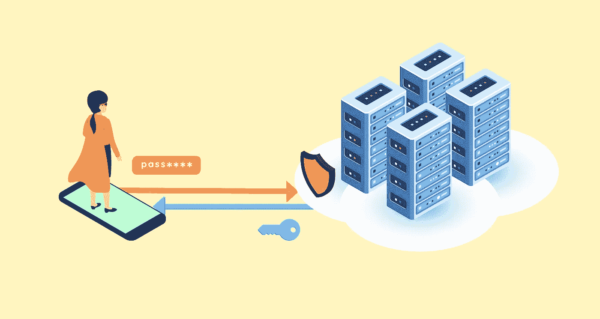
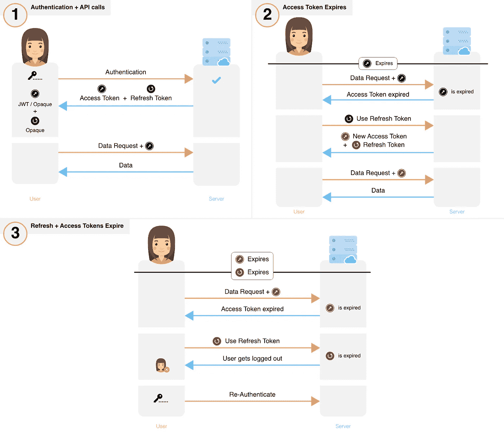
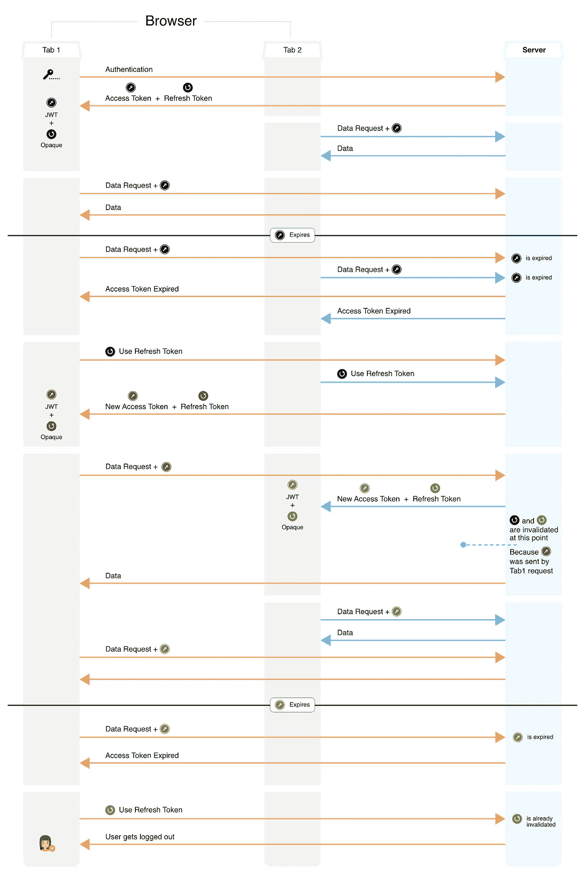

# 安全管理用户会话的最佳方式

> 原文：<https://medium.com/hackernoon/the-best-way-to-securely-manage-user-sessions-91f27eeef460>

作者编辑:我觉得我应该感谢所有人的积极回应——最重要的是，我很高兴这篇文章对开发者社区有用！如果您想更详细地讨论此解决方案或 [*超级令牌*](https://supertokens.io/) *用于您的使用情形，请随时安排致电* [*此处*](https://calendly.com/supertokens-rishabh) *。*

这是关于会话管理的两部分系列文章的第 2 部分。如果读者理解了 JWT (JSON web token)和用户会话的一般概念，那么可以不读第 1 部分而读第 2 部分。

[*第 1 部分:会话管理介绍、最常用会话流分析和最佳实践*](https://supertokens.io/blog/all-you-need-to-know-about-user-session-security)

*第 2 部分:安全且易于集成的新开源会话流分析*

第 1 部分提供了会话管理的教育指南(在活动会话期间如何处理、存储和更改授权令牌 *)* ，我们讨论了几种常用的会话流。然而，我们认为第 1 部分中提到的流程在大多数用例的安全性方面是次优的。我们在 RFC 6819 中遇到了 IETF(互联网工程任务组)概念化的流程。我们采用了提议的流程，构建了它，并应其他人的请求，为更广泛的社区开源了我们的代码。

在这篇文章中，我们将探索和分析会话流，讨论一些实现细节，并为您提供一个[可定制的库](https://github.com/supertokens/supertokens-node-mysql-ref-jwt)。这个库已经可以生产了，并且可以在一天之内集成到您的系统中(目前适用于 NodeJS 和 MySQL)。它叫做[超级坦克](https://supertokens.io/)。

## 建议流量

**用短期访问令牌轮换刷新令牌**

Suggested Auth flow — Click to Zoom

*   访问令牌是短期的，而刷新令牌是长期的。
*   当获得新的刷新令牌时，旧的刷新和访问令牌在后端无效并从前端移除。正确地做到这一点并不简单。请参见后面讨论的“实施注意事项”。
*   如果用户自愿注销，访问和刷新令牌将被撤销并从前端清除。

**损害分析** 关键认证令牌永久暴露在前端和后端两个攻击面上，偶尔会在传输中暴露。

*身份验证令牌被盗的影响:* 访问令牌被盗:攻击者将在短时间内进行未经授权的访问(直到令牌到期)

刷新令牌被盗:检测到被盗将使被盗的刷新令牌失效，将损害限制在短时间内

*失窃检测:* 访问令牌失窃:这种失窃只能通过使用[启发式算法](https://supertokens.io/blog/all-you-need-to-know-about-user-session-security#eee3)或用户通知服务提供商/开发商来检测。

刷新令牌失窃:只要攻击者和受害者在攻击后至少使用一次刷新令牌，就有可能检测到失窃。下面的例子说明了这一点。

*   攻击者设法获得了受害者的刷新令牌— RT0。在访问令牌(AT0)到期时，受害者和攻击者都需要使用 RT0 来获取一组新的令牌。
*   如果攻击者首先使用 RT0，那么他们将收到一个新的 RT1 和 AT1，当使用时，将使 RT0 无效。当受害者使用被无效的 RT0 时，服务器将接收到一个清楚的指示，即盗窃已经发生，因为客户端应该使用 RT1。如果受害者首先使用 RT0，则类似的论点有效。
*   如果受害者和攻击者同时使用 RT0，那么一方将得到(RT1，AT1)，另一方将得到(RT2，AT2)。他们中的任何一个使用新的访问令牌的下一个请求将使 RT1 或 RT2 无效，导致受害者或攻击者最终被注销[【1】](#d440)。同样，这里后端会得到一个盗窃的明确指示。

*一旦检测到:* 访问令牌不需要被撤销，因为它们是短期的。但是，如果需要，可以通过从数据库中删除不透明的访问令牌来撤销它们。

通过从数据库中删除刷新令牌，可以很容易地撤销它。

这总结了概念流程的讨论。下面是一些额外的提示，希望自己实现这个流程的读者需要记住。或者，我们在 [Github](https://github.com/supertokens/supertokens-core) 上有这个流程的开源实现。

## 实施注意事项

1.  后端在生成新的令牌对时会使之前的令牌失效。在前端没有收到新令牌的情况下(无论出于何种原因)，它将继续使用以前失效的令牌，导致用户被注销。为了防止这种情况，后端应该仅在前端使用新令牌时使以前的令牌无效，以确认其成功接收。
2.  每次使用有效的刷新令牌时，系统都会生成一个新的不同的刷新令牌(RT)。为了防止误报(盗窃的迹象)和用户注销，必须考虑前端[【2】](#e81c)可能发生的竞争情况。
3.  如果刷新令牌被撤销，那么理想地，它的访问令牌也应该被撤销。
4.  检测刷新令牌盗窃不需要数据库显式存储失效的令牌。这可以通过使用父子层次结构构造刷新令牌来实现(参见 Github 实现)。
5.  就空间和时间复杂度而言，使用 JWT 访问令牌的实现可以像第 1 部分中的会话流 5 一样具有可伸缩性。我们只需要在数据库中为每个设备的每个登录用户存储一个刷新令牌。

这就是我们关于会话管理的大部分内容。下面你会发现一个 GitHub 仓库，里面有处理所有实现问题的源代码。它可以根据您的需求进行高度定制，并且可以快速集成到您的系统中。它在防止和检测令牌盗窃方面也非常安全。我们很想知道你对它的看法——请留下评论或给我们发电子邮件。

## 超级文库

我们承诺支持我们的库(修复错误、解决问题、添加功能和更新文档)并做出响应(通过 SO、电子邮件等)。

为了向我们的早期读者表达更多的爱，我们提供以下专门支持:

*   免费咨询您当前的会话管理系统，包括识别漏洞和针对您的特定用例提出改进建议。
*   SuperToken 库的免费支持。如果您在实施、错误和定制方面有任何问题，我们将随时待命。

请访问[我们的文档](https://bit.ly/2XSjBHu)，为您的技术堆栈找到正确的库。

## 最后结论和建议

构建生产就绪的会话管理解决方案并不简单。它需要很深的知识，并且在时间和金钱方面是昂贵的。许多开发人员没有优先考虑会话管理，导致生产中的系统次优、不安全。

我们已经在这两篇文章中讨论了各种会话流。根据需求，一个流可能比其他流更适合。总的来说，我们的建议如下:

对于处理**非常敏感数据**的服务(例如:股票交易平台或类似 Ashley Madison 的东西)，安全性可能优先于用户体验。这里理想的流程是使用我们的流程和**短期刷新令牌和短期不透明访问令牌**。刷新令牌的到期时间将取决于用户由于不活动而注销的时间量(让我们称这个时间为 T)。每次使用刷新令牌时，新令牌将在时间 t 内有效。您可能还希望对整个会话的生存期进行硬限制。也就是说，无论用户活动如何，会话都会在这段时间内过期。举例来说，这是根据你期望用户在一天内使用你的服务的时间来估计的。

对于所有其他服务，使用我们的带有 **JWT 访问令牌**(为了更容易的可伸缩性)和**长期刷新令牌**的流。您还可以使用黑名单来立即撤销访问令牌(这将增加每个 API 的时间，但是与使用不透明的访问令牌相比，您将节省空间)。但是，如果您不希望所有身份验证都依赖一个共享密钥(即使该密钥不断变化)，或者如果节省网络带宽是首要任务，则使用不透明访问令牌。此外，通过使用双因素身份验证或无密码登录方法，可以提高安全性。后者的好处是不需要用户记住另一个密码。

就是这样！请通过评论或给我们发电子邮件[这里](mailto:team@supertokens.io)让我们知道你在阅读这篇文章时的想法。我们希望这是有用的。

## 脚注

*[1]如果使用不透明令牌，则立即注销，否则他们将在新 JWT 到期后被注销。*

*【2】这是一个竞态条件问题:假设一个用户在其浏览器中的 Tab1 和 Tab2 中打开了你的 app。这两个选项卡共享同一套 cookies。下图演示了竞争条件如何导致用户注销。*

由[超级油轮](https://supertokens.com)的人们撰写——希望你喜欢！如有任何问题，请在 Twitter 上关注我们或加入我们的 Discord 服务器！

