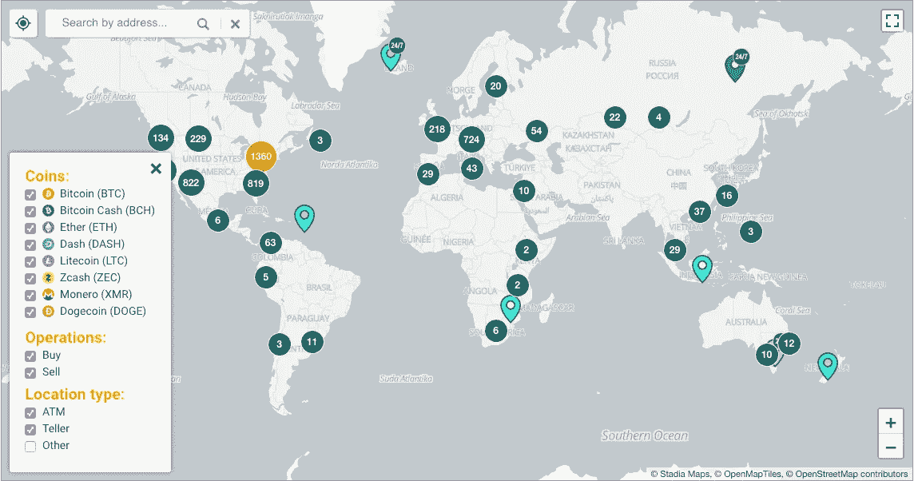
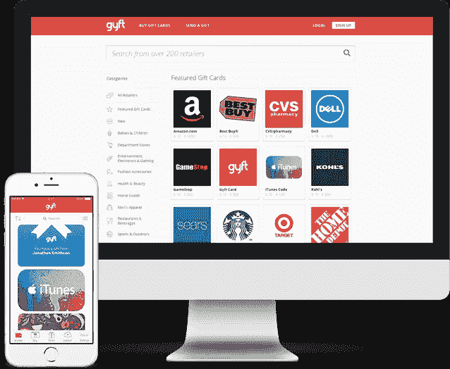

# 如何使用比特币:购买和消费比特币的最佳方式

> 原文：<https://medium.com/hackernoon/the-best-ways-to-buy-and-spend-your-bitcoin-c70cf04b2e0c>

对于新密码用户来说，一个主要的障碍是他们不认为他们的比特币有任何现实应用。即使对于经验丰富的加密投资者来说，也很难找到可信和声誉良好的地方来使用、交易和消费他们的比特币。该行业的最终目标是让 crypto 成为人们日常生活的一部分。通过为消费者和专业人士提供一种比以往任何时候都更便宜、更全球化的交易方式，比特币正在创造一种新的格局，将金融机构的权力收回到个人手中。已经有许多市场领先的公司使购买、消费、[赚取](https://blockfi.com/?ref=a598ccef)和使用加密货币成为你日常生活的一部分变得容易。

# 如何赚取比特币

除了直接购买比特币，还有很多其他方法可以让你在不花钱的情况下把更多的比特币放进钱包。赚取比特币通常只需要在应用程序上注册，或者将你现有的资产存入一个[比特币计息账户](https://blockfi.com/crypto-interest-account/?ref=a598ccef)。

# 1.用复利赚比特币

人们常说，最富有的人让他们的钱为他们工作。通过利用复利的力量，这正是你可以用比特币做的事情。这是什么意思？不要把你的比特币放在钱包里，你可以把它们放在一个计息账户里，这样你每个月会赚更多的比特币。像 [BlockFi 利息账户(BIA)](https://blockfi.com/crypto-interest-account/?ref=a598ccef) 这样的产品为客户提供利息，只需将比特币存入他们的账户。

只要把你的比特币存入 BIA，让利息发挥作用。客户的比特币每年可以获得高达 6.2%的 APY。最精彩的部分？利息每月复利。每个月初，你的比特币利息会存入你的 BIA 账户。下个月你将立即开始赚取更多的利息，因为你的余额会随着利息的增加而继续增长。了解如何向 BIA 账户存款，让你可以利用比特币的复利[观看比特币滚滚而来。](https://blockfi.com/earn-crypto/?ref=a598ccef)

了解更多关于[BIA 如何在这里工作](https://blockfi.com/earn-bitcoin-interest/?ref=a598ccef)。

# 2.赚取比特币返现

赚取比特币最简单的方法之一是通过像 [Lolli](https://lolli.com/ref/VPiAfvVv6O) 这样的返现服务。每当你在合作零售商处在线购物时，Lolli 用户都会获得比特币作为现金返还。他们的合作伙伴网络包括 500 多个顶级品牌，如沃尔玛、Barnes & Noble、Gap、Best Buy、Overstock 等。Lolli 类似于其他返现服务，如 [Ebates](https://www.rakuten.com/button.htm?ref_id=MICHEL97030&eeid=43663&utm_source=extension&utm_medium=raf_link) ，除了不是用美元支付返现，而是用比特币支付。所以，下次你准备进行下一次网上购物时，停下来记住，你可以使用[的 Lolli Google Chrome 扩展](https://lolli.com/ref/VPiAfvVv6O)点击几下就能赚到比特币。

另一种令人兴奋的赚取比特币返现的方式是使用 [Pei](https://getpei.com/) 。通过 Pei，您可以解锁 BTC 或美元的返现。他们的应用程序非常简单。第一步是通过 Plaid 将您的银行账户、借记卡和信用卡安全地连接到您的账户[。然后，你每次在](https://plaid.com/) [Pei 商家社区](https://getpei.com/merchants)的店铺购物，都会直接收到返现到你的 Pei 账户。他们的合作伙伴包括 Target、Chipotle、7-Eleven 等公司，以及其他一些大型零售商。最棒的是，你不仅可以通过 Pei 赚取比特币，还可以获得通常从信用卡中获得的积分和奖励。Pei 是被动赚取比特币的最好方法之一，不用想。

当您注册并连接您的卡时，使用代码“oqskcu”免费获得 15 美元添加到您的 Pei 帐户余额中。

# 3.获得比特币支付

一些公司更喜欢用比特币支付奖励，因为使用区块链交易既便宜又快捷。如今，你可以完成各种各样的小任务和工作来赚取比特币。其中包括:

*   接受调查
*   完成行政工作
*   回复电子邮件
*   查看移动应用
*   做自由职业者

[Earn](https://earn.com/) 是加密货币行业中一些最优秀和最聪明的人使用的平台，如 Naval Ravikant 和文克莱沃斯双胞胎。创建专业档案后，每次你回复招聘人员、企业或研究人员的信息，你就会开始获得比特币。

你也可以去 [Cryptogrind](http://www.cryptogrind.com/) 或 [Jobs4Crypto Reddit](https://www.reddit.com/r/Jobs4Bitcoins/) 找更有技能的工作，而且通常是用比特币支付的永久性工作。只是要小心，任何用比特币支付的工作都需要双方的信任。如果你真的想工作赚取比特币，你应该考虑使用托管服务来确保支付。

# 如何购买比特币

购买加密货币的地方已经发展了好几年。起初，比特币只能通过地下市场购买，以个人对个人的方式进行，公众看不到。如今，有各种不同的值得信赖的地方可以购买比特币，这让你更容易参与到数字货币的最新革命中。

# 1.使用加密货币交易所

交易所是一个平台，你可以用你辛苦赚来的现金购买比特币。它们通常由一个集中的实体来操作，这个实体通过一个订单簿来帮助买卖双方进行交易。此外，资金(法定货币或加密货币)存储在交易所本身，让您可以快速轻松地访问您的资产。交易所的成功很大程度上是由高交易量推动的。这为交易所提供了流动性，可以下单(买入或卖出)并快速成交。许多此类服务，如[比特币基地](https://www.coinbase.com/join/52a8f12705f773a0640000da?src=ios-link)和[双子](http://www.gemini.com/)，由于美国和海外的反洗钱(AML)和了解你的客户(KYC)法规，需要个人信息。您可以在我们的资源中心了解更多关于 [BlockFi 如何使用 KYC/AML](https://blockfi.com/crypto-loan-credit-score/?ref=a598ccef) 的信息。

这些集中交易的替代方案是分散市场。在这里，交易是在双方之间直接进行的，没有任何中央实体控制或促进交易。资金不存储在交易所，使您能够随时控制自己的资金，而不必委托第三方保管。LocalBitcoins 是一个众所周知的分散市场的例子，买家和卖家聚集在一起直接进行交易。在 LocalBitcoins 上，购买比特币有更多种选择，比如通过 PayPal、Moneygram 或 Venmo 支付。像 [Kyber Swap](https://kyberswap.com/) 这样的其他平台提供了一种简单且不可信的方式来买卖加密货币。就像中央交易所一样，Kyber 有一个开放的订单簿，但需要使用以太坊 Dapp 钱包，如 [Metamask](https://metamask.io/) ，来存储和转移您的资金。

如果你不想为订单簿、买卖差价等复杂的事情而烦恼，有一些替代交易所可以让你快速轻松地购买比特币。像 [Shapeshift](https://shapeshift.io/) 这样的交易所可以让你立即快速交换比特币。不幸的是，你需要已经拥有另一种加密货币才能使用 Shapeshift 等服务购买比特币，因为他们不接受法定货币作为支付方式。它们最适合用于快速“交换”一种加密货币和另一种加密货币。

# 2.把不用的礼品卡变成比特币

如果你家里有没有用过的礼品卡，不要让它们浪费掉。相反，用它们来购买比特币。像 Paxful 这样的网站可以让你用未使用的礼品卡购买比特币,“通过与其他想要购买相同礼品卡的人联系。然而，你可能不得不打折出售你的礼品卡，以便找到愿意交易的合作伙伴。如果你愿意这样做，这是一个将未使用的礼品卡变成比特币的好方法。

# 3.如何使用比特币自动取款机

每个人都知道如何使用自动取款机，所以你也应该能够在自动取款机上购买比特币。不，你仍然不能在普通的自动柜员机上购买比特币，但你可以在一个特殊的比特币自动柜员机上购买，该自动柜员机接受现金钞票以换取比特币。只要把现金放进机器里，一张纸条就会出来，上面有你的新钱包信息和比特币余额。然后，你可以拿着这张纸到另一台 ATM 机上提取现金，或者在任何接受比特币的地方消费。

不幸的是，比特币自动取款机还没有普及，在全球范围内也很少。要找到你附近的比特币自动取款机，请查看[比特币自动取款机雷达](https://coinatmradar.com/)，这是一个全球信息库，包含当前所有比特币自动取款机的位置。谁知道呢，也许有一天每个角落都会有一台比特币 ATM 随时供你使用。

ATM 的另一种选择是使用[硬币之星](https://www.coinstar.com/bitcoin)将你的零钱兑换成比特币。是的，那些你可以带着装满硬币的存钱罐的机器现在可以吐出比特币，而不是现金或礼品卡。事实上，Coinstar 不仅适用于硬币，也适用于钞票。你甚至可以当场存入高达 2500 美元来购买比特币。这使得 Coinstar 成为快速购买比特币的另一个重要资源。

既然你已经了解了一些可以购买比特币的方法，那我们就来看看在日常生活中你可以在哪些地方使用比特币。

# 如何使用比特币

新的加密货币所有者会向我们提出很多问题，比如“我该如何使用比特币？”或者“人们喜欢在哪里花比特币？”。你可能会对使用比特币的场所数量感到惊讶。你现在不仅可以用比特币购买你最喜欢的视频游戏，还可以用它来支付你一直想要的积压的新地毯，甚至可以把钱用于预付 SIM 卡。

# 1.使用比特币进行网上购物

越来越多的在线零售商接受比特币作为一种有效的支付方式。Overstock 一直是支持你在网站上使用比特币购物的先锋。其他支持比特币作为支付方式的公司包括微软、新蛋、TigerDirect 和许多其他公司。目前，接受比特币的电子商务网站相对较少，但这些大公司愿意冒险的事实对该行业的未来来说是一个很好的信号，所以确保利用一切机会在允许你使用比特币的网站上购物。

还有一些新的电子商务平台，它们被设计成只接受比特币和其他加密货币作为支付形式。目前最大的市场， [OpenBazaar](https://openbazaar.org/) ，是一个点对点的市场，在这里你可以买到任何东西，从当地的食物和来自世界各地的饮料，到艺术品，甚至数码商品。该平台采取预防措施来确保交易的安全，使用托管服务进行支付和用户审查，让买家了解不道德的卖家。

同时，你可以用比特币给你的预付费 SIM 卡充值[加密充值](https://www.cryptorefills.com/)。只需输入你的电话号码，你想要充值的金额，然后用比特币支付。您甚至可以向国外的家人或朋友汇款，为他们的 SIM 卡充值。这在金融基础设施有限的地方尤其有用。如果你是一名游戏玩家，CryptoRefills 还允许你使用比特币购买一些你喜欢的游戏的游戏代金券，如《魔兽世界》、《反恐精英》等。

# 2.使用比特币购买礼品卡

想象一下，在百思买看到一副你一直在寻找的新耳机。唯一的问题是，你没有现金，只能使用你的比特币。但是百思买不接受比特币作为支付方式。你是做什么的？有了像 [Gyft](https://www.gyft.com/bitcoin/) 移动应用这样的服务，你可以很快将你的比特币变成礼品卡，进行你想要的购买。

由于允许你将比特币兑换成礼品卡的服务，你可以使用比特币的零售店几乎是无限的。像 [eGifter](https://www.egifter.com/bitcoin/) 这样的网站允许你用自己的比特币从数百个网站购买礼品卡，实际上让你可以在你最喜欢的商店用比特币作为现金消费。

没有花完整个礼品卡？用 Paxful 转回比特币。

# 3.获得一张使用比特币的借记卡

随着比特币越来越受欢迎，新的和创新的金融产品已经推出，使您在任何地方花费比特币都比以往任何时候都更容易。其中一项创新是允许比特币存储在借记卡上，并在任何接受借记卡的地方使用。我的比特币可以花在哪里？有了这些服务，你可以在任何地方花你的比特币！

BitPay 提供一种借记卡，你可以在上面加载你的比特币。该公司与 Visa 合作，允许用户在接受 Visa 的任何地方立即消费比特币。你甚至可以用 BitPay 手机应用程序管理你的账户和卡里的余额。 [Wirex](https://wirexapp.com/card) 提供类似的 Visa 借记卡产品，甚至在所有店内购买上提供 0.5%的比特币返现。

现金应用程序是另一个 Visa 借记卡选项，但也有更多功能。该应用程序允许你向朋友发送比特币(如 Venmo)，在你喜欢的商家(如 [Ebates](https://www.rakuten.com/button.htm?ref_id=MICHEL97030&eeid=43663&utm_source=extension&utm_medium=raf_link) 和 [Lolli](https://lolli.com/ref/VPiAfvVv6O) )给你现金折扣，甚至允许你直接在应用程序上买卖比特币。这就像一个交易所，借记卡和银行账户集于一身。

[**本文最初发表于 BlockFi.com。*](https://blockfi.com/use-bitcoin?utm_source=hackernoon&utm_medium=organic&utm_campaign=use-bitcoin&utm_term=use-bitcoin&utm_content=use-bitcoin)