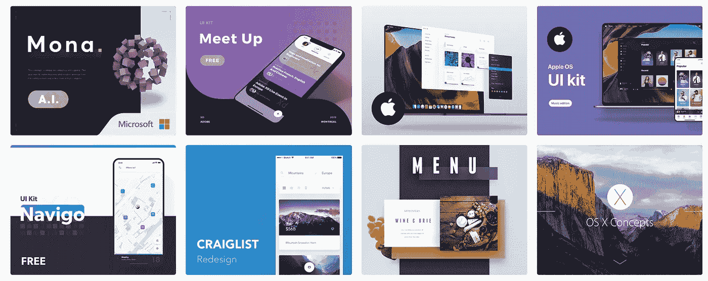
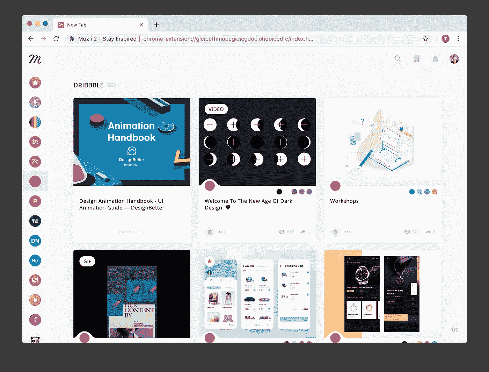
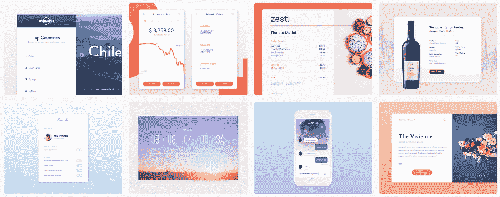

# 作为设计师如何获得更多面试机会

> 原文：<https://medium.com/hackernoon/the-biggest-mistake-ux-designers-make-in-their-portfolios-952920952df5>

## 我有争议的建议能让你得到面试机会。

*更喜欢视频？查看我的* [*YouTube 视频上的这篇文章*](https://www.youtube.com/watch?v=GQesdEAxy3M) *。*

在过去的 4 年里，我一直在雇佣设计师。在那段时间里，我看到了令人惊叹的投资组合和糟糕的投资组合。

在所有这些人当中，有一件事我反复看到，让我作为一名招聘人员的生活变得非常艰难:

# UX 作品集有太多的文字

这可能会引起争议。我知道这违背了你在网上其他地方看到的大多数建议。但是听我说完。

招聘人员每天审查数百份投资组合。在好的一天，他们在每个投资组合上大概花 5 分钟。在糟糕的一天，可能是 30 秒。

他们不会承认，但是**你写的东西**他们大部分都不看。

作为一名 UX 设计师，这很可怕，因为你的作品集大部分是信息。是你需要解决的问题。这是你的研究，你的深刻见解，以及你解决这些问题的巧妙方法。如果招聘人员不看，这些都没用。

即使招聘人员有时间阅读，也很难从线框和模拟图中正确判断 UX。评估入职或采购流程的最佳方式是使用产品。

如果可以的话，你**应该提供发货产品和交互式原型**的链接。即便如此，招聘人员可能也只有时间去试一两个。还有，招聘人员不是你的目标受众。他们可能不会像你的真实用户那样欣赏你的解决方案。

大多数时候，我会检查学生的作品集。这意味着没有真正的产品可以尝试。这都是文本，线框，和一些模拟。

那么，毕业的 UX 设计师应该做什么呢？我的建议是:

# 尽可能多地展示用户界面和视觉设计

也许你专门研究 UX。可能你觉得自己 UI 不够好。

然而，如果你想获得更多的面试机会，我的建议是，要擅长面试，并且在你的作品集里有很多面试机会。

我最喜欢的设计师之一是所罗门·奥雷连恩。检查他的[行为](https://dribbble.com/aureliensalomon)和[行为](https://www.behance.net/aureliensalomon)。我保证他每天都会收到大量的工作邀请。

Aurélien’s [Behance page](https://www.behance.net/aureliensalomon).

为什么？因为它比 UX 更容易和更快地判断 UI。伟大的视觉设计显而易见。只要花 10 秒钟看一眼奥雷连恩的投资组合，就足以立刻感受到它的质量。

这里是最混乱的部分:**当招聘人员看到令人惊叹的用户界面时，他们会立即认为设计师在 UX 也很棒。**

这就是[吸引力偏见](https://www.oreilly.com/library/view/universal-principles-of/9781592535873/xhtml/ch10.html)。我们把无关的积极品质归于美好的事物。对人，对建筑，对设计作品集都是如此。

我知道，这是不对的。我曾和在 UX 表现糟糕的优秀 UI 设计师共事过，反之亦然。尽管如此，当我看到伟大的 UI 时，我无法摆脱这种感觉。

奥雷连诺在 UX 可能会很糟糕。没关系。他仍然会收到大量的工作邀请。

如果你想让面试变得尽可能容易，**关注用户界面。**

# UI 帮你获得面试机会。UX 给了你这份工作

这就是通常的结局。招聘人员寻找数百个投资组合。他们根据第一印象做出快速判断。他们把范围缩小到几个候选人。然后，他们伸出手谈论 UX。

面试是展示你的 UX 作品的最佳时机。你吸引了招聘人员的全部注意力。你有时间解释问题、研究、你的发现和你聪明的解决方案。你可以演示你的原型，并解释为什么设计符合你的目标受众的需求。

UI 帮你获得面试机会。UX 给了你这份工作。

> “但我在 UI 方面很烂”

**扯淡。**

没有 UI 不好这一说。视觉设计是一种可以学习的技能，就像其他任何东西一样。

当有人告诉我他们在 UI 上很烂的时候，我假设有两种可能。最好的情况是:**他们从来没有花时间去正确地学习它**。最坏的情况:他们总体上不擅长设计，所以他们“专攻”UX，因为那里更容易隐藏。

我做了 10 年的 UX 和 UI。根据我的经验，UI 比 UX 简单多了。这是简单而有趣的部分——艰难项目结束时的甜点。

如果你不能找出合适的颜色和间距，我不知道我能不能信任你来修复我们数百万美元的采购流程。

> “怎么才能学会 UI？”

以下是改进 UI 设计的最佳方法:

1.  学习基础知识
2.  培养优秀设计的眼光
3.  练习和分享

# 1.学习基础知识

> “我不是搞艺术的类型”

关于 UI，首先要明白的是，它不是艺术，它更客观，而不是主观。好的美学是有规则和逻辑的。

这些规则很容易学会。我见过工程师花几个小时研读基础知识后，创造出高质量的 UI。

网上有很多关于这些规则的信息。这里有几篇文章可以帮你入门:

*   [如何让你并不出色的视觉设计变得更好](/facebook-design/how-to-make-your-not-so-great-visual-design-better-67972eee3825)
*   [非设计人员的基本设计原则](/free-code-camp/fundamental-design-principles-for-non-designers-ad34c30caa7)
*   [如何在 UI 设计中运用色彩](https://blog.prototypr.io/how-to-use-colors-in-ui-design-16406ec06753)
*   [光学调整](https://medium.muz.li/optical-effects-9fca82b4cd9a)
*   [空白](https://www.justinmind.com/blog/10-examples-of-white-space-design-websites-youll-want-to-copy/)
*   [层级](https://uxdesign.cc/the-fundamentals-behind-visual-hierarchy-4323c85fb186)

# 2.培养优秀设计的眼光

一旦你掌握了基本知识，你就应该培养自己的品味。

这是通过每天看好的设计来做到的。随着时间的推移，你会对正确的版式、颜色、间距和布局有一个直观的理解。

为此，我建议使用一个浏览器扩展，用一个 Dribbble feed 替换默认选项卡。我用 [Muzli](https://chrome.google.com/webstore/detail/muzli-2-stay-inspired/glcipcfhmopcgidicgdociohdoicpdfc) ，但是你也可以用[熊猫](https://chrome.google.com/webstore/detail/panda-hacker-news-dribbbl/jhiocdmmaannaccoofjfmjpbfkogmnap)或者[设计 Hunt](https://chrome.google.com/webstore/detail/design-hunt/ilfjbjodkleebapojmdfeegaccmcjmkd) 。

[Muzli](https://chrome.google.com/webstore/detail/muzli-2-stay-inspired/glcipcfhmopcgidicgdociohdoicpdfc) can replace your new browser tab with a Dribbble feed.

这也有助于创建一个 Dribbble 和 Behance 账户，并开始追随伟大的设计师。以下是一些好的开始:

*   [奥雷连恩·所罗门](https://dribbble.com/aureliensalomon)
*   创意造币厂的迈克
*   [库贝托](https://dribbble.com/cuberto)
*   [分枝](https://dribbble.com/ramotion)

# 3.练习和分享

我的一个朋友，一个了不起的 UX 设计师，正在找一份新工作。她申请了几个地方，没有得到她想要的回应。

她认为她的作品集很丑，她讨厌它。

**于是她开始了** [**每日 UI**](https://www.dailyui.co) **挑战。**

起初，我取笑她。我说:

> “这不是真正的设计。没有任何限制。这就是艺术。”

但她还是做了。她每天都在网上分享她的日常用户界面。

[Yansou’s Behance Page.](https://www.behance.net/yansou)

**10 天后，私信开始涌入**。招聘人员在 LinkedIn 和 Behance 上联系她，提供面试机会。

**20 天后，她接受了 Wix** 的新工作。她很高兴，她停止了挑战。我被吹走了。

作为一个设计师，我不认为她在那 20 天里提高了那么多。她仍然认为自己是 UX 的设计师。她的新工作主要是模仿 UX。

然而，通过创造大量优秀的视觉效果并与世界分享，她引起了招聘人员的注意。他们根本不在乎她的设计背后没有背景或难题。他们看到了各种精彩的视觉效果。他们看到了人才，他们伸出了手。

# 附言

如果你想专注于 UX，这是可以的。如果你不愿意，就不要强迫自己进入 UI。但是如果你想让面试变得尽可能容易，这是我见过的最有效的方法。

此外，如果你想尝试日常用户界面，请查看 [CollectUI](https://www.collectui.com/) 获取一些好的灵感。

# 如果你喜欢或从中学到了什么，请点击👏鼓掌按钮。这有助于把这篇课文带给更多的人。

**亲提示:**最多可以拍 50 次:)