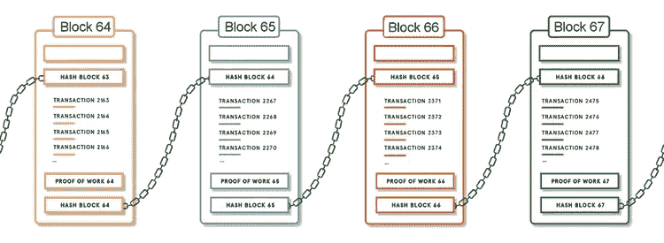
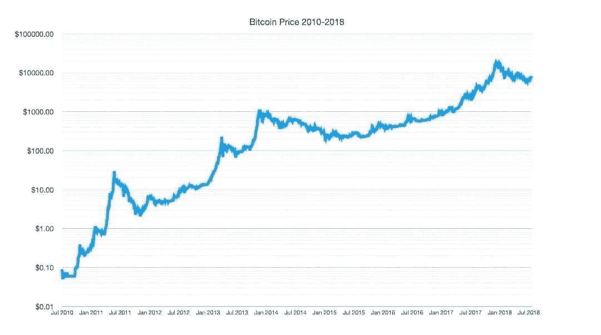
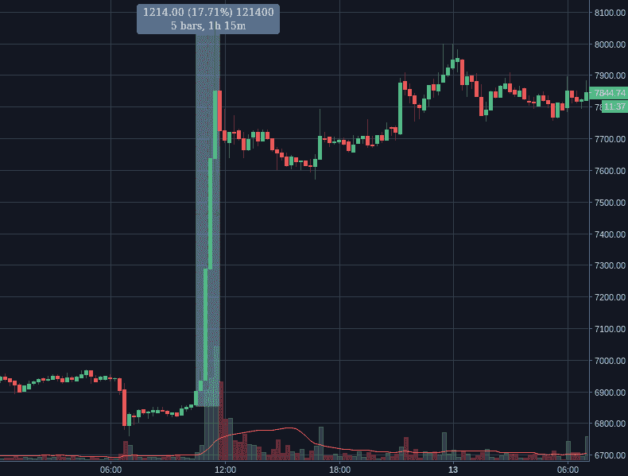
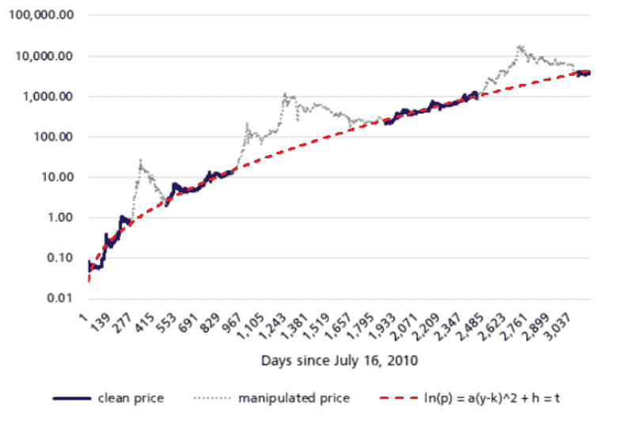
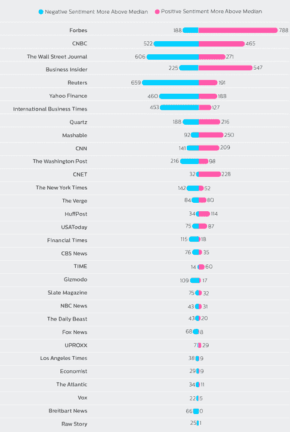
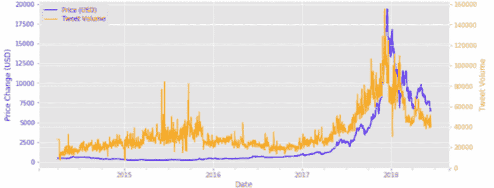

# 比特币“病毒”——影响比特币工作和受追捧的因素

> 原文：<https://medium.com/hackernoon/the-bitcoin-virus-factors-on-why-bitcoin-works-and-is-sought-after-d64874eb9522>

*区块链允许几乎即时的交易结算，因为它不需要漫长的验证、对账和清算过程。这是因为在两方或金融组织之间的共享(分散)分类帐中可以获得一致同意的数据的单一唯一版本。有了区块链技术，不需要第三方(中间人)或清算所。因此，以费用形式支付给票据交换所或受信任的第三方的间接费用可以被消除。*

# 喧闹的市场

处于婴儿期的加密货币，是由建立或摧毁这一新资产类别的相互竞争、有时甚至是连贯的努力所驱动的。从寻求最大化持股的年轻日内交易者，到旨在增加社交媒体受众的新成立的顾问和市场影响者，从成熟、历史悠久的金融机构，到政府、机会主义者、名人、骗子和投资者，这一领域有很多值得探索的地方。超过 2000 种加密货币硬币和代币，用于“待监管”证券，旨在改变世界的项目，以及精心包装的骗局，每一种都在一个非常年轻的市场中占据重要地位，取决于情绪、大众媒体和监管的不确定性。

资产交易市场的市值只有大约 1000-2000 亿美元，市场本身非常不稳定，单一的影响力量(一次大量买入/卖出)就可以动摇整个市场。由于高相关性，这通常会影响整个市场。

# 网络经济学

梅特卡夫定律:随着参与者数量的增加，网络的价值会随时间呈指数增长。至于比特币，大多数时候，这个价值是体现在市场价格上的。通过基础技术的发展、媒体的存在以及简单的机会主义交易，越来越多的采用率与病毒感染、细菌生长或之前看到的移动电话扩散的模型有相似之处。

*网络效应是一种现象，随着用户群的增长，产品或服务对用户或消费者的价值也随之增加。*

从“月亮”——伴随着“兰博”收益的高价——到法定货币的非货币化，以及“比特币已死”的世界末日崩溃(自 2010 年以来，在新闻和统计中出现了 355 次)的预测已经很常见，甚至是通过成熟和声誉良好的媒体渠道。大众/社交媒体的影响对总体情绪、大众观点等有明显的影响。研究显示，推文和谷歌搜索的数量在价格变化之前先发生变化。我们可以假设(不完善的评估)，推文的数量和他们的情绪(积极和消极)可能会影响价格，特别是在一个年轻，小，因此高度波动的市场。

总的来说，随着时间的推移，价格趋向于价值。因此，比特币价值普遍增加，从而其价格通过网络效应:

有待讨论的是，那些影响整体市场情绪的极端媒体事件(正面和负面)的概率是否可能是价格的实际驱动因素，或者它是否只有非常小的影响，假设用户数量最终驱动价格。

需要区分的是，网络效应通过 1)“价值储存”，如加密货币、通货紧缩、总体供应和交易机会绝对有限，即。比特币将在 2021 年达到 25 万美元*，以及 2)“利用协议”，该协议选择通过技术进步和对遗留系统的效率和有效性的积极影响来推动采用，即。恒星区块链协议允许使用[‘Nemoo’Stable Coin](http://moneyfi.io/)进行快速、安全和低费用的交易，以更有效地促进跨境支付。

## **25 万美元的比特币**:

越多的市场参与者意识到便利性、审查阻力、无法发挥市场力量**(没有垄断，因为没有一个实体可以控制网络)，以及超越黄金物理限制的进步，就会有越多的人购买比特币。有了它，它将变得更有价值，然后(已经)增加需求，散列率(导致增加网络安全性)，反过来，吸引更多的“霍德尔”和开发人员。此外，导致更高的流动性，加强比特币的网络效应，并最终促进价格升值。

数字网络的无许可特性削弱了市场力量，这导致这些网络的效率大幅提高，释放出大量潜在的经济价值。没有市场力量的低效率——“联网成本”，补充应用程序的用户和开发者不会因定价过高而被排除在市场之外，从而导致更多的参与和更大的网络收益。

# 长期增长与短期周期

用户的长期增长率(网络效应)对长期价值有相当大的影响，因此对比特币的价格有直接影响。像细菌和病毒这样的生物有机体的增长可能对网络经济有一些应用。相似之处可以从用户数量的增长和 ie 的市场资本化中观察到。脸书和比特币。

我在[的文章](https://hackernoon.com/2018-the-downfall-of-crypto-funds-9d7a2642dc96)中详细解释了短期波动，我的文章是关于试图将传统市场策略应用于秘密交易和投资的基金，主要是因为市场规模小。市场越小，越容易受到影响；

**1)直接(操纵，‘鲸鱼’批量卖出/买入)**

【2018 年 4 月 12 日——一小时内转移 1200 美元

*通过操纵市场，比特币价格偏离均衡价值*

2)间接(情绪和社交媒体效应以及群体思维***)

*网上加密货币文章数量(2013–2018)。研究表明，主流媒体和加密货币价格之间存在正相关关系。*

*比特币每日推文量(黄线)，比特币价格(蓝线)*

## 社会/大众媒体效应:

一项研究显示，推文的数量及其情绪(积极和消极)会影响价格。推文数量的变化先于价格的变化。在观察到价格实际上涨之前，对关键词比特币的搜索次数激增。也许，一个驱动另一个，反之亦然。在一个高度波动的市场中，不仅是“鲸鱼”和机构(无论是谁在里面，也无论是谁不仅仅是场外交易)推动价格，而是大众。

*资料来源:凯恩岛替代方案、Investopia、Clovr、彭博*

# 关于我:

**伊利亚扎基是一家总部位于美国的** [**STO 咨询**](https://moonwhale.io/sto-ico/) **公司的营销主管—**[**moonwale Ventures**](https://moonwhale.io/)**。**

在我们的各种社交媒体平台上关注我们—

[推特](https://twitter.com/MoonwhaleBV) | [LinkedIn](https://www.linkedin.com/company/moonwhalebv) | [脸书](https://www.facebook.com/MoonwhaleBV/) | [电报](https://t.me/moonwhaler)