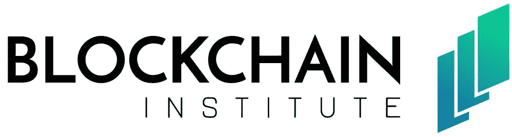

# 人人免费区块链教育

> 原文：<https://medium.com/hackernoon/the-blockchain-institute-free-blockchain-education-for-everyone-cd64476ba5ee>

准备学习更多关于分布式账本技术，但不确定从哪里开始？区块链首批注册的教育慈善机构之一精心策划的完全免费的课程怎么样？

The Chicago Blockchain Institute are one of the first charities to be granted 501c3 charity status in the US — and this is just the start of their journey.

# 成立区块链研究所

区块链研究所成立于芝加哥，旨在通过向公众提供免费的区块链教育来促进区块链技术的采用、发展和鼓励正确使用。

芝加哥区块链研究所由汉娜·罗森伯格(Hannah Rosenberg)建立，她是芝加哥最大的密码社区领导小组——[比特币和开放区块链会议](https://www.meetup.com/Bitcoin-Open-Blockchain-Community-Chicago/)的杰出组织者；以太坊基金会的联合创始人泰勒·格林；首席律师[安德鲁·戈登](https://www.gordonlawltd.com/andrew-gordon/)；黑脸田鸡风险投资公司的执行合伙人杰森·金海芳。

区块链研究所正在为未来的学生提供一系列课程，从区块链 101 到开发者的比特币，再到分散存储。

在最近的一次新闻发布会上，Rosenberg 解释说，*“很难找到关于区块链技术和加密经济的高质量、可靠的信息。作为一个非营利组织，我们提供资源，没有任何隐藏的议程。”*

相反，区块链研究所免费提供他们所有的材料。他们的 10 人强大团队带来了在区块链领域久经考验的经验，曾在以太坊基金会、黑脸田鸡风险投资公司和咨询公司 [Velas Commerce](http://velascommerce.com/) 等不同角色和组织中工作过。

# 501c3 慈善状况

区块链研究所向前迈出了一大步，他们刚刚被授予 501c3 慈善机构身份，这意味着他们现在可以接受各种加密货币和美元作为捐赠。

由于这些捐赠是免税的，由区块链机构的慈善机构地位代理，[捐赠](https://theblockchaininstitute.org/donations/)将大大有助于推进他们的使命。

区块链研究所表示"*我们收集的每一美元都用于教育年轻的软件开发人员和企业家。你的捐赠可以提供建设未来互联网所需的资源。*“因此，那些捐款的个人或团体将直接帮助下一代区块链技术开发人员。

# 区块链学院开设了哪些课程？

区块链学院已经提供了大量的课程，从基本的初学者风格课程到面向开发者的比特币。

而且，他们都是**免费**。在每门课程中，学生们会发现大量精心策划的课程材料。

以下是他们当前课程的简要介绍:

[**区块链 101**](https://theblockchaininstitute.org/courses/blockchain-101/)**——**区块链 101 课程让学生熟悉区块链技术的特点，包括其应用，从比特币到智能合约，去中心化网络，以及共识机制。

[**区块链安全**](https://theblockchaininstitute.org/courses/blockchain-security/)**——**这是一门很棒的课程，适合那些想知道可以采取哪些实际步骤来保护自己在区块链或他们工作的系统上的安全的人。

[**面向开发者的比特币**](https://theblockchaininstitute.org/courses/bitcoin-for-developers/)**——**一门课程，旨在为开发者提供所需的工具，以了解比特币交易的工作原理、钱包的工作原理、比特币脚本以及如何将比特币支付整合到现有平台中。

[**分散存储**](https://theblockchaininstitute.org/courses/decentralized-storage/)**——**让学生熟悉分散存储基础知识以及为什么需要分散存储的课程。

[**Hyperledger 简介**](https://theblockchaininstitute.org/courses/hyperledger/) **—** 本课程教授学生如何将区块链应用于私有生态系统，探索私有区块链的优势，以及 Hyperledger 如何将分布式分类帐的优势与企业软件的可预测性相结合。

[**IPFS 简介**](https://theblockchaininstitute.org/courses/ipfs/)**——**星际文件系统是一种在互联网上共享媒体的新方式。本课程探讨了这种新协议的基础，并将其与传统方案进行了比较。

正如您所看到的，有大量的优秀内容可供各种能力的用户开始学习，并且肯定会有更多的课程推出！

同样，区块链研究所也收集了大量宝贵的区块链相关资源，用户可以在这里找到，以及[广泛的 F.A.Q](https://theblockchaininstitute.org/faq/) ，帮助区块链的初学者解决一些你刚开始使用 crypto 时可能遇到的最常见的问题。

# 你如何帮助区块链研究所？

想加入区块链研究所，或者你是一个主题专家，想通过量身定制的课程传授你的知识？

与团队取得联系:[info@theblockchaininstitute.org](mailto:info@theblockchaininstitute.org)。

区块链研究所正在为区块链社区的教育和知识基础带来巨大变化，这个行业迄今为止，正规教育的选择非常有限。

*免责声明——作者与区块链研究所没有任何关系，区块链研究所是美国的一个慈善组织，完全依靠公众的捐款运作。*