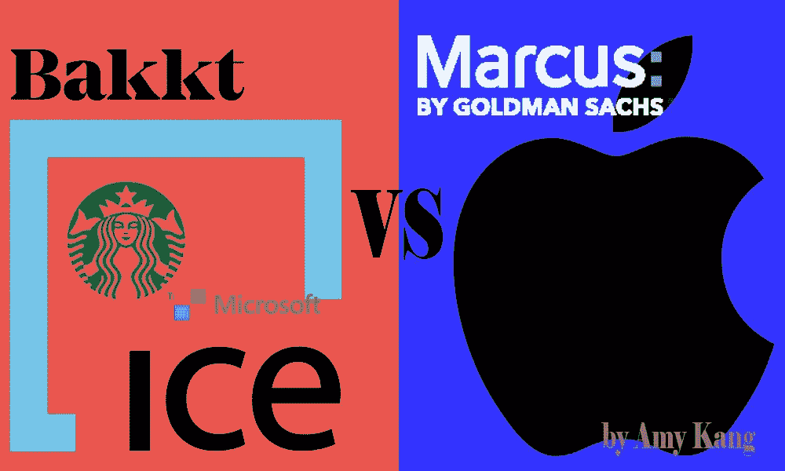
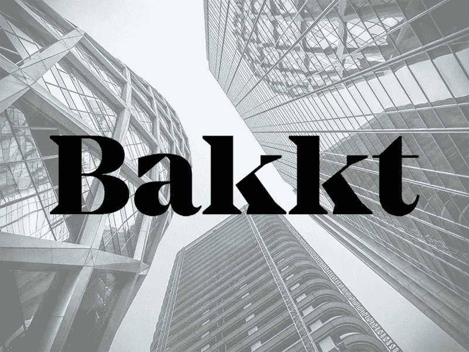
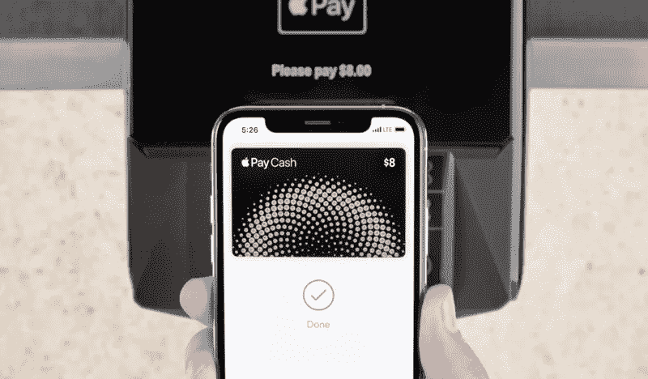
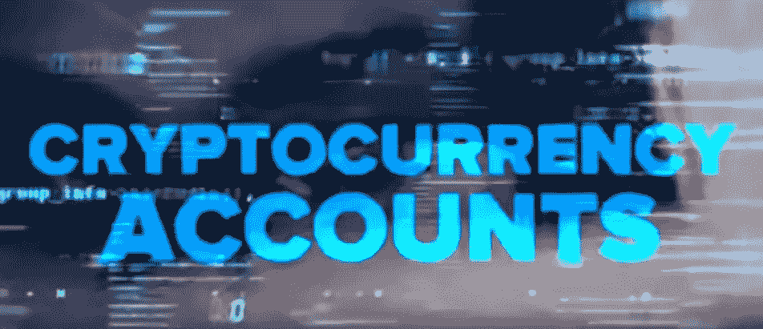
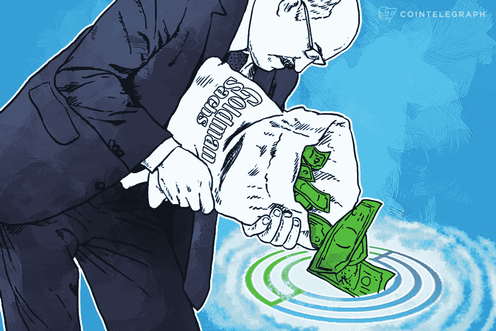

# 区块链漫威 vs DC，巴克特 vs 高盛&苹果

> 原文：<https://medium.com/hackernoon/the-blockchain-marvel-vs-dc-bakkt-vs-goldman-sachs-apple-2681962d40cc>

**Q1 2019 区块链和加密趋势:区块链漫威 vs DC，高盛&苹果 vs 巴克特**

区块链和加密领域的许多专家都认为，2018 年底最重要的两项发展是区块链技术的大规模采用和金融机构的参与。

随着 2019 年第一季度的结束，这种情况将继续存在。

纽约证券交易所(NYSE)的母公司 ICE 去年宣布，将为机构开放一个名为“Bakkt”的区块链和加密金融平台，并计划于 12 月 12 日推出。由于自 2018 年初以来一直持续的长期熊市，Bakkt 的推出随后被推迟。

graphic by Amy Kang

与此同时，Bakkt 在去年 8 月与星巴克和微软建立了合作伙伴关系。这些合作伙伴关系引起了加密社区的兴奋，许多人急切地等待 Bakkt 在 2019 年正式推出。

(根据巴克特首席运营官最近的采访，正在取得进展，但新的发射日期尚未确定。)

**前面提到的金融机构之一高盛(Goldman Sachs)最初表示，他们将推动 Bakkt 向其客户和客户提供比特币期货交易。**

高盛自成立以来就与 ICE 有着密切的关系，许多专家一致认为高盛与 ICE 的关系密不可分。

**然而，2018 年 10 月，高盛改变了他们的论调。**

高盛已经决定不与巴克特合作。相反，他们投资了一家主要的比特币托管服务公司 BitGo。投资规模令人震惊，BitGo 筹集了 7000 万美元的投资。

高盛继续涉足区块链和加密领域。

2019 年 3 月 26 日，[美国消费者新闻与商业频道报道称，高盛将与苹果正式合作，推出一款全新的“免手续费”信用卡，将在全球范围内发售。实际交易将在高盛(Goldman Sachs)于 2016 年开设的零售银行品牌马库斯(Marcus)和苹果之间进行。](https://www.cnbc.com/2019/03/26/goldman-sachs-hints-that-apple-card-will-be-rolled-out-internationally.html)

[https://www.macrumors.com/2019/02/21/apple-goldman-sachs-credit-card-report/](https://www.macrumors.com/2019/02/21/apple-goldman-sachs-credit-card-report/)

“我们正在经历一场零售复兴，”高盛分析师马特·法斯勒说。

2019 年 2 月 20 日，高盛发布了题为“零售复兴”和“银行的未来”的视频，展示了该公司在 2019 年及以后的发展方向。

(你实际上可以在 YouTube 视频中间看到“加密货币账户”这个词。)

[https://www.goldmansachs.com/insights/pages/matt-fassler-the-retail-renaissance.html](https://www.goldmansachs.com/insights/pages/matt-fassler-the-retail-renaissance.html)/ [https://www.youtube.com/watch?v=aDV_jLVbC1Y&t=2s](https://www.youtube.com/watch?v=aDV_jLVbC1Y&t=2s)

**高盛现在和未来在朝着什么方向建设？**

**答案很明确；零售和加密。**

高盛的主要竞争对手如美国银行和摩根大通最近一段时间都在向零售银行业大胆迈进，公司陷入危机。为了对冲另一场 2008 年的金融危机，进入零售银行业和密码市场被视为一个关键举措。

让我们来看看苹果 CEO 蒂姆·库克(Tim Cook)在宣布通过与高盛(Goldman Sachs)的合作推出新的苹果信用卡时发表了什么评论。

“苹果卡的设计是为了确保你是唯一可以使用它的人。

你不觉得很熟悉吗？

我们已经从世界各地的多个区块链和加密项目中听到了这种说法；一种易于使用的支付方式，并由只有授权用户才能访问的 ID 系统保护，“仅供一个用户(拥有该卡的用户)使用，并且只能通过查询用户的身份来激活，并且只有一个所有者可以访问卡号和所有信息。”

我不会说苹果正在考虑在苹果卡上集成区块链技术，但看起来区块链和 crypto 将不可避免地出现在他们的未来。

高盛和苹果非常契合。

苹果每年销售超过 2 亿件产品，拥有非常忠诚和坚实的客户基础。

与苹果合作，高盛可以为其新的零售银行带来坚实而有前景的用户基础，这对高盛来说确实是一笔非常有吸引力的交易。

自 2015 年以来，高盛投资并积极参与加密和区块链行业的研究。

事实上，高盛拥有大量关于区块链和加密的研究数据，这无疑对苹果非常有吸引力，可以引领他们进入移动加密银行、加密信用卡和其他基于区块链的金融服务领域，我认为这是他们的发展方向。

[https://cointelegraph.com/news/circle-building-its-global-vision-thanks-to-50m-investment-from-goldman-sachs-and-others](https://cointelegraph.com/news/circle-building-its-global-vision-thanks-to-50m-investment-from-goldman-sachs-and-others)

(2015 年，高盛向 Circle 注资 5000 亿美元，引发了对 BitGo、Veem 等其他机构加密项目的投资竞赛。)

苹果的主要竞争对手之一，[三星已经建立了自己的名为“NEXT”的区块链服务，最近在其 Galaxy 系列手机上安装了名为 Coinduck 的加密钱包，](https://www.redpulse.com/research/20190314/blockchain-wallets-for-mobile-samsungs-coinduck-and-kakaos-bitberry--7c2ff8186d)苹果在移动领域的另一个竞争对手小米已经加入了世界知名的区块链财团集团 Hyperledger，因为他们也在寻求进入区块链行业。

**自从那些竞争对手开始竞争以来，苹果做了些什么？暂时没有。**

作为苹果最有前景的业务之一，Apple Pay 的规模一直在快速增长。虽然移动支付现在被全球超过 20%的人使用，即使持续增长，支付模式也面临着区块链和加密形式的新威胁，这一空间增长如此之快，以至于继续开发类似于支付宝和 Apple Pay 的移动支付平台是浪费时间。

如前所述，竞争对手已经在寻找下一个“步骤”，并且行动非常迅速。苹果现在最需要的是来自高盛等主要金融机构的坚实数据库，以及与那些有明确解决方案的机构的战略关系。

到目前为止，苹果和高盛在宣布新的信用卡时，没有提到任何关于区块链的事情。然而，从到目前为止已经发表的信息和文章中，我们可以推断出苹果公司和高盛公司正在开发一种新的解决方案，它将利用加密和区块链技术，这将导致加密社区一直希望的“大规模采用”。

这场区块链的漫威 vs DC 风格的比赛才是我们应该关注的:巴克特队 vs 高盛/苹果队。

**哪个“团队”将为区块链和 crypto 开创一个新时代？谁会是下一个能够带领行业走向“大众化”的英雄？**

随时随地，总是需要“先锋”。

我会和他们一起期待 2019 年第二季度。

**你也可以在这里找到韩版:**

 [## 블록체인 업계의漫威그리고特区

### 真诚的제1분기리포트마무리·区块链！| 2019년의 1분기가 이미 알차게 지나갔다.블록체인 크립토 업계에서는 3년 치 4년 치의 뉴스와 프로젝트들이 알차게 1분기에 모두 이루어지거나…

brunch.co.kr](https://brunch.co.kr/@sincerelyamy/17)