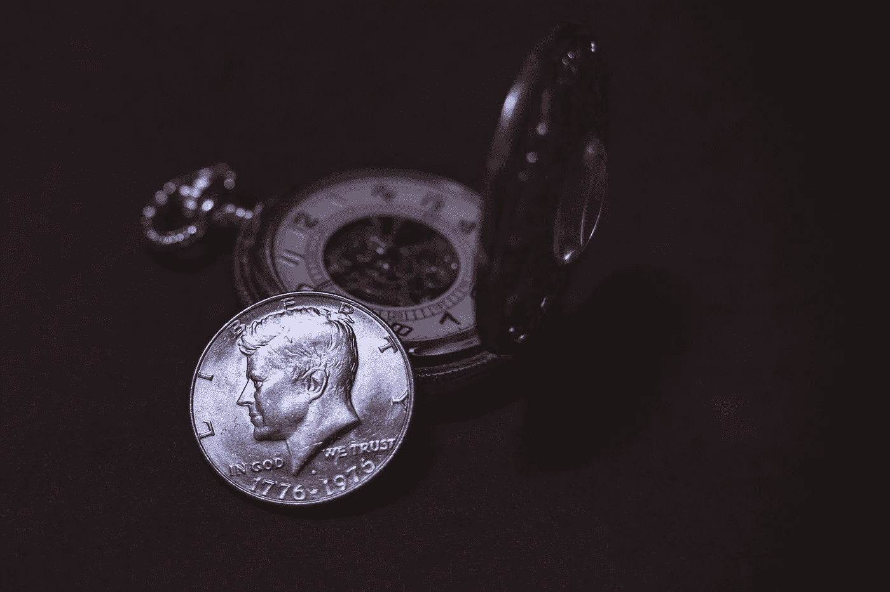

# 区块链价值:一个象征性的故事

> 原文：<https://medium.com/hackernoon/the-blockchain-value-a-token-story-92cd1a3c5207>

现代技术允许人们直接交流。语音和视频通话、电子邮件、图片和即时消息直接从 A 地传到 b 地。无论人与人之间的距离有多远，都可以保持信任。

当涉及到金钱时，人们必须信任第三方才能完成交易。区块链技术正在以一种激进的方式挑战这一点，通过使用加密技术，提供一个开放的分散数据库，包含涉及价值的每一笔交易。金钱、货物、财产甚至选票。创建一个其真实性可以被整个社区验证的记录。

未来的全球经济将走向分布式财产和信任，任何能够访问互联网的人都可以参与基于区块链的交易，第三方信托组织可能不再是必要的。

人们每天拥有更多的代币，交换和消费它们。一个*令牌*有很多用例。让我们列举其中的一些:

众筹、奖励计划、债券发行、衍生品、股票、门票、投票系统、所有权、租车、会员和订阅、软件许可等等。

# **所有权**

但是我如何真正理解区块链呢？不仅仅是谈论这个巨大的分布式分类账、节点、智能合同、秘密商店，这里没有 Alice 也没有 Bob 让我们简化它，让我们把它放在上下文中。

假设你有一张超级碗的门票，但由于某种原因，你不能去，所以你想把票给一个朋友。要么你和他见面，要么你必须把它寄出去。这将是两种可能的选择:

*   把你的二维码截图发给他。
*   把公司发给你的带票的邮件发过去。

无论您选择哪种方式，您都不能通过互联网发送价值，您发送的是您原始票证副本的另一个副本:

*   公司通过电子邮件把票发给你了。这是副本#1。
*   你把那封邮件发给一个朋友。副本#2 将放在交付的文件夹中。
*   如果中间没有中间人，第三份可能是到达你朋友收件箱的那份。

这就是区块链要解决问题。你可以通过互联网发送价值，你可以控制你发送的内容。超级碗的门票附有所有权令牌，可以直接发送给另一个人。

> ***是时候搭建新旧经济之间的桥梁了。***

即使你给你的兄弟寄了一些钱，你仍然是那些钱的主人。

# **智能令牌**

那么，价值是如何通过货币传递的呢？有可能给代币赋予价值吗？这些钱不仅仅是数字现金，而是智能货币。

正如我在上一篇[文章](/caelumlabs/the-art-of-tokenization-2b5f76f71596)中所写的，代币有不同的类型，但它们只是资产、稳定的硬币或新货币，希望我们认为它们是新的比特币。智能货币是可以由所有者控制的代币。

*这到底是怎么回事？*

举个大家熟悉的例子吧。我们在以太坊区块链中构建一个令牌，它必须满足智能合约中提供的一些条件。

这个令牌的所有者可以是双亲。他们决定这笔钱是否可以花。智能合同将遵循给定的指令，以了解令牌何时可以使用或不可以使用。

想象一下，你的儿子正在旅行，你收到一个通知，说某笔付款的费用比平时高，父母中的一方可以接受或拒绝。同样的货币，在你儿子 18 岁之前，可以作为一个*家庭生态系统*。这可以用作家庭决策或普通购买中的投票。智能合约的所有权可以及时转移。

例如，它也适用于企业生态系统。它可以是一种在公司内部消费的代币，可以兑换成预定会议室、购买食物或饮料、进入健身房等所必需的奖金。

这只是一个通过区块链可以创造什么的例子。代币有多种用途，但当涉及到金钱时，你可以成为自己的银行，所以让我们建立一些智能。既然我们知道金钱可以满足某些条件，让我们聪明地思考，用这项技术帮助创造一个新的可持续经济。