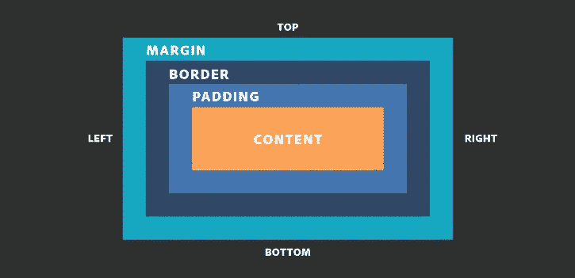
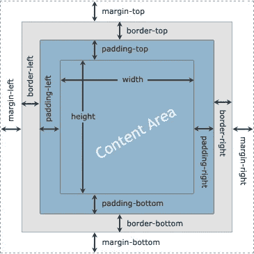
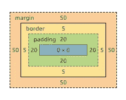

# 盒子模型

> 原文：<https://medium.com/hackernoon/the-box-model-44fc2c04a935>



本文将为您简单介绍一下 ***CSS 盒子模型。***

# 盒子模型是什么？

HTML 文档中的每个元素都由一个或多个矩形框组成。CSS 盒子模型描述了这些矩形框是如何在网页上布局的。
Box 模型描述了如何将填充、边框和边距添加到内容中以创建这个矩形。换句话说，我们可以说每个框都有一个内容区域和可选的周围边距、填充和边框。



by republic.com

1.  最里面的矩形是内容框。其宽度和高度取决于元素的内容(文本、图像、视频和任何子元素)。
2.  然后我们有了填充框(由 padding 属性定义)。如果没有定义填充宽度，则填充边缘等于内容边缘。
3.  接下来是边框(由 border 属性定义)。如果没有定义边框宽度，则边框边缘等于填充边缘。
4.  最外面的矩形是边距框。如果没有定义边距宽度，则边距边缘等于边框边缘。

例子—

```
div{
 border: 5px solid;
 margin: 50px;
 padding: 20px;
}
```

这个 CSS 将所有 div 元素的上、右、下和左边界的宽度设为 5px，上边、右、下和左边距设为 50px 以及 20px 的顶部、右侧、底部和左侧填充。忽略内容，我们生成的框将如下所示:



## 上述元素盒的高度和宽度是多少？

如果你的答案是零，那么你就错了，因为高度和宽度是 150 乘 150。
元素的盒子所占的空间是这样计算的:

> **总宽度** =宽度+填充-左侧+填充-右侧+边框-左侧+边框-右侧+边距-左侧+边距-右侧

eg —总宽度= 0px+20px+20px+5px+5px+50px+50px = 150 px

> **总高度** =高度+填充-顶部+填充-底部+边框-顶部+边框-底部+边距-顶部+边距-底部

eg —总高度= 0px+20px+20px+5px+5px+50px+50px = 150 px

# 盒子尺寸

属性定义了如何计算一个元素的总宽度和高度。我们可以使用这两个值来调整盒子大小属性:

```
box-sizing: content-box;
```

默认情况下，在框模型中，分配给元素的宽度和高度仅应用于元素的内容框。
当您开始向元素添加填充和边框样式时，元素的宽度和高度将不会代表它在屏幕上的实际宽度或高度。
例如——如果您将元素的宽度设置为 100 像素，那么元素的内容框将为 100 像素宽，添加 20px 填充会将元素的实际宽度增加到 100px + 20px +20px = 140px。

```
box-sizing: border-box;
```

它告诉浏览器考虑您为元素的宽度和高度指定的值中的任何边框和填充。
换句话说，当你在一个元素上设置`box-sizing: border-box;`时，该元素的填充和边框不再增加它的宽度。
例如，如果你将一个元素的宽度设置为 100 像素，这 100 像素将包括你添加的任何边框或填充，内容框将缩小以吸收额外的宽度。

在 [Twitter](https://twitter.com/jscodelover) 、 [LinkedIn](https://www.linkedin.com/in/jscodelover) 或 [GitHub](https://github.com/jscodelover) 上关注我。

希望这篇文章对你有用。感谢阅读&继续编码！！