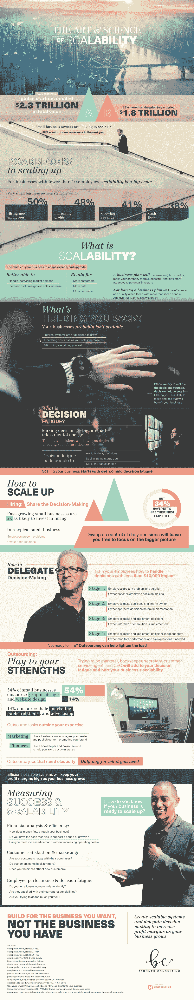

# 业务可扩展性信息图

> 原文：<https://medium.com/hackernoon/the-business-scalability-infographic-796aa1eb6289>

2015 年至 2017 年，全球创业公司创造了超过 20 亿美元的总价值，比前三年增加了 26%。但是开始只是成功的一半，尽管许多小企业显示出希望，稳定可靠的增长并不容易。

每个企业的可扩展性看起来都不一样，但目标总是一样的——拓展增长空间。如今，88%的小企业主表示，他们的目标是在明年增加收入，但这说起来容易做起来难。高度可伸缩的企业不一定要像一艘紧密的船一样工作，但它们确实依赖于有能力的团队成员做出明智的决策。对于小企业主来说，他们经常发现自己插手每个部门的事情，扮演簿记员、销售人员和客户服务代表的角色。放弃对日常活动的控制将解放你的注意力，并有助于你专注于大的发展。

提高可伸缩性始于几个简单的问题，但最终会带来巨大的成果。你准备好扩大规模了吗？请看这张信息图，了解更多关于可扩展性背后的[科学](http://brunnerconsultinginc.com/the-art-of-scalability/)以及如何为您想要的业务而不是您现有的业务进行构建。

