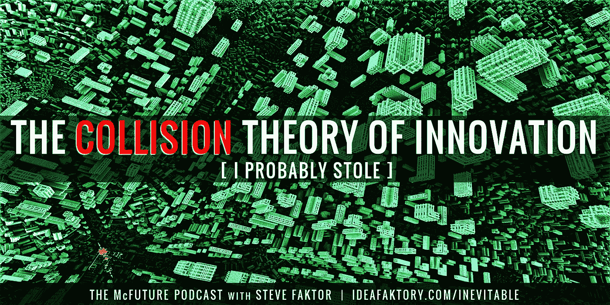
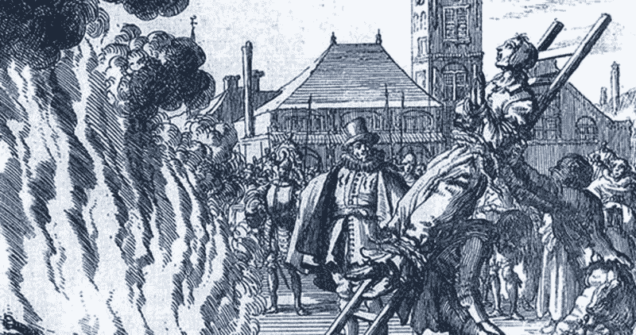
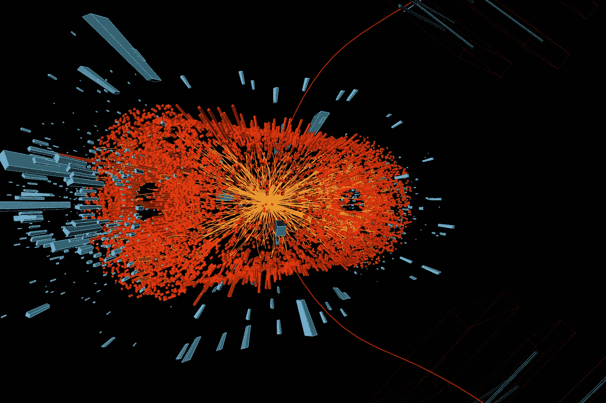
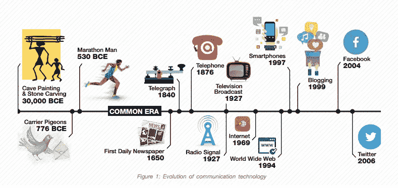
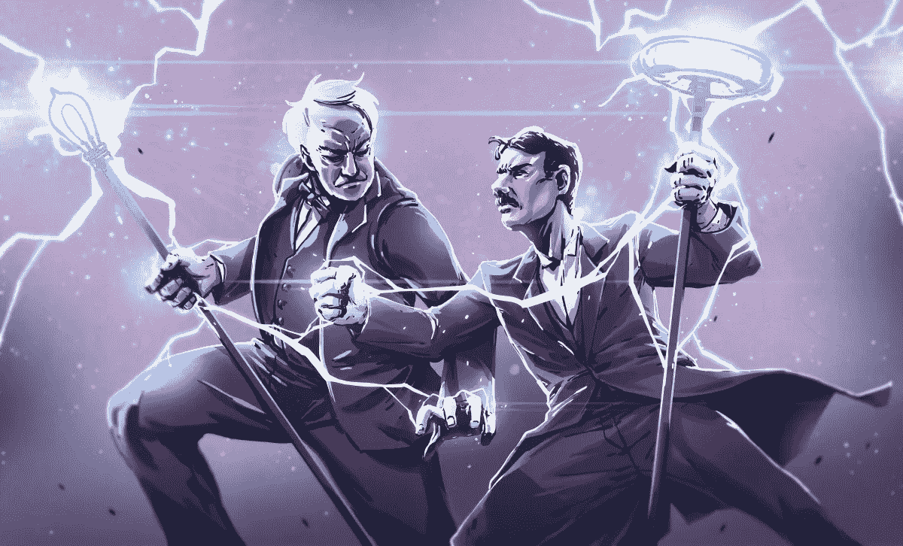
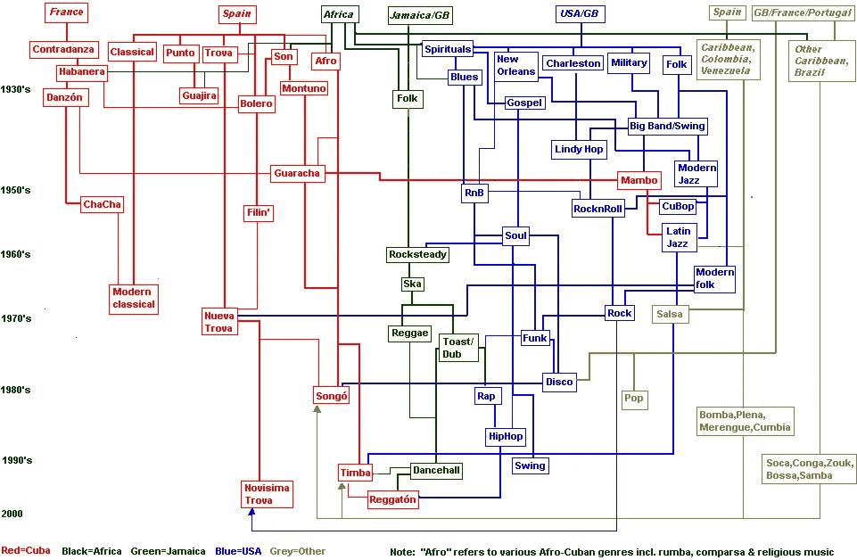
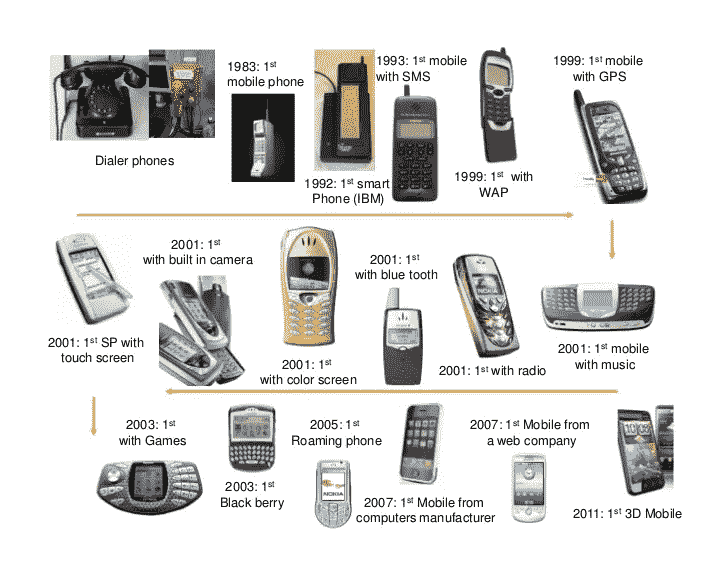
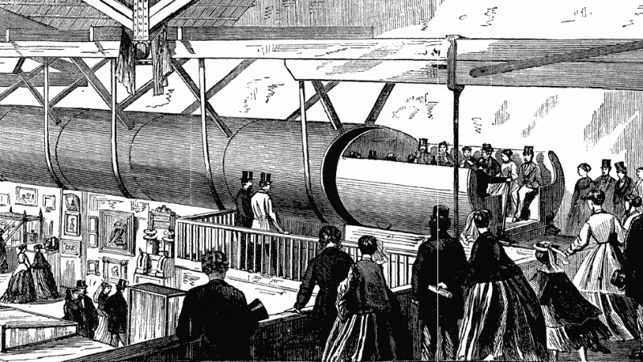

# 创新的碰撞理论

> 原文：<https://medium.com/hackernoon/the-collision-theory-of-innovation-b6087aee9368>

## …我可能偷了

Source: [IdeaFaktory.com/inevitable](https://www.ideafaktory.com/inevitable)

如果我告诉你所有的进步，从现在开始，都依赖于*盗窃*呢？而那所有的创新*都被*挪用了。还有那个*我们*都是贼……在这件事上没有选择。是因为*创新的碰撞理论*。*(帖子续下)*

*碰撞理论是我在* [*这一集*](https://www.ideafaktory.com/inevitable)*[*的《McFuture 播客》*](http://TheMcFuture.com) *中布局的“必然性的 3I”公式中的第一个“我”。*请在 iTunes 上给它 [*5 星*](https://itunes.apple.com/us/podcast/ideafaktory-podcast/id504552826?mt=2&ls=1) *！)**

## *主意*

*所有的进步都始于一个想法。回想我们在山洞里的日子，几乎每个想法都很糟糕。*

> ***“为什么耶利米会得瘟疫？”***
> 
> *“是女巫干的！”“我们烧死女巫吧！”*
> 
> ***“我们如何打败所有这些蒙古人？”***
> 
> *“我们必须用这种特殊的舞蹈召唤我们长辈的鬼魂…”*
> 
> ***“我们如何让庄稼生长？”***
> 
> *“牺牲这个处男！”*

**

*这唯一有意义的时候是当处女也是女巫的时候。至少到那时，你可以减少一半的死亡人数。*

*这不是他们的错。原始的头脑有营养不良的想象力。他们依靠恐惧、无知和迷信生存。今天，我们理所当然地认为坏主意被扼杀的速度有多快——被小学科学或令人愉快的推特暴民扼杀。*

*知识驯服了我们思想的野性，但也深化了它们的品质。我们所有的处女都能活下来。*

*但是推动我们前进的不再是科学，而是碰撞。*

**

*当两个或更多不相关的想法碰撞出新的东西时，创新就发生了。最好的碰撞可以改变生活，消除枯燥或简单的快乐。创新需要质和量的碰撞。*

*质量是由知识、多样性、智力、创造力、勤奋、刺激和批评所驱动的。*

**数量*都是频率和音量。一个物理空间里的人越多，互动越多，交流的时间越多，刺激越多，碰撞越多。*

*当然，一些隐士可以在柳树下旋转魔法，听青蛙呱呱叫。但是，为了让社会受益，他们的想法必须传达给其他人，被交换、辩论和屠杀——以提出更好的想法——或者让人们按照他们的想法行动。*

*我们已经提高了我们的碰撞游戏，大时间。*

*轮船、火车、飞机和汽车把我们带到了新世界。他们提高了碰撞的频率和质量。城市让我们挤上地铁，近到可以给彼此的早餐命名，但也进了办公室，在那里我们与许多聪明人碰撞。*

*但是最伟大的飞跃根本不需要感动人，只需要思想本身。无线电、电报、电话和电视以难以想象的速度和规模制造了碰撞。他们将碰撞从物理约束中解放出来。*

**

*然后互联网出现了。互联网是一个超级对撞机。它使得碰撞成指数增长。网络是世界上最大的头脑风暴会议……永不停歇。在这里，没有什么想法能长久保持珍贵。*

> *互联网是一个思想超级对撞机。网络是世界上最大的头脑风暴会议……永不停歇。这是任何想法都不会长久珍贵的地方。” —史蒂夫·法克特*

*我们不仅上传了我们的全部作品——我们所有的发明、书籍、科学发现、幻想，而且我们开启了无限的可能性。*

*单单 YouTube 就是创新的巨大推动力。这是所有可能性的疯狂档案。当有人雄心勃勃地看到一个伟大的滑板或烹饪技巧。他们不仅会复制它，还会试图超越它。他们在加熏肉。或者，跳下四段楼梯……每只胳膊下抱着一只猫和一只黑猩猩。然后，他们会发布他们是如何做到的。第三个人？他在放火烧楼梯。(不要这样，小朋友。)*

*这个循环正在帮助我们释放人类无限的潜能……给或拿一只偶尔冒烟的黑猩猩。*

*那么当碰撞次数接近无穷大时会发生什么呢？我们将开始看到更多的两个显著现象。*

## ***纬线***

*我喜欢喜剧。但时不时地，像[艾米·舒默](https://www.youtube.com/watch?v=Qv0eWN8v_tg)、[罗宾·威廉姆斯](http://nymag.com/nymetro/news/people/columns/intelligencer/6281/)和[柯南·奥布莱恩](http://brobible.com/entertainment/article/comedy-writer-suing-conan-o-brien/)这样的喜剧演员会被指控剽窃笑话。少数几个，像卡洛斯·曼西亚[和丹尼斯·利瑞](https://www.youtube.com/watch?v=gN8uZshqP4E)是明目张胆的，但除非是习惯性的，否则即使是听起来一样的笑话也不太可能是偷窃的产物。至少不像我们所知道的那样，又名“盗窃*经典*”。*

*想象有两个喜剧演员。一个来自纽约，另一个来自洛杉矶。两人都是单身，性格古怪，深夜工作。他们不停地旅行，四处流浪，吃中低档的拉面。两者都消费类似的博客、播客和 HBO 节目。他们的朋友圈可能相差一度。很难想象两者会有相似的前提吗？或者，甚至是一个相同的笑话？或者，有着相似生活方式的其他人最终会这么做？*

*这个概念被称为 ***平行思维*** ，它每天都在我们的超级对撞机中强化。*

*创新也是如此。*

*当平行思维引出有用的东西时，就叫做 [***多重发现***](https://en.wikipedia.org/wiki/Multiple_discovery) 。*

*我每周都有几十个想法——关于新业务、文章和与花椰菜有关的事情。(我正在进行低碳水化合物饮食，不要问…)我有太多的想法了。但我把它们藏在手机的加密文件里。我最近浏览了一下，发现每个人都在敲我的竹杠！一个接一个，我的想法被肮脏的小偷偷走了！！*

**

*完美的例子是 Pillpack。它将你的处方和维生素制成小包，从打孔的纸卷上撕下每个定制的剂量(就像卫生纸一样)。它被亚马逊以 10 亿美元收购。他们怎么敢偷我的主意？！？难道他们不知道，在 8 到 48 年的时间里，我会把它建成一个万亿美元的企业！我要求赔偿！*

*我没有屏住呼吸的原因是多重发现，这是西方文明的一个主要特征。而且已经接近超速了。*

*追溯到最原始的文化。他们都有装饰性的面具，图腾柱和插在棍子上的肉。埃及人和玛雅人都独立建造了金字塔。尽管埃及人穿得更好。*

*所有这些，都是从积累的知识中拼凑出来的。*

**

*谁发明了电？爱迪生还是特斯拉？*

*如果奥本海默和曼哈顿计划没有造出原子弹，你觉得我们不会有原子弹吗？俄罗斯和德国紧随其后，每周都有数万人死亡。就在你认为你的老板给了你疯狂的最后期限的时候…？*

*摇滚并不是从猫王、查克·贝里或披头士开始的。这是一种影响的发展，可以追溯到非洲。*

**

*iPhone 也是如此。好吧，不完全是回到非洲，但它产生于现有技术的碰撞——电话、移动电话、电池、计算、塑料、数据压缩等等。像 Palm 和 blackberry 这样的前辈并没有*那样*与众不同。*

**

*想想埃隆·马斯克(Elon Musk)的 Hyperloop，这是一项非凡的发明，它以极快的速度将人们射进地下管道，希望他们不会在另一端变成汤。但是它看起来很像 19 世纪 60 年代在纽约获得专利并建造的[气动地铁](http://bit.ly/2GHJnU6)*

**

*最近，美国在线联合创始人史蒂夫·凯斯[在推特上向第一台文字处理器的创造者](https://mobile.twitter.com/SteveCase/status/1072495980145205248)[伊芙琳·贝雷津](https://t.co/zPcZL4j80A)致悼词:*

*没有比尔·盖茨？没有史蒂夫·乔布斯？没有网络？没有文字处理器？没有电子表格？她是关键人物，真的是这样吗？或者，我们还会有所有这些东西，只是不同，有不同的角色？*

*这才是重点。奥本海默、特斯拉、史蒂夫·乔布斯、猫王和马斯克——他们不是魔术师，他们是管道。第一个到达终点，但远不是比赛中唯一能赢的人。*

*随着时间的推移，碰撞成倍增加。并行思考和多重发现升级。这保证了越来越多的“指挥家”有资格建设我们的未来。这是因为每一个可以想象的发明都在这个无限的全球汤里孵化。不管专利法怎么说，*没有人*拥有它们中的任何一个。从来没有。每一个想法，每一项发明都是之前所有事物的产物——人类知识的集合。一切——以及*每个人*既是产品也是成分。*

*这就是为什么我可以放心地说预测未来变得更容易了。事实上，这个作品只是必然性的第一个“我”，我创造这个公式是为了帮助你预测未来。不仅仅是未来，而是不可避免的。请听完整的故事，关于“ [***为什么连马斯克都无法战胜不可避免的***](https://www.ideafaktory.com/inevitable/) ”一集的[MC future 播客](https://www.ideafaktory.com/the-mcfuture-podcast/)。*(如果你喜欢，别忘了订阅分享。)**

*下次见，享受你人类想象力的极限吧，你这个美丽的小偷。*

***Listen & Subscribe on:** [**Apple Podcasts**](https://itunes.apple.com/us/podcast/ideafaktory-podcast/id504552826?mt=2&ls=1#episodeGuid=https%3A%2F%2Fwww.ideafaktory.com%2F%3Fp%3D8155) **|** [**Google Play**](https://goo.gl/app/playmusic?ibi=com.google.PlayMusic&isi=691797987&ius=googleplaymusic&link=https://play.google.com/music/m/Iotj53jopkngeouppdqno6in6da?t%3DThe_McFuture_with_Steve_Faktor_%257C_IdeaFaktory.com) **|** [**Spotify**](http://spotify.TheMcFuture.com) **|** [**TuneIn**](http://tunein.themcfuture.com) **|** [**Stitcher**](http://stitcher.TheMcFuture.com) **|** [**RSS**](https://www.ideafaktory.com/feed/podcast/) **|** [**Web**](https://www.ideafaktory.com/the-mcfuture-podcast/) (Like it? Please rate it [5-stars on iTunes](https://itunes.apple.com/us/podcast/ideafaktory-podcast/id504552826?mt=2&ls=1)!)*

*如果你喜欢这个，请分享。*

***关注我 via** [**快讯**](http://www.ideafaktory.com/newsletter/) **，** [**The McFuture 播客**](https://www.ideafaktory.com/mcfuture) **，**[**LinkedIn**](https://www.linkedin.com/today/author/ideafaktory)**，** [**脸书**](http://facebook.com/ideafaktory)**[**推特**](http://twitter.com/ideafaktory) **。*****

*****关于*****

***史蒂夫·法克托尔是创新孵化器 IdeaFaktory 的首席执行官，美国运通董事长创新基金的前负责人，也是《电子创新》的未来主义作者。他是福布斯、哈佛商业评论和商业内幕的著名撰稿人，也是 LinkedIn 的影响者。在这一季的 McFuture 播客中，将会有一些挑衅性的，不敬的独白，讲述在我们虚拟化的未来取得成功的关键。***