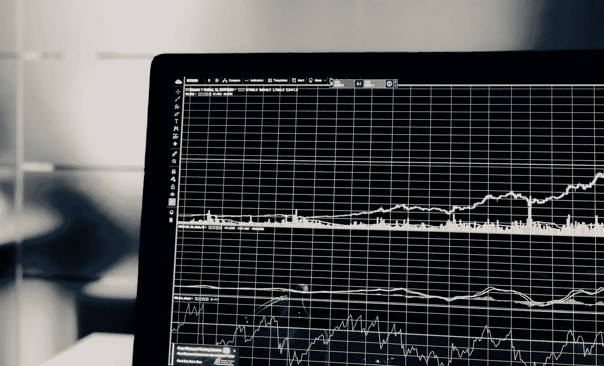
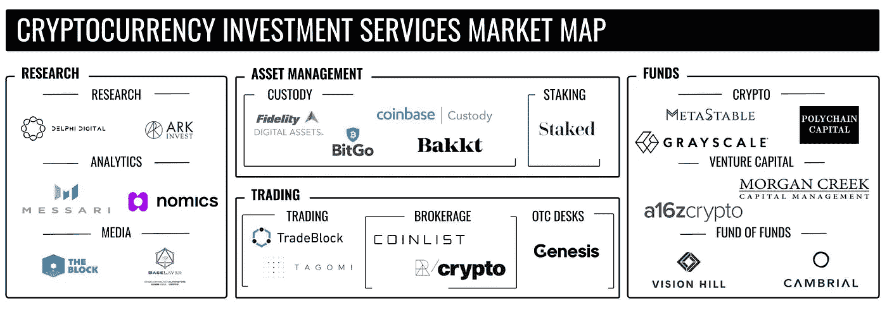
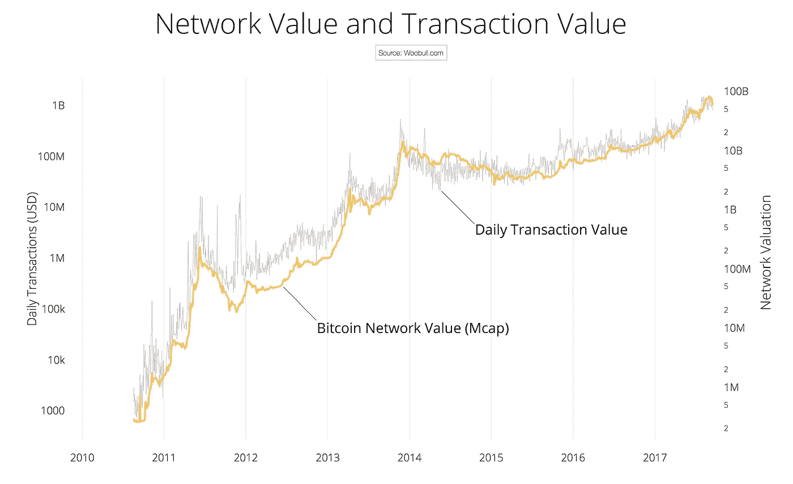
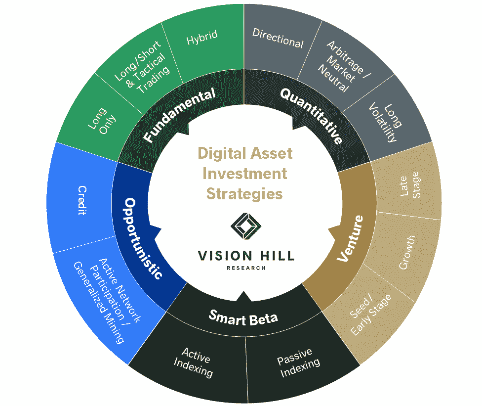

# 帮助机构投资者购买比特币的公司

> 原文：<https://medium.com/hackernoon/the-companies-helping-institutional-investors-buy-bitcoin-bad5a3377d55>

## 加密货币投资服务市场地图

在 2017 年从不到 1000 美元飙升至近 2 万美元后，最大的加密货币比特币在 2018 年底暴跌至 3000 美元。在狂热高峰期买入的投资者眼看着他们的投资缩水了 85%。

然而，在 2019 年，价格悄然上涨了 300%以上——回到了 1 万美元以上。

有报道称，大型机构投资者和基金可能至少是近期反弹的部分推动力。许多人认为，除了比特币的早期使用者之外，没有其他人的支持，最近的反弹是无法持续的。

然而，投资于加密并不等同于投资于其他资产类别。它不仅具有高度的波动性和投机性，还带来了新的独特挑战，如估值方法、技术尽职调查、托管和流动性。大型机构投资者——如对冲基金、银行、家族理财室和捐赠基金——将需要许多与投资其他资产类别相同的产品和服务。

尚未进入 crypto 的大量资本有可能将 crypto 带回到其历史高点，并远远超过它。这篇文章重点介绍了那些提供产品和服务来帮助对冲基金、银行、捐赠基金和家族理财室投资 crypto 的公司。

# 1.研究和教育

与投资商品、股票或货币相比，投资加密货币需要不同的尽职调查实践和分析。你需要评估区块链技术和经济，没有任何普遍接受的估值方法。现在有很多公司教育投资者关于加密资产的知识。

## 投资研究

在华尔街，股票研究公司对上市公司进行广泛的尽职调查和财务分析，以便投资者能够做出更明智的投资决策。

加密领域的投资研究公司——如[德尔福数码](https://www.delphidigital.io/)和[方舟投资](https://ark-invest.com/research/tag/cryptocurrency-2)——提供相同的价值主张，但拥有加密资产方面的专业知识。

## 链上和交换分析

Source: Willy Woo

包括 [Messari](https://messari.io/onchainfx/metrics) 、 [Nomics](https://nomics.com/) 、[chain analysis](https://www.chainalysis.com/)、 [Digital Asset Data](https://www.digitalassetsdata.com/) 和 [Adaptive Capital](http://charts.woobull.com/) 在内的公司提供关于链上和加密交换活动的指标。例如，[Adaptive Capital 的合伙人 Willy Woo](https://medium.com/u/a8f4de44a01d?source=post_page-----bad5a3377d55--------------------------------) 报告比特币的网络价值和流经区块链的交易价值，以确定该资产何时可能被高估或低估。

## 新闻和媒体

有许多大型媒体公司提供传统市场的新闻分析。谁将成为加密领域的美国消费者新闻与商业频道？[Block](https://www.theblockcrypto.com/)和 [CoinDesk](https://www.coindesk.com/) 是早期的领跑者。

也有一些面向机构投资者的优秀播客，包括[大卫·内奇](https://acrabaselayer.podbean.com/)的[基础层](https://acrabaselayer.podbean.com/)，汤姆·沙乌格内西[的](https://medium.com/u/9baf70bc7a3a?source=post_page-----bad5a3377d55--------------------------------)[连锁反应](https://podcasts.apple.com/us/podcast/chain-reaction/id1438148082)以及安东尼·庞普利亚诺的[连锁反应](https://podcasts.apple.com/us/podcast/off-the-chain/id1434060078)。

# 2.资产管理

购买、持有和管理加密货币面临独特的挑战。您需要您的私钥来进行交易和访问您的加密资产。然而，私钥几乎不可能被记住，而且可能被盗或被黑。在线钱包和交易所是选择，但有许多关于黑客和安全缺陷的重大新闻报道，使得风险承受能力较低的投资者持观望态度。

## 监护

没有人想投资一项资产，然后让它丢失或被盗。托管公司为加密货币提供存储和安全服务。

这个领域已经取得了巨大的进步。最值得注意的是，富达成立了一个名为[富达数字资产](https://medium.com/u/3a8b739a08d1?source=post_page-----bad5a3377d55--------------------------------)的[数字资产集团](https://www.fidelitydigitalassets.com/overview)，提供托管和执行服务。 [BitGo](https://www.bitgo.com) 、[比特币基地](https://custody.coinbase.com/)、[总账](https://www.ledger.com/vault/)、[王国信托](https://www.kingdomtrust.com/individual-custody-solutions/digital-currency)也提供密码托管服务。

## 立桩标界

股权证明是一种用于验证区块链交易的系统。具有工作证明系统的加密货币在用户执行计算工作时验证交易并创建新块，而利益证明系统基于用户拥有的加密货币的数量验证交易并创建新块。

据为机构投资者提供赌注服务的公司 [Staked](https://medium.com/u/2e226f754735?source=post_page-----bad5a3377d55--------------------------------) 称，“到 2019 年底，整个加密货币市场的约 25%将使用股权证明作为安全模型。”这意味着，加密货币凭证的所有者可以参与治理，并收取赌注奖励。

# 3.贸易

你可以通过几乎任何一家传统银行或经纪公司购买股票。然而，直到最近，潜在的加密投资者还没有以安全有效的方式购买和交易所需的所有工具和服务。

## 贸易

[TradeBlock](https://tradeblock.com/) 、 [Lumina](https://www.lumina.app/) 和 [Tagomi](https://tagomi.com/) 提供为满足大投资者需求而构建的交易执行、投资组合管理和分析产品。

## 佣金

2017 年，随着比特币飙升至历史高点，许多新的加密项目进入市场，希望提供类似的回报。然而，这些项目中的许多充其量是低质量的，最坏的是骗局。像 [CoinList](https://medium.com/u/88ecffe5cb1?source=post_page-----bad5a3377d55--------------------------------) 和 [Republic Crypto](https://medium.com/u/e929e1652625?source=post_page-----bad5a3377d55--------------------------------) 这样的公司帮助投资者过滤所有的噪音，找到最好的投资机会。

## 柜台交易柜台

大多数加密货币的交易量都不及大盘股等资产。因此，如果一个大投资者在像比特币基地这样的交易所下一个大的买入或卖出订单，它可能会使市场上涨或下跌，从而降低投资者以他们想要的价格卖出的能力。像 [Genesis](https://genesistrading.com/) 这样的柜台交易平台将大型买家和卖家联系起来，然后他们直接进行交易。

# 4.基金

许多大型投资者将资金分配给基金，然后基金对不同的资产进行直接投资。例如，家族理财室可以投资于风险投资基金，而不是投资于特定的初创公司，然后风险投资基金寻找、评估和投资初创公司的投资组合。现在有许多基金直接投资于各种加密货币，也有许多公司为加密货币生态系统提供产品。

[Vision Hill Advisors](https://medium.com/u/433cf470006?source=post_page-----bad5a3377d55--------------------------------) ，一个组合基金的加密货币基金[，为](/vision-hill-blog/vision-hill-crypto-hedge-fund-returns-fourth-quarter-2018-a87d8c38d44)提供了一个关于加密基金部署的不同策略的有用图表:

Source: Vision Hill Blog

许多基金混合运用这些策略。以下是一些直接投资加密货币的基金、加密市场的初创公司和加密基金。

## 直接加密货币投资

[Polychain Capital](https://polychain.capital/) 、 [BlockTower Capital](https://www.blocktower.com/) 、[亚稳](https://www.metastablecapital.com/)、[逐位](https://medium.com/u/5b2cd72c5d1b?source=post_page-----bad5a3377d55--------------------------------)、 [Multicoin Capital](https://medium.com/u/1ac059405a76?source=post_page-----bad5a3377d55--------------------------------) 、 [Arca](https://www.ar.ca/) 、[数字货币集团](https://medium.com/u/a6be2334cd52?source=post_page-----bad5a3377d55--------------------------------)、[银河数字](https://www.galaxydigital.io/)、 [CoinShares](https://medium.com/u/853761ab8029?source=post_page-----bad5a3377d55--------------------------------) 、[灰度投资](https://medium.com/u/e9d2e607092?source=post_page-----bad5a3377d55--------------------------------)是众多直接投资加密货币的基金中的几个。

## 风险资本

加密风险投资基金对为加密生态系统提供产品的公司进行股权投资。要让比特币成为一个可行的支付系统，成为零售投资者可行的或可行的投资机会，需要许多解决方案，投资于提供这些解决方案的公司可以带来可观的回报。例如，据报道，最大的交易所之一比特币基地的估值为 80 亿美元，这足以为对该公司进行风险投资的基金提供可观的回报。

[a16z Crypto](https://a16z.com/crypto/) 、[潘迪拉资本](https://medium.com/u/d25fb22875fb?source=post_page-----bad5a3377d55--------------------------------)、[区块链资本](https://medium.com/u/9737c5ab2ab1?source=post_page-----bad5a3377d55--------------------------------)和数字货币集团是最活跃的专门加密风险投资基金。也有许多风险投资公司投资加密以外行业的初创公司，如 Union Square Ventures 和 Boost VC。

## 基金中的基金

与投资加密货币类似，投资加密基金需要独特的专业知识和尽职调查实践。机构投资者投资于评估加密投资的基金的基金，并将客户的资金投资于最佳基金。Vision Hill、 [Cambrial Capital](https://medium.com/u/7575c7224d0e?source=post_page-----bad5a3377d55--------------------------------) 和 [Hutt Capital](https://medium.com/u/de441d0ad2c2?source=post_page-----bad5a3377d55--------------------------------) 是最著名的基金的加密基金。