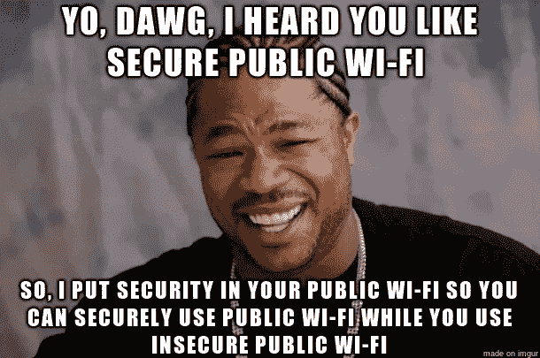

# 在公共 Wi-Fi 上保证安全所需的所有东西的完整、无止境、荒谬的列表

> 原文：<https://medium.com/hackernoon/the-complete-endless-ridiculous-list-of-everything-you-need-to-be-safe-on-public-wi-fi-57fca0a733f7>

我们访问的 Wi-Fi 网络、访问的网站和使用的协议都无法保证我们的在线安全。因此，每个人都有责任构建零碎的防御。在这里，我列出了安全使用互联网的基本原则。

> 这是我今天关于公共 Wi-Fi 网络不安全系列的第 3 部分。
> 
> 之前，第 1 部分着眼于公共 Wi-Fi 的[黑客攻击危险，接下来是第 2 部分](https://hackernoon.com/a-hacker-intercepted-your-wifi-traffic-stole-your-contacts-passwords-financial-data-heres-how-4fc0df9ff152)深入探究我们为什么会在今天的位置。

# 1.从已知的安全状态开始

首先，为了在公共 Wi-Fi 上安全，一般来说，你需要在互联网上安全。

您至少需要:

1.  拥有你知道还没有被泄露的在线账户
2.  使用从不使用超过一次的强密码(一个好的密码管理器会有所帮助)
3.  对所有帐户实施双因素身份验证

[由于短信很容易被转发到攻击者的手机](https://www.wired.com/story/sim-swap-attack-defend-phone/)，**你的账户永远不要通过短信使用双重认证**。

> 为你的金融账户启用额外的预防措施，比如登录提醒，也不会有什么坏处。

With many applications installed comes multiplied risk, as you trust even more developers and code practices

# 2.保持最新状态

[网页浏览器](https://leucosite.com)[bug](https://nakedsecurity.sophos.com/2019/01/31/update-now-chrome-and-firefox-patch-security-flaws/)、 [TLS/SSL](https://en.wikipedia.org/wiki/Transport_Layer_Security#Attacks_against_TLS/SSL) 漏洞、 [Wi-Fi 认证协议](https://www.wired.com/story/krack-wi-fi-wpa2-vulnerability/)漏洞、应用和操作系统漏洞在漫游到他人网络前应打好补丁。

> ***这意味着你需要让你的各种设备操作系统和应用保持最新，但你也应该让你的所有其他设备保持最新，如家用路由器、打印机和智能设备，因为这些可能成为其他设备和/或在线帐户的攻击媒介。***

安装更新后，通常需要重启应用程序，如 web 浏览器(或者，在操作系统更新的情况下，甚至是整个计算机)来实际应用这些更新。

An unnecessarily-exposed attack surface can result in your devices and apps being bombarded by threats

# 3.掩护你的攻击面

在考虑连接到公共网络之前，您首先需要考虑如何保护您的计算机免受攻击。

> 您需要确保您的计算机上没有运行虚假的网络可访问服务或文件共享，并且安装并正确配置了防火墙。

限制安装的应用程序的数量和卸载不再使用的应用程序是减少攻击面的一个很好的附加步骤。另一个最佳实践是保存一份您拥有的所有帐户的(脱机)列表，这样您就不会忘记它们或与它们相关的信息，并定期查看您不再使用的帐户列表，停用不必要的帐户。

A typical hacker, or privacy advocate, or both, or neither — who knows what’s beneath that mask

# 4.防止拦截

在连接到公共网络之前，您需要准备好防止应用程序数据被拦截的对策。

> ***这需要找到一个值得信赖的 VPN 解决方案，安装它，并正确配置它，以便它可以立即启动，它不会泄漏任何协议的数据包(如 DNS 请求)。***

在连接到公共网络之前，必须下载 VPN 解决方案，因为不能相信公共网络能够提供下载没有恶意软件的软件的能力。

# 5.连接到合适的网络

许多公共 Wi-Fi 网络利用包含使用条款或收集用户信息的强制网络门户。

不幸的是，如果 VPN 解决方案捕获所有流量，那么为了点击进入强制网络门户并访问互联网，往往必须将其禁用。

> ***强制网络门户至少可以暂时规避 VPN 的好处，更不用说如果在这个过程中设置了 cookies，还会有潜在的跟踪隐患。***

Wi-Fi pineapple routers promise hospitality, but with a catch —undesirable security and privacy implications

# 6.避免菠萝

[Wi-Fi 菠萝](https://www.wifipineapple.com)是提供好客服务的路由器，但问题是它们是伪装成良性网络的恶意黑客工具。

如果防火墙和 VPN 解决方案都运行良好，那么菠萝应该没什么可攻击的；但是，如前所述，强制网络门户会加剧风险，更不用说泄漏的 VPN 配置了。

> ***事实是，恶意网络很容易伪装成合法网络，但即使是合法的公共网络也可能有恶意行为者与之连接。***

# 7.使用浏览器插件修补网络安全漏洞

让我们面对现实:开箱即用， [25%的网站是在没有使用加密](#)的情况下被访问的，到处都是网站是[跟踪你](https://medium.freecodecamp.org/what-you-should-know-about-web-tracking-and-how-it-affects-your-online-privacy-42935355525)和[你的家人](https://twitter.com/iamdylancurran/status/977559925680467968)。

网络浏览器扩展 [HTTPS Everywhere](https://www.eff.org/https-everywhere) 和 [Privacy Badger](https://www.eff.org/privacybadger) 将帮助你浏览狂野的网络。[容器扩展](https://www.reddit.com/r/worldnews/comments/87icwb/mozilla_launches_facebook_container_extension_for/)的存在也是为了更好地隔离网站/标签及其数据，这也可以有效地阻止某些在线跟踪器。对于你访问的所有网站，我都极力推荐使用这些扩展和网络浏览器容器。

> 如果你是一个高风险群体的成员，如活动家、记者或亿万富翁，你将受益于不同类型的在线活动之间更强的物理隔离，利用单独的专用设备进行敏感活动。任何级别的虚拟封闭都不如物理隔离好。

# 8.了解并优化您的威胁模型

每个人都有不同的威胁模型，由不同的环境定义:

1.  我的高价值资产在哪里？
2.  我哪里最容易受到攻击？
3.  我最有可能受到的威胁是什么？

不断地问自己:我能做些什么来减少威胁，过上更注重安全和隐私的生活？

> ***也问问你自己:我是否有独特的情况(例如，一个需要匿名的记者，或者一个可以进入一些大额银行账户的亿万富翁 CEO)？如果是的话，熟悉一下 EFF 的*** [***监视自卫***](https://ssd.eff.org) ***资源，如果需要的话，*** [***匿名工具***](https://www.torproject.org) ***也可以。***

在公共网络和互联网上保持安全需要意识和行动。

# 结论

*最低限度*，你应该使用值得信赖的 VPN，到处使用双因素认证(但不是通过短信)，安装 HTTPS 无处不在浏览器插件，并保持你的系统是最新的。如果不是，您可能应该彻底重新考虑您的安全状况。

如果这一切看起来都是临时的，笨拙的，不太可能完美地保护你的在线安全，更不用说以一种相当好的用户体验的方式，那么不幸的是，你是绝对正确的。

> 在我的日常工作中， [Magic](https://magic.co/?utm_source=hackernoon&utm_medium=blog&utm_campaign=content) ，我们正积极致力于解决这些问题，在默认情况下为互联网实现类似 VPN 的功能和基于能力的安全性，同时牢记伟大的 UX。

> 【magic.co**或**[**https://github.com/magic-network**](https://github.com/magic-network)】了解更多信息并加入关于如何构建更安全、更高效的互联网的讨论

但是，就目前而言，你的普通共享网络和公共 Wi-Fi 不可信，流行网站和协议未能充分保护我们，消费者不得不主要依靠自己在互联网安全的波涛汹涌的大海中航行。