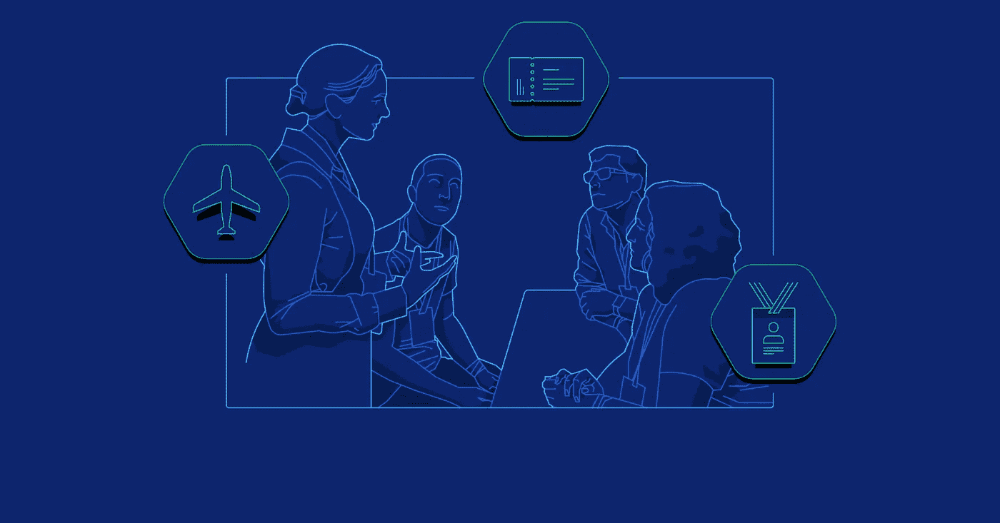
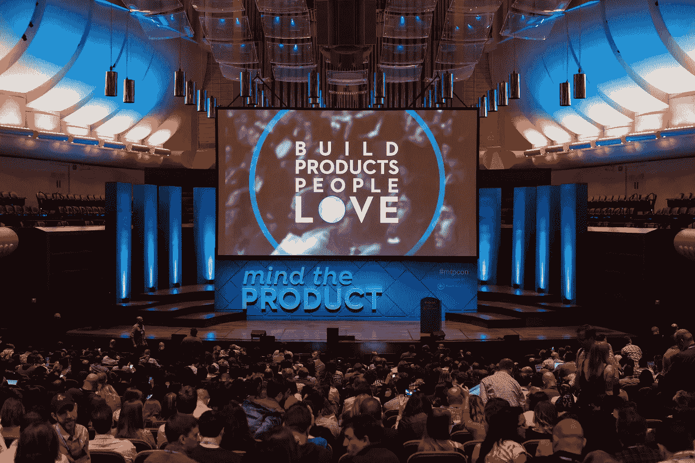
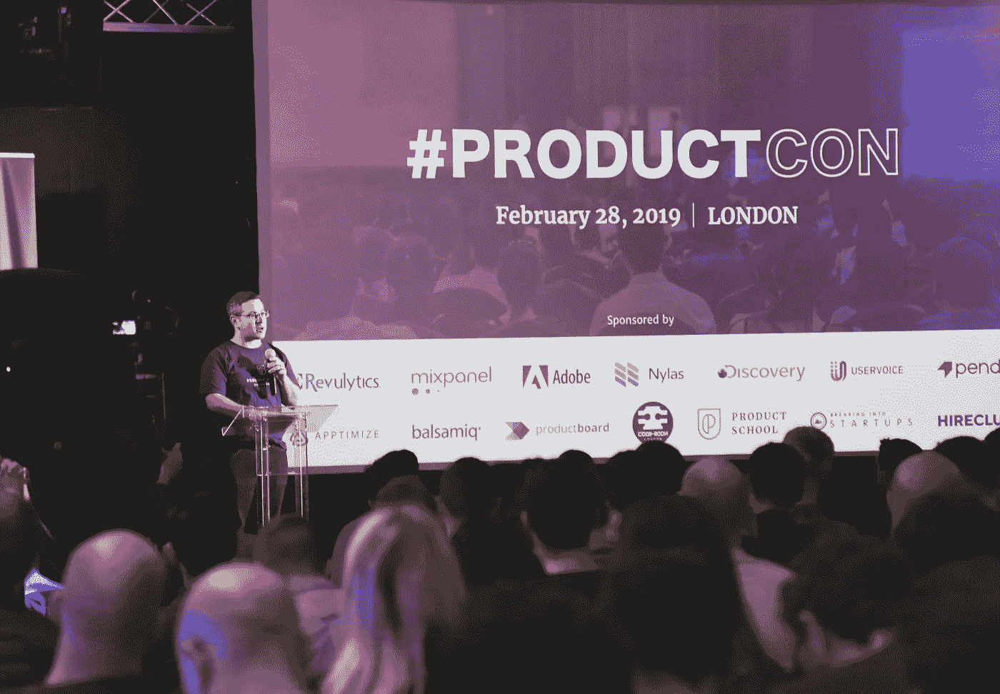
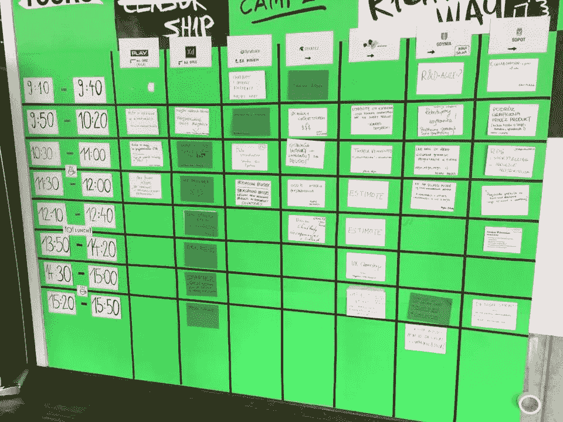
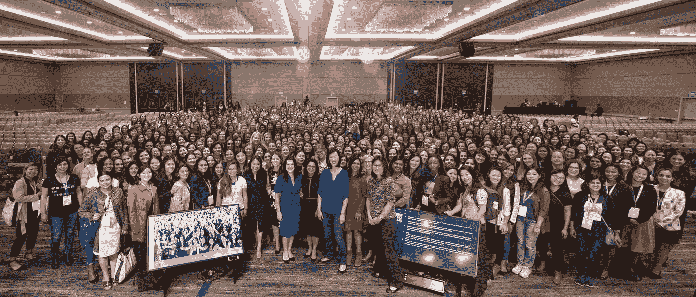
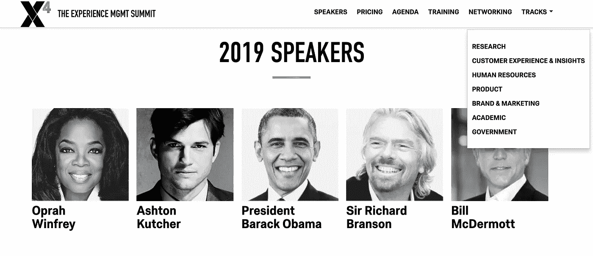
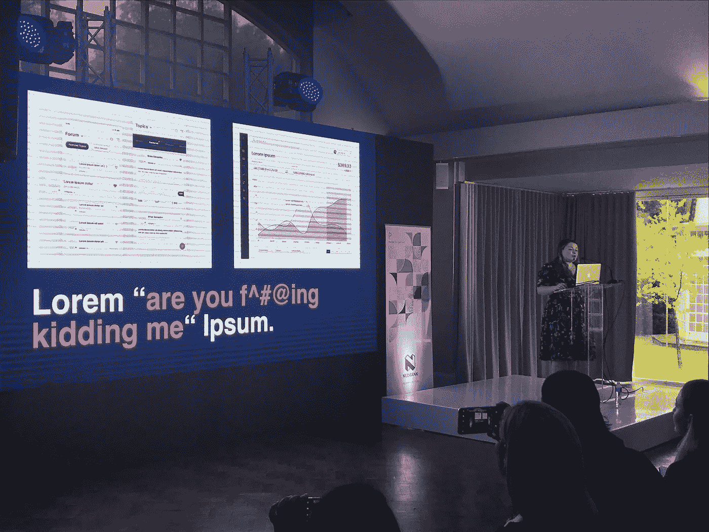
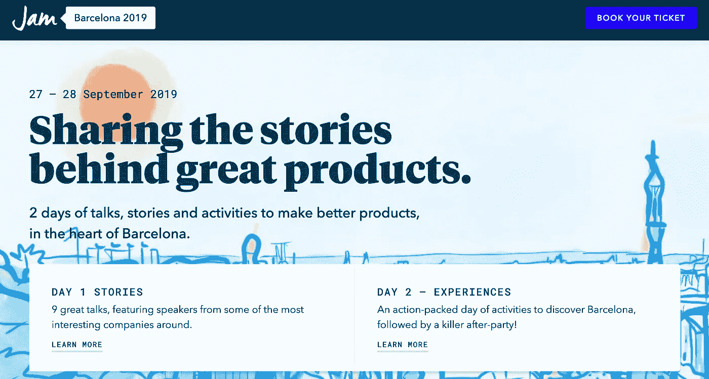
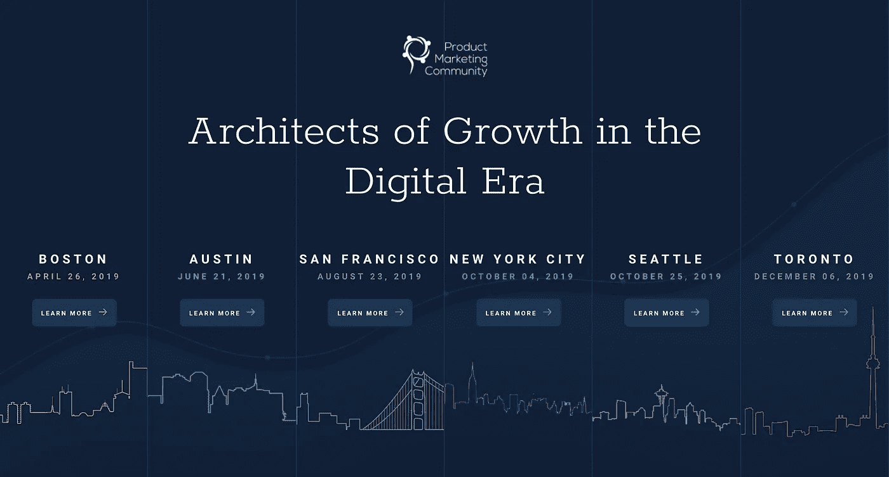

# 产品管理会议的完整列表

> 原文：<https://medium.com/hackernoon/the-comprehensive-list-of-product-management-conferences-ead802b4b9b2>

# 60 多次产品管理会议

会议提供了一个与你所在行业的同行建立联系和交流知识的机会。参加这些会议也有助于你从顶级专家那里学到有价值的见解。产品经理可以了解其他[产品负责人](https://www.toptal.com/product-managers/product-leader)是如何处理类似问题的，他们使用的[KPI](https://www.toptal.com/product-managers/product-management/creating-success-a-guide-to-product-manager-kpis)。

在过去的几年里，产品管理会议的数量激增，现在全世界已经有超过 60 个这样的会议。根据你对这样一篇文章的要求，我们将它们全部编辑在这个列表中，并按月份进行了排序(向下滚动到最后是[完整列表](https://www.toptal.com/product-managers/product-leader/product-management-conferences#full-list-of-conferences-in-2019))。该列表将定期更新，所以当您计划参加新的会议时，请回来查看。

该列表仅包括专门讨论[产品管理](https://www.toptal.com/product-managers)或议程中包含大量产品管理内容的会议。这个列表不包括产品经理也经常参加的 UX 或敏捷会议。如果你知道任何不在这个列表中的产品管理会议，请在评论中告诉我们，我们会添加它。

大多数产品管理会议都在美国和欧洲召开。此外，大部分活动在 3 月至 6 月进行。随着时间的推移，第 4 季度可能会发布新的会议，这种情况可能会有所改变。

# 著名的会议

## 小心产品

Mind the Product conference venue (by Amido)

[介意产品](https://www.mindtheproduct.com/2018/10/mind-product-conferences/)可能是最知名的系列会议之一。它目前在[伦敦](https://www.mindtheproduct.com/mtpcon/london/)、[曼彻斯特](https://www.mindtheproduct.com/mtpengage/manchester/conference/)、[三藩市](https://www.mindtheproduct.com/mtpcon/san-francisco/)、[汉堡](https://www.mindtheproduct.com/mtpengage/hamburg/)和[新加坡](https://www.mindtheproduct.com/mtpcon/singapore/)举办五场会议。来自全球各地的产品经理参加这些活动，交流并聆听来自 Medium、Slack、Google、BBC 和腾讯等公司的众多演讲者。

# ProductCon

ProductCon conference venue (by ProductCon)

[ProductCon](https://www.productschool.com/productcon/) 是 Product School 组织的另一个系列会议，有针对新老产品经理的课程。会议分别在旧金山、西雅图、纽约、洛杉机和伦敦举行。演讲者来自这些地区的一些顶级公司。ProductCon 的有趣之处在于，他们为所有活动提供免费的直播门票。为贵公司的产品经理举办学习会议的好机会。

# 产品阵营

Product Camp user-driven agenda board (by Product Camp PL)

[产品营](http://www.productcamp.org/)不同于列表中的所有其他会议，因为它实际上是一个“非会议”这是一种参与者驱动的形式，参与者自己提出他们想要讨论的话题。每个话题都被写在一张便条上，并张贴在一块板上，让每个人都可以看到。然后所有与会者投票选出他们最喜欢的三个主题，这就是议程的创建过程。活动组织者把所有话题都放在一个时间表里，大家都看得见。提出这个话题的人成为主持人，决定讨论的方向。

关于不可比的最有趣的事情是“两英尺规则”它指出，如果当前的讨论不符合他们的利益，每个人都可以在讨论之间自由移动。这是一个优化参与度的聪明方法。不管是 5 个人还是 15 个人参与讨论都没关系，因为这就是对某个特定话题感兴趣的人数。

# 产品中的女性

Women in Product conference participants (by Women in Product)

[产品中的女性](https://www.womenpm.org/)是一个“致力于为女性提供平等参与和参与各级产品管理职业的非盈利组织。”美国、加拿大和新加坡的当地社区都会举办小型活动和聚会，并在 9 月份的年度全球会议上达到高潮，通常在硅谷地区举行。

# X4 体验管理峰会

X4 Summit keynote speakers (by Qualtrics)

X4 体验管理峰会是一个有[产品赛道](https://www.qualtrics.com/x4summit/product-experience/)的大型会议。世界上一些最好的公司会在赛道上进行演讲和举办研讨会。会议上真正令人惊讶的是 2019 年的主题演讲人名单——巴拉克·奥巴马、理查德·布兰森、奥普拉·温弗瑞和阿什顿·库彻。难怪票早就卖完了。发布此列表时，会议已经召开；然而，为明年设置一个提醒是值得的，以获得早鸟票。

# 像素向上

Pixel Up conference venue (by Pixel Up)

虽然本质上不是一个产品管理会议， [Pixel Up](https://pixelup.co.za/) 是目前唯一一个大规模的会议，非洲大陆的产品经理可以在这里会面和交流。它有一份来自顶级公司(脸书、易贝、Slack 等)的演讲者名单。).会议议程主要集中在产品设计和 UX 主题上。

# 困境

JAM Barcelona website (by JAM)

[JAM](https://www.jamlondon.io/events) 是欧洲的一系列产品管理会议。虽然[伦敦会议](https://www.jamlondon.io/events/conferences/jam-london-2019)在形式上与许多其他会议相似，但在[威尔斯](https://www.jamlondon.io/events/experiences/jam-product-leaders-weekend-2019)和[巴塞罗纳](https://www.jamlondon.io/events/experiences/jam-barcelona-2019)举行的会议将身体活动与演讲和演示结合在一起。这种方法创造了在轻松的环境中思考所提出话题的机会。这也有助于与其他产品负责人建立更非正式的关系。

# 产品营销社区

Product Marketing Community event series (by PMC)

为与产品营销有利害关系的产品营销人员或产品经理举办的一系列活动。在[波士顿](http://productmarketingcommunity.com/boston-2019/)、[奥斯汀](http://productmarketingcommunity.com/austin2019/)、[旧金山](http://productmarketingcommunity.com/sanfrancisco-2019/)、[纽约](http://productmarketingcommunity.com/nyc-2019/)、[西雅图](http://productmarketingcommunity.com/seattle-2019/)和[多伦多](http://productmarketingcommunity.com/toronto-2019/)召开的会议上，来自 Gartner 或 SiriusDecisions 等咨询公司的演讲人以及当地的产品营销负责人出席了会议。

# 2019 年会议完整列表

## [果酱产品领导者撤退](https://www.jamlondon.io/events/experiences/jam-product-leaders-weekend-2019)

*   **日期:**2019 年 4 月 4 日至 7 日
*   **地点:**英国卡迪根
*   **价格范围:【2,100 美元至 2100 美元/ 750 美元至 1600 美元**

## [创新卡罗莱纳大会 2019](https://www.pdma.org/events/EventDetails.aspx?id=1188068&group=)

*   **日期:**2019 年 4 月 5 日
*   地点:美国夏洛特
*   价格区间: $50

## [软件产品管理峰会](https://spmsummit.org/)

*   **日期:**2019 年 4 月 9 日至 10 日
*   **地点:**德国法兰克福
*   **价格区间:**540-1530 美元/€480-1350 欧元

## [欧洲 BOS 会议](https://businessofsoftware.eu/)

*   **日期:**2019 年 4 月 11 日至 12 日
*   **地点:**英国剑桥
*   **价格区间:**700-840 美元/€630-750 欧元

## [产品感](http://productsense.io/en)

*   **日期:**2019 年 4 月 15 日至 16 日
*   **地点:**俄罗斯莫斯科
*   **价格区间:**280-870 美元/€630-750 欧元

## [行业:产品发布会](https://europe.industryconference.com/)

*   **日期:**2019 年 4 月 15 日至 17 日
*   地点:爱尔兰都柏林
*   价格区间:840-1300 美元/€750-1150 欧元

## [产品营哥伦布](https://www.eventbrite.com/e/productcamp-columbus-tickets-55041409337)

*   日期:2019 年 4 月 19 日
*   **地点:**美国哥伦布
*   **价格区间:** $30

## [产品营销社区](http://productmarketingcommunity.com/boston-2019/)

*   **日期:**2019 年 4 月 26 日
*   **地点:**美国波士顿
*   **价格区间:**$ 170-$ 250

## [双城产品发布会](https://www.product-conf.com/)

*   **日期:**2019 年 4 月 29 日
*   **地点:**美国明尼阿波利斯
*   **价格区间:**$ 125-$ 145

# 五月

## [金融科技产品峰会](https://www.eventbrite.com/e/fintech-product-summit-tickets-51946729065)

*   **日期:**2019 年 5 月 3 日
*   **地点:**美国旧金山
*   价格区间:$ 400-$ 600

## [品营罗利](https://www.productcamprtp.org/spring-conference)

*   **日期:**2019 年 5 月 4 日
*   **地点:**美国罗利
*   **价格区间:**免费

## [Sirius 决策峰会](https://summit.siriusdecisions.com/)

*   **日期:**2019 年 5 月 6-8 日
*   **地点:**美国奥斯汀
*   价格区间: $2，500-2，700

## [马德里产品发布会](https://laproductconf.com/lpc-2019-madrid/)

*   **日期:**2019 年 5 月 9 日
*   地点:西班牙马德里
*   价格区间:170-280 美元/€150-250 欧元

## [产品工艺:发布会](https://events.productcraft.com/conference/)

*   **日期:**2019 年 5 月 9 日
*   **地点:**美国旧金山
*   **价格区间:**$ 400-$ 800

## [产品管理&创新](https://www.productevent.com/)

*   **日期:**2019 年 5 月 16 日至 17 日
*   **地点:**美国芝加哥
*   **价格区间:**$ 1600-$ 2000

## [产品管理状态](https://www.stateofproductmanagement.com/)

*   **日期:**2019 年 5 月 16 日至 17 日
*   **地点:**荷兰阿姆斯特丹
*   价格区间:300-680 美元/€270-600 欧元

## [小心产品](https://www.mindtheproduct.com/mtpengage/hamburg/)

*   **日期:**2019 年 5 月 22 日至 24 日
*   **地点:**德国汉堡
*   **价格区间:**400-1130 美元/€350-1000 欧元

## [王牌！](https://aceconf.com/#!/home)

*   **日期:**2019 年 5 月 23 日至 24 日
*   地点:波兰克拉科夫
*   **价格区间:** $400/€350

## [旧金山产品展](https://www.productschool.com/productcon/san-francisco/)

*   **日期:**2019 年 5 月 29 日
*   **地点:**美国旧金山
*   **价格区间:**500 美元至 1200 美元

# 六月

## [巴黎产品发布会](https://laproductconf.com/)

*   **日期:**2019 年 6 月 6 日
*   **地点:**法国巴黎
*   价格区间:400-570 美元/€350-500 欧元

## [前端](https://www.frontutah.com/)

*   日期:2019 年 6 月 6 日至 7 日
*   **地点:**美国盐湖城
*   价格范围:$ 450-$ 700

## [PMF](https://apac.productmanagementfestival.com/)

*   **日期:**2019 年 6 月 17 日至 18 日
*   **地点:**新加坡，新加坡
*   价格区间:640 美元至 1590 美元

## [产品营销社区](http://productmarketingcommunity.com/austin2019/)

*   日期:2019 年 6 月 21 日
*   地点:美国奥斯汀
*   价格区间:$ 170-$ 250

## [PM 峰会](http://pm-summit.org/en)

*   **日期:**2019 年 6 月 21 日至 22 日
*   **地点:**中国北京
*   **价格区间:**$ 710-1120/4760-6800

## [西雅图产品展](https://www.productschool.com/productcon/seattle/)

*   **日期:**2019 年 6 月 25 日
*   **地点:**美国西雅图
*   **价格区间:**500 美元至 1200 美元

# 七月

## [关注产品](https://www.mindtheproduct.com/mtpcon/san-francisco/)

*   日期:2019 年 7 月 15 日至 16 日
*   地点:美国旧金山
*   **价格范围:**700-1000 美元

## [产品世界论坛](https://www.worldforumdisrupt.com/product-new-york-2019/)

*   日期:2019 年 7 月 25 日
*   **地点:**美国纽约
*   价格区间:$300

# 八月

## [牵引力](https://www.tractionconf.io/)

*   **日期:**2019 年 8 月 7 日至 8 日
*   地点:加拿大温哥华
*   **价格范围:**$ 370-660/500-880 美元

## [产品营销社区](http://productmarketingcommunity.com/sanfrancisco-2019/)

*   **日期:**2019 年 8 月 23 日
*   **地点:**美国旧金山
*   **价格区间:**$ 170-$ 250

## [图灵节](https://www.turingfest.com/)

*   **日期:**2019 年 8 月 27 日至 29 日
*   地点:苏格兰爱丁堡
*   **价格区间:**$ 394-$ 789/300–600

# 九月

## 纽约产品展

*   日期:2019 年 9 月 1 日
*   **地点:**美国纽约
*   价格范围: $500 到$ 1200

## [潘多拉](https://www.eventbrite.com/e/pendomonium-2019-tickets-44150964724)

*   日期:2019 年 9 月 9 日至 11 日
*   地点:美国罗利
*   价格范围:$ 500-$ 900

## [果酱巴塞罗那](https://www.jamlondon.io/events/experiences/jam-barcelona-2019)

*   日期:2019 年 9 月 20 日至 21 日
*   **地点:**西班牙巴塞罗那
*   **价格区间:**610-930 美元/€450-650 欧元

## [行业:产品发布会](https://global.industryconference.com/)

*   **日期:**2019 年 9 月 23 日至 25 日
*   **地点:**美国克利夫兰
*   **价格区间:**740 美元至 1940 美元

## [产品中的女性](https://www.womenpm.org/)

*   **日期:**2019 年 9 月
*   **地点:**美国加利福尼亚州
*   **价格区间:**未公布

# 十月

## [产品营销社区](http://productmarketingcommunity.com/nyc-2019/)

*   **日期:**2019 年 10 月 4 日
*   地点:美国纽约
*   价格范围:170 美元到 250 美元

## [画布大会](https://www.eventbrite.co.uk/e/canvas-conference-2019-tickets-50803660115)

*   **日期:**2019 年 10 月 10 日
*   **地点:**英国伯明翰
*   **价格范围:**$ 130–200/100–150

## [小心产品](https://www.mindtheproduct.com/mtpcon/london/)

*   **日期:**2019 年 10 月 17 日至 18 日
*   **地点:**英国伦敦
*   **价格区间:**$ 530–790/400–600

## [引领产品](https://www.leadingtheproduct.com/melbourne/)

*   **日期:**2019 年 10 月 17 日
*   **地点:**澳大利亚墨尔本
*   **价格区间:**$ 280-350/澳元 400-500

## [引领产品](https://www.leadingtheproduct.com/sydney/)

*   **日期:**2019 年 10 月 22 日
*   地点:澳大利亚悉尼
*   **价格区间:**$ 280-350/澳元 400-500

## [产品营销社区](http://productmarketingcommunity.com/seattle-2019/)

*   **日期:**2019 年 10 月 25 日
*   **地点:**美国西雅图
*   价格区间:$ 170-$ 250

## [果酱伦敦](https://www.jamlondon.io/events/conferences/jam-london-2019)

*   **日期:**2019 年 10 月 31 日—11 月 1 日
*   地点:英国伦敦
*   价格范围:$ 460–1120/350–850

# 十一月

## [洛杉矶产品展](https://www.productschool.com/productcon/los-angeles/)

*   **日期:**2019 年 11 月 1 日
*   **地点:**美国洛杉机
*   **价格区间:** $500 到$ 1200

## [开放移动峰会](https://events.incite-group.com/oms/)

*   **日期:**2019 年 11 月 7 日至 8 日
*   **地点:**美国旧金山
*   **价格区间:【1,850 美元至 7000 美元**

## [PMF](https://productmanagementfestival.com/zurich/)

*   **日期:**2019 年 11 月 13 日至 14 日
*   地点:瑞士苏黎世
*   价格区间:999 美元至 1290 美元

## [产品化](https://productized.co/)

*   **日期:**2019 年 11 月 21 日至 22 日
*   地点:葡萄牙里斯本
*   **价格区间:**340-780 美元/€300-700 欧元

# 十二月

## [产品营销社区](http://productmarketingcommunity.com/toronto-2019/)

*   **日期:**2019 年 12 月 6 日
*   地点:加拿大多伦多
*   **价格区间:**$ 150-220/203-300 元

## [新产品开发会议](http://www.npd-conference.com/)

*   **日期:**2019 年 12 月 14 日至 15 日
*   **地点:**印度钦奈
*   **价格区间:** $50/₹3,000

## [产品领袖论坛](https://productleadersforum.org/)

*   日期:未公布
*   **地点:**印度
*   价格区间:未公布

*原载于*[*https://www.toptal.com*](https://www.toptal.com/product-managers/product-leader/product-management-conferences)*。*