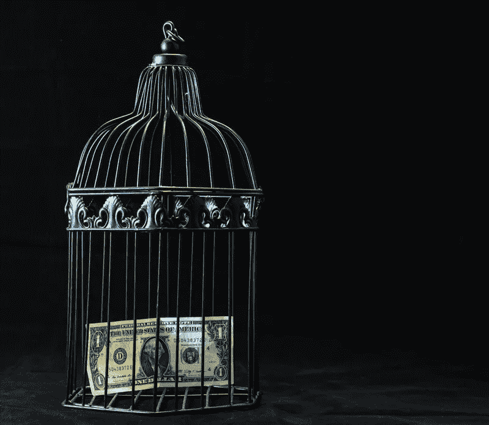

# 数字国家货币对你的钱包意味着什么

> 原文：<https://medium.com/hackernoon/the-connection-between-crypto-and-fiat-is-closer-than-you-think-aa6a2ea16de0>

Don’t keep your money siloed from the 21st century! Photo courtesy canva.com

从积满灰尘的账本、超大的支票簿和在银行排长队，钱已经走了很长的路。

事实上，消费者对“大银行”的创新失败非常失望，以至于三分之一的人认为传统银行将在 5 年内不复存在。

大多数人甚至不再使用实物货币。移动支付市场已经让现金在亚洲成为一种遗迹，中国两大平台[每月有 14 亿用户(约占世界人口的 18%)。尽管移动支付正在增长，但对传统银行业来说，还有更具革命性的东西:](https://www.businessinsider.com/alipay-wechat-pay-china-mobile-payments-street-vendors-musicians-2018-5)

**引入加密货币作为真正的支付替代手段。**

在韩国，[消费者可以在数千个零售点使用 crypto 支付](https://bitcoinmagazine.com/articles/south-koreans-will-be-able-pay-cryptocurrency-over-6000-stores/)，30%的人口拥有加密货币。在西方，零售商注意到了这一点——微软、Paypal 和 Expedia 等品牌接受比特币作为支付方式。Overstock 宣布他们今年使用比特币支付州税，甚至接受以太币、莱特币和 Dash 币。

这些创新并没有提供资金管理的最终解决方案，但它们是朝着正确方向迈出的一步。使用菲亚特支付的便利性和安全性与使用不稳定的加密货币的相对难以获得的支付形式之间仍有很大差距。这也是 cryptos 在成为菲亚特的可行替代品之前需要改进的地方。

但有一种加密技术有助于弥合这一差距，在菲亚特和加密技术之间架起了一座真正的桥梁，迎合了消费者对可访问和安全的数字货币的渴望。

他们被称为 stablecoins，他们在这里是为了[恢复对 crypto](https://www.imperial.ac.uk/media/imperial-college/research-centres-and-groups/ic3re/CRYPTOCURRENCIES--OVERCOMING-BARRIERS-TO-TRUST-AND-ADOPTION.pdf) 声誉的信任，将用户的财务带入 21 世纪，并刺激加密货币的大规模采用。

**为什么稳定密码是解决加密难题的方法**

在 2017 年的牛市之后，我们看到了一个“[加密冬天”，投机者损失了近 5000 亿美元](https://www.forbes.com/sites/billybambrough/2019/02/06/new-price-data-suggests-bitcoin-could-be-about-to-make-a-major-move/#6f88d614ae9f)。并且[加密货币预计不会很快复苏](https://www.forbes.com/sites/billybambrough/2019/01/30/blow-to-bitcoin-as-ceo-warns-crypto-winter-could-turn-nuclear/#764ae0541078)。

比特币的波动性(见:著名的例子 [10，000 比特币披萨](https://www.cbinsights.com/research/report/what-are-stablecoins/)，2010 年价值约 30 美元，2017 年底价值 82，000，000 美元)阻碍了机构、商业和大众的全面采用。

政府也没有像希望的那样参与数字货币。就在本周，世界上最大的加密市场韩国维持了对加密 ico 的禁令。QuadrigaCX 最近的丑闻，当唯一的密码持有者死亡时，用户损失了 1 . 9 亿美元，说明了监管者在这种集中交易中是多么无能为力。比特币、以太、Ripple 和其他名牌密码正在辜负消费者。但这并不是发生在所有的密码上。

我们看到稳定的增长。

诺贝尔奖获得者 F.A .哈耶克在 40 多年前提出了稳定硬币背后的一般概念。现在，我们开始理解它们是如何融入我们的机构的。

> 被认为是加密的“圣杯”，“稳定货币是价格稳定的加密货币，其市场价格由另一种稳定资产担保。

它们也受到监管，被认为比其他加密货币“更安全”。但这正是真正有趣的地方:

当稳定的货币与一种国家货币挂钩(大多数都与美元挂钩)时，它们为 T2 提供了一座连接法定货币和秘密货币的简易桥梁。这在传统上是进入密码市场的一个巨大障碍(正如《T4》密码“如何”指南和[《纽约时报》登陆页面](https://www.nytimes.com/topic/subject/bitcoin)的流行所说明的)。除了为交易者提供一个安全的避风港之外，稳定的投资者还提供了一个简单、廉价的退出渠道。这是将您的加密利润返还给菲亚特的最佳方式。

在许多方面，这使得数字国家货币(DNC)这样的稳定货币在全球越来越受欢迎:

*   [瑞士电子法郎](https://www.ft.com/content/fcc7d27a-186e-11e8-9376-4a6390addb44)
*   [瑞典克朗](https://www.riksbank.se/en-gb/payments--cash/e-krona/)
*   [委内瑞拉石油](https://www.businessinsider.com/venezuelas-oil-backed-petro-is-an-imaginary-currency-2018-9)
*   [马绍尔群岛主权](https://www.reuters.com/article/us-crypto-currencies-marshall-islands/marshall-islands-to-issue-own-sovereign-cryptocurrency-idUSKCN1GC2UD)
*   [日本 J 币](https://www.technologyreview.com/the-download/608963/japanese-banks-are-planning-to-launch-j-coin-a-digital-currency-meant-to-kill/)

稳定的货币联盟提供了密码货币独有的所有创新——获得分散的、不可改变的区块链分类账、金融包容性和货币民主化——同时将货币带入了 21 世纪。

**稳定的蛋白有益处其他蛋白缺乏**

稳定的加入简直是两全其美。它们提供了相对于其他密码的价格稳定性，并解决了银行机构中的一些滞后问题。

# 难怪 2019 年被称为稳定年。

这样想吧:

稳定硬币是现金的技术高效替代品，由法定货币支持，确保支付系统和模式的安全。它们为对等体提供了相互信任的框架，因为每笔交易都在不可更改的分散分类账上被跟踪(读:不可变)。通过在分散的交易所进行交易，它们允许用户实时进行点对点(P2P)交易——消除了“传统”银行模式的中介作用。

> P2P 支付有很多好处。

绕过银行会为你节省很多钱。通过在法定货币和加密货币之间建立桥梁，你可以随时让你的钱*进出不稳定的加密市场*——并且可以把它存储在一个非银行网络中。

但这只是 P2P 应用的开始。它解决了加密的交易时间问题，允许可信方之间的即时传输。在外汇交易中的应用也同样重要。有了 stablecoins，你可以创建货币对，直接按自己决定的汇率兑换货币，绕过了最初建立于 1973 年的[昂贵而陈旧的 SWIFT 系统](https://www.theguardian.com/money/2018/dec/09/banking-swift-money-transfer-worldwide-delay)。

随着国际市场对加密货币的接受，稳定的加密货币不再仅仅是一种对冲工具。他们现在有真正的购买力。

区块链和去中心化账本技术已经进入许多(如果不是全部)行业。随着服务和信心的下降，金融科技迫切需要创新。

**在区块链的世界里，稳定的硬币是数字货币的下一步**

是的，[未来就是现在](https://www.youtube.com/watch?v=ta41xU-tkFA)。不，不必是一个可怕的地方。

我们不仅看到了 DNC 项目的发展(上面列出的五个项目只是冰山一角)，我们现在有整个政府在区块链找到了一个家，就像在[数字爱沙尼亚共和国](https://www.newyorker.com/magazine/2017/12/18/estonia-the-digital-republic)一样。

与此同时，在美国，我们未能意识到 stablecoins 提供的各种服务。正如我们所见[交易者(不成功)急于将他们的利润](https://www.coindesk.com/winklevoss-crypto-gemini-gusd-stablecoin-redemption)转回法定货币，一种稳定的货币作为桥梁的效用，以及加密资产的“绝缘体”没有被利用。除了 stablecoins 在电子商务和外汇方面的应用尚未开发之外，stablecoins 还没有发挥其潜力。

但是世界在等待，人们的兴趣也在增长。很快。

下一步是什么？

实际上，在美国，我们已经有了一种受[监管的稳定货币。GUSD](https://www.prnewswire.com/news-releases/chimpion-chairman-stablecoins-like-gemini-dollar-strengthen-the-case-for-crypto-e-commerce-300795957.html) 凭借区块链的技术和官方监管带来了美元的价格稳定，它[通过了外部公司德勤](https://www.coindesk.com/crypto-exchange-gemini-passes-security-compliance-audit-conducted-by-deloitte)的安全审计。

与此同时，另一家“四大”公司[普华永道已经合作创建了一种新的美元稳定币](https://www.pwc.com/us/en/press-releases/2018/pwc-collaborates-with-cred.html)。

最近的一份报告显示了机构对稳定资本的参与有多广泛。有 [57 个 stablecoin 活动项目](https://blog.blockchain.com/2018/09/26/the-state-of-stablecoins/)，其中 23 个已经开始运行。很容易理解，除了给通胀经济带来的好处，稳定的收入还能带来:

*   区块链货币的所有好处:分散、透明、不可改变
*   一个价格稳定的切入点，加密新手对一个高度动荡的市场
*   进入和退出市场的桥梁
*   信任方之间的 P2P 支付系统，可在外汇交易中获得巨大收益
*   用于安全存储货币的非银行网络

创新型金融科技公司已经在叫嚣着要在这个令人兴奋的新市场找到一个利基市场。Interblockchain 公司正在通过将 cryptos 集成到世界上第一个基于浏览器的支付应用程序中，让大众可以使用它。它已经嵌入到数十亿个浏览器中。

记住:

既然文克莱沃斯已经用双子星座开启了革命，那么可以肯定地说下一个扎克伯格就在眼前。

报名加入 Interblockchain 社区电报频道:[https://t.me/interblockchainlab](https://t.me/interblockchainlab)