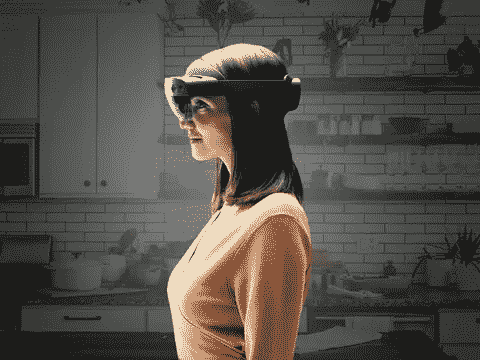
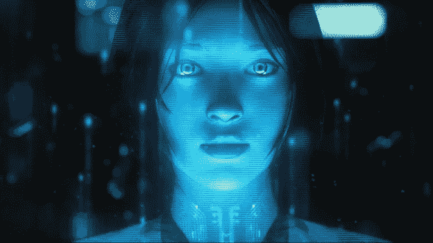
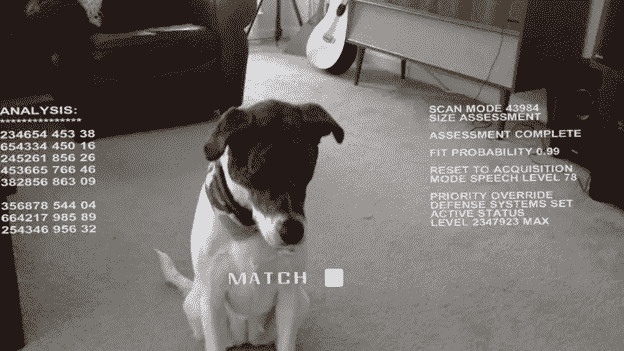

# 微软的聊天机器人和混合现实的融合

> 原文：<https://medium.com/hackernoon/the-convergence-of-chatbots-and-mixed-reality-e86f4b4b8474>

今年混合现实中最大的趋势之一是聊天机器人在 HoloLens 等平台上的到来。语音命令是许多 XR 设备的常见输入。添加对话式人工智能来扩展这些本机语音识别能力是迈向未来的自然步骤，在未来，由强大人工智能支持的个性化[虚拟助理](https://docs.microsoft.com/en-us/azure/bot-service/bot-builder-virtual-assistant-introduction?view=azure-bot-service-4.0&ocid=bots_hack_va)将以全息图的形式陪伴我们。它们可能会被降级为我们提供购物建议，但或许相反，它们会成为强大的定制工具，帮助我们变得更敏锐，给出诚实的反馈，并帮助实现我们的个人目标。

如果你多年来一直关注电视和电影中科幻人工智能的发展，从语音到全全息图的转变将是自然的。在早期的科幻小说中，比如电影 *2001:太空漫游*中的哈尔或者原版*星际旅行*中的计算机，计算机智能通常被表现为一种脱离实体的声音。在虚拟援助的更近的化身中，例如*星际旅行旅行者*和*银翼杀手 2049* ，这些声音最终被紧急医疗全息图和 Joi 的全全息图拟人化。

同样，Cortana、Alexa 和 Siri 正在慢慢从我们的智能手机、Echos 和 Invoke 设备转移到我们的全息耳机。现在还为时尚早，但技术已经到位，我们虚拟助手的未来化身也相对清晰。

# 聊天机器人的兴起

对于微软的个人数字助理 Cortana 来说，她在 Xbox 的 Halo 视频游戏中以全息图的身份开始了她的生活，转向全息耳机有点像回家一样。那么，当微软 HoloLens 在 2016 年首次发布时，Cortana 已经内置于板载全息操作系统中，这似乎是很自然的。

然后，在 2017 年 Windows Apps 团队博客上的一篇文章中，[在 HoloLens](http://aka.ms/AA525s4) 中构建终结者视觉 HUD，微软向人们展示了如何将 [Azure 认知服务](https://azure.microsoft.com/en-us/services/cognitive-services/?ocid=bots_hack_va)集成到他们的全息头戴式显示器中，以便提供智能对象识别，甚至是翻译服务，作为类似终结者的 HUD 覆盖图。

要获得智能虚拟助手，唯一要做的就是将 HoloLens 的内置 Cortana 语音功能与一些人工智能结合在一起，以创建一种互动体验。毫不奇怪，微软能够用 [Bot 框架](https://aka.ms/AA525sw)填补这一空白。

# 虚拟助手和微软机器人框架

微软 Bot 框架结合了由 T2 Azure 认知服务公司支持的人工智能和自然语言能力。它包括一组开源 SDK 和工具，使开发人员能够构建、测试和连接与用户自然交互的机器人。有了微软的机器人框架，随着时间的推移，使用 Azure 认知服务，很容易就可以创建一个可以说话、听、理解甚至向用户学习的机器人。这种聊天机器人技术有时被称为对话式人工智能。

有几个聊天工具可用。我最熟悉 Bot 框架，所以我将谈论它。现在，使用 Bot 框架构建的聊天机器人可以适用于语音交互或文本交互，就像上面的 UPS 虚拟助理示例一样。使用准备好的模板和基于 web 的对话框，它们相对容易构建和定制。

我最喜欢的[创建聊天机器人](https://docs.microsoft.com/en-us/azure/bot-service/bot-service-quickstart?view=azure-bot-service-4.0&ocid=bots_hack_va)的方法之一是使用 [QnA Maker](https://aka.ms/AA4y92z) ，它让你只需指向一个在线 FAQ 页面或上传产品文档，作为你的机器人服务的知识库。然后，QnA Maker 会引导您将聊天机器人个性应用到您的知识库并进行部署，通常不需要定制编码。我喜欢的是，你可以在大约半天的时间里推出一个复杂的聊天机器人。

使用微软的机器人框架，你还可以完全控制[的创建过程](https://docs.microsoft.com/en-us/azure/bot-service/dotnet/bot-builder-dotnet-sdk-quickstart?view=azure-bot-service-4.0)，在代码中定制你的机器人。Bot 应用程序可以用 C#、JavaScript、Python 或 Java 创建。您可以使用自己创建的或者从第三方引入代码的[中间件](https://docs.microsoft.com/en-us/azure/bot-service/bot-builder-concept-middleware?view=azure-bot-service-4.0&ocid=bots_hack_va)来扩展 Bot 框架的功能。通过[分支和循环](https://docs.microsoft.com/en-us/azure/bot-service/bot-builder-dialog-manage-complex-conversation-flow?view=azure-bot-service-4.0&tabs=csharp&ocid=bots_hack_va)，甚至还有管理复杂对话流的高级功能。

# 道德聊天机器人

上面已经介绍了使用认知服务构建终结者 HUD 的想法，同样重要的是提高关于培养道德人工智能环境和围绕人工智能的道德思维的意识。借用《未来的计算》一书的说法，人工智能系统应该公平、可靠、安全、私密、安全、包容、透明、负责。当我们构建各种形式的聊天机器人和虚拟助手时，我们应该始终考虑我们希望我们的智能系统做什么，以及关心它们可能无意中做什么。

# 人工智能和混合现实的最终融合

今天，聊天机器人正致力于整合商务技能，如寻找方向、定位餐馆，以及通过虚拟助手为公司产品提供帮助。开发更好的聊天机器人的主要研究目标之一是个性化聊天机器人体验。实现高水平的个性化将需要用更多的人工智能功能来扩展当前的聊天机器人。幸运的是，这不是一件遥远的事情。如上面的[终结者 HUD](http://aka.ms/AA525s4) 教程所示，给你的聊天机器人和设备添加认知服务很容易做到。

由于全息耳机有许多外部传感器，人工智能也将有助于分析所有这些视觉和位置数据，并通过聊天机器人和认知服务将其转化为有用的信息。例如，如果你在一个外国城市，相机可以用来帮助翻译街道标志，或者在你购物时识别产品并提供有用的评论。

最后，将需要人工智能来创建你的聊天机器人的现实 3D 模型表示，并克服目前阻碍 VR、AR 和 MR 的恐怖山谷。当所有三个元素都到位来增强你的聊天机器人时——个性化、计算机视觉和人性化的 3D 建模——我们将更加接近我们一直希望的——个性化的人工智能，它将作为个体来照顾我们。

以下是一些关于聊天机器人融合的补充阅读材料，你会觉得很有帮助:

*   [使用 HoloLens、计算机视觉 API、Unity 和 Windows 混合现实工具包分析视觉内容](https://devblogs.microsoft.com/premier-developer/analysing-visual-content-using-hololens-computer-vision-apis-unity-and-the-windows-mixed-reality-toolkit/)
*   [MR 和 Azure 302:计算机视觉](https://docs.microsoft.com/en-us/windows/mixed-reality/mr-azure-302)
*   [MR 和 Azure 303:自然语言理解](https://docs.microsoft.com/en-us/windows/mixed-reality/mr-azure-303)
*   [未来计算值(PDF)](https://blogs.microsoft.com/wp-content/uploads/2018/02/The-Future-Computed_2.8.18.pdf)
*   [Bot 指南](https://www.microsoft.com/en-us/research/publication/responsible-bots/?ocid=bots_hack_va)