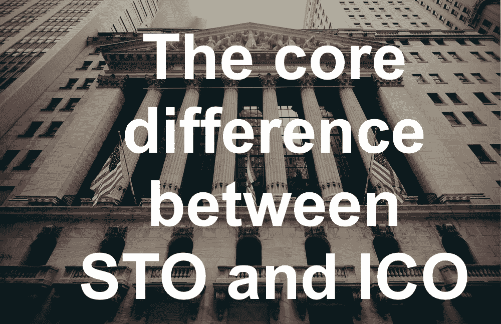

# STO 和 ICO 对于项目和投资者的核心区别

> 原文：<https://medium.com/hackernoon/the-core-difference-between-sto-and-ico-for-projects-and-investors-fcee7ae5af09>

最近 sto 的趋势在区块链业界引起了很多议论。然而，我们不能说这是一个绝对新的概念，因为即使在 ICO 炒作的日子里也有一些 sto。在 ico 繁荣时期，带着安全令牌进入市场并不流行，我们将在这篇文章之后找出原因。即使是现在，许多希望投资 sto 的项目和投资者也不明白它与 ico 的不同之处。

在本文中，我们将讨论使 sto 不同于 ico 的基本原理。

要完全理解安全令牌和实用令牌之间的区别，您需要理解它们的本质，最重要的是它们的用途和用例。

公用事业代币原则上让其持有者直接获得发行这些代币的公司的产品和服务。重要的是要明白，在这些情况下，它们被视为一种工具，而不是一种投资。每个实用程序令牌在系统中都应该有一个特定的用例。在某些情况下，对某些产品或服务的激励和奖金是可能的，但还是只能在项目范围内。具体例子:我们的一个客户 Bubbletone 区块链项目有 UMT 令牌，以后可以在项目内部使用，支付移动通信、互联网和各种服务包。令牌具有明确的效用和有限的用途。我早些时候在我的媒体频道上发表了一个更简单的解释和一个例子，即使你的祖母也会明白。

你应该知道，这种类型的令牌保持从总令牌供应到公司的一部分或利润的未分割份额。这可以在研究它们的令牌度量时进行研究。因此，公用事业代币被认为不属于证券法的范围，这极大地便利了向 ico 发行项目的过程，特别是在法律方面，反复扩大了潜在代币购买者的基础。

然而，可以假设这种代币的价格(和价值)可能随着对产品或项目服务需求的增加而增加。因此，代币的效用并没有阻止项目从代币销售中获得巨额收益，也没有阻止代币购买者在交易市场上转售代币，增加或损失资本。

后来，大量的骗子注意到 ICO 的流行，并迅速进入这个行业。这些项目本身经常带着虚幻的想法出现在 ICO 上，但只有一个动机；来收集投资。这一策略暴露了大量投资者，表明他们没有受到任何保护。许多项目并没有实现他们在营销或白皮书中制定的计划和承诺。它们中的一些消失了或者停止了进一步的发展。针对欺诈公司的频繁诉讼刺激了市场，但是仍然有大量的骗子。这导致许多投资者对 ico 失去兴趣，并加大了来自监管机构的压力。

后者在 2018 年中期和年底变得特别活跃，因为在现实中，许多实用令牌实际上仅用于投机目的；光说不做。这迫使许多项目不接受来自美国这个最大市场之一的居民的投资，以避免美国证券交易委员会的强大势力。

作为 ICO 主题的总结，我想说，在我看来，这种项目融资方式有存在的权利，而且很可能以这样或那样的方式存在。好的、真正的项目，只要有正确的象征经济学和市场营销，仍然会有自己的社区和投资者。肯定会有这样的项目，其中实用工具令牌是一个合适的模型，它确实是一个实用工具。但目前的形势已经顺利地引导市场寻找一个折中方案，首先保护投资者的利益。

因此，在筹款的烟幕后面，STO 出现在了舞台上。如前所述，安全令牌在 ICO 的活跃期进入市场，这种类型的投资已经讨论了很长时间。例如，我们的一个客户 Paygine project 已经在 2018 年 5 月以注册的安全令牌进入市场，为其潜在买家提供了某些非功利的好处。

但在很大程度上，直到最近，公司更倾向于 ICO。说实话，这通常是因为不愿意为投资者提供重大利益(我们将进一步讨论)，同样重要的是要经历更复杂的法律框架，如果你正确投资 s to，这是必需的。

**那么，什么是安全令牌产品，什么是安全令牌？**

事实上，安全代币可以等同于证券。例如，他们可以给予所有者相应的所有权。因此，在美国，证交会决定，证券代币与标准证券一样受制于相同的联邦法律。

这种代币可以由公司资产支持，如股票、分红权或投票权。毫无疑问，对于相信一家公司的投资者来说，这是一种更透明、更安全的投资方式。由于金融监管机构将此类代币视为证券，这保护了代币持有者，最重要的是，赋予了他们真正的权利。

安全令牌有三种主要类别:

- **股权代币:**持此类代币进入 STO，每张代币等同于公司股份，赋予其所有者平等的投票权和分红权，持有人本身也等同于实际股东。

- **储备资产代币:**适合进行实物商品交易的组织，如不动产资产、黄金等。因此，代币可以受到基础资产储备的保护。

- **债务代币:**与股票或资产的代币化不同，这种代币证券本质上是基于债务的，承诺随后从投资者手中赎回这些代币。

如你所见，所有这些类别都是经典债券市场所熟悉的。而且大多数情况下，s to 为投资者提供真正的利益:股息、股权、投票权、利润分配权、看涨期权(回购权)。

谁是 STO 投资者？他们和 ICO 一样吗？

但是，除了令牌功能本身，还有几个非常重要的东西，包括将 STO 与 ICO 区分开来的东西。

首先，安全令牌必须向适当的金融机构注册，包括那些取决于发行者管辖的国家和潜在销售的地理位置的机构(例如，美国的 SEC)。这是为投资者提供额外安全性和透明度的主要优势。然而，为了遵守这个市场的财务条例和规则，这大大增加了项目的法律费用。

其次，证券代币通常等同于证券，这一事实限制了可以投资这类代币的投资者的类型。事实上，只有合格的投资者才能投资。要求至少包括下列条件之一:

*-人均年收入超过 20 万美元或每对夫妇年收入超过 30 万美元；*

*-净资产超过 1 00 万美元，不包括投资者的主要住所；*

*-资产超过 5 00 万美元的机构；*

*-完全属于合格投资者的法律实体。*

对小投资者来说，遵守这些标准通常是有问题的。这就缩小了 s to 在公开销售中吸引最大数量投资者的可能性，而不限于他们自己的资本或地理位置，就像大多数 ico 一样。

然而，这就是游戏规则。更合法的方式总是会导致一些限制，这些限制对于一般的小型私人投资者来说是一种限制，但对于专业投资者来说却是标准的。

某些变化和限制影响了代币销售的营销活动和推广，但这将是下一篇文章的主题。