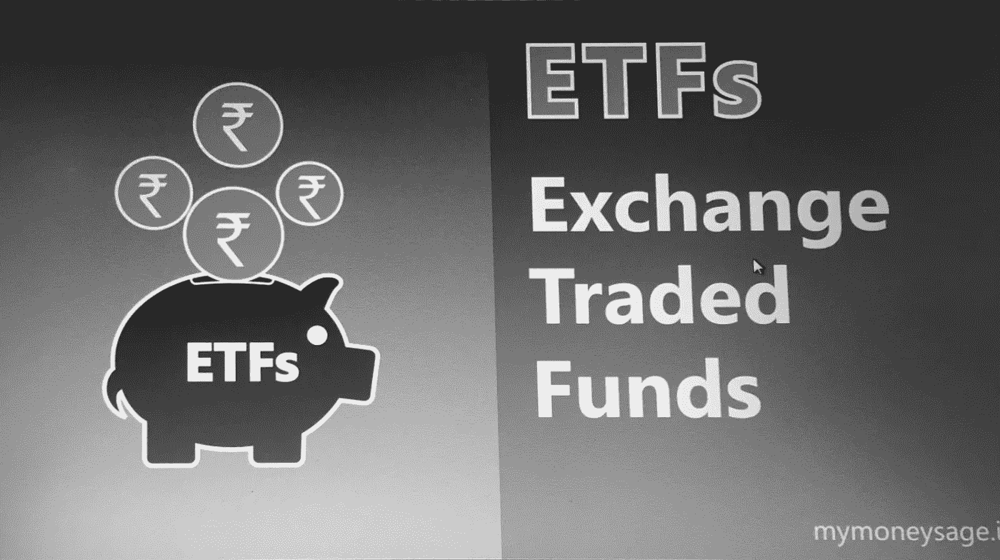

# 加密 ETF:他们会，还是不会？

> 原文：<https://medium.com/hackernoon/the-crypto-etf-will-they-or-wont-they-78ce8cb42f6>

加密 ETF 的批准日期是虚拟货币世界最大的悬念之一

*由安妮·苏泰克·塔尔博特导演内容，* [*BX3 大写*](https://bx3.io)

W 谈到加密货币新闻，有几个话题肯定会点亮社交媒体，成为会议讨论的话题。把“ICO”、“SEC 执法”和最新的 JV-squad 明星代言人放到你的标题中，你肯定会被点击几次。有新的硬币选择吗？令牌化的最新进展如何？

在关于虚拟货币的热门话题中，至少有一个有可能将加密货币定位为合法的投资工具，并为普通公众带来更大的可及性。加密支持的交易所交易基金(ETF)将是监管清晰化和机构资金到来的标志。连续几个月来，SEC 批准加密 ETF 的传言充斥着资金管理和加密货币领域的对话。

Photo by [energepic.com](https://www.pexels.com/@energepic-com-27411?utm_content=attributionCopyText&utm_medium=referral&utm_source=pexels) from [Pexels](https://www.pexels.com/photo/blue-and-yellow-graph-on-stock-market-monitor-159888/?utm_content=attributionCopyText&utm_medium=referral&utm_source=pexels)

**2019 年将是永远平息加密 ETF 谣言的一年吗？**

“目前加密市场缺乏方向，”商业咨询公司 [BX3 Capital](https://bx3.io/) 的合伙人兼联合创始人凯尔·阿斯曼(Kyle Asman)说，该公司为区块链和加密货币等数字领域的公司提供服务。“在我看来，对一只 ETF 的否定已被市场定价。我认为，没有人预计加密 ETF 会在未来 6 个月内获批。”

[基于区块链的 ETF](https://etfdb.com/themes/blockchain-etfs/)，包括那些追踪加密货币潜在价值的 ETF，已经存在。然而，投资于加密本身而非基础技术的 ETF，将是资产管理界对加密货币长期稳定性的认可。

诚然，在过去几个月加密货币经历的阵痛中，即使是最狂热的加密 bug 也很可能不会对加密 ETF 的推出做出保守的预测。尽管从所有方面考虑，监管环境和来自机构投资社区的[势头似乎表明，加密 ETF 的批准可能会早些到来。](https://www.investors.com/news/bitcoin-investment-cryptocurrency-market-institutional-investors/)

> 机构资金会淡化加密货币的波动性，虽然不会让它成为购买牛奶和面包的货币单位，但至少会让公众在看了 401(k)招股说明书后有一种熟悉感。

ETFs: Electrify your piggy bank. Credit: [BHAVESH K MUTHA](https://commons.wikimedia.org/w/index.php?title=User:BHAVESH_K_MUTHA&action=edit&redlink=1) / Wikimedia Commons

**什么是 ETF？**

*   对于门外汉来说，ETF 提供了一种便捷的投资方式，就像古老的谚语所说的那样“[不要把所有的鸡蛋放在一个篮子里](https://www.msn.com/en-us/money/markets/understanding-the-dont-put-all-your-eggs-in-one-basket-investing-strategy/ar-BBNMRFK)ETF 是一种在证券交易所交易的证券，它本身跟踪一组证券，如股票、商品、债券——如果加密投资者有选择的话——加密货币。
*   有些跟踪现成的指数，如涵盖 24 个发展中经济体的大中型企业的标准普尔 500 或摩根士丹利资本国际新兴市场指数。其他人则跟踪基金经理挑选的一批股票，比如道富银行的 SHE ETF，该基金投资于被认为董事会中有大量性别多元化代表的公司。(华尔街的“[无畏女孩”雕像实际上是 ETF](http://fortune.com/2017/04/17/fearless-girl-statue-nyc-plaque-she-nasdaq/) 宣传活动的一部分。)
*   ETF 份额的供应和创建受到基金授权参与者的监管，他们采用各种机制来确保[基金保持在其资产净值](https://www.investopedia.com/terms/e/etf.asp)附近。交易所交易基金通常在退休投资账户中占据相当大的份额，尤其是那些由所谓的机器人顾问管理的基金。
*   恕我直言，追踪加密投资的 ETF 将向最普遍的个人投资者开放加密投资:他们更喜欢让其他人——无论是人类财务顾问还是算法——来管理投资组合。

Fearless Girl: Staring down Wall Street while promoting her signature ETF. [Charlot B](https://commons.wikimedia.org/w/index.php?title=User:Charlot_B&action=edit&redlink=1) / Wikimedia Commons

**资产管理行业向加密货币靠拢**

ETF 资金通常由机构投资者管理。上周，彭博报道称，截至 2018 年，富达投资管理着 2.5 万亿美元的资产，是美国最大的资产管理公司之一，该公司正准备在下个月推出比特币托管服务，接下来将推出以太计划。资产管理托管人代表其他投资公司管理证券，防范被盗或损失的风险。这种加密货币服务将需要数字密钥管理和合规性问题，以避免与 SEC 发生冲突。一个专门的密码保管人将有助于缓解大公司对将密码作为一种资产类别的担忧。

同样在过去的一周，机构投资平台 [Bakkt](https://www.bakkt.com/index) 公布了其未决的[比特币对美元每日期货合约](https://www.investinblockchain.com/bakkt-btc-futures-revealed-launch-horizon/)的细节。在证券交易巨头[洲际交易所](https://www.intercontinentalexchange.com/index)的支持下，Bakkt 需要商品期货和交易委员会(CFTC)的许可，系统应该可以运行了。(顺便说一句，巴克特一直对自己的意愿知情——他们——或者——不会——他们说闲话；该平台最初定于 12 月 12 日上线。)

鉴于机构投资者最初的角色是充当他人集合财富的管理者，他们不应该因为对像 crypto 这样一个监管结构还不成熟的资产类别有点紧张而受到指责。

Photo by [kendall hoopes](https://www.pexels.com/@ken123films?utm_content=attributionCopyText&utm_medium=referral&utm_source=pexels) from [Pexels](https://www.pexels.com/photo/architecture-building-capitol-dawn-616852/?utm_content=attributionCopyText&utm_medium=referral&utm_source=pexels)

另一个信号表明，美国正准备更全面地拥抱加密，[令牌分类法法案](https://www.scribd.com/document/396096529/Token-Taxonomy-Act-of-2018)可能会消除一些现有的监管不确定性。这项两党法案于 12 月假期前首次发布，将于情人节再次提交国会。(注:BX3 Capital 一直担任俄亥俄州众议员沃伦·戴维森(Warren Davidson)的密码事务顾问，特别是在与税收有关的[事务上](https://hackernoon.com/token-taxonomy-bill-crypto-holidays-are-here-255d3c87a132)。)第二轮法案的具体内容尚未公开。然而，我们可以期待看到更多关于加密货币作为一种证券的处理以及 CFTC 在其贸易和投资中的作用的指导，包括 ETF。

“我确实认为，在美国监管法案获得通过后，我们看到 ETF 获得批准的可能性会大得多，”阿斯曼表示。一旦这种情况发生，预计将会看到大量流动性涌入加密 ETF。“我们将看到加密市场的市值增长约 5 至 10 倍，类似于第一只[黄金支持的 ETF](https://www.institutionalinvestor.com/article/b14z9w3hx488ml/with-rates-near-zero-gold-displays-its-resilience) 推出时的情况，”他继续说道。一旦洪水阀门松动，随后的流动性将允许市场基础设施一劳永逸地使加密成为一个坚实的资产类别。

过去几个月是加密货币行业的清算期，无论是因为 SEC 的执法、价格波动还是其他原因。坏演员已经被淘汰，建立在大创意而非坚实基础上的项目已经被淘汰。

一个加密货币支持的 ETF，如果不是清理加密的最终游戏，至少也是剧本的一部分。机构资金会淡化加密货币的波动性，虽然不会让它成为购买牛奶和面包的货币单位，但至少会让普通公众在看了 401(k)招股说明书后有一种熟悉感。

也许关于加密 ETF 更好的问题不是“他们会不会”，而是“他们什么时候”“何时”似乎是监管和流动性的先有鸡还是先有蛋的问题。