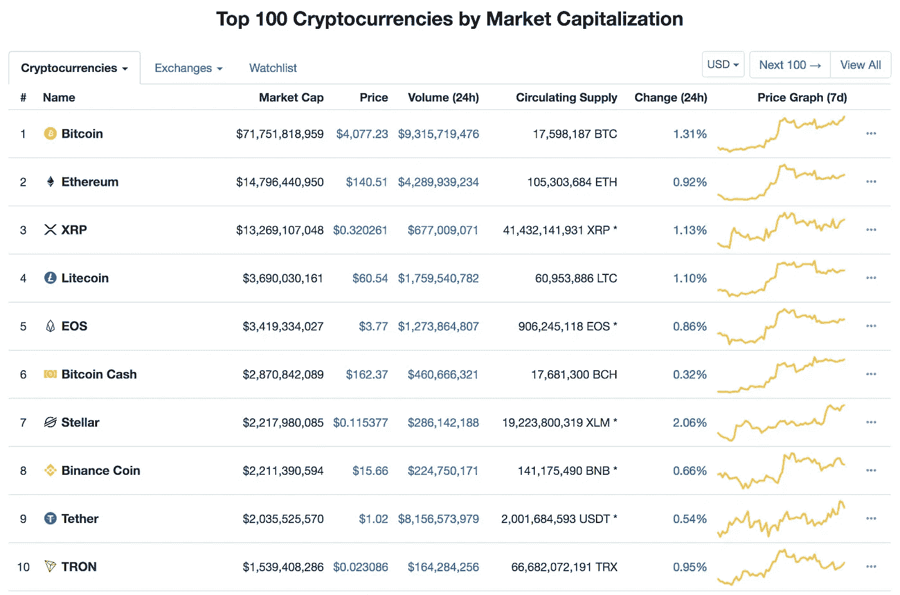

# 加密指数谬误

> 原文：<https://medium.com/hackernoon/the-crypto-index-fallacy-b151d1b1ecc>

*免责声明:我是一只加密货币基金的活跃经理人。*

和以往一样，加密货币市场仍有许多问题有待解决。2019 年初，我们仍然处于加密货币的寒冬，实际上是史上最长的寒冬。许多人认为，尽管投资的投机面在熊市，但仍有许多建设在进行，而且这个行业仍在增长。或者，他们提到的私人投资或风险投资仍然相当活跃。这两种说法可能都没错，但作为对比，我想看看其他人没有注意到的方面，那就是流动性很强的硬币和代币市场。

我认为，对于新的加密货币投资者来说，重要的是要列出两种主要的投资方式，以及为什么其中一种可能不是看上去的那种。但首先，让我们结合一些典型的投资者在使用被动投资策略时的思维定势。

## 股票指数化的被动投资方法

大多数人都熟悉被动投资使用股票指数。个人投资者、家族办公室和机构投资者经常使用这种投资策略。指数化投资的费用较低，因为它们被动地跟随某一特定指数，并根据该相关指数调整其持有量。最著名的例子可能是标普 500 指数以及跟随其后的各种 ETF，比如$SPY 和$VOO。它们表现良好，特别是在美国股市等高效市场。

股票指数的一个组成部分，以加强其价值主张是多元化。它通过多种方式实现多样化。该指数按市值追踪美国 500 强企业，其中包括 10 个板块。每个部门都由许多类似的公司组成(例如技术部门。)这让投资者投资者可以接触到对经济增长、利率、通胀和大宗商品价格敏感的公司，因为每个行业对不同的市场动态会做出不同的反应。此外，每家公司都是自己创办的，并逐渐发展到在指数中的地位。每家公司都有助于实现多元化，因为每家公司都有自己的团队，遵循自己的系统和流程。它们是构成一个整体的原子碎片。所有这些因素都有助于创造一个真正多元化的投资工具。

## 被动加密索引方法

在加密货币领域采取被动投资方式时，有几种选择。它们大多按市值(技术上是网络价值)来追踪排名前 10、20 或 30 位的加密资产指数。如果与股票指数比较，可以认为前 10 名是大盘股，前 20 名或前 30 名是中盘股。有几个指数可供选择，但前三个是:持有 10 指数(按位)、彭博银河加密指数(来自彭博)或 CCI30 指数。它们追踪加密货币市场的方法略有不同。和其他指数投资一样，主动投资的费用相对较低。

许多非常聪明的人正在这个领域打造可靠的投资产品。我绝不否认这一点。此外，在很长一段时间内，消极的方法可能会击败大多数积极的策略，如在美国股票市场。只有时间能证明一切，因为加密是一种新的资产类别。

# 加密指数谬误

加密指数谬误是指加密资产类别的多样化。为了更好地说明这一点，让我们沿着加密内存的道路走一走。

最初，大约 10 年前，只有比特币。然后慢慢地，随着时间的推移，许多加密资产被创造出来。许多人开始复制比特币开源软件，并添加一些变种来创建自己的加密资产。由于它们是比特币的复制品，因此存在类似的监管风险。一旦比特币被认为不是一种证券，它就允许其复制品推断它们的监管风险也降低了。因此，许多比特币的早期副本被添加到当时流行的交易所，如比特币基地，这吸引了新的加密投资者对这些加密资产的投资。

开源软件是过去 15 年来形成的一股强大趋势。顾名思义，这意味着人类可读的代码是公开的，任何人都可以访问它，查看它，如果他们愿意，还可以复制它来开始他们自己的项目。作为一项技术，这在区块链是一个强大的功能，但随着时间的推移，它改变了加密资产的增值方式。不再有最好的技术作为这项投资的防御护城河。有了开源软件，聪明的企业家可以复制开源软件并开始他们自己的项目，或者在这种情况下，启动一个加密资产。

迄今为止，有超过 2000 种不同的加密资产。我在文章 [*加密资产类别*](https://hackernoon.com/crypto-asset-classes-6dd6ddece456) 中将加密货币区分为子集，将加密资产区分为超集。在 10 大加密资产中，4 个是加密货币，5 个是智能合约平台。前 10 名中只有 1 个公用事业令牌，这是在过去几周刚刚发生的。没有 dApp，商品或证券令牌在前 10 名的指数中。此外，当你考虑到前 10 大加密资产中有 3 个是比特币或 Ripple 的开源软件副本时，集中度会变得更高。

如果我们回顾一下前 10 大加密资产——莱特币和比特币现金是比特币的副本，Stellar 是 Ripple 的副本。就在一年前，还有以太坊和以太坊经典，但后者已经跌出了市值排名前 20 的加密资产。每种资产可能都有不同的特点，但最终 10 大加密资产中有 50%是相似的，这无助于在加密领域寻求多元化投资的投资者。这是一种谬论——加密指数投资是一种投资加密资产的多样化方法。

对此的反驳可能是，由于这项技术是开源的，加密资产唯一真正可以防御的护城河就是它们的网络。网络效应为资产构筑了护城河，这是事实。然而，如果一项加密资产仅仅是比特币的 8 小时编码变化，并且因为它是首批在交易所上市的加密资产之一而被购买，那么它真的有任何网络效应吗？

还有更多因素导致了加密指数谬误。由于加密资产主要是软件项目，团队成员可以从事多个项目。此外，加密市场的所有部门都没有在指数中得到体现。例如，前 10 名中没有治理令牌，只有一个实用工具令牌。最后，总市值的 80%由前 10 大加密资产持有这一事实是一个“T2”缺陷，而不是当前被动指数投资的特征。随着市场的成熟，我预计这种情况会改变，但今天的情况就是如此。

# 结论

密码市场中的被动和主动策略都是有效的。唯一需要考虑的区别是，投资于其他市场的假设可能不适用于加密市场。相对于被动管理，主动管理仍然昂贵，但在一个效率低下的新兴市场中，或许能够带来更高的回报，在这个市场中，稍微多一点的知识就能带来不对称的价值。

同样，被动投资仍然遵循一个指数，并减少支出，但指数中的内容可能不是你所想的那样。它们目前可能没有多样化。应该说，这种情况将来很可能会改变。随着加密资产作为一种新的资产类别开始成熟，随着价格开始更多地反映内在价值，指数可能会变得更加多样化。我想这只是需要一些时间。目前，*买者自负*——信息是要知道你投资的是什么；这个古老的拉丁短语也适用于投资。

*免责声明:以上内容仅代表一种观点，仅供参考。这篇文章是由一位活跃的加密投资经理撰写的。它无意成为投资建议。请自己做作业。*

[***杰克·瑞恩***](/@jake_ryan) ***是 Tradecraft Capital 的 GP，创业顾问，天使投资人&投资方面的作家。如果你喜欢这篇文章，请“鼓掌”帮助别人找到它！欲知详情，敬请关注*** [***【脸书】***](https://www.facebook.com/tradecraftcapital)*[***碎碎念***](https://twitter.com/TradecraftJake) ***。****

*# crypto #加密货币#比特币#投资#区块链#估值#加密估值#交易技术*