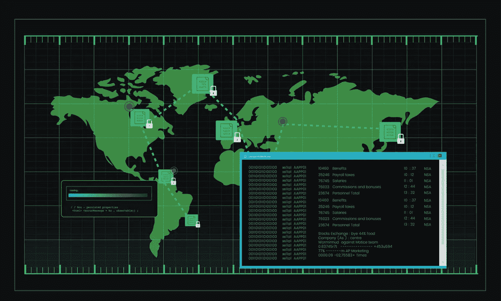
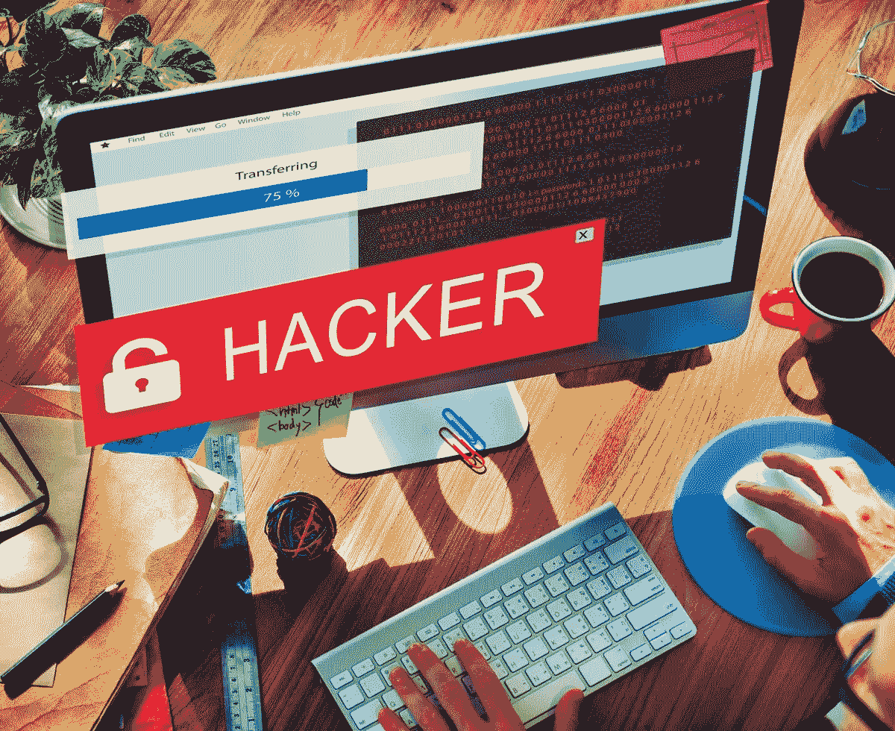

# “雇佣黑客”市场的现状

> 原文：<https://medium.com/hackernoon/the-current-state-of-the-hackers-for-hire-market-85f4107d3e7c>

Image via [Rawpixel](https://www.rawpixel.com/image/395240/illustration-computer-hacking-code)

人们不用花很长时间就能找到恶意黑客的例子，他们破坏数据库并窃取信息来出售或以其他方式获利。

但是，也有一些道德黑客被科技公司雇佣来进行渗透测试，或者验证网站、应用程序或网络是否像看起来那样安全。

近年来，对于任何有必要财力的人来说，进入“黑客雇佣”市场变得比以往任何时候都容易。这就像在谷歌搜索结果一样简单。

在那里，人们可以找到[黑客](https://hackernoon.com/tagged/hacker)市场，参与者在那里推销他们的技能，有时还提供他们的价格范围。最初，许多受雇的黑客只在黑暗网络上活动，但现在他们的服务需求如此之大，以至于广播他们已经司空见惯。

大多数受雇的黑客都是匿名工作的，他们的报酬会根据黑客的复杂程度和工作时间的长短而上升。以每小时 5 美元(T5)的价格雇佣一名黑客是可能的，这意味着这种选择甚至对那些财力有限的人也是开放的。他们中的一些人也更喜欢比特币支付，而不是传统货币。

那么，既然受雇的黑客可以展示他们的技能，那么在未来的几个月或几年里，人们可以期待什么呢？

# 美国联邦当局和受雇黑客之间微妙的关系

Image via [Rawpixel](https://www.rawpixel.com/image/500377/hacker-cyber-crime-criminal-computer-concept)

美国联邦调查局(FBI)是一个通常转向灰色市场雇佣黑客的机构，有时通过与专业公司签订合同。

这种做法的一个有趣之处在于，它允许联邦调查局[绕过漏洞权益程序(VEP](https://slate.com/technology/2018/06/the-federal-policy-loophole-supporting-the-hacking-for-hire-market.html) )，该程序要求该机构权衡是向科技公司披露零日漏洞，还是将其保密。

此外，即使有了最近的 VEP 更新，它仍然存在不足，因为如果联邦调查局购买受保密协议等合同条款约束的零日漏洞，它可以忽略 VEP 的规定。

但是，2018 年 12 月，美国司法部表明，即使其他联邦机构雇佣黑客，市场也不会不受限制。这是因为该组织将 15 个销售分布式拒绝服务(DDoS)攻击的域下线，并将其作为压力测试进行营销。此外，三名嫌疑人因运营两个违规网站而受到指控。

一些现已关闭的网站是最受欢迎的 DDoS 攻击网站。例如，与一个提供商相关的服务[在大约四年的时间里对 200，000 次 DDoS 攻击](https://www.pcmag.com/news/365609/feds-take-down-15-ddos-for-hire-websites)负有责任。

此外，联邦调查局特工警告说，他们将起诉运行这些 DDoS 攻击网站的实体和购买此类服务的人。因此，人们不能指望参与这些网站——无论是作为服务提供商还是客户——并指望免受潜在后果的影响。

# 做一名受雇的黑客是自由职业者的另一种选择

Image via [Rawpixel](https://www.rawpixel.com/image/392895/anonymous-hacker)

受雇的成功黑客一般都懂各种编程语言。他们非常注重细节，能够在压力下高效工作。

市场前景表明，拥有适合雇佣黑客市场的技能的人将很快变得[更有价值](https://www.princetonreview.com/careers/43/computer-operator-programmer)，尤其是对那些想要外包给自由职业者的公司而言。

许多刊登招聘黑客广告的市场看起来与自由职业者通常用来寻找需要其他服务的客户的网站几乎一样，比如写作和网页设计。这意味着人们冒险进入黑客世界并不困难，看看他们是否能获得收入。

有时候，这些自由职业者没有必要推销他们自己和他们的服务。这是因为公司向发现漏洞并报告的道德黑客提供“漏洞奖金”。一名少年[通过这样的兼职赚了超过 10 万美元](https://www.marketwatch.com/story/this-18-year-olds-hacking-side-hustle-has-earned-him-100000-and-its-legal-2018-07-23)。

谷歌和苹果等公司提供的这些程序可以产生数十万美元，作为找到一个问题的奖励。并且，由于这些举措是光明正大的，参与者不必担心他们的工作来源会因为执法部门的介入而终止。

现成的漏洞奖励项目列表显示了黑客可以获得的最低和最高奖励。既然如此多的知名公司都在向这些公民黑客寻求帮助，这表明希望进入这个市场的人有一个光明的未来。

# 全球范围内打击雇佣黑客——同时招募其他人

Image via [Soumil Kumar](https://www.pexels.com/@soumil-kumar-4325)

甚至在 2018 年 12 月拆除 DDoS 网站之前，来自 12 个国家的执法机构在 2018 年 4 月采取了一项行动，拆除了服务器，并逮捕了与 webstressor.org 网站相关的人员。

据称，这个在线目的地是多年来超过 400 万次 DDoS 攻击的幕后黑手，因为据报道它是最大的黑客雇佣平台。

然而，并非所有国家当局都对黑客感到厌倦。2019 年 1 月有消息称，加拿大国内情报机构[想要雇佣黑客](https://www.thestar.com/news/canada/2019/01/03/canadas-domestic-spy-agency-looking-to-hire-hackers-and-data-scientists.html)，一份“网络开发分析师”的招聘启事就是明证然后，在美国，爱达荷国家实验室是该国首要的网络安全设施之一。它最初被称为核设施，但最近[在网络安全方面获得了优势](https://phys.org/news/2018-12-idaho-lab-infrastructure-cyber.html)。

一座可容纳 200 多名员工的新建筑正在建设中，因为目前的空间太小，容纳不下该设施的网络安全团队，招聘工作仍在快速进行。

爱达荷国家实验室的代表们在候选人还在高中的时候就开始寻找未来的团队成员。该设施还为大学生举办网络安全竞赛。

# 受雇黑客应谨慎行事

Image via [Christina Morillo](https://www.pexels.com/@divinetechygirl)

这些例子表明，对黑客的需求正以前所未有的速度增长。而且，他们提供的服务可以赚钱。

然而，由于执法官员最近的活动，似乎更安全的做法是将注意力集中在 bug 赏金计划和其他纯粹合法的机会上，以避开可能的网站关闭。

 [## 黑客正午的毒品技术工作

### 黑客如何找到最好的技术工作？官方工作委员会的出版物，黑客中午！黑客如何开始他们的…

jobs.hackernoon.com](https://jobs.hackernoon.com/)