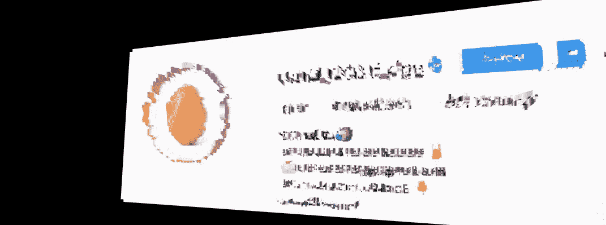
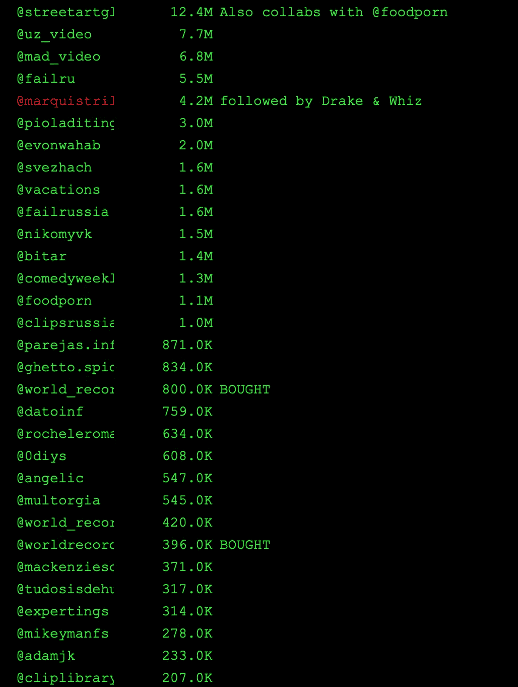
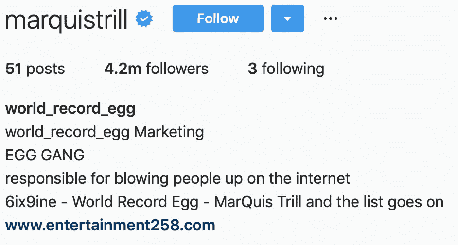
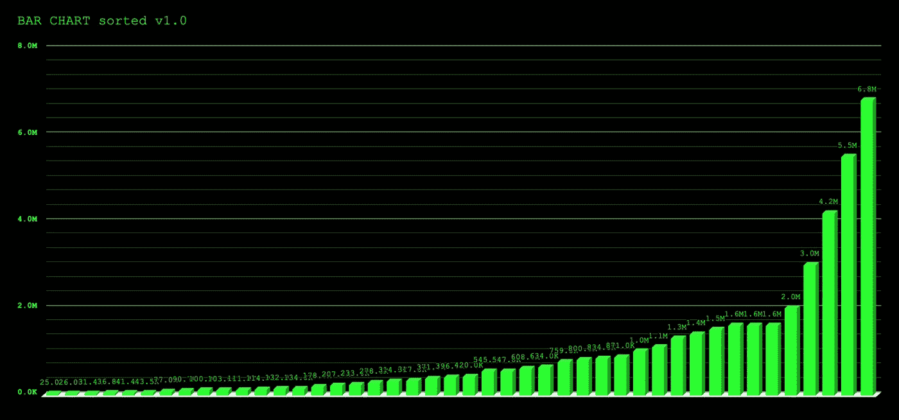
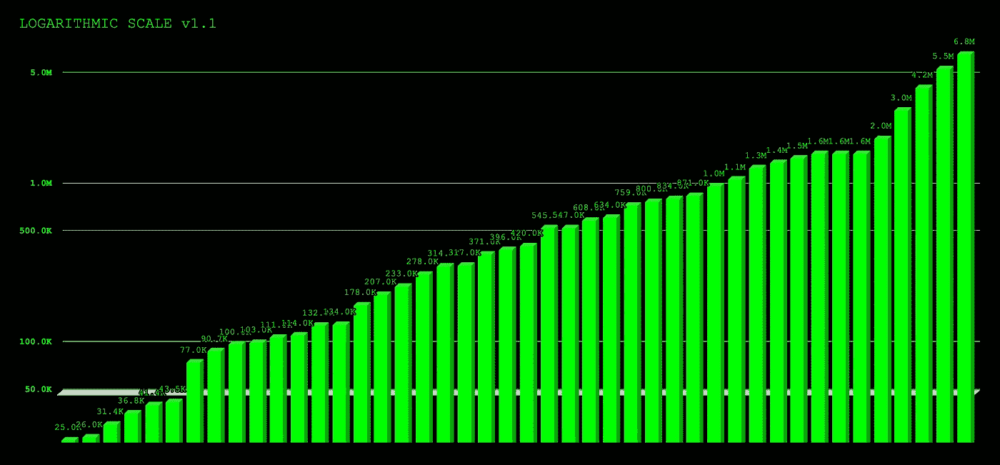

# 世界纪录鸡蛋背后的黑暗真相

> 原文：<https://medium.com/hackernoon/the-dark-truth-behind-world-record-egg-f0577857d679>

我钻进被窝，打开 Instagram，随便搜了一下。

@world_record_egg…

老实说，我不相信——我完全怀疑它的合法性。你怎么能像病毒一样传播如此毫无意义的东西。甚至不是毫无意义的，但从第一天起就完全不支持。

向左滑动，苹果新闻……它甚至遍布媒体，帖子已经超过凯莉·詹娜的婴儿照片，成为互联网上最受欢迎的图片。

震惊地看着这个搜索结果列表，我的目光被吸引到了别处。对着一堆堆和官方页面用户名一样的用户？不可能是…

但事实并非如此。

相反，我的眼睛捉弄了我，我应该知道得更好。我看到的是 50 个用户把他们的 instagram 昵称改成了 world_record_egg。

为什么？为什么会这样。

我决定深入调查。点击个人资料，尝试理解这一点。

## 我的初步结论

1.  他们改变他们的名字来获得浏览，当人们像我一样搜索鸡蛋帖子时，他们可能也会点击这些页面，从而获得更多的浏览。抽象？…
2.  他们真的如此热爱世界鸡蛋记录，以至于他们为了它的事业重新命名了他们的 Instagram 页面。

# 谁会这么做？

Instagram 上的每个人都是关于他们的形象，这是 Instagram 的目的。谁会把自己的昵称改成一个随机的世界纪录尝试手柄呢？问题，但没有数据…

Top Tier Sample of the 50+ User Accounts

## 所以我做了一些数字运算

…它让我大吃一惊。大多数页面都是巨大的转发页面。只要你付钱给版主，你可以发布任何你想发布的内容。与他们现有的追随者相比，他们从搜索结果中获得的增长是微不足道的。在查看这 50 个用户时，我发现了一些可能被购买的页面，因为他们没有帖子，没有关注者，没有休眠帐户。

它们都是转贴页面。然后我发现了别的。

the founder of the egg?

## @marquistrill

紧随其后的是德雷克和神童哈利法。他声称自己是世界纪录彩蛋的一员，这篇文章提到他是某种社交媒体营销者。他引起了我的注意，因为他是第一个真正改变名字的人，事实上是仅有的拥有超过 10 万名粉丝的人之一。

# 这可能是世界记录鸡蛋的主人吗？

我越是浏览其他的报道，就越是开始得出一些没有根据的结论。这一切开始感觉像一个阴谋。

当你获取数据并将其绘制在图表上时，它是沉重的，平均粉丝数为 140 万。

follower count of each user using world_record_egg

然而，在对数尺度上，基线被调整并且异常值被去除。

logarithmic scale follower count of each user using world_record_egg

此时，我决定在凌晨 2:30 开始写这篇文章。

用数据画点，就是感觉不对。这看起来像是一场经过策划和执行的营销活动。

## 社交媒体营销

做过影响者的工作后，我知道人们是如何在 instagram 上支付费用的。有人给我钱，让我为大品牌发布大规模的广告，有人给我 100 美元，让我随便发布一篇关于 xyz 产品的广告。也就是说，我知道 100 个经常拿 100 美元的人*。它们很容易买到，或者可以买到。*

*现在，有 50 名用户拥有大量追随者，他们把自己最著名的 instagram 工具变成了一种随机的、一夜之间流行的时尚。更不用说列表中那些是 bot 页面，俄罗斯 bot 页面。他们几乎不是“真正的”人，而那些“真正的”人除了他们自己之外没有什么别的事情可做。*

*我不想一概而论，因为没有太多的证据。这是一个最好的长镜头。*

> *实际上，这有多难？向 50 个用户支付几百美元来购买一个值得传播的大喊，改变他们的昵称来换取巨大的可见性。*

*动机是什么？我不知道——必须有一个来测试这个理论，但我认为这些数据足够有趣，值得质疑。*

## *这是不是真的有什么关系？*

*事实并非如此——我被 Instagram API 冲昏了头脑。虽然我的一部分喜欢关于社交媒体操纵的好阴谋，并认为这完全是疯狂的，但你可以通过并非有机或真正“病毒”指标的方法获得这种真实世界的可见性。*