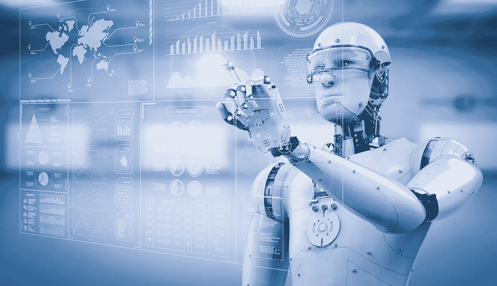

# 机器人过程自动化和人工智能的区别

> 原文：<https://medium.com/hackernoon/the-difference-between-robotic-process-automation-and-artificial-intelligence-2bc3bc938d03>

# 什么是机器人过程自动化？

那么，[什么是机器人过程自动化](http://www.robotprocessautomation.co.uk/)？简单地说，它是以软件机器人的形式使用计算机程序，来标准化和自动化可重复的业务流程。

想象一下，让一个机器人坐在电脑上，像人类一样执行相同的键盘操作，打开相同的应用程序。虽然它不需要物理机器人，但软件机器人倾向于通过像正常人一样使用应用程序来模仿人类活动。

借助机器人流程自动化，机器人可以完成重复性任务，从而解放员工的时间，让他们为公司从事更多创收任务。有趣的是，非技术员工将拥有制造自己的软件机器人所需的工具，这些软件机器人将解决他们个人的自动化挑战。

## **好处:**

*   **准确性:**极高的一致性和准确性——而且不容易出现打字错误或错误。
*   **合规:**机器人提供审计跟踪历史，并能完全遵循监管合规规则。
*   可靠性:你可以使用机器人全天候工作。
*   **一致性:**任务以相同的方式完成，更容易有效地运行重复的项目。
*   **提高员工士气:**借助机器人流程自动化，员工可以更轻松地将时间投入到更有吸引力的工作中。

# 什么是人工智能？

人工智能是机器学习领域，智能机器像人类一样运作。以下是一些常见的活动:

*   规划
*   学问
*   问题解决
*   语音识别

人工智能可以分为两个部分:

*   **窄 AI:** 窄 AI 专注于单一任务，往往表现得极其出色。即使狭义的 AI 机器看起来是智能的，但它们是高度受控的，处于严格的约束之下。
*   **人工通用智能:** AGI 以强人工智能著称。你通常会在《星际迷航》或《西部世界》等电影中看到这种类型的人工智能。AGI 是一台具有接近人类能力的机器，可以用它的应用智能来解决任何问题。

## **好处:**

*   **艰难探索:**人工智能可以用来解决复杂的程序，探索世界范围内的古怪区域。你可以利用人工智能探索海底，这使得它超越了人类的限制。由于他们的编程，人工智能可以用来执行艰巨的工作，承担更大的责任。而且他们不会感到疲劳。
*   **不休息:**人工智能不需要茶点和休息。这意味着您可以全天候使用它们，而不必担心疲劳、分心或性能下降。

# 他们的区别是什么？

RPA 由结构输入和业务逻辑控制。他们的主要目标是实现业务流程的自动化，并与员工协同工作。人工智能是一种用于替代人类劳动的技术形式。结合 RPA 和人工智能可以创建一个完全自主的流程。

例如，RPA 软件可用于扫描账单，并将其放入会计软件中。通过人工智能，它可以自动检测并按照指定的顺序对账单进行排序，并让机器人使用它。人工连续体是人工智能和 RPA 一起使用的时候。

# 社会如何受益？

社会使用 RPA 来帮助组织成长为数字工作场所，并解决自动化挑战。除了日常的自动化任务，RPA 帮助团队在处理一次性项目时变得更加高效。

机器人过程自动化有助于提高生产率和降低成本。例如，让一个机器人一天工作 8 小时，节省了找员工的时间和麻烦。因此，RPA 使企业能够更快地工作并产生更好的结果。

## 你对人工智能或机器人过程自动化有什么疑问吗？

在下面的评论里分享吧！