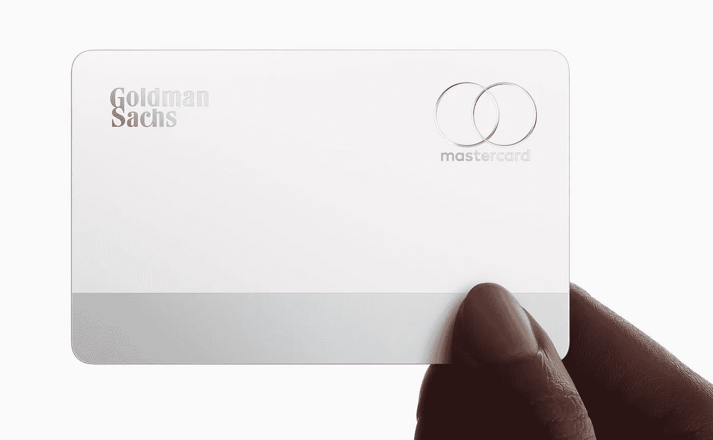
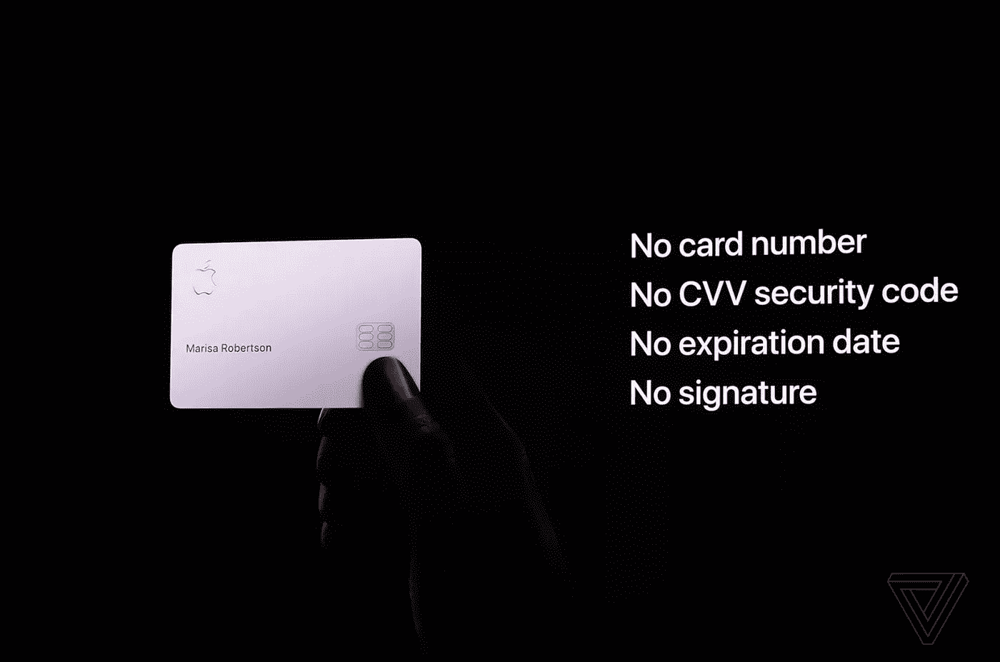
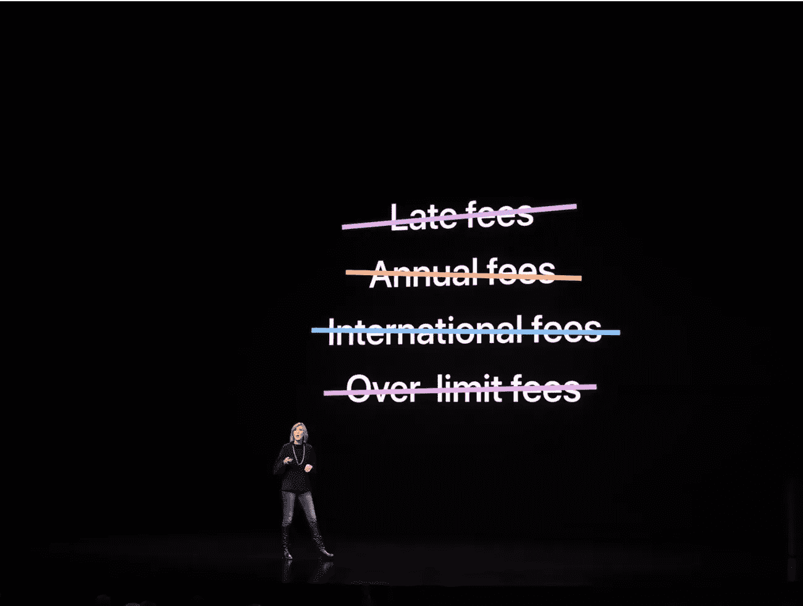
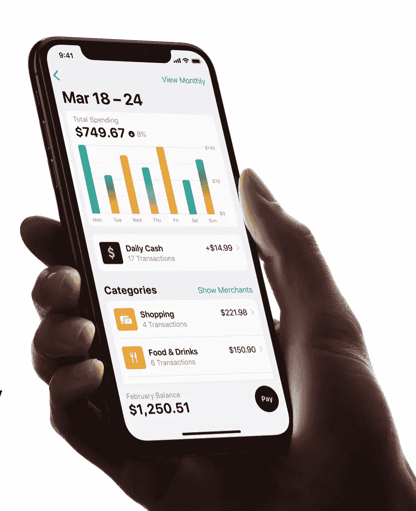

# 信用卡的颠覆者——苹果信用卡。

> 原文：<https://medium.com/hackernoon/the-disruptor-of-credit-cards-apple-credit-card-5451f539ecca>

## 随着苹果推出他们的信用卡，有太多的期待。它在许多方面都不同于市场上的其他产品。让我们深入了解一下为什么它具有破坏性，以及你可能见过的最漂亮的卡片会带来什么。

在我介绍这张卡的功能之前，让我们先来欣赏一下这款产品的魅力:

> *下巴下垂*

Source: [https://www.apple.com/apple-card/](https://www.apple.com/apple-card/)

今天，我在读《哈佛商业评论》的文章“什么是颠覆性创新”，文章认为颠覆性创新需要具备以下两个特征之一:

> 源自低端市场:“颠覆者通常旨在为低端消费者提供“足够好”的产品”
> 
> 源自新的市场立足点:“颠覆者创造了一个不存在的市场”

因此，根据上述两个特征，苹果信用卡不是颠覆者，因为它既不是针对低端消费者，也没有创造一个新的市场，信用卡市场自 1950 年以来就存在。

那么为什么我认为它是一个颠覆者呢？让我们来看看:

1.  **首张全数字信用卡**:这是首张全数字信用卡，完全消除了随身携带实体信用卡的需要。有人可能会说，数字钱包提供相同的功能，但数字钱包和数字信用卡是不一样的。

页（page 的缩写）s:有一种非常光滑的激光蚀刻钛卡，苹果现在正在为那些在技术上可能无法接受苹果信用卡的商店提供，但是，随着 iPhones 的更大渗透，这些实体卡的使用可能会减少。

## 数字钱包(如 Paypal、Apple Pay 和 Amazon Pay)提供的服务允许人们存储个人信息，并通过大量附加的金融工具(借记卡/信用卡或网上银行)进行数字支付。然而，全数字信用卡不便于通过多种工具支付。

Source: [The Verge](https://www.theverge.com/2019/3/25/18277417/apple-pay-credit-card-announcement-goldman-sachs-event-2019?fbclid=IwAR0hyJhwY4Cx6S7WO79LnOghe0cb_zsbHR295Fkongs4o_pyN5qOr9_0fYQ)

**2。打破了古老的在卡片上包含信息的方式:**苹果以其简约时尚的设计而闻名。他们又做了一次，这张卡上没有持卡人或卡的相关信息。没有 CVV，没有到期日，没有持卡人姓名——什么都没有！它的美妙之处？Safari 会自动填充购物所需的数据。

如果这不是天衣无缝，那是什么呢？

Source: [The Verge](https://www.theverge.com/2019/3/25/18277417/apple-pay-credit-card-announcement-goldman-sachs-event-2019?fbclid=IwAR0hyJhwY4Cx6S7WO79LnOghe0cb_zsbHR295Fkongs4o_pyN5qOr9_0fYQ)

3.**不收取任何费用:**据称，延迟支付时不收取任何费用，没有年费，没有超限费等。这怎么可能呢？苹果表示，没有“隐性费用”，但这种提议背后的经济学原理目前肯定对最终消费者是隐藏的。

Source: [Apple](https://www.apple.com/apple-card/how-it-works/)

4.数据隐私:众所周知，苹果公司非常注重隐私，他们信用卡最大的卖点之一就是隐私。苹果声称，他们将无法访问交易数据(购买地点和价格等)，这将确保数据的隐私。这一定会让你想知道，如果他们不访问数据，漂亮的交易分析摘要是如何策划的？(*参考左图*)

交易分析将使用设备上的智能来完成，而不是在苹果的服务器上。

还提供了许多其他的小变化，它们是朝着积极方向迈出的一步，将有助于实现无缝集成:

1.  **简化文件**:你不需要正式申请一张卡，使用你的苹果 ID 通过你的手机就可以完成。
2.  **交易监控无需跨平台移动:**能够在类似仪表板的屏幕上查看您的所有购买，并根据类别对费用进行颜色编码，这使得懒人更容易实时监控他们的费用。
3.  **每日现金和月末余额支付**:我们都听说过信用卡有很多随机日期到期的返现，很难追踪。苹果让这变得更容易，你每天都可以买到现金。默认情况下，您的信用卡付款也将在月底到期，这消除了记住信用卡付款到期日的麻烦。

> 尽管这一切看起来美好而乐观，但这些产品确实引发了我这个金融人的担忧。其中一些是:

1.  **持卡人信用度评估&卡的信用额度:**

据 Jennifer Bailey(Apple Pay 副总裁)称，要获得苹果卡，只需在他们的 iPhones 上注册，几分钟后，他们的卡就会被激活。这让我感到困惑，苹果公司将如何决定特定用户的信用度，以及这种卡的信用额度将如何决定？

**2。iPhone 丢失/被盗的潜在风险增加:**

由于您的 iPhone 中存储了如此多的信息，与某人可能丢失其 iPhone 的情况相关的金融欺诈风险可能会大幅增加。对于小偷来说，唯一的障碍是解锁手机，然后他们就可以购物直到他们倒下。苹果公司声称，他们会在每次购买之前向你的 iPhone 发送交易提醒以获得批准，然而，当设备落入不法之徒手中时，这是一种徒劳的做法。

3.**数据隐私:**

虽然苹果公司可能声称他们无权访问交易数据，但这些数据仍在与高盛共享。

总的来说，我是这张卡的粉丝，一旦它在美国上市，我会很乐意使用它。此外，看看这张卡的使用将如何提高 Apple Pay 在美国的采用率也将是一件有趣的事情。

你对这张卡有什么看法？请在下面的评论中告诉我。

如果你喜欢这篇文章，请表达你的爱:

参考资料:

1.  [https://hbr.org/2015/12/what-is-disruptive-innovation](https://hbr.org/2015/12/what-is-disruptive-innovation)
2.  https://www.britannica.com/topic/credit-card
3.  【https://www.apple.com/apple-card/how-it-works/ 
4.  [https://www . the verge . com/2019/3/25/18277417/apple-pay-信用卡-公告-高盛-事件-2019？FB clid = iwar 0 hyjhwy 4c x 6 S7 wo 79 lnoghe 0 CB _ zs bhr 295 fkongs 4 o _ pyn 5 qor 9 _ 0 fyq](https://www.theverge.com/2019/3/25/18277417/apple-pay-credit-card-announcement-goldman-sachs-event-2019?fbclid=IwAR0hyJhwY4Cx6S7WO79LnOghe0cb_zsbHR295Fkongs4o_pyN5qOr9_0fYQ)