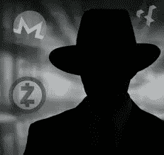

# 加密货币时代的制裁执行

> 原文：<https://medium.com/hackernoon/the-enforcement-of-sanctions-in-the-age-of-cryptocurrency-76f8e58b21b8>

经济制裁对个人和国家都会造成严重后果。虽然它们常常是严重的，但我们必须问的问题是:它们能被强制执行吗？规模更大、公开程度更高的制裁更容易监控，比如，你总能发现一艘油轮在海上运送非法石油。然而，透明度和可核查性较低的制裁怎么办？换句话说，更难核查的制裁？

难道连制裁这种东西都是不可核查的吗？没错，因为在当今的现代加密货币世界中，隐形和保密是自比特币最初推出以来取得进步的关键词。

比特币最初被认为是匿名和不可追踪的，然而发送和接收比特币就像是一个幽灵作家。因为最终你只是一个化名，而不是真实的身份。与充当别名的个人所使用的身份相关联的一切，最终都可以被追踪到并链接到该别名。

> 因此，如果一个人不想被发现，就很难确定他的真实身份。以我们的例子为例，在比特币的世界里，一个人的别名就是你发送或接收比特币的地址。

一旦地址和交易被核实，它们将作为别名永久记录在区块链上。因此匿名。然而，如果一个别名的地址与一个人的真实身份联系在一起，那么每一笔交易都会与这个人联系在一起。截至今天，市场上已经有软件和公司可以追踪区块链的来源和地址，从而发现谁持有存放比特币的钱包。正如你所看到的，曾经被认为是匿名的东西现在只是伪匿名。

另一方面，加密货币要安全得多，因此在实施制裁时也更成问题。Monero 就是这样一种货币，因为它使用环签名、保密交易和秘密地址来掩盖所有交易的来源和目的地。

因此，莫雷诺在其网站上声明，他们“提供了分散加密货币的所有好处，没有任何典型的隐私让步。”如果这种情况继续存在，那么 Monero 无疑将被用来破坏对个人制裁的执行，因为这种货币的交易和持有将无法追踪。

> 此外，区块链上的 Monero 交易无法与特定用户或合法身份联系起来，因此无法实施制裁。

此外，另一种加密货币允许类似级别的模糊性，它就是 Zcash。比特币等 Zcash 交易将数据发布到公共区块链；然而，与比特币不同的是，Zcash 通过零知识证明来确保一个人的个人和交易数据。零知识证明是一种加密方法，通过这种方法，一方可以向另一方证明他们知道值“x”，除了他们知道相同的“x”值这一事实之外，不传递任何信息。

从而允许在不暴露发送者、接收者或交易金额的情况下验证交易。本质上，整个交易是匿名的。因此，津巴布韦元是另一种货币，使一个人有机会绕过或大或小规模的制裁。

加密货币能够规避制裁有效性的第三个例子是 Verge。据 Verge 网站称，该公司“使用多个以匿名为中心的网络，比如 TOR 和 I2P。”从而使用户的 IP 地址变得模糊不清，无法追踪。他们的核心 QT 钱包是用 SSL 加密和 TOR 集成构建的，因此增加了额外的安全级别。

在未来，一旦开发出来，Verge 的双密钥隐形寻址和 f Ring 机密交易使能技术将允许支付处理更加私密，因此更难追踪。

正如我们所见，现代加密货币的技术越来越先进，因此也越来越难以追踪。虽然比特币可能一度被认为是最安全、最匿名的混淆交易方式，但现在情况不同了。

在当今的经济中，比特币更多地被视为一种投资，而像莫雷诺这样的货币被用于交易伙伴关系和双方之间需要匿名的交易。因此，这种匿名也可能被非法使用，因为他们的交易几乎不可能追踪。

这一事实使得拥有足够技术知识的个人和国家能够避开制裁，继续他们的买卖而不大肆宣扬。因此，制裁将永远无法真正实施。