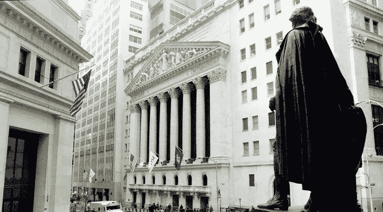
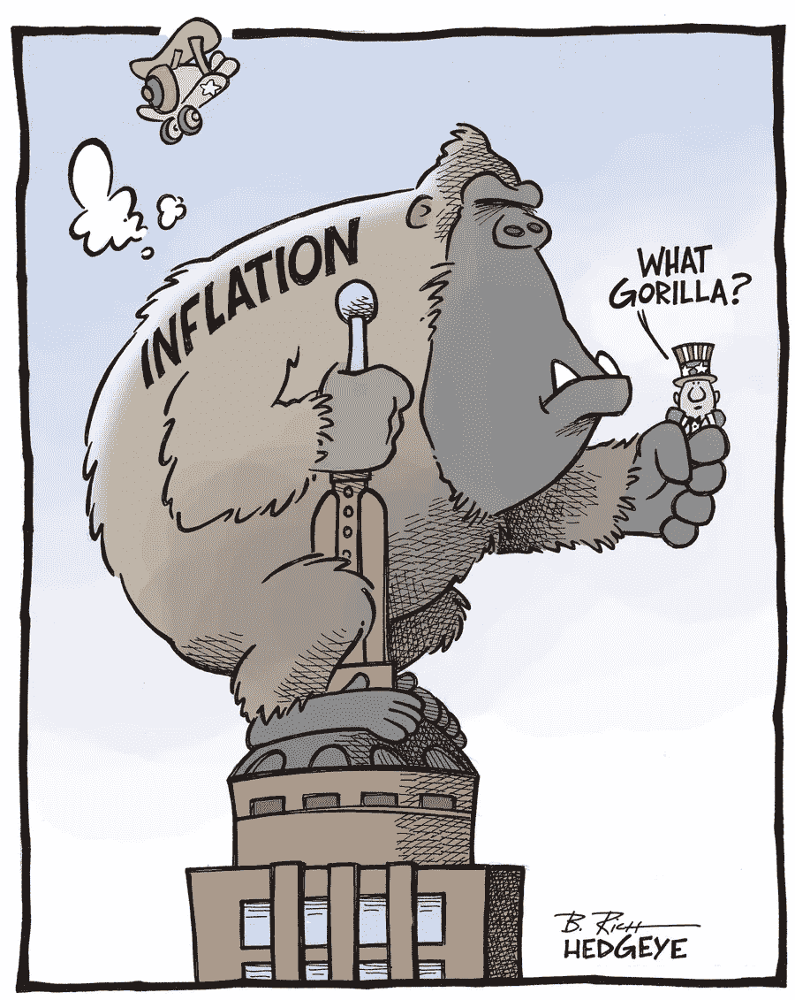

# 货币的演变。第五集:商业银行反击

> 原文：<https://medium.com/hackernoon/the-evolution-of-money-the-commercial-banks-strike-back-episode-v-ce78108d0a91>

Wall Street

在商业银行扮演的角色被强调出来之前，货币从以物易物到现在的演变的故事永远不会结束。虽然早在公元前 2000 年巴比伦就有保管和储存储蓄的做法，但“银行”一词只是在 1640 年左右才开始使用，当时借贷和信贷在南欧开始盛行。

## **银行业的起源**

历史上第一家官方银行是威尼斯银行，大约于 1157 年在威尼斯开业。你可能已经猜到了，它是在开始资助君主战争后变得突出的。然而，现代银行业可以追溯到 1730 年后出现在伦敦的英国金匠，也被称为“商业银行家”。

这些人的主要业务是交易商品、政府债券，以及向探险者和商人发放贷款。没过多久，社区里的每个人都把他们的金条和其他有价值的物品委托给了商人金匠。这种做法迅速传播开来,“银行家”很快成为社会中最富有的成员。

储蓄和保管业务需要定期转移大量的金银。考虑到他们必须保证客户存款的安全，防止被盗，这些商人发明了吸收存款的纸质银行。客户将被收取少量费用，并被发给收据，或证明一定数量的贵重物品被安全地存放在银行。每当顾客购买黄金时，他不是冲到银行去提取黄金，而是给他的银行写一封信，指示他们向卖家支付一定数量的黄金。这些收据演变成纸币和支票(支票)。

这就是银行在货币进化中扮演重要角色的地方。因为他们可以吸收没有所有者标记的存款，这些金匠开始以一定的利息将它们贷出去。然而，为了确保少数可能需要提取硬币的顾客在需要时能拿到钱，商人们保留了一些钱作为储备，就像今天的银行一样。可以肯定地说，银行家在让金本位货币发挥作用的过程中发挥了核心作用。

## **信贷与银行**

2014 年，英国央行发布了一份名为*[***的报告，现代经济中的大部分货币是由商业银行发放贷款***](http://www.bankofengland.co.uk/publications/Pages/news/2014/051.aspx)*创造的。在这个被商业世界忽视的启示中，作者代表银行承认，在现代经济中，银行流动的大部分资金不是来自银行存款，而是来自贷款。美联储银行在其“我打赌你认为”的出版物中写道:*“商业银行在发放贷款时，只需在他们的账户中增加新的存款美元，以换取借款人的借据，就可以创造出支票簿上的钱”*。**

**以下是部分准备金形式的货币如何凭空创造货币:当银行从客户 A 处收到 100 美元的存款时，为了赚钱，它将这笔存款按利息借给另一个客户 b。有趣的是，银行将客户 A 存款的 90%给了客户，并留下了价值 100 美元的借据，这是借出的金额。然而，请注意，白条不同于基础货币，因为它们只是存在于计算机中的数字。它们仍然是钱。**

**因此，除了借给客户 B 的金额外，银行现在又创造了 90 美元，从 10 美元的存款中获得 190 美元。顾客 B 当然需要用借来的钱去购物。这意味着向卖方付款，卖方也将钱存入他的银行账户。银行当然会借出同一笔存款的 90%，比如 190 美元，但在它的账面上，它会开出价值 200 美元的借条，使流通中的货币总量从最初的 100 美元增加到 300 美元。**

**通过这种骗局模式，银行几乎可以永远创造出难以置信的投资回报率。有利息的债务是由借给另一个客户的存款形成的——这需要一个非常好的律师、很大的勇气和决心，而且你有相当大的机会打赢一场针对银行的诉讼，因为银行借给你在贷款时并不真正拥有的钱。**

**虽然货币只能追溯到黄金和白银的使用，但信用已经存在很长时间了。在公元前 2300 年的巴比伦，日常交易通常以信用方式进行，每一笔贷款都由一名政府官员监管。这可能是信贷的起源，因为债权人通常在收获季节向农民提供贷款。此后不久，在罗马帝国，出现了主要从事放贷的西方当铺老板。也有证据表明，在 5 世纪至 15 世纪的黑暗时代，信贷是最流行的支付方式，当时一些地方的主要货币是劳动力。**

**考虑到英格兰银行的证实，几个世纪以来，银行通过无中生有地创造货币而繁荣发展。然而，天才之处在于他们如何设法让公众对这个系统心怀感激。信用体系的运作方式本质上很简单，但实际上却是一团糟。例如，当我们说货币和信贷实际上是一样的东西时，你可能看不到其中的真相，除非你看利息。当银行借给客户一个单位的货币时，至少有一个单位的债务和另一个单位的货币被转移，甚至在复利计算在内之前。**

**这解释了为什么根据 [**Rational Wiki**](https://rationalwiki.org/wiki/Debt_slavery#cite_note-5) 的说法，247 万亿美元的世界债务总额是 2018 年现有货币总量的两倍多。按照这种逻辑，全球债务是不可偿还的，因为它继续产生利息。也正因为如此，真正的财富是通过企业和个人传递给消费者的价格隐性利益，从财富的向上转移中产生的。为了理解这是如何发生的，我们有必要回过头来审视一下现代信贷作为银行提供的一种服务的状况。**

## ****信用卡契约劳役****

**继现金和支票之后，银行应该负责的下一个发明是塑料信用卡的广泛采用和滥用。塑料信用卡所基于的产品银行信用，本质上是银行和持卡人之间的一种协议，银行信任客户在以后偿还他们使用的资金和利息。这项服务允许普通公民在银行作为担保人的情况下赊购商品和服务。这意味着在交易或信用期(通常为 12 个月)结束时，持卡人必须向银行支付使用的金额、相关费用和利息。**

**公众是非常不信任的。已经有数十名富有献身精神的个人付出了额外的努力，试图揭示银行提供的这种信贷的严重社会和经济后果，但大多数人往往过于专注于解决自己的问题，而不是真正关心的问题。例如，在美国，美联储发行的纸币实际上是私人银行美联储银行的“负债”。因为这些票据是不可赎回的，它们本质上是‘货币化债务’，不能也不应该用来偿还债务的负债。**

**契约奴役理论表明，所有或大部分货币的存在实际上是一种债务偿还给银行。一个国家的中央银行，如英国的英格兰银行或美国的美联储，向较小的银行发放信贷，后者再将信贷发放给个人借款人和企业。虽然大多数人认为货币是由当时的政府控制的，但事实是，运行现代经济的私有银行系统不是为了让一个国家或其人民受益，而是为银行所有者赚取利息。**

****人为膨胀****

****

**Inflation? What inflation?**

**阴谋论者有充分的理由相信，普通美国家庭是一个奴隶之家，他们不承认自己对商业银行和他们所代表的银行负有契约义务。引领全球经济走到今天这一步的措施有很多，但自货币发明以来，银行完善的一个特别做法是货币膨胀。用专业术语来说，通货膨胀是一个经济体中商品和服务的总价格随着时间的推移而上升，同时货币购买力下降。**

**20 世纪 60 年代中期的越南战争期间，美国经历了人为通胀最严重的一次。发生这种情况是因为战争总是昂贵的，当约翰逊总统选择将美国军队投入越南时，它带来了一种通货膨胀，给当时的新金融世界秩序带来了很大压力。随着这场预计在几个月内就能赢得的战争年复一年地拖延下去，美国军方需要资金来为所有的努力提供资金，而美元在十年前刚刚被宣布为世界储备货币，美联储的一些“天才”认为用美元印更多的钱是明智的。**

**为满足燃眉之急而铸造更多货币的结果严重打击了美元的价值。如果你曾经想知道一条面包在 1960 年的价格是 45 美分，在 1970 年是 70 美分，到 2019 年是 3 美元，这都是因为通货膨胀。是的，从那以后工资和薪水也上涨了，但是如果你仔细看看，通货膨胀率总是比工资/薪水的涨幅略高。20 世纪 60 年代中期的通货膨胀如此严重，主要是因为铸造更多的美元货币产生了全球性的多米诺骨牌效应，这意味着由于过度供应导致的美元贬值直接影响了世界上所有其他货币的价值。**

## **债务能偿还吗？**

**如今，普通美国家庭平均负债 203，163 美元。这通常是从不同银行积累的各种债务的组合，包括学生贷款、服务费、购车贷款、抵押贷款和信用卡债务等，所有这些都是从银行借来的。这种债务体系受到了操纵，以至于偿还的金额往往在几年的时间里比最初的借款金额高出许多倍。考虑到通货膨胀，普通美国人几乎不可能逃脱信贷奴役的枷锁。有这种债务的人拼命工作来偿还债务，但他们不得不承担其他更昂贵的债务来维持生计。**

**诚然，有些个人或个人家庭富有得超乎想象。这些人中的大多数都直接或间接受益于现代奴隶制，这种制度使人们在一生中的大部分时间(如果不是全部时间的话)都背负着债务，向他们出售梦想，并让他们感到对显然是在实验室中设计的财务状况负有责任。如果你一生都在偿还一笔阻止你追逐幸福梦想的债务，那你是什么？**

**R.《贸易、萧条和出路》一书的作者、美国财政部前助理副部长 G. Hawtrey 说:“(T2)我恐怕普通公民不喜欢被告知银行能够而且确实创造和毁灭货币。“在他的书中，他揭示了运行美国和世界其他地方的信贷系统并没有为受压迫者设计一个明显的出口。银行在没有放贷的情况下放贷的谎言，是由参与交易的各方对这种欺诈系统的信任所推动的。由于真正的钱只能通过创造财富或工作来赚取，而不能通过电脑记账来赚取，只要普通公民和企业将他们所有的收入都用于支付永无止境的贷款，当前的金融体系注定会让每个人都受制于它。**

## ****塑料如何延续现代信用****

**从一开始，货币的进化就总是倾向于便利和价值，而不是其他任何东西。随着现代簿记的发明，纸币、支票和硬币变得没有必要了。信用卡的出现彻底改变了人们拥有和使用货币的方式。第一次，你所有的钱都可以放进口袋里，这比以往任何时候都更安全，尽管携带它的卡没有内在价值，但它使用起来既优雅又迷人。很少有人意识到这也是一个伟大的间谍设备，让你在每一分钱都被监视的现实中受到控制。**

**使用可替换的纸板卡来识别持卡人和交易的想法在 19 世纪的美国西部扩张中被使用。商人可以用这些信用卡向农场主和农民发放贷款，以偿还他们的收成。在 20 世纪初，许多石油公司和百货公司将这一技术向前推进了一步，推出了他们自己的专有卡，只有获得批准的合作伙伴才接受这种卡。**

**1946 年，在布鲁克林的商人约翰·比金斯推出签帐卡后，银行开始发行真正的签帐卡。即使在那时,“闭环”卡系统也过于复杂，因为中间商要为商家的销售进行报销。这意味着该卡可以在当地使用，并且只能在授权的商家使用。五年后，纽约的富兰克林国家银行开始发行成熟的信用卡。大约在 1950 年，大来俱乐部卡首次出现，美国也开始发行信用卡。**

**1958 年发行的美国运通卡，通过使其具有可塑性和国际性，将信用卡游戏带到了一个全新的水平。在 5 年内，近 100，000 家商店签约为 100 多万美国运通卡持卡人服务。整个 60 年代，各大银行都开始发行自己的信用卡，但方式不同。信用卡不再是每月月底全额结算的账单，而是一种循环信贷服务，向持卡人收取少量费用，以结转其每月余额。**

**信用卡行业的下一个重大发展是由一群加利福尼亚银行组成的银行间信用卡协会。这后来演变成万事达卡，今天世界上第二大信用卡服务。该协会选择使用“开环”系统，该系统需要银行之间的合作来转移银行。这使得银行更容易、更便宜地管理他们的信用卡，并增加了接受他们品牌的网点数量。**

## ****银行的未来****

**银行的历史是不完整的，除非它强调了行业中的贪婪几乎摧毁了世界的许多危机。银行不会宣扬这一点，但在 1866 年的维多利亚时代，票据经纪人和银行 Overen，Gurney & Company 倒闭，带走了高达 1100 万英镑的客户存款。这一事件引发的金融危机在当时是史无前例的——以至于威胁到了英格兰银行的地位。1907 年美国的恐慌在一天之内造成了经济衰退，当时一家银行决定撤销违反程序的贷款，这一决定导致了 6 年后美联储的诞生。**

**历史上有很多银行为了个人利益操纵货币性质的例子。例如，1929 年华尔街股灾导致纽约证券交易所损失 140 亿美元，银行直接卷入了导致这一问题的事件。衰退开始时，情况非常糟糕，25，000 家美国银行中有 11，000 家破产，股票价格暴跌超过 75%。大萧条之前的投机热潮与近 100 年后发生在 2008 年银行业危机中的另一场投机热潮非常相似:少数人将其他人遭受损失的大部分(如果不是全部)资金收入囊中。**

## ****结论****

**如果不扰乱全球经济赖以运行的现有金融体系，就无法解决现代银行体系的问题。从第一批商业银行和监管银行(如国际清算银行、世界银行和国际货币基金组织)以及独立国家的中央银行(如英国银行和美联储)继承了几代人的系统问题。业内专家认为，正是由于我们对金融形势的绝望，分散货币正逐渐取代现有的金融体系。这是真的吗？**

**在本系列的下一篇文章中，我们将讨论当前金融体系中的主要问题，这种新形式的分散货币有助于一劳永逸地解决这些问题。**

*****免责声明*** *:* *由*[*@ cryptomedics*](https://steemit.com/@cryptomedics)*提供的信息不构成投资建议、财务建议、交易建议或任何其他类型的建议，您不应将本网站的任何内容视为投资建议、财务建议、交易建议或任何其他类型的建议。做好自己的尽职调查，并在投资前做好自己的研究。如果你喜欢我们的内容，给我们点爱，upvote，分享一下，加入我们的* [*电报讨论*](https://t.me/cryptomedicsdiscussion) *或者主* [*密码医生频道*](https://t.me/cryptomedics) *。***