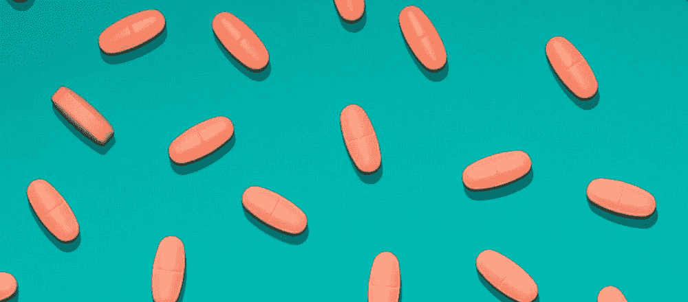
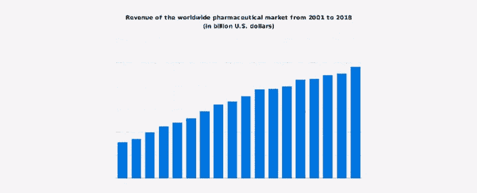
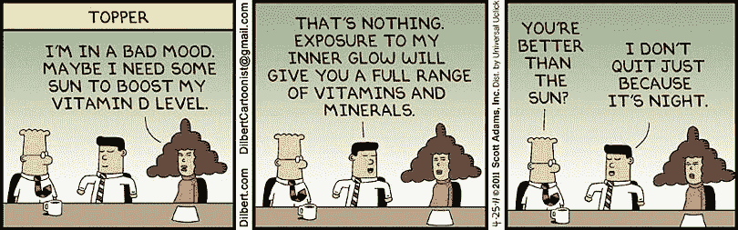

# 假药市场超过 300 亿美元。你的补充剂和维生素是真的吗？

> 原文：<https://medium.com/hackernoon/the-fake-drugs-market-is-over-30-billion-are-your-supplements-and-vitamins-real-d1169d5b3aa1>

制药行业是世界上最大的行业之一，2018 年其全球收入为 1.2 万亿美元，并且还在继续增长，因为不断增长的人口正在寻找新的方法来增加他们的消费量，通过从食物来源中提取的加工营养素来补充他们的饮食。到 2023 年，药物、维生素和补充剂的全球收入预计将达到[73.5 亿美元](https://www.marketsandmarkets.com/Market-Reports/vitamins-market-159097794.html)。

但问题是，这几乎是一个不受监管的市场。当有人买了一片药，很有可能是假药。可悲的是，统计数据显示，市场上有成吨的假冒伪劣产品出售给不知情的人。

我们还记得最近发生在中国的[丑闻](https://edition.cnn.com/2018/07/23/asia/faulty-vaccine-china-intl/index.html)，数千支由长春长生生产的问题疫苗被注射给儿童，在某些情况下甚至导致了死亡。

官员们说总共有多达 50 万的长春长生的 DTaP 疫苗可能没有达到适当的标准。另一个例子发生在最近，一家私人医院被关闭了十几家；几十个病人被注射了假的人乳头瘤病毒疫苗。这也发生在中国。

[https://www.statista.com/statistics/263102/pharmaceutical-market-worldwide-revenue-since-2001/](https://www.statista.com/statistics/263102/pharmaceutical-market-worldwide-revenue-since-2001/)

但这个问题并不是中国独有的，它在全球范围内都很普遍。医生说假药每年杀死超过 [25 万儿童](https://www.theguardian.com/science/2019/mar/11/fake-drugs-kill-more-than-250000-children-a-year-doctors-warn)。它们无处不在，必须对此采取措施。但是我们已经知道了解决方案；基于区块链的解决方案，例如 MidasCaps、Paragon 或 VeChain。

> 但是首先，我们必须深入研究这个问题。

# 问题的根源

假药市场是一个巨大的市场——价值超过 300 亿美元！维生素和补充剂市场只是这个价值的一部分，但它每年将 23，000 人送进急诊室。医用大麻(目前)是市场上的另一个少数品种，被发现在[含有](https://www.acsh.org/news/2017/02/10/%E2%80%98medical-marijuana%E2%80%99-riddled-mold-bacteria-%E2%80%94-especially-bad-sick-10855)霉菌和多种细菌，可能会对吸入者造成伤害——甚至没有人检查这一点！

目前，没有正确的方法来区分真假产品。或许“原产地证书”会有所帮助，但在当前的环境下，这也是可以伪造的。

这些劣质产品大部分来自 T4、印度、中国或者非洲的国家。这些发展中国家的质量控制很差，而且缺乏一个强有力的法律体系来惩罚假冒产品的制造，这吸引了许多罪犯和其他不良行为者进入与医药相关的行业。

根据世界卫生组织的一份报告，在中低收入国家流通的每 10 种医疗产品中，就有 1 种是假货或者质量低劣。

当生产这些劣质产品的卡特尔和公司被抓住时，他们不会面临严重后果，只会被罚款或轻判。不算人的因素，供应链上的每个人都可能被贿赂。成了造假厂商小输大赢的游戏。

# 没有人类——没问题

应该使用的显而易见的解决方案是区块链，该解决方案在处理食品供应链方面已经显示出其有效性。像沃尔玛[这样的大公司通过区块链跟踪他们的食品，这几乎是革命性的——每个集装箱都有自己的跟踪号码，从制造商到商店的路线可以在几秒钟内被检查出来。](https://www.zdnet.com/article/walmart-implements-ibms-blockchain-for-food-traceability/)

> 显然，假食品在区块链不可能有真正的数量。

那么，当我们处理各种与健康相关的产品时，为什么不能实施同样的技术呢？嗯，我们真的可以！区块链市场已经可以为我们提供上述所有行业的许多解决方案——跟踪供应链和签发原产地证书！

在本文中，我们将了解 MidasCaps、Paragon 和 VeChain，这些区块链项目都在开发独特的解决方案，以防止向商店交付假冒药品。

[https://disruptionhub.com/blockchain-supply-chain-must-maybe/](https://disruptionhub.com/blockchain-supply-chain-must-maybe/)

MidasCaps 致力于实施分散的原产地证书，同时生产自己的产品——含补充剂的胶囊。这个想法简单而美好——每个胶囊都带有预定数量的 MDC 令牌，新的令牌随着胶囊的生产而产生。

要找到包含证据的代码，必须打破胶囊，然后用代码换取代币。伪造胶囊的唯一方法是使用没有代码的胶囊，使用明显伪造的胶囊，或者使用从真胶囊复制的代码。

> 幸运的是，这种产品如此便宜，以至于没有经济刺激去做它。

他们的代币将用于支付参与他们平台上的各种体育活动、补充品、设备和健身房订阅。

或者他们可以用来购买其他胶囊作为奖励积分系统的一种形式。无论如何，这里引起我们兴趣的主要特征是证书，它工作得非常好。

Paragon 专为大麻供应链提供解决方案。它为买家和卖家提供了一个 CRM，并配有一套工具，旨在促进大麻行业的发展，并为最终用户提供额外的安全保障。

每一株植物、每一批产品、每一个品系或每一件产品都可以被追踪，每一项操作都被记录在区块链账本上。如果有人试图出售一个糟糕的产品，真相大白，这个制造商的声誉将永远毁于一旦。

最近，鉴于 [SEC 指控](https://www.cnbc.com/2018/11/16/in-crackdown-of-crypto-sec-goes-after-unregistered-coin-offerings.html)出售未注册的安全令牌，Paragon 没有停止开发，他们最终与监管机构[达成协议](https://forkast.news/2019/05/16/get-right-with-the-authorities-bringing-yourself-into-u-s-compliance-after-an-unregistered-ico/)。现在，他们有了一个真正的大麻制造商的功能平台，这将有助于行业的进一步发展。

VeChain 是在中国开发的通用供应链项目。如前所述，大多数假药是在中国制造的。VeChain 与 DNV GL、[被选中](/@vechainofficial/introducing-vechains-drug-and-vaccine-traceability-solution-c17fb869e003)共同开发本地药品和疫苗可追溯性解决方案。

它已经在上海成功实施，物联网设备将在区块链上捕获和记录所有关于疫苗生产和运输的相关数据。

每种疫苗都有一个单独的 ID 号，可以通过扫描来检索该疫苗的全部历史。就算是私链，也是很有用的，可以救很多人的命。

虽然他们有几个其他基于区块链技术的起源解决方案，但我挑选了这三个作为例子来解释。

# 结论

正如我们所看到的，医疗保健、制药和补充剂行业的现状可以归类为糟糕。全球市场充斥着假冒医疗产品，在生产假冒产品的发展中国家情况更糟。这对人类来说是一个大问题，因为我们谈论的是生死攸关的问题。

总会有欺骗系统和维持欺诈现状的方法，但如果区块链在全球范围内实施，将会困难得多。这些起源区块链项目，以及许多其他项目，为所有制造商设定了路线，这条路线引领我们走向更美好的未来，在那里，人们不会吃墨水而不是维生素，不会在需要疫苗才能生存时被注射有缺陷的液体。