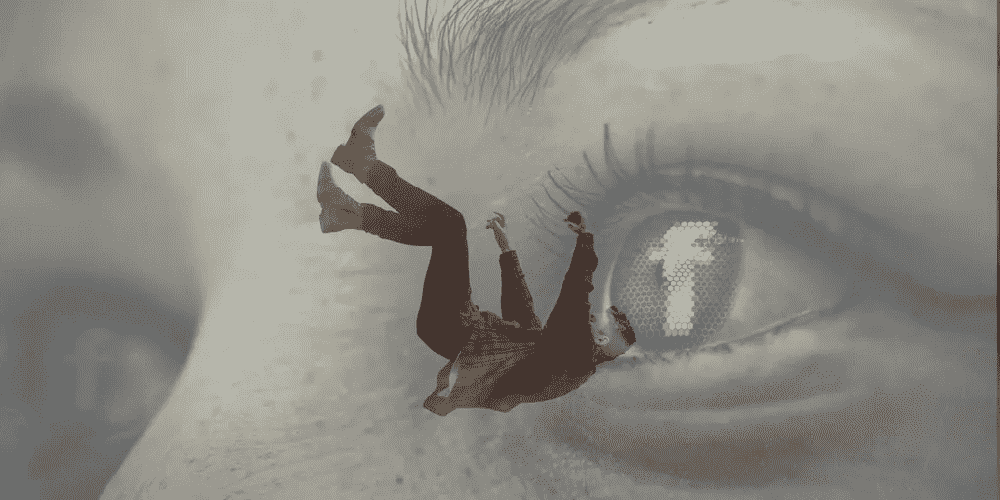

# 脸书的陷落(下)

> 原文：<https://medium.com/hackernoon/the-fall-of-facebook-part-2-b6662aab49dc>

今年八月，我写了一篇题为“脸书的衰落和去中心化互联网的回归”的文章在那篇文章中，我暗示脸书的许多丑闻最终会导致他们垮台。我当时相信我是对的，现在我更加相信我是对的。

为什么？

T2 脸书将 Whatsapp、Instagram 和脸书 messenger 合并的消息不绝于耳。对于我们这些想跳出脸书这艘正在下沉的船的人来说，这是一个好时机。毕竟，Whatsapp 应该是加密的，但如果这些服务合并，谁能相信脸书不会利用其用户的数据？

消息应用是我们生活的一个重要部分，因此可以理解马克·扎克伯格为什么想要合并这些服务，然而脸书在用户数据保护方面的记录糟糕透顶，而用户数据保护对消息应用至关重要。

当剑桥分析公司破产时，大多数脸书用户都视而不见。然而，它仍然在大多数人的嘴里留下了不好的味道。WhatsApp 有可能被攻破，这可能意味着脸书在即时通讯平台上的霸主地位的终结。失去这一点将危及脸书的商业成功，阻碍其增长潜力并助长其衰落。

因此，随着你的数据陷入比之前想象的更大的麻烦，是时候考虑 WhatsApp 的替代品了。这些包括:*信号，电报，使用密码，振动，等等。*

随着脸书继续努力寻找神奇的方法来阻止用户流血，他们最近的举动可能具有讽刺意味的是，这可能是最终吓跑足够多用户的导火索，这将迫使脸书放松和衰落。所有这些都证明，扎克伯格和他的团队就是不明白这一点，人们想要隐私，而且无论在什么平台上都不愿意放弃隐私。