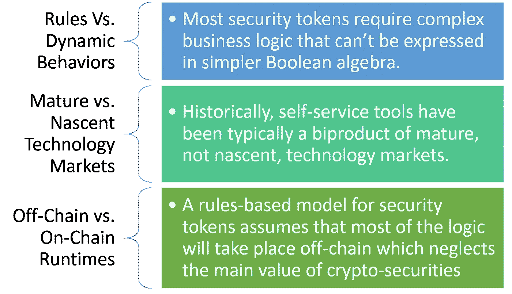
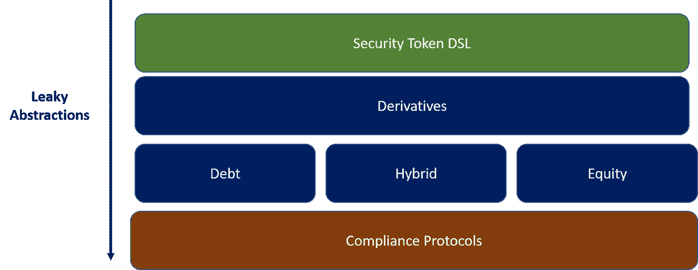

# 自助式安全令牌发放的幻想和一些解决办法:第二部分

> 原文：<https://medium.com/hackernoon/the-fantasy-of-self-service-security-token-issuances-and-some-ideas-to-fix-it-part-ii-1855fc15bb6e>

这是一篇文章的第二部分，也是最后一部分，它揭示了自助式安全令牌发放平台的概念。[在第一部分](https://hackernoon.com/the-fantasy-of-self-service-security-token-issuances-and-some-ideas-to-fix-it-part-i-5a1bc00b3a4a)中，我们探讨了自助安全令牌发放的一些挑战。今天，我想讨论一种潜在的解决方案，它既能平衡技术可行性，又不会受到当前一套自助安全令牌发放工具的任何基本限制。

构建工具来简化安全令牌的发行的想法似乎令人难以置信地令人信服，尤其是考虑到当前发行模型的复杂性。然而，在早期技术市场中，复杂性是可以预料到的，试图太快地抽象它们会导致工具的创建与现实世界的场景不相关，或者，人们不太礼貌地称之为无用。我感觉目前这波自助安全令牌发放工具就是如此。在本文的第一部分中，我强调了与当前自助令牌发放方法相抵触的三个主要因素:

第一篇文章的整个分析可以总结为一个简单的想法，即自助令牌发放不仅不切实际，而且在当今的技术下是不可能的。我非常确定，通过用户界面点击几下鼠标来抽象复杂的金融工具是不可能的，但是，即使这是可能的，我们也没有安全令牌基础设施来创建任何相关的抽象。

# 泄漏的安全令牌抽象

想到自助式安全令牌发放工具，我想起了现代软件开发中一个非常流行的概念:泄漏抽象。这个概念最初是由 Joel Spolsky 在 2002 年[的一篇名为“泄漏抽象法则”](https://www.joelonsoftware.com/2002/11/11/the-law-of-leaky-abstractions/)的博客文章中提出的，它表达了有效的抽象应该“泄漏”其下一层的细节的思想。“漏洞”允许抽象适应需要深入实际实现的场景。漏抽象理论的基本前提是，当涉及到复杂的概念时，大多数抽象都是不够的。

在安全令牌的情况下，泄漏抽象的概念非常重要。想象一个更高级别的构造，它支持安全令牌智能合约的抽象，同时仍然“泄露”关于底层协议的足够多的细节，这些细节可以被开发人员修改。现在我们只需要找出正确的抽象😉

# 一种半自助安全令牌发放解决方案

在安全令牌中解决自助发行的挑战不仅仅是找到正确的抽象结构。在我看来，为安全令牌发行启用更简单的半自助服务模型可以基于两个主要元素:

a)创建一组加密金融协议，这些协议抽象了安全令牌的基本动态。

b)创建能够基于底层协议对安全令牌进行声明性建模的领域特定语言。

将这两个概念放在一起，我们会得到类似下图的结果:

# 加密金融原语

安全令牌最终是基于现金流和投票权的金融动态的可编程表示。其中一些动态是像股票、债务、可转换债券、衍生品和许多其他变体这样的概念。以可组合智能契约的形式实现抽象这些金融原语的协议是实现任何级别的抽象自助服务的第一步。

# 用于安全令牌的 DSL

安全令牌发行的基本挑战是，反复构建具有非常基本的可重用性的智能合约非常耗时。虽然试图将安全令牌简化为一些 if-then-else 规则似乎有些极端，但在不久的将来可能会有可行的中间抽象模型。在所有抽象安全令牌结构的想法中，我对创建更高级的领域特定语言(DSL)的概念特别感兴趣。从概念上讲，DSL 是一种专用于特定应用领域的计算机语言。这与通用语言(GPL)不同，后者广泛适用于各个领域。DSL 的概念在计算机科学中一直存在，但是直到最近才获得一定的普及，特别是在软件开发传奇人物如 [Martin Fowler](https://en.wikipedia.org/wiki/Martin_Fowler_(software_engineer)) 的鼓吹下。

将 DSL 的思想应用于安全令牌，我们可以设想一种声明性的(可能基于 JSON)语言来表示安全令牌背后的契约。DSL 将引用使用泄漏抽象模型的底层智能合约协议。

安全令牌的 DSL 思想除了令牌契约的抽象之外，还有许多实实在在的好处。通过使用高级语言抽象加密安全的表示，安全令牌可以使用该模型实现一些有趣的功能:

**快速创作:**虽然安全令牌的 DSL 不一定是自助服务机制，但它可能会更有效地简化加密安全智能合约的创作和版本控制。一种依赖于 JSON 等众所周知的声明性结构并引用底层智能契约的机制似乎是这种方法的一个很好的组合。

**元数据管理:**如今，很难附加任何与特定安全令牌相关的元数据。然而，拥有基于 DSL 的声明性结构提供了一个无缝的工具来包含元数据元素，这些元数据元素可用于更好地理解底层智能合约。

**搜索:**补充上一点，声明式 DSL 结构将有助于使用主流搜索技术搜索和发现安全令牌智能合约。随着安全令牌数量的增加，搜索和发现将成为生态系统更相关的功能。像图这样的技术为这种方法奠定了基础。

**链上链下编程模型:**安全令牌智能合约通常涉及链上动态和链下数据或动作的组合。后一种机制通常是通过 Oracles 之类的组件来实现的，这总感觉像是在运行两种不同的编程模型。安全令牌的 DSL 可以提供一致的编程模型，抽象链上和链下的动态。

**其他好处:**版本控制、可移植性、文档是安全令牌 DSL 模型的其他好处。

在目前的市场状况下，自助式安全令牌发放工具的想法是不现实的。然而，为所有事情编写智能合同的原则似乎也很难扩展。通向半自助令牌发行模式的道路首先需要启用一套核心金融协议，提供加密证券的主要机制。一旦这些核心协议建立起来，使用更高级的领域特定语言的想法似乎是一条可行的道路。只有建立了这两个基础构件，自助服务安全令牌发放工具的概念才可能有一定的相关性，即使如此，我相信范围也是相当有限的。