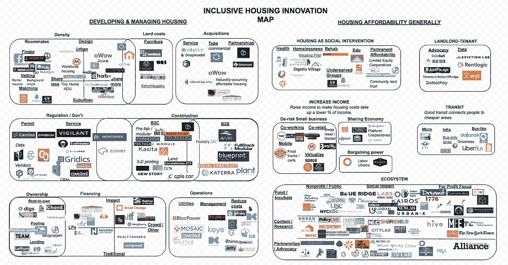

# 导航包容性住房创新领域

> 原文：<https://medium.com/hackernoon/the-field-of-inclusive-housing-innovation-a-rocketship-youve-been-ignoring-d689f8ce0ec2>

# 你一直忽视的火箭飞船

[包容性住房创新地图第 1 版](https://docs.google.com/drawings/d/1Aa_REkm7_GG6A3RmtJk1ojV8o7zkvsrP7Jtaq7UOfgA/edit)(地图上有可点击的链接)

几乎每周都有人提醒我们，我们正处于经济适用房危机之中。在旧金山，只有全美最顶尖的[2](https://sf.curbed.com/2016/5/17/11692468/rent-salary-2016-san-francisco-)2[%](https://dqydj.com/income-percentile-calculator/)才能租得起普通的两居室公寓。无家可归者营地已经蔓延开来。千禧一代的银行账户中平均只有 1000 美元，大部分收入都花在了生活费用上。但在这场危机中，政策建议——尽管至关重要——占据了主导地位，因为有希望的私人部门解决方案往往被忽略。事实上，社区发展界的许多讨论都集中在住房资金的来源上，如第 8 节。虽然这种讨论是必要的，但更多地思考如何有效地使用这笔钱可以带来更好的可负担性结果。

几个趋势表明了为什么住房负担能力是一个关键问题:(1)这是一个关键的社会商品，(2)负担得起的住房将越来越少，以及(3)有改善的机会。经济学家谢(Hsieh)和莫雷蒂(Moretti)计算，由于高房价，美国经济每年损失 1.6 万亿美元。据[普华永道](https://www.pwc.com/gx/en/capital-projects-infrastructure/publications/cpi-outlook/assets/cpi-outlook-to-2025.pdf)称，世界将需要[78 万亿](https://webcache.googleusercontent.com/search?q=cache:aE2KtL5wnyMJ:https://www.forbes.com/sites/greatspeculations/2015/11/25/three-ways-to-profit-from-78-trillion-in-global-infrastructure-investment/+&cd=2&hl=en&ct=clnk&gl=us)的基础设施投资——包括经济适用房投资——来满足城市化的增长。根据麦肯锡研究所的数据，顶级房地产公司在研发上的支出不到其利润的 0.9%，而科技公司，如亚马逊公司，平均支出接近 10%。

包容性住房创新是相当广泛的。因此，为了组织我的地图，我首先根据目标利益相关者区分干预:开发商、租户、社会影响企业家和政府。我还讨论了两个相关的利基——努力增加收入和交通——也影响住房的可负担性。在核心类别之外，最发达的领域是针对开发商和租户的创新。

**以开发者为中心的创新**

基于开发人员的创新使得开发过程的各个方面变得更加容易理解和高效。

**降低土地成本**。由于主要城市供应不足，土地成本可能会消耗掉房地产开发预算的 30%至 40%。

设计。如果重新设计住房，以宜居的方式增加密度，更多的人可以分担同样的住房成本，从而降低住房的单位成本。

我将设计创新分为两类:城市/郊区和空间共享的程度。大多数经常合并的 coliving 和微生活公司，都落入了做城市和分享更多的水桶。一些合住公司，如 Padsplit 和 HubHaus，专注于郊区的独栋住宅。

尽管减少了对共享的关注，但劳动力住房、公交导向型开发、附属住宅单元、小住宅和缺少中间住房都降低了住房成本。它们是传统市场价格住房的变体，但使用设计来降低成本，并针对特定的租户或业主群体。

最后，一些公司简单地设计家具，让人们生活在更小的空间。其中包括大黄蜂空间、Ori 和资源家具。

收购。如果开发商可以降低购买房地产的成本，他们就可以建造更便宜的房子。这里有四个关键工具。

首先是使用像 citybldr 或 idedevelop 这样的服务。city 使用大型数据集和算法来了解要收购哪些房产以及价格。

第二种是集中收购未充分利用的房屋类型，如棕色地带、商业建筑或自然形成的经济适用房。

第三种是与提供特殊土地交易的非营利组织合作，比如 Blokable 与教会的合作。

第四是将土地所有权与实物所有权分离，这在人造住宅社区中很常见。作为负担得起的长期租约的交换，从社区土地信托中租房的房主在出售和从房屋价值上涨中获利的能力受到限制。

最后一种是新的销售技术，如 iBuyers，它缩短了购买房屋的时间，或者通过团购批量购买房屋，从而实现规模经济。

**降低监管成本。**美国住宅建筑商协会声称，建造房屋的监管成本可能占到房屋开发成本的 30%左右。存在各种各样的服务，例如本地参与工具，例如 coUrbanize 和 Neighborland 航行许可和规则，如 Gridics 提供监管情报，如 CivicPro 和 Vigilant。

**降低建筑成本**:人工和建筑可以吃掉一栋建筑总成本的 30%到 50%。住房建设创业公司主要有三种类型。第一类是专注于为开发者提供 B2B 服务的初创公司，如 Fullstack Modular 和 Blokable。第二种是为消费者建造独立单元的创业公司，如 Module 和 Kasita。第三类是初创公司，它们帮助消费者了解当地法规，帮助他们在后院等未充分利用的土地上增加单元。这些包括封面、居住者和蒙塔纳人。

**降低融资成本**。正如一位开发商强调的那样，为新项目筹集足够的资金是他面临的最大障碍之一。

新的融资模式。融资干预分为两大类:以影响为导向或众包。社会影响基金不仅关注利润，还关注社会影响，如特纳影响资本。众筹公司从日常人那里获得融资，而不仅仅是机构投资者，比如 Compound 和 RealtyShares。有些专注于社会影响和众筹，如零钱和低收入投资基金的影响笔记。

承租人所有权。一些融资模式促进基于租赁者的资本和所有权。

一种越来越常见的模式是“先租后拥有”或“共享股权”计划，其中一部分租金用于股权投资。这一领域的初创公司包括 DivvyHomes 和 Digs。

另一种模式是合作抵押贷款模式，即居民共同集资购买更大的房子。这方面的一个例子是 CoBuy 和 baugruppen，这是一种奥地利的发展模式，在这种模式下，开发项目的未来居民集资，自己成为开发商。同样，mietshuser syndi kat 不仅从现有居民那里集资，而且还从其辛迪加的其他住房中提取盈余，用于资助新的永久负担得起的合住项目。

新的贷款模式也存在，以帮助特定类型的居民获得购买房屋的资本。例如，Landed 向教师提供首付补助。ROC Capital 为低收入活动房屋居民提供贷款，然后他们用这笔贷款从房东那里集体购买活动房屋社区。

**运营**:除了开发房源，运营房源成本也增加了房租成本。

公用事业费用。各种创业公司使用太阳能等替代能源和融资机制，使住房消耗更少的能源。

物业管理费用。物业管理公司可以收取 7%到 10%的租金来管理日常运营，即使这样，也可以提供不同的服务。Keyo 和 Zenplace 试图将租赁和维护的关键环节自动化，以降低成本。

**以租户为中心的创新**

室友。租房者通过与室友合住，可以节省 12%到 20%的租金(T4)。寻找室友是一种历史悠久的方式，可以集中资源，增加议价能力，并获得规模经济。室友应用包括帮助你减少交易费用、寻找室友、审查室友以及匹配符合你偏好的室友的工具。

房东-房客。即使有人住在更便宜的房子里，也不能保证房子是高质量的。有各种工具帮助租房者了解法律和获取信息，以确保他们的住房符合标准。

**社会影响创新:**这些创新根据其寻求解决的社会问题而有所不同。这些创新试图解决健康问题，如 Kaiser Permanente 对住房的 2 亿美元投资，无家可归问题，如住房第一运动；弱势群体的康复，如德兰西街基金会；以及教育，例如国家住房信托基金的倡议，将经济适用房安置在好的学区附近。为了促进长期的可负担性，社区土地信托和有限股份合作社经常一起使用。在有限股权合作社中，住房由居民集体所有，其单位的转售价值受到限制，以提高未来居民的支付能力。他们经常与拥有土地租赁的社区土地信托机构合作，否决那些希望取消转售限制的居民。

**政府创新**:虽然这是一个更广泛的话题，可以保证有自己的地图，但金融和监管创新可以增加住房供应。一项金融创新“睦邻”帮助政府为新型基础设施项目融资，比如经济适用房。Camino.ai 和 Symbium 有助于政府法规，如开发许可流程，更容易导航。

**增加收入的创新:**人们买不起房的一个原因是因为人们没有足够的收入。帮助人们赚取更多收入的举措包括努力降低创建小企业的风险，如联合办公、低成本商店、联合零售和按需服务，从而消除对物理空间的需求；通过共享经济计划开发新的收入来源，如 Airbnb、Rover 和平台合作社；并增加工人的谈判能力，如技术，使工人的权力和集体谈判。

**增加交通便利性的创新:**当人们住在更远但更实惠的社区时，住房也会变得更实惠。虽然交通创新可能是一个独立的领域，但我相信一些创新会提高人们对住房的承受能力。这些包括微型移动选项，如自行车和踏板车；新的基础设施方法，如公交专用道和自行车道；以及类似公交车的替代品，如 dollar ride、Via 和 UberBus。

**支持住房创新生态系统的组织:**除了直接影响住房的倡议，还有资助或孵化创新的组织，如 Urban.us 帮助制作研究和内容，以了解问题或新的解决方案，如 Shareable、Shelterforce 或 Terner 住房创新中心；倡导新政策和分享最佳做法的伙伴关系，如 100 个有复原力的城市和住房创新联盟。

**结论**

我的《风景》回顾了大约 200 多项计划，提出了 14 个关键领域的这些主要类别。将许多业务归入一个类别很有挑战性，因为一些公司正在扩大其业务范围，以影响其他类别。

我个人密切关注以下举措。

资源集中努力。我们的经济体系不利于许多人，我很好奇人们如何集中资源来提高他们的议价能力，并像大公司一样获得规模经济。

*   例如，在住房领域，mietshuser syndicat 不仅从居民那里集资，而且还从其辛迪加的其他住房中提取盈余，帮助资助新的永久负担得起的合住项目。一些室友和合住平台帮助租房者组成团体，获得更便宜的租金，如欢迎回家。
*   为了增加收入，平台合作社允许参与者共同拥有平台，并从他们的活动中获得更多利润。联合零售或点播平台使小企业主能够降低运营成本，否则将是资本密集型业务。

努力帮助新演员成为开发者。住房开发通常由少数人完成。新技术使发展“民主化”,允许更多的消费者和新的参与者建造和拥有东西，这是令人兴奋的。例如，Cover 为房主提供一站式服务，让他们在自家后院和其他未充分利用的空间建造房屋。baugruppen 模式让未来的居民汇集他们的资源，成为开发商

作为社会干预的住房。住房是促进身体稳定、建立关系和获得资源(如工作和学校)的重要资源。然而，许多住房创新侧重于建造更便宜的住房，而没有专门设计解决社会问题的住房。因此，我发现以社会动机为目标来促进住房的住房努力是有希望的，并有助于弥合与社会影响和非营利部门的差距。这方面的例子包括新的融资工具，如零钱、Blokable 与非营利组织的合作，以及利用住房促进健康、社区、康复和长期可负担性的努力。

请随时让我知道你想在这张地图上看到的其他人和你觉得令人兴奋的其他交叉趋势。

*☞注:在 TechCrunch* [*这里*](http://bit.ly/TCHousingMapPost) *可以看到这篇文章的一个版本。*

*☞同意还是不同意？在 LinkedIn 上加我加个备注* [*这里*](https://www.linkedin.com/in/wu12345/) *。*