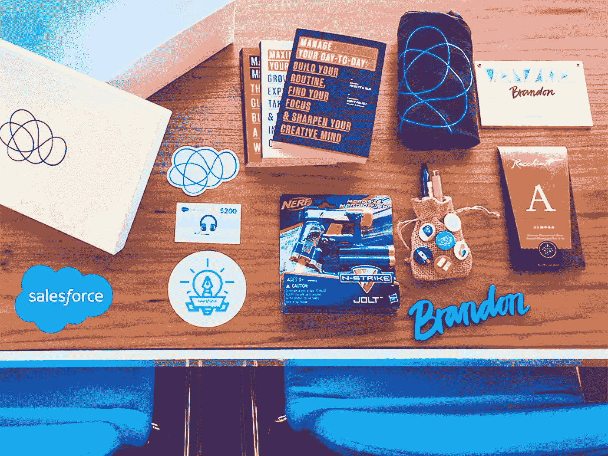
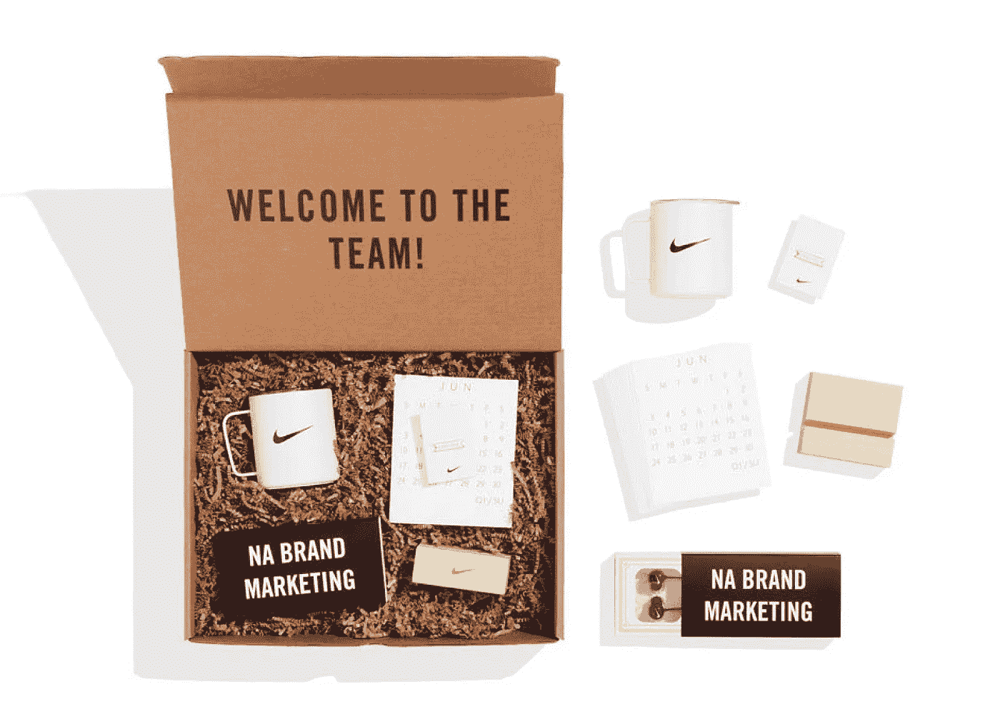
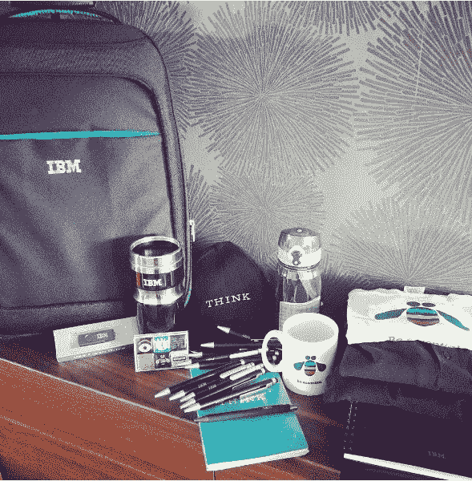
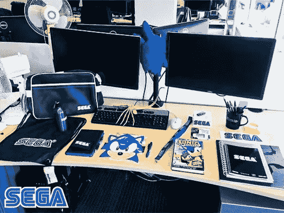
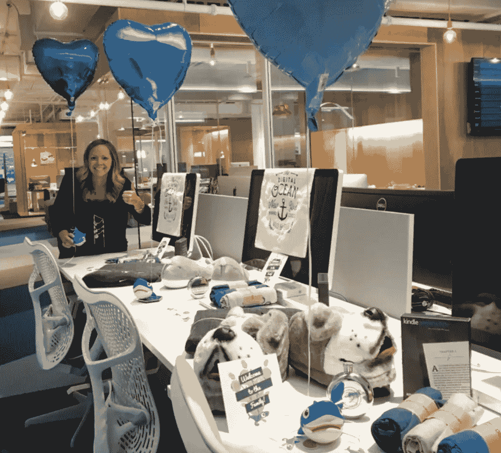
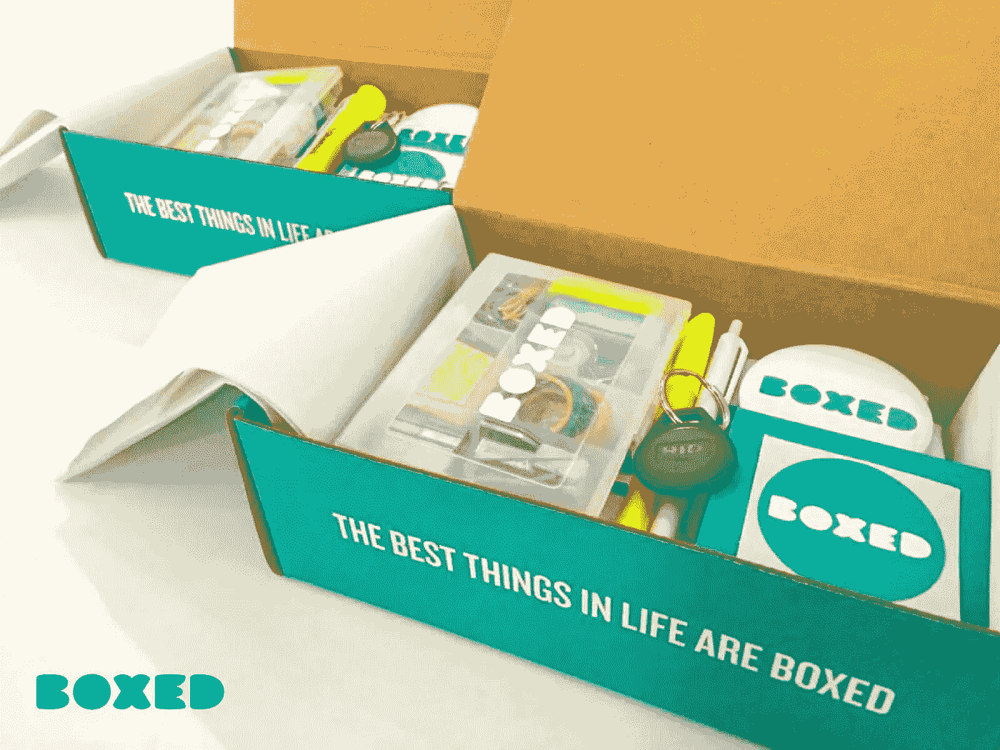
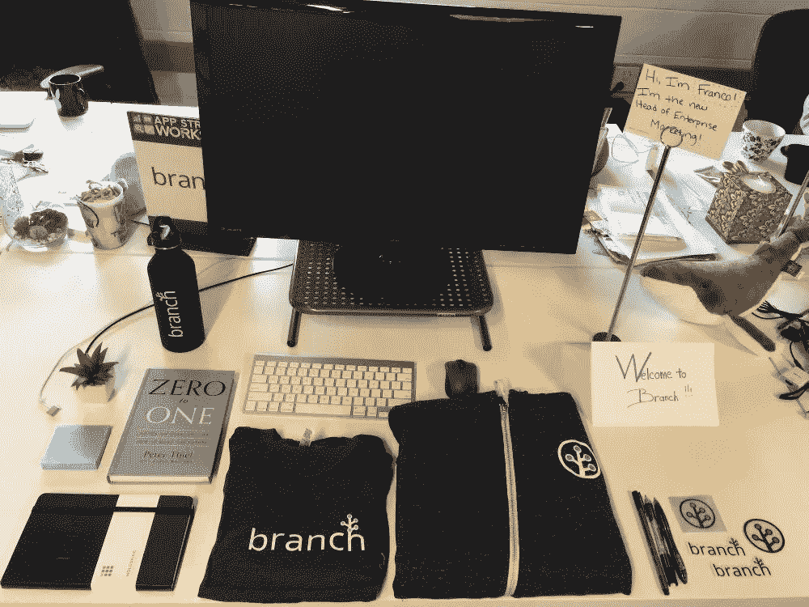
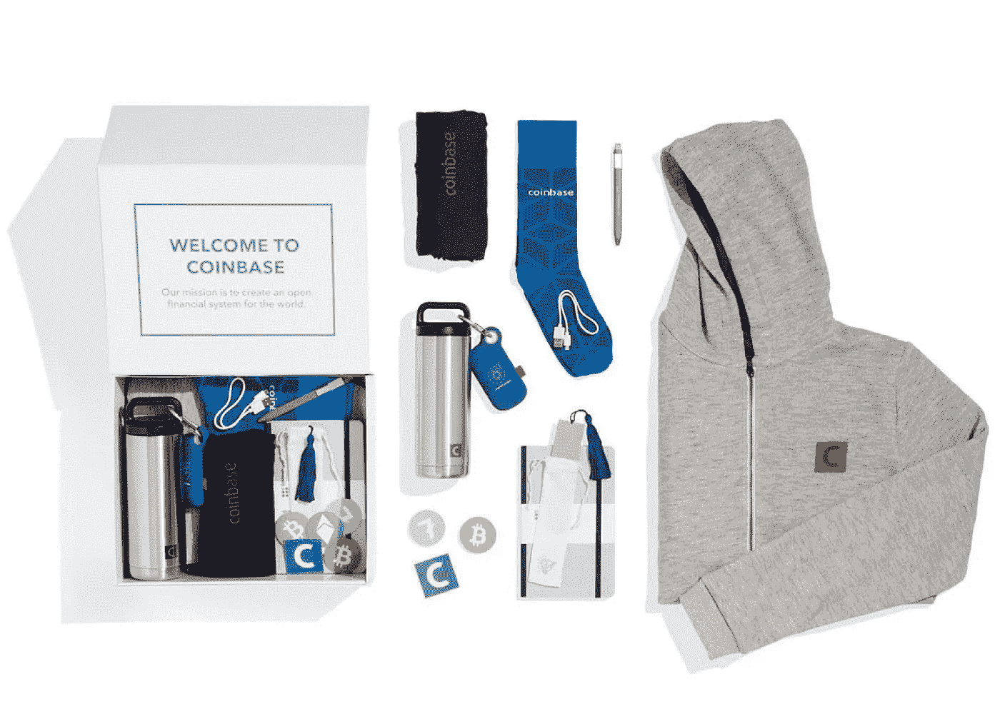
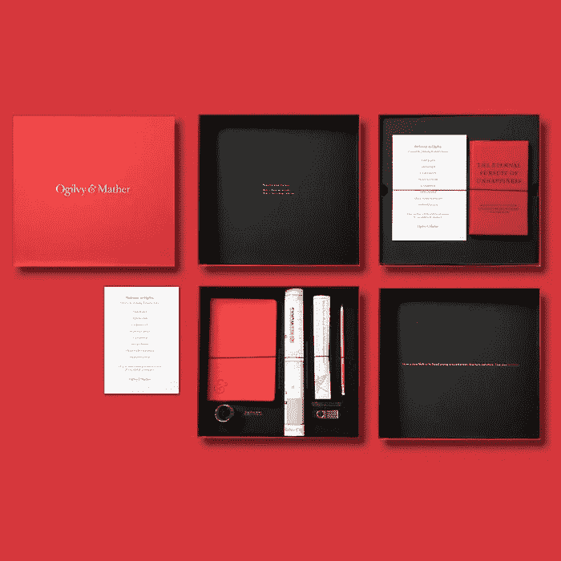
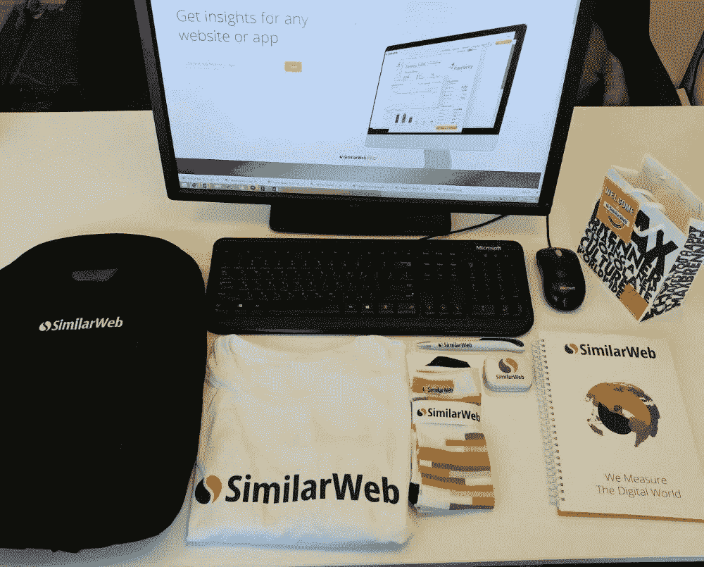

# 耐克、Salesforce、IBM、SEGA、DigitalOcean、Boxed、Branch、比特币基地、奥美和 SimiliarWeb 的第一天工作欢迎包

> 原文：<https://medium.com/hackernoon/the-first-day-of-work-at-nike-salesforce-ibm-and-sega-f911e4936b03>

在耐克、Salesforce、IBM 或世嘉这样的公司工作的第一天是什么样的？

如果你想找到答案，你必须通过严格的招聘程序，成为一名员工，但有一个第一天的传统已经公布:新员工的欢迎包。

> 欢迎工具包是新员工在工作中需要的物品的集合:笔记本电脑、笔、笔记本等。

工具包里通常还有其他东西，让员工感到受欢迎，可能会有公司名称或标志:衣服、贴纸或其他更不寻常的东西。其中一些物品是收藏品——例如，苹果公司的主要办公室过去有一个传统，给新员工一件印有他们加入公司年份的 t 恤。

至少有两个原因让人们知道欢迎礼包的传统:

1.  员工为他们的新工作场所感到自豪，并在 Instagram 上发布他们办公桌的照片。
2.  人力资源部门与营销专家合作，故意将这些照片发布在公司的社交媒体页面上，以展示在那里工作有多酷。

这篇文章基于我多年来收集的来自不同公司的各种欢迎包。我的公司 [AcademyOcean](http://academyocean.com/) ，自动化入职和员工教育。直到 2018 年，我们公司一直专注于**用户入职**，但在 2019 年，我们拓宽了我们的关注范围，现在我们还为**员工入职**提供了一个强大的工具。

# 以下是从不同公司挑选的 10 个新员工欢迎套件

1.Salesforce 是全球最大的 SaaS 公司。他们的主要产品是同名的 CRM 系统。Salesforce 成立于 1999 年，拥有 35，000 名员工。

他们的欢迎礼包包括书籍、贴纸、礼券、名签，还有非常重要的一把玩具枪。

2.耐克是一家美国运动服、运动鞋和运动器材制造商。该公司成立于 1964 年，在全球拥有 73，000 多名员工。这是北美营销团队的欢迎工具包。

这些项目正是你对营销团队的期望。有一个杯子，一个日历，耳机和一个别针。这一切都呈现在一个令人难忘的盒子里。

3.IBM 是世界上最大的硬件和软件公司之一。它创建于 1911 年(108 年前！).他们在 170 个国家雇佣了超过 35 万名员工。这是一个员工在社交媒体上发布的欢迎工具包示例。你可以看到 IBM 热爱咖啡和思考。他们特别喜欢写下他们想到的东西。

4.世嘉是一家我们很多人小时候就记得的公司。这家日本电子游戏公司成立于 1960 年，员工超过 5000 人。

他们的欢迎包包括几个包，一些漫画，组织者/笔记本，和一点怀旧——传奇索尼克的肖像。

5.**数字海洋**是世界上最受欢迎的主机服务提供商之一。该公司成立于 2011 年，2017 年，客户数量超过 100 万。他们有 500 多名员工。

他们把气球系在新员工的桌子上，给他们一包 t 恤、巨大的毛绒拖鞋和金属水瓶。

6. **Boxed** 是一家在线商店，它于 2013 年亮相，宣布希望结束在商店排队等候的现象。该公司提供批发商品和盒装产品。

因此，他们的新员工欢迎工具包当然是包装在他们的签名盒中(比盒装客户熟悉的那个版本小)。基本就是个小办公室。

7.**分公司**是一个移动营销服务，成立于 2014 年。他们雇用了 300 多人。

该公司并不太关心“平躺”——衣服只是折叠起来放在桌子上。但新员工确实会得到一本 Moleskine 笔记本和一本关于创业的最重要的书——彼得·泰尔的《从零到一》。

8.**比特币基地**是一项针对加密货币钱包和加密货币兑换的服务。他们大约有 500 名员工。公司成立于 2012 年，成功完成了 [Y Combinator](/marketing-and-entrepreneurship/ten-weeks-with-y-combinators-startup-school-an-insider-s-view-5cc3d8e5b3f) 加速器计划。

这是他们欢迎包的布局。想到添加的一个有趣的东西是 iPhone 充电器。

9.奥美是世界上最著名的营销和公关机构之一。它成立于 1948 年，目前在 83 个国家拥有 10，000 名员工。

他们的可能是这个列表中最时尚的装备。里面有很多纸制品——从美观的卡片到办公室平面图。盒子里还有一本秘密红皮书，作者是该公司创始人大卫·奥格威。这本书在商店里买不到，只有在该机构工作的人才能买到(尽管一名前雇员在亚马逊上以 60 美元的价格“第三方”出售这本书)。

奥美用了一个非常好的方法来提高忠诚度，从员工进入公司的第一步开始。一些公司甚至走得更远，让他们的故事变得互动——我们的一个客户 Netpeak 为他们的新员工创建了一个名为“你在 Netpeak 的第一天”的整个学院就像这本书一样，只有网峰的员工才能进入这个学院。

10. **Similarweb** 是一项创建于 2007 年的分析服务，可以轻松分析任何网站的流量。

500 多人在这家公司工作。他们提供经典的出发装备，包括袜子和巧克力:

> 感谢阅读本系列的第 1 部分！第 1 部分介绍了我们收集的前 10 家公司。第 2 部分将介绍 10 家不同的公司，以及一些关于创建欢迎工具包的建议。