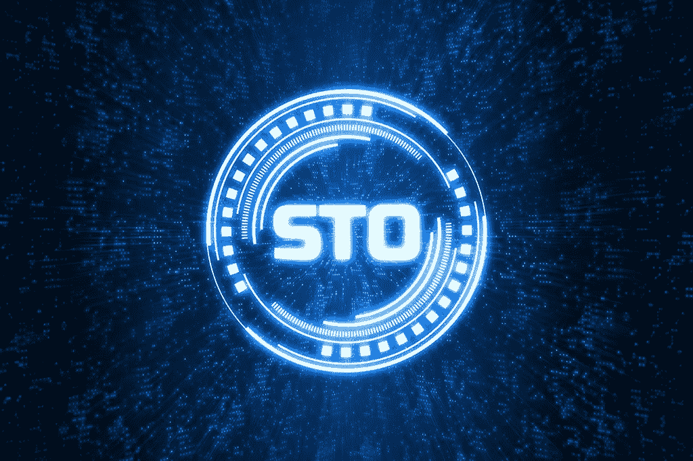

# STO 的第一个里程碑是德国:Bitbond 发行了第一个 BaFin 批准的安全令牌债券

> 原文：<https://medium.com/hackernoon/the-first-sto-milestone-is-german-bitbond-issues-the-first-bafin-approved-security-token-bond-70925e61f2d>

最后，事情发生了:一家德国公司赢得了发行完全受监管的安全令牌的竞赛，至少在欧洲是这样。尽管其他人声称过去已经“象征化”了一些东西，但目前为止，比特币债券的发行是 STO 叙事中的一个彻底转变。

**的确**[**bit bond**](https://www.bitbondsto.com/)**——一家总部位于柏林的众筹公司——发布了一份** [**招股书**](https://www.bitbondsto.com/files/bitbond-sto-prospectus.pdf) **经** [**德国监管机构 BaFin**](https://www.bafin.de/DE/Startseite/startseite_node.html) **批准，通过在恒星区块链上发行安全令牌债券来筹集资金，无需存托银行，无需证书或息票和中介**。与传统债券不同，认购者无需支付佣金/溢价/溢价。此外，这个 STO 的规模相当可观，雄心勃勃的€100 万英镑的硬性规定。

## 这是一个很大的进步，这是我在过去 12 个月里一直在等待的游戏规则改变者。

如果有什么不同的话，我的赌注是一个规模更小、更灵活的司法管辖区，能够首先完成这项工作(比如瑞士)。

因此，德国此举对该行业非常重要。这发出了一个明确的信号，德国现在在 STO 竞赛中领先，并准备抢走你的生意。至少在保守的德国中型企业主中——根据我的经验，他们非常热衷于“在国内保持基地安全”——这基本上意味着“嘿，伙计们，为什么要把你的生意搬到别处去呢？不要冒险，也不要看得太远，现在你可以在家里通过股票交易所方便地筹集资金。

随着英国退出欧盟的不确定性——这可能会在短期内惩罚伦敦的金融中心——德国人甚至可以从其他欧盟国家吸引潜在的 sto。最后，法兰克福的金融基础设施是一流的，柏林是顶级的技术和加密中心，拥有大量经验丰富的加密顾问和法律顾问，德国中小企业中潜在的 STO 候选人的市场是欧洲最大的。因此，德国 STO 市场的繁荣和发展是有目共睹的。

现在，[正如我在这里所承诺的](https://blockchainflashnews.com/crypto-regulatory-developments/)，我已经仔细阅读了比特大陆的招股说明书，我也和公司的总法律顾问[亨宁·弗兰肯](https://www.linkedin.com/in/henning-franken-72a90760/)交换了电子邮件，澄清了一些问题。以下是我对比特大陆 STO 债券发行的分析。

# **1。比特邦的商业背景**

Bitbond 的平台在投资者和小企业主之间进行贷款中介。通过其全资子公司 Bitbond Finance GmbH，他们旨在通过 Bitbond 平台筹集资本，直接资助小企业主。

# **2。Bitbond s —安全令牌发行(STO)**

为了筹集资金，Bitbond Finance 将发行 1 亿€的证券代币债券。发行的货币是欧元，尽管投资者也可以用密码支付本金。

该公司将发行 BB1 代币，面值为€1，代表一种债务工具(债券)，年利率为 4%，按季度分期支付。此外，它将支付相当于 Bitbond GmbH 在其业务活动中实现的利润的 60%的可变利息额(如果有)。BB1 代币将在[恒星区块链](https://www.stellar.org/)上发行。债券的期限是 10 年。

出于显而易见的实际原因，象征性权利或其质押的合同转让——根据民事合同法，标准证券本来是可能的——在这种情况下被否定(第 7.2.8 条有限禁止转让)。这是因为只有通过 Stellar 区块链才能转让代币的权利，这样才能出售和转让代币的全部所有权，而不是附属权利。因此，投资者在招股说明书中确认，在恒星区块链之外，基本上不会质押或以其他方式转让代币权利。这是必要的，以避免在民事合同法下的法律可能性与区块链的实际可行性之间的冲突。

# **3。比较代币债券与传统债券**

## 3.1 成本

首先，发行直接成本只是可比传统债券的一小部分。最大的直接成本是营销和销售，€约为 40 万英镑，其次是€的法律和招股说明书费用为 12 万英镑，€的软件开发费用为 8 万英镑。如果债券被完全认购，直接成本仅为 0.6%，不包括所有间接成本，如小费佣金、转介和关联公司奖励。

## 3.2 没有中间人

那么就没有金融中介可以打交道，认购方也不会支付佣金/溢价/贴水。发行直接面向投资者，BB1 代币将通过智能合约直接分配到投资者的钱包中。

## 3.3 流动性潜力

[流动性仍然是一个有待验证的问题](https://blockchainflashnews.com/why-tokenization-is-still-a-chimera/),因为没有交易这种令牌化债券的真实市场。因此，€1 亿欧元债券将被认购多少，BB1 代币的流动性如何，以及发行者将选择哪个市场进行交易，都还有待观察。

无论如何，潜在优势是存在的，随着该行业的增长和传统金融机构的参与，流动性将逐步改善。我毫不怀疑，尽管金融运营商在代币债券发行阶段被“非中介化”，但它们将在代币交易中扮演积极且有利可图的角色，从而为市场带来流动性(做市商会来)。此外，商业票据或小型公司债券等传统金融工具也非常缺乏流动性。在这方面，我们至少有潜力创建一个基于区块链的全球市场，在那里可以交易这些证券。随着时间的推移，一切都会到来。

## 3.4 可编程性

另一个优势是令牌通过智能合约的可编程性。在这种特殊情况下，会编写一个脚本，自动执行与支付利息和赎回相关的所有步骤，以及计算汇率和到期金额并分配到钱包中。然而，脚本是由发行者手动激活的，所以最终它是半自动的。

# **4。风险**

招股说明书中适当地列出了风险。然而，我希望更深入地挖掘和更仔细地检查一些风险。抛开任何业务和任何金融工具投资中常见的明显风险不谈，我想把重点放在加密贷款业务中更不透明和固有的风险上。

## 4.1 ERP 贷款和汇率风险

当 Bitbond 通过其平台向小企业出借密码时，它就进入了所谓的 ERP 贷款(汇率挂钩贷款)。简而言之，如果借款人借了€1000 英镑，这笔钱会以加密的形式转给他，然后借款人会将这笔钱再次转换成法定货币。当它必须偿还时，它将总是以当时的秘密法定汇率偿还 1.000€。这显然保护了 Bitbond 免受加密波动的影响。另一方面，借款人在接受加密贷款并将其兑换成法定资金的过程中，会受到加密法定汇率波动的影响。据该公司总法律顾问 Henning Franken 称，这通常只需要几分钟。然而，自 2018 年以来，该公司声称已经改善了其业务模式，现在，它不再使用加密货币，而是使用一种稳定的硬币——欧元令牌——向借款人转移资金，如下文第 4.2 段所述。

## 4.2 欧洲铁路运输风险

为了做到这一点，Bitbond 与平台(如 [Tempo](https://www.tempo.eu.com/en) )合作，将菲亚特转变为一种数字稳定货币，以 1:1 的比例支持欧元，称为 EURT(欧元代币)。

根据[亨宁·弗兰肯](https://www.linkedin.com/in/henning-franken-72a90760/)——比特大陆的法律总顾问—“*Tempo 在恒星区块链上发射所谓的“欧洲代币”。所以他们不使用恒星流明(XLM ),而只使用恒星提供的底层账本。*

*与上述模型(4.1)相比，风险敞口进一步降低，因为转移到 Tempo 的每一个法定欧元都被兑换成一个欧元代币，该代币在交易的任何时候都保持 1 欧元的价值。这样，即使在向借款人转账和兑换之间，也不再有波动风险。此外，交易速度更快，成本更低，更安全。*

*Bitbond 已将后一种模式引入所有德国和大部分欧洲客户，并将在 2019 年及以后继续这样做。*

*bit bond Finance GmbH(BB1 的发行人)可能会将 BB1 资金主要投资于德国和欧洲经济区贷款，因为我们现有的大部分客户群都在那里。*

顺便说一句，在这个问题上，值得注意的是 [JP 摩根最近宣布](https://blockchainflashnews.com/jpm-coin/)它将开始发行自己的与美元挂钩的稳定的日元硬币。它最初将用于内部操作，但未来的发展方向是明确的。当大型金融机构介入时，任何与挂钩硬币发行者相关的第三方风险(如第三方偿付能力)至少可以得到缓解和适当评级，如果你的法定挂钩硬币的交易对手是 JP 摩根或高盛，而不是任何小型初创企业，情况就更是如此。这对于允许机构资金投资当然很重要。

## 4.3.本金偿还(到期赎回)和利息支付

所有利息支付以及 BB1 代币到期时的赎回都将在 XLM 进行。这意味着到期的欧元金额将在支付时转换成相应数量的 XLM，并转移到投资者的钱包中。因此，投资者承担上述 4.1 中描述的相同汇率风险，直到 XLM 再次转换为菲亚特。

Bitbond 没有指出在 XLM 偿还本金和利息的替代机制。也不清楚为什么在这种情况下不使用 EURT 来偿还利息和本金。我的观点是，XLM 并不完全是美元。如果几年后它不存在了呢？至少可以插入一个通用条款，建立一个法定货币或法定挂钩硬币的替代支付机制。

还有另一个风险需要考虑，尽管它并不那么明显。截至本文撰写之日，XLM 的市值仅为 16 亿美元，与 BTC(670 亿美元)不可同日而语。因此，不能排除价格操纵。如果 XLM 价格在关键的支付或赎回日期之前被人为抬高，那么在 XLM 转换为法定货币之前，支付给承担汇率风险的投资者的 XLM 就会减少。

此外，不能保证投资者有足够的 XLM 流动性以及可兑换成 BTC/联邦储蓄银行或菲亚特。换句话说，投资者承担了这种加密货币的“退出”风险。这很重要。

## 4.4 编码错误和缺乏争议解决机制

另一个问题是缺乏争端解决机制。由于代币化仍处于实验阶段，以及随之而来的技术风险——想想代码中的一个 bug，或者一个错误的代币，或者在区块链上不可逆的支付转移——我希望有一个仲裁程序，让投资者能够快速解决这些问题。

公平地说，Bitbond 在第 2.2.14 条中正式承认了这些风险，并彻底解释了半自动支付的执行方式，但它未能指出失败时的解决方案。德国法律以柏林法院的非专属管辖权规范 BB1 问题。

# **5。反应**

奇怪的是，证券代币行业迄今为止最大的成就，几乎没有被最大的国际加密媒体注意到。有些人报道了新闻，但没有真正的评论。尽管这则新闻在德国专业媒体上占据了头条，但这绝不是一个地方的成就。这是该行业在全球范围内的成功。

因此，我邀请了一位著名的德国密码专家，与我分享他的观点。

[奥利弗·克劳斯](https://www.linkedin.com/in/droliverkrause/)——我在[无题公司](http://www.untitled-inc.com/)的同事——评论:*“这显然是一个已经实现的里程碑，尽管从投资者的角度来看，我看到了 sto 改进的巨大潜力。我预计，一旦 STOs 获得牵引力，这个领域将会变得更加成熟。我们期待着为我们目前正在进行的一些项目做出贡献。安德里亚·比安科尼的分析[即本文]还表明，投资顾问专业知识的需求很明显，因为大多数散户投资者将无法正确评估这些投资的复杂风险回报状况。总的来说，我毫不怀疑，随着时间的推移，sto 将成为一种替代资产类别”*

# **结论**

尽管 Bitbond 取得了里程碑式的成就，但这种数字债券将如何被认购仍有待观察。我的感觉是，BB1 代币债券很可能会在加密投资者中获得成功，这些投资者可能希望转换和对冲风险加密头寸，并将 BTC/ETH 或其他加密转换为该债券。加密鲸、矿工和那些在 2017 年积累了财富的人可以很容易地超额认购这种比特币债券。

因为这是这种数字债券首次向菲亚特投资者开放，所以很难预测它会如何发展。然而客观地说——在一个零利率或负利率的世界里，即使是房地产的收益率也不到 2%(至少在德国是这样), 4%的固定收益率加上可变金额——对任何投资者来说无疑是一个有价值的提议。

最后，关于机构投资者的参与，我认为在对冲法定加密汇率风险的市场没有发展起来——拥有足够流动性的期权和期货合约——并且由主要金融机构支持的稳定硬币被创造出来(见 [JP 硬币](https://blockchainflashnews.com/jpm-coin/))之前，很难看到机构资金流入。

但是罗马不是一天建成的，我们比看起来要快得多。

*****************************************************************

**法律免责声明**:本文仅供一般指导，不构成法律意见。因此，它不应被用来替代就具体问题与律师的磋商。本文中的所有信息均按“原样”提供，不保证完整性、准确性、及时性或任何形式的明示或暗示的担保。

**披露:**我在 Bitbond 公司或本文主题的要约中没有任何利益，在撰写本文之前，我不认识 Bitbond 的任何人，Bitbond 没有向我支付报酬或以其他方式雇用我提供任何服务，我也没有承诺为撰写这篇文章提供任何经济奖励或利益，这是关于他们要约的完全独立的信息。

# tokens # bianconiandrea #区块链# crypto # think block tank # tokenization # sto # stable-coin