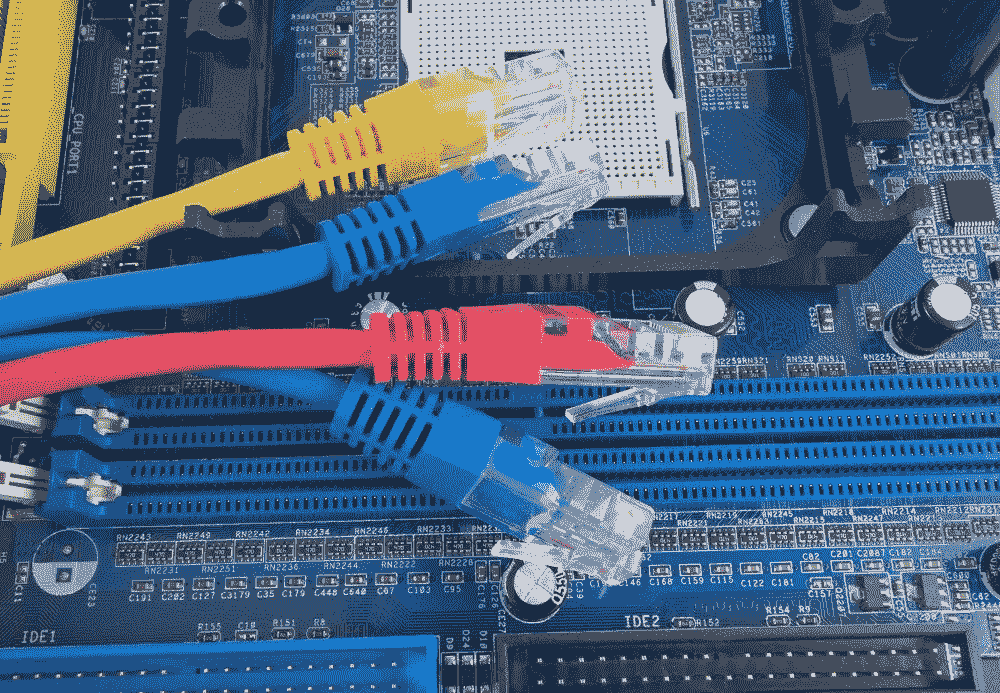
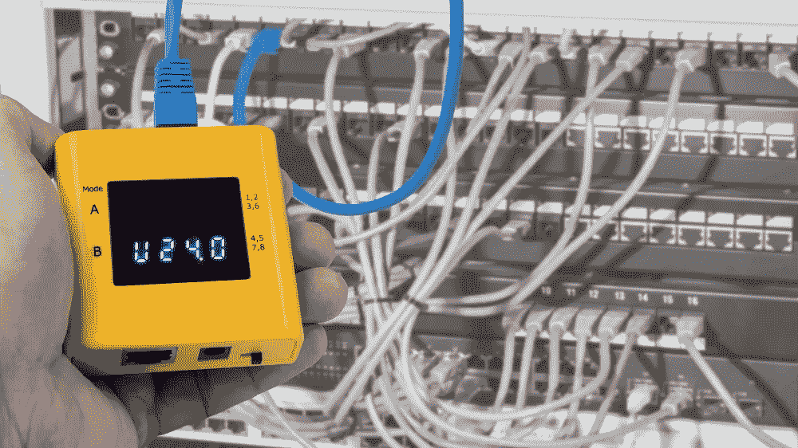
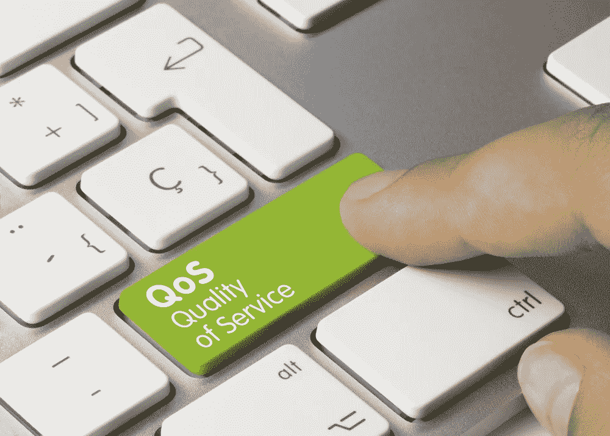

# VoIP 网络的四个基本特征

> 原文：<https://medium.com/hackernoon/the-four-essential-features-of-a-voip-ready-network-6dcab6f4d7b5>

Photo: everythingpossible / Adobe Stock

在小企业的世界里，所有运营阶段的效率都是必须的。这就是为什么许多小公司试图从他们花在必要的办公技术上的每一分钱中榨取尽可能多的用途。然而，任何曾经为小型企业管理技术的人都会告诉你，在成本节约和纯粹的愚蠢之间有一条细微的界限(如果你问小型网络管理员他们使用一体化 Windows Small Business Server 的体验，你可能会得到一些特别悲惨的故事)。

尽管如此，当多用途技术以正确的方式部署时，它还是有很多优点。如今，市场上各种内部小型企业 VoIP 解决方案就是一个很好的例子。从像 [Asterisk](https://www.asterisk.org/) 这样的开源解决方案到 Digium 和 Xorcom 这样的公司的机架式 SBS 设备，有一种 VoIP 系统可以满足任何需求，它们都可以与现有的计算机数据网络集成。

除非他们没有。或者受到性能问题的困扰。或者当他们使现有的互联网连接过载时。

事实上，给现有的小型企业计算机网络增加 VoIP 功能并不是一件即插即用的事情。需要进行一些认真的容量规划，并且在大多数情况下，需要对现有硬件进行一些升级或重新配置。为了帮助任何小型企业网络管理员完成这项具有挑战性的任务，以下是 VoIP 就绪型企业网络的 4 个基本特征。

# 没有亚千兆网络

Photo: AVD / Adobe Stock

VoIP 网络的第一个基本特征是速度——而且是大量的速度。如果你打算使用公司的计算机网络来处理语音和数据，它必须有足够的吞吐能力。在大多数情况下，这意味着一个由 [Cat5e 或 Cat6 电缆](https://www.bittree.com/blogs/get-connected/difference-between-cat5e-and-cat6)、千兆位交换机和无集线器(如果可能)构建的网络。拥有全千兆连接将有助于避免传输瓶颈和减少网络延迟，这可能是稳定 VoIP 操作的杀手。

# PoE 功能

Photo: KPixMining / Adobe Stock

在大多数情况下，VoIP 商务电话系统利用桌面电话，这些电话被设计成从它们的以太网连接中获取能量。这种电力必须由一种称为电力注入器的设备提供，该设备与每部电话串联，或者必须来自包括以太网供电(PoE)功能的网络交换机。在大多数情况下，最好升级网络交换机以支持 PoE ( [或更好的 PoE+](/@AriaZhu/poe-vs-poe-which-is-better-for-you-4e83d2a3f126) ，这是一种更新、更通用的标准)，因为在商业环境中支持无数的电源注入器可能会变得复杂。将 PoE 内置到网络交换机中，可以远程管理和排除连接到系统的每部电话的电源问题，为网络管理员节省了大量时间。

# QoS 支持

Photo: momius / Adobe Stock

当过多的需求来自互联网活动、文件传输和 VoIP 流量的组合时，即使是千兆位网络也会变得不堪重负。为了确保通话不会掉线、质量下降或根本无法连接，有必要实施一个服务质量(QoS)系统，在网络需求高时优先考虑 VoIP 流量。大多数小型企业级路由器和硬件防火墙将包括 QoS 特性，这使得标记 VoIP 数据并优先考虑其在企业网络上的传输成为可能。诀窍在于 QoS 配置没有统一的标准，因此有必要了解企业特定硬件上存在的控制。这里的概念概述[是一个很好的起点。](https://www.howtogeek.com/75660/the-beginners-guide-to-qos-on-your-router/)

# 分段网络

Photo: ArtemSam / Adobe Stock

到目前为止，很明显，VoIP 部署的大部分网络需求都围绕着确保语音流量到达正确的目的地，而不受其他网络流量的干扰。在理想的环境中，最好将这一想法更进一步，将 VoIP 连接与网络的其余部分完全隔离开来。一种方法是[利用虚拟局域网(VLAN)技术](https://www.lifewire.com/virtual-local-area-network-817357)在交换机级别创建端口组。这就形成了一个单独的、独特的网络，专门用于语音通信。当然，这只有在没有其他设备将与 VoIP 电话共享物理以太网连接的环境中才有可能(小企业似乎喜欢带有内置以太网端口的 VoIP 电话)，因此您的里程可能会有所不同。

# 把所有的放在一起

Photo: Brian Jackson / Adobe Stock

尽管 VoIP 部署的完整网络要求列表会因系统的品牌、类型和规模而异，但任何具备上述四个特征的网络都应该能够处理您能找到的任何 VoIP 硬件。有了功能强大的基础设施组件，连接或呼叫稳定性应该没有问题，并且有足够的扩展空间。然后，管理员可以把通过取消单独的语音网络节省下来的钱交给 headsetplus.com，并拿起一个漂亮、舒适的耳机来处理任何新技术投入生产后总是会出现的无数支持电话。毕竟，再多的计划也不能弥补用户的错误——所以在处理它的时候，你至少可以让自己舒服一点。