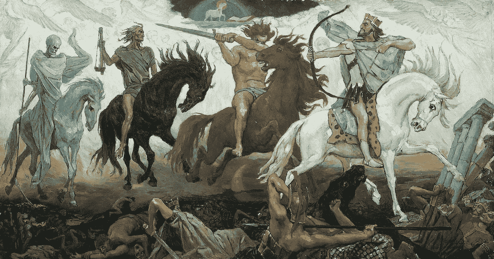

# Cryptocalypse 的四骑士

> 原文：<https://medium.com/hackernoon/the-four-horsemen-of-the-cryptocalypse-33acee1d79ac>

虽然随着我们进入 2019 年，加密行业表现出强劲的采用和发展，但 Cryptocalypse 的四名骑士宁愿看着[区块链](https://hackernoon.com/tagged/blockchain)弯曲膝盖，或按照他们的意愿弯曲膝盖。

*Four Horsemen of the Apocalypse* — **Conquest, War, Famine & Death** (1887) by [Victor Vasnetsov](https://en.wikipedia.org/wiki/Victor_Vasnetsov)

一个世界末日是大多数经历过(或幸存于)2018 年的加密投资者都熟悉的一个词。它本身并不是一种感觉，但如果是的话，它是当你…