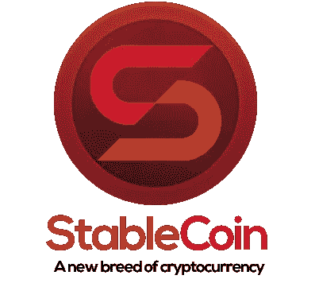
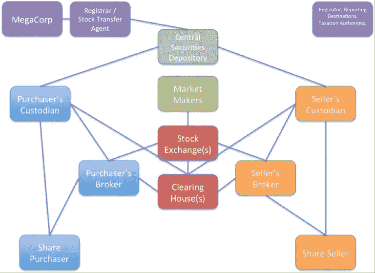

# 看好 BTC 和密码行业的根本原因

> 原文：<https://medium.com/hackernoon/the-fundamental-reasons-to-be-bullish-on-btc-and-the-crypto-sector-7d5560425a28>

Bitcoin bullishness

漫长的冬天过后，乐观情绪又回到了秘密世界。果然，我也有这种普遍的感觉…尽管原因大不相同。

# **那么，最近的加密挤兑背后的真正原因是什么？**

投资者指出，由于全球地缘政治紧张局势，中国人担心资本管制，并普遍逃往安全的*。尽管这两个动机很可能是(暂时的)同时存在的原因——这也顺便增加了短期投机激增和痛苦的*洗盘*的风险——但在这个漫长的冬天，我的乐观从未消退，而且它更基于长期因素，因为它取决于**基本面因素**。*

> ***简而言之，推动增长的是机构资金——越来越被该行业吸引——并将继续如此。***

***机构资金的长期规划分配通过向行业提供新服务来实现。与上个月的暂时/投机性避险行为相比，这显然是一个重要得多的长期看涨驱动因素。***

## ***机构投资者的情绪越来越积极***

**

*[世界上最大的资产管理公司之一的富达投资](https://www.fidelity.com/)，[最近宣布](https://www.bloomberg.com/news/articles/2019-05-06/fidelity-said-to-offer-cryptocurrency-trading-within-a-few-weeks?srnd=cryptocurrencies)将开始交易 BTC 作为其机构客户群。他们清楚地看到了潜力。在最近的一项调查中，46%的机构客户表示愿意投资加密技术。尽管 BTC 当时比 2017 年的高点下降了 80%。令人惊讶？不尽然，机构投资者考虑的是长期，较少受到短期价格波动的影响。*

> *尽管有直言不讳的批评，高盛还是悄悄地投资了加密公司 Circle。现在，Circle 正在发行一种新的硬币，USDC。*

## ***正在创建新的稳定副本***

**

*摩根大通也宣布了新的 JPMCoin。这是重要的一步。稳定的硬币是实现从法定资金到加密代币无摩擦过渡的基础。如果没有值得信赖且运转良好的稳定银行，银行业就无法吸引机构资金。*

*这里的问题主要是主观的，而不是技术的。我们能相信稳定币的发行者吗？我们能相信资金会被隔离吗？我们能相信硬币是完全由法定货币支撑的吗？*

*[系绳](https://tether.to/) (USDT)故事具有启示性。抛开个人观点不谈，事实是，该公司最新的[官方声明指出，已发行的](https://www.bloomberg.com/news/articles/2019-04-30/tether-says-stablecoin-is-only-backed-74-by-cash-securities)硬币的支持比例为 74%，尽管该公司一直坚称，这些硬币是由法定基金 1:1 完全支持的。*

*随着泰瑟斯的信誉受损，jpm coin——或者说高盛的 Circle-USD coin——非常有必要将投资引入该领域。*

## ***STOs 和 STexchanges 来了***

*慢慢地，是的，但这是打开风险投资部门和房地产部门投资大门的关键，并创造了可以交易令牌化证券的监管市场。*

> *[债券/债务的令牌化已经是事实](https://hackernoon.com/the-first-sto-milestone-is-german-bitbond-issues-the-first-bafin-approved-security-token-bond-70925e61f2d)。但在大多数司法管辖区，实物资产和股票的令牌化需要克服监管障碍。*

*尽管如此，一些国家正在做准备，其余的国家迟早会被迫效仿。[一项新的监管招股说明书制度也将在欧盟生效](https://hackernoon.com/the-new-growth-prospectus-regime-a-potent-instrument-for-security-token-offerings-9acd9734602f)，这将促进投资流入该领域。*

## ***面向机构投资者的新托管、清算和结算服务正在建立**。*

*与传统金融部门的托管、清算和结算链的复杂性相比，自托管、无摩擦的点对点转移、轻松清算和几乎即时的加密交易结算通常被吹捧为巨大的好处和优势(见下图)。*

**

*Source: Richard Gendal Brown — [*A simple explanation of how shares move around the securities settlement*](https://gendal.me/2014/01/05/a-simple-explanation-of-how-shares-move-around-the-securities-settlement-system/) *system* — 5.1.2014*

*我倾向于同意…但只是对我们个人而言。*

*该行业能够以指数级增长，只能归功于遗留金融部门将投入的数万亿资金。机构资金确实需要机构级的托管、清算和结算服务来运作，比如野村证券、摩根大通、BNY 和北方信托感兴趣的服务和 T2 富达开始提供的服务。*

*显然，在像 CX 四重奏这样的事件发生之前，机构资金将在一旁观望。*

*毫无疑问，这意味着传统金融领域的一些复杂性(见上图)也将在加密领域复制，DTCC、Clearstream 或 Euroclear 之类的机构将是必需的，但机构资金没有其他操作方式。*

*举例来说，在 BitGo 最近宣布的服务[中，人们认识到所有传统保管、清算和结算服务都适用于加密领域:](https://www.bitgo.com/)*

*-一方作为买方和卖方的受托人、保管人和结算人*

*-资产托管在独立账户中(冷藏)*

*-首先完成交易的离线结算，然后进行在线对账*

*-双方必须在受托人处有账户，以实现各自头寸的无摩擦清算和结算*

## ***结论***

*此类新服务为机构投资者解决了基本的运营问题和风险。唯一不能排除的风险是托管人的偿付能力风险。但这是遗留金融体系习以为常的风险，将通过更严格的监管、资本要求和保险来应对。*

*这是否意味着*太大而不能倒*的问题——这是发明比特币协议的核心动机之一——也将成为加密领域的一个问题？*

*可能是的，但至少只对大男孩。让他们按照自己喜欢的方式去玩。我们个人可以继续玩去中心化的，点对点的，自我监管的游戏。但是——最重要的是，尽管每天都有批评——大男孩喜欢加密游戏，他们想成为它的一部分，想把它做大，这样他们就可以用它赚很多钱。*

*因此，他们将调动他们的万亿，他们将投入巨资设计一个适合他们的基础设施来交易加密令牌，这一投资浪潮将提升所有船只。这将不可避免地反映在 BTC 和所有相关密码的升值上。这一进程正在进行，不可逆转。*

*这是我们长期以来非常非常看好这个行业的真正原因。*

*********************************************************************

****如果你喜欢这篇文章，请在左下角“鼓掌”x 次，这样它就会被更多的人分享。多谢****

*#比特币# security tokens # bianconiandrea # crypto # think block tank # sto # stable coin #保管#结算#清算#系绳*