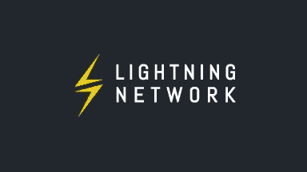
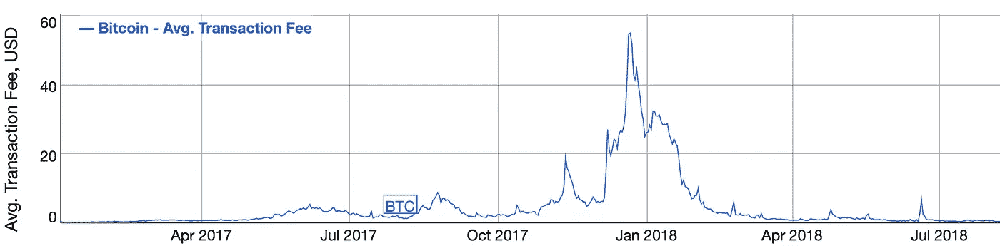
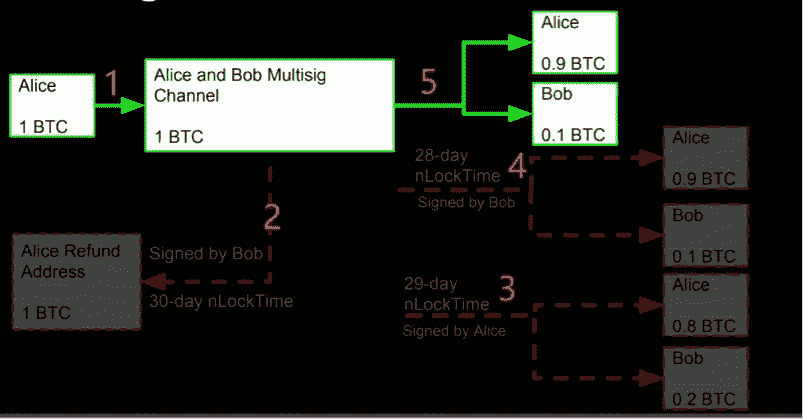
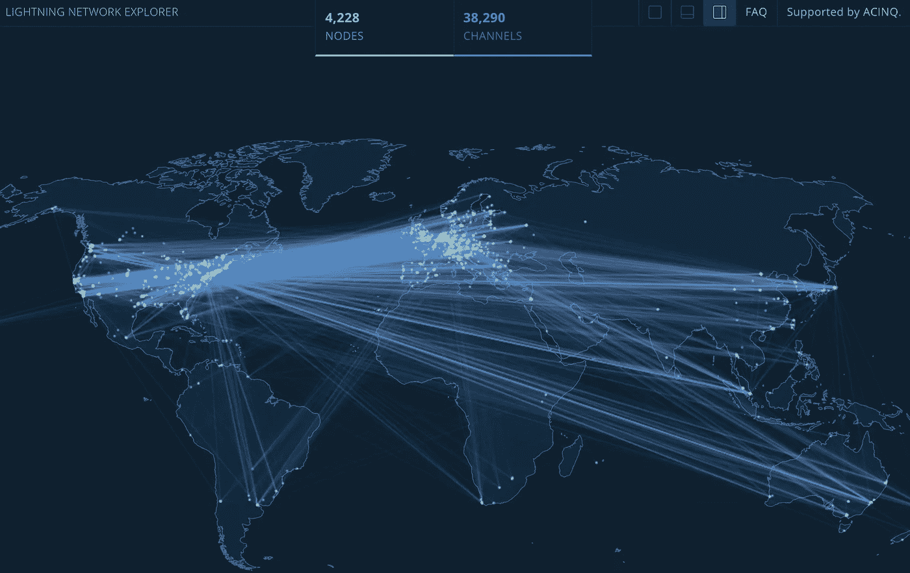
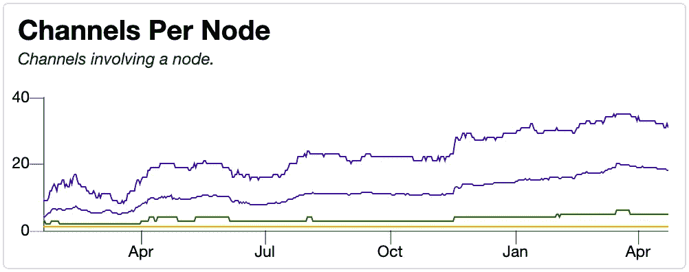

# 比特币可扩展性的未来:闪电网络和替代方案介绍(LBTC 和 BCH)。

> 原文：<https://medium.com/hackernoon/the-future-of-bitcoin-scalability-an-introduce-to-lightning-network-and-alternatives-lbtc-bch-bf4aabdbae90>

# **摘要**

我们许多人可能面临一个问题是，对比特币力量进行链上可伸缩性总是会损害去中心化的程度。因此，正在尝试一些关于链外方法的可扩展性的努力，以解决比特币交易的处理能力差和手续费高等问题。**闪电网**，通过建立基于密码算法的支付通道，使得链上资源只在通道建立或关闭时被消耗，双方可以免费进行任意数量的交易。

本文介绍了闪电网的两种基本交易模式——**RSMC**和 **HTLC** ，并解释了为什么闪电网作为一个链外可扩展的平台，也能达到与链上交易同等程度的不可信。

事实上，我们不得不承认，然而，闪电网络所需的基础设施仍然缺乏，维护支付通道的成本一直居高不下，这使得闪电网络极有可能在发展中产生大规模的专业化金融机构，就像我们今天看到的那些银行一样。**但反过来说，这些相当集权的机构恰恰是比特币从一开始就反对并试图取代的**。正是因为这个原因，闪电网络也引发了比特币支持者的激烈争论。

**闪电比特币**或 **LBTC** 作为比特币的分叉版本，为解决比特币可扩展性问题开辟了新的尝试。它以一种创新的方式实现了巨大的可扩展性，将 DPOS 共识机制与原始的比特币-UTXO 模型相结合。这种设计虽然在某种程度上不可避免地妥协了相对于比特币式 POW 的去中心化水平，但确实在工作效率和系统健壮性之间取得了平衡。

LBTC 认为，在比特币 POW 机制(如 BCH)的基础上扩大区块容量将产生微不足道的边际效益，同时可能带来严重的潜在风险。然而，链外可扩展性(如闪电网络)可能会再次将比特币生态系统送回由集中式中介主导的传统轨道。就比特币可扩展性问题而言，以闪电网络为代表的链外方法和以 LBTC 为代表的链内方法可能是我们讨论的最有希望解决问题的两种方法。

# **1。比特币的可扩展性问题**

**1.1 比特币交易的 TPS 和手续费问题**

比特币块的大小在 2M 是固定的，大约每 10 分钟可以生成一个块。紧接着，我们先来计算一下比特币 TPS:

TPS(BTC)

=块大小/发送大小/ (10 * 60)

= 2 * 1024 * 1024 / 500 / (10 * 60)

≈ 7

我们现在很清楚，比特币平均每秒可以处理大约 7 笔交易。再加上随着使用比特币的人数增加，比特币交易肯定会激增，极有可能造成交易拥堵。当这种拥塞发生时，那些待处理的事务将按等待顺序排队，同时给用户带来问题。

此外，交易拥挤还可能带来另一个可怕的后果，即交易费用激增。我们知道，比特币交易是由矿工打包的，他们通过采矿奖励和交易费获得报酬，因此他们总是有动力提高他们将获得的交易费。令人欣慰的是，用户期望支付更低的费用，而矿商追求更高的费用，这种情况将使市场在一个平衡的状态下运行，保持可接受的费用水平。但如果出现交易拥堵，市场的供需平衡就会被打破，此时的矿商可以要求更高的费用(因为矿商理论上有权选择优先化和打包交易)。

Data from bitinfocharts.com/

历史数据(上面的纵轴代表基于美元的交易费用)显示，单笔比特币交易费用在 2017 年底达到峰值，超过 50 美元，甚至在新年前后的两个月内都保持在 15–20 美元。但在非活跃期，交易费一般可以维持在 0.3 美元到 1.5 美元之间。

虽然“淡季”费用似乎可以接受，但人们不能满足于现状。毕竟，比特币作为一种加密货币，预计将走向广泛应用，因此应该能够处理大规模交易。正因为如此，比特币的可扩展性问题受到了批评者的广泛指责。

**1.2 比特币的链上可扩展性**

如上所述，比特币追随者确实已经意识到了比特币可扩展性的严重性和紧迫性。但是怎么做呢？这是争议的导火索。

首先是链上可扩展性。顾名思义，链上可扩展性，就是通过修改共识协议的参数来达到更高的 TPS 数据。当然对于比特币来说，扩大分块时间，增加分块大小，减少交易的计算占用，都是理论上可行的尝试。然而，作为一个共享最大市值的加密货币系统，比特币的任何细微修改都可能具有如此大的影响和深远的意义，我们应该极其谨慎。事实是为了防止全节点高门槛造成的去中心化损失，比特币几乎不可能缩短阻断时间。因此，我们不得不将注意力转移到块大小和事务的计算占用上来寻找出路。

关于交易的计算占用，比特币框架已经确定了交易的格式和内容，留给进一步减少的空间相当有限。尽管在 SegWit 升级后，交易的结构得到了某种程度的优化，但变化仍然不够显著。

最终，我们转向**块大小**。最初的比特币协议将块大小固定在 1M，在互联网基础设施飞速发展的时代，这似乎并没有给我们造成任何压力。一些支持扩大街区规模的人建议提高或取消街区容量限制。然而，事实上，这正是比特币分叉版本之一的比特币现金(BCH)的实际做法。BCH 直接将区块大小增加到 32M，并声称未来会继续增加。SegWit 的升级也将比特币的块大小提高到了接近 2M。虽然这种可伸缩性的想法是否真的可行还有待讨论，因为块大小扩展后产生的好处确实有限，但是对去中心化的损害是相当明显的。

这里我们不妨做一个简单的比较:

比特币现金(BCH)将块大小增加到 32M，与比特币(BTC)相比可以实现 16 倍的 TPS 提升。

闪电比特币(LBTC)，通过基于 UTXO 的 DPOS，可以实现约 200 倍于比特币(BTC)的 TPS 升级。

然而，BCH 在增加块大小的同时也会提高 P2P 网络中满节点的阈值和块流动的效率和速度。这是绝大多数比特币原教旨主义者所担心的。出于这个原因，比特币(BTC)必须密切关注不断增加的区块大小，并且一直不愿取消限制。

**1.3 另类想法**

既然我们从链上扩展中获得的收益如此有限，潜在的损害又如此可怕，那么如果我们把注意力转向非链上的可伸缩性呢？

答案肯定是肯定的！我们可以用两种方式解决非链上可伸缩性:链外或跨链。

先说后者，跨链。为什么要“穿越”？因为它指的是将拼接的比特币网络绑定到更高 TPS 的区块链，以实现高得多的 TPS。但要做到这一点，需要一个公认的、可行的跨链技术支持和一个子链生态系统解决方案。这有点尴尬，因为我们将不得不推出一个全新的区块链。

现在，前者。到目前为止，离线可伸缩性作为一个高度可行的解决方案是最重要的。著名的闪电网络就是这样一个解决方案。

链外可伸缩性意味着事务完全在链外完成，不会占用链上资源。在一系列交易完成后，最终结果将被传送到 chain 上。简单来说，你可以简单的把它想象成一个小银行，帮你进行一系列的转账交易。交易完成后，余额数据将定期发送到 chain。

我们将在下一节中更详细地描述闪电网络的运行机制，并评估这种扩展是否真的有效。

# **2。** **雷电网络的基本工作原理**

**2.1 支付渠道**

我们中的许多人在接触闪电网络时可能会有点困惑，可能会问:既然闪电网络只处理外链交易，我们怎么能信任它呢？

好问题！如果你这么问，对我来说很明显，至少你对区块链有所了解。Lightning Network 确实以链外方式完成交易，但我可以向您保证，它的运行机制是高度可保证的，因为 Lightning Networks 依靠一系列密码安全解决方案来完成支付通道建立、支付和余额变化，甚至节点路由等事情。

这里来了一个新名词:**支付渠道**。听起来可能有点抽象，但你可以这样理解:它是两个支付方之间开立并维护的账户。当一笔交易发生时，它将被记入这个账户。在一段时间内进行了几次交易后，账户的余额将被登记在比特币链上。

闪电网就是这样一个支付渠道网络。除了支付通道的建立和关闭要在链上交易中完成，其余都在链外完成。基于此，闪电网实现了更好的链外可扩展性，大大扩展了比特币的交易潜力。

**2.2 支付渠道和 RSMC 交易**

支付通道的开通、关闭和余额变动都是通过一个叫做 RSMC 的交易来实现的。

RSMC 或可撤销序列到期合同，意味着当序列到期时，合同将变得可撤销。它通过包含一系列事务来实现目标功能。

Why Always Alice and Bob?

我们现在以 Alice 和 Bob 之间的转账为例来说明支付通道建立的过程。

下面是整个通道的建立过程:

*步骤 1* : Alice 和 Bob 各自拿出自己的 BTC，建立一个资金交易。该事务的输入是他们持有的确切的 BTC，输出是 2/2 多重签名条件。该资金交易尚未由两人签署，此时未播出。

*第二步*:爱丽丝创建了两个承诺交易。

第一笔交易的输入花费了 Bob 签名的资金交易(Alice 此时没有签名)。该事务包含两个输出结构，第一个需要 Alice 和 Bob 的多个签名(Alice2 表示 Alice 的另一个私钥)，第二个需要 Bob 的签名。

第二个事务是指向第一个事务的第一个输出。它首先由 Bob 签名，Bob 的输出指向 Alice 的地址。该事务有一个顺序条件，这意味着只有在前一个事务已经证明了顺序确认之后，该事务才能够被打包到块中。

*步骤 3* : Bob 也创建了两个承诺事务，其结构应该与 Alice 创建的完全对称。

*第四步*:完成上述承诺交易设置后，各方签署资金交易并广播。

这里有一个简短的解释:

资金交易的目的是允许支付的每一方取出一定数量的资金来建立通道。随之而来的承诺使得双方可以单方面要求退款。在我们的示例中，Alice 和 Bob 都有权单方面发起退款。但同样值得注意的是，谁先触发退款将不得不等待一段时间，然后另一个人才能立即获得退款。因此，爱丽丝和鲍勃都可以随时取消渠道和终止合作，保证他们的资金安全。

**2.3 支付渠道余额更新**

既然 Alice 和 Bob 已经创建了支付通道，那么如果他们想互相转账，还需要什么呢？

下面是待办事项:当他们同意发起一个交易时，他们首先要共同建立另一套承诺交易来代替上一套，然后更新交易内容中的余额信息。

但是另一个问题就弹出来了:之前的承诺交易还在，双方都交换了签名。怎么才能丢弃呢？

我们确实有一个非常巧妙的解决方案。当双方创建一个新的承诺事务时，我们要求发起者的签名对应一个新的私钥(我们不妨称之为 Alice3/Bob3)。在这种情况下，只要 Alice 告诉 Bob 她以前的私钥 Alice2，Bob 就可以将以前的事务修改成一个新的惩罚性事务，其输出可以是对他/她自己的，去掉了顺序限制。然后，如果 Alice 私下签署了承诺交易，Bob 可以广播修改的交易，以通过造成她的金钱损失来执行惩罚。因此，一旦 Alice 告诉 about Alice2，她就声明放弃之前的提交事务。这同样适用于鲍勃。

有点复杂，不是吗？不用麻烦了。我们来得出一个简单易懂的结论:当交易余额需要更新时，交易双方可以建立一个新的承诺交易，保证任何一方都不能单方面篡改资金余额，企图获利。

至此，相信你的疑惑已经很大程度上解决了。关联交易的建立可以通过建立、关闭和改变支付渠道余额来实现，即使双方对彼此的相互信任并不太大。所以，链外支付渠道完全可以不可信。

# **3。闪电网络中的节点路由**

**3.1 为什么需要？**

支付通道的建立保证了任何两方都可以创建一套离线账户来记录交易余额的变化，并在无信任框架下实现交易。

然而，还有一个问题需要解决。我们知道小额支付经常发生，涉及的各方并不总是固定的。这是否意味着任何两个人在需要支付或转账时都必须在他们之间建立这样的支付渠道？绝对不行！如上所述，支付渠道的建立和关闭都是通过链上交易实现的。如果我们的 Lightning Networks 用户必须在每次支付前与对方建立支付渠道，这将使解决方案与链上交易完全没有区别。这显然是荒谬的！所以，为了解决这个问题，我们需要在不同的支付渠道之间建立一个路由机制。

举例来说，假设 Alice 已经与 Bob 建立了支付通道，并且 Bob 也已经与他的朋友 Kevin 共享了支付通道。如果爱丽丝想转移一笔资金给凯文，鲍勃现在可以充当**托管人**。我们不再需要建立额外的支付通道，因为路径“Alice→Bob→Kevin”可以实现支付行为。

**3.2 支付通道路由和 HTLC 交易**

HTLC 或散列时间锁契约，顾名思义，是指由散列值和到期参数锁定的契约。

厌倦了这些极其复杂的技术解释？这是另一个简单的真实例子。

在上例中，我们发现了一条“爱丽丝→鲍勃→凯文”的路由路径。让我们继续假设爱丽丝需要支付凯文 1 BTC。

首先，Bob 制作了一个保险箱，将 1BTC 存入其中，然后交给 Kevin。Alice 也做了同样的事情，制作了一个类似的盒子，放入盒子 1BTC，然后交给 Bob。两个箱子的密码都是一样的，需要 Kevin 提供。凯文给出密码后，它将对任何人开放。

当交易正在进行时，Kevin 打开 Bob 的盒子，并通过提供密码获得 1BTC。鲍勃知道密码后，他可以对爱丽丝的盒子做同样的事情，并获得另一个 1BTC。

我们注意到 Bob 实际上在这个交易中充当了托管人，他使得 Alice→Kevin 交易得以实现。所以在这里，Bob 理论上收取一些佣金作为匹配两者之间交易的报酬是合理的。这当然很容易实现。例如，他只能在他的箱子里存 0.99BTC，剩下的 0.01BTC 作为他的交易佣金。

这个比喻可能不会完全发生在现实生活中，但可以大致解释 HTLC 的原则。如我们所见，HTLC 也不值得信任。这意味着我们可以放心地通过众多 RSMC 和 HTLC 合同的巨大网络支持链外的高频小额支付，而不用担心资金的安全。

# **4。闪电网络 vs LBTC:可扩展性之战**

**4.1 闪电网的一些评论**

不得不说，闪电网络是一个如此有才华和成功的想法，它至少已经在大规模实施的路上了。整个比特币社区现在都在密切关注它的实施，它内部的交易也证明了活力。

然而，目前的闪电网络离真正的大规模应用还有一段距离。在雷电网络中还可能存在几个非常值得关注的问题或方面:

1)雷电网络对**基础设施**的要求非常高。既然它把自己定位为高频小额支付的生态系统，那就必须有配套的设备和软件应用来支持网络所需的算法。但如果你仔细观察和审视目前的情况，你会发现，能够支撑网络的钱包很大程度上是集中式的，而不是真正去中心化的钱包。然而，将分散的钱包送到普通用户的完全和欢迎的接受，仍然有很长的路要走。在这种背景下，闪电网络的意义很容易受到质疑。

2)闪电网作为一种链外支付工具，对**中介**和交易双方的要求远高于链上同行。它特别要求中介在交易双方保持在线的情况下在线操作，并提供签名和建立 RSMC 和 HTLC 交易。这种模式对中介机构提出了挑战，如果他们的能力弱，规模不够大，他们就完全无法生存。相反，链上交易不需要太多的中介和节点，你甚至不必太担心，因为新推出的比特币交易将被扔进 P2P 网络，等待打包并继续生成区块。

Today’s LN Ecology Prosperity. Data from [https://explorer.acinq.co/](https://explorer.acinq.co/)

虽然我们经历了闪电网络的一些弱点，但必须指出，它的一些闪光的优点，如快速资金到达和低佣金必须得到承认。此外，由于闪电网络的链外结算，许多其他方面的优点，如交易隐私保护，也变得触手可及。

**4.2 深陷闪电网内部矛盾**

闪电网络确实引发了很多争议，其中最值得注意的是它重新鼓励了集中化的组织，然而，这正是比特币从一开始就反对的。

正如我们之前所讨论的，闪电网络需要依靠一些中间节点来匹配网络内部的交易方。这些中介机构(以下简称 Hub)需要不断提供在线服务，会见客户并为他们匹配交易，维护大量支付渠道，以及预留足够的 BTC 来满足移动需求。当闪电网出现时，整个网络必然需要一些大规模的、优秀的服务枢纽来匹配交易。

Nodes are evolving to Hubs? Chart from [https://bitcoinvisuals.com/lightning](https://bitcoinvisuals.com/lightning)

作为结算中心，Hub 甚至可以在信用风险的情况下也提供类似于传统银行提供的金融服务，例如为机构和个人客户提供预付款、交易结算、临时贷款甚至长期抵押贷款服务。唯一的区别是它是比特币的形式。在这个过程中，比特币已经退化为闪电网络中的结算工具，逐渐失去了资产属性，就像今天金融体系中的贵金属一样。

更夸张的是，Hub 在比特币分配和结算中的作用及其庞大的资金量，很可能导致监管部门对 Hub 施加各种约束。这些中心有朝一日将逐渐成为高度专业和持牌的金融机构，相应的监管部门也将为企业或个人经营这些中心设置高门槛。此外，这些大型中心有可能以多种方式纳入监管体系，如 BTC 资产持有的流动性、法定准备金率、对客户的信贷以及资产和负债的期限管理，就像监管机构监管的那些银行领域一样。

那么，这些比特币创造者从一开始就冷言冷语的枢纽和银行有什么区别呢？

更可怕的是，闪电网络可能会直接催生一个以 BTC 为**结算媒介**的在线金融机构体系，并加深托管对 BTC 交易的影响，尤其是在比特币的货币属性还不那么受大众欢迎的情况下。这实际上将是相当压倒性和可怕的。

**4.3 闪电比特币作为比特币可扩展性的另一种选择？**

作为**闪电比特币(LBTC)** 的卑微支持者，我有必要介绍一下 LBTC 关于可扩展性的思想。

关于可扩展性问题，LBTC 采取了一种相当另类的方法:它没有像闪电网络那样试图完全依靠离线托管来解决高频小额支付的问题，也没有像 BCH 那样继续致力于通过扩展块容量来改善 TPS。LBTC 认为，链外可扩展性违背了去中心化的原则，在 POW 机制下一味强调扩展块容量不过是在刺伤处贴上创可贴。

BCH 坚持不懈地扩大区块产能，以改善 TPS。这个想法在理论上当然是可行的。但是这种增长的边际效益非常低，因为当 BCH 将区间容量增加几十倍时，分散化的程度也将受到很大的威胁。

一些权力原教旨主义者可能会怀疑 LBTC 采用的基于 UTXO 的 DPOS 机制不够分散。我只能说，如果 BCH 的 TPS 可以达到 LBTC 的几分之一，它的分散程度肯定会下降到甚至不如 DPOS 的程度。如果 BCH 保持和 DPOS 一样的分权程度，它的 TPS 肯定会远远落后于 LBTC。

原因是巨大的块很难在 P2P 网络中流通，这将使 POW 挖掘生态不可逆转地收敛，并导致去中心化的崩溃。如果网络能够承受 BTC 从 100 万到 2M 的增长，那么从 2M 进一步增长到 1.28 亿几乎会将整个生态系统置于边缘。

我不是真的想去 BCH。BCH 的价值在于，它确实整合了相当多的计算能力，但它也可能过于依赖这些能力。关于实质性的可扩展性问题，我相信只有闪电网络和 LBTC 能够进入发挥的领域。但想必他们每个人都会在各自的领域取得成功。

**4.4 如果你不熟悉 LBTC…**

事实上，这份报纸不是为 LBTC 做广告的(因为我已经声明我是它的粉丝)。毕竟，它的知名度和受欢迎程度远不如 BCH 和闪电网络。但鉴于许多人可能会对 LBTC(闪电比特币)和闪电网络的概念感到困惑，我仍然需要在这里简要介绍一下。

LBTC 确实与闪电网络有一个相似的名字，但这与它没有任何关系。据 LBTC 团队介绍，该名称最初用于展示 LBTC 交易的快速确认速度，以及其迈向高频小额支付应用场景的愿景。所以，如果你之前混淆了，下次尽量避免混淆 LBTC 和闪电网络。

LBTC 创造性地采用了基于 UTXO 的 DPOS。它的团队认为 UTXO 是高度健壮的，所以不想放过 UTXO，**比特币**的本质设计。LBTC DPOS 有固定的闭塞时间，目前大约为 3 秒。LBTC 认为，这样的共识机制不仅可以保持一定程度的分权，而且可以实现 POW 完全无法企及的高速度和高效率。我个人认为 LBTC 可以被视为比特币的超级精简版，而基于 UTXO 的 DPOS 并不常见。有趣的尝试。

中本聪在比特币白皮书中已经明确定义，比特币**是一个点对点的电子现金系统**。LBTC 团队认为，实现这一愿景的最佳方式是在效率和比特币稳健性之间取得平衡，以在效率显著提高的情况下最大化边际收益。这主意不错。所以，请原谅我在这里把 BCH 作为一个反例。我只是尽可能直截了当地说服自己，这并不是比特币可扩展性前进方式的真正解决方案。