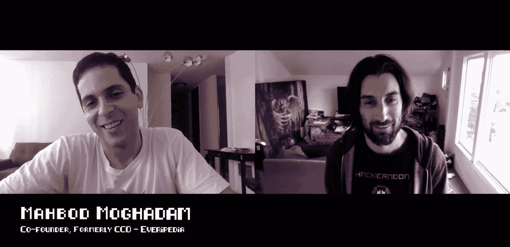

# Mahbod 的集中式互联网的未来

> 原文：<https://medium.com/hackernoon/the-future-of-centralized-internet-with-mahbod-674558dbb0fa>

[黑客午间播客](https://podcast.hackernoon.com/)第 52 集:采访连续创业者[、](https://hackernoon.com/@mahbodmoghadam)[天才](https://genius.com/)联合创始人 [Everipedia](https://everipedia.org/) 联合创始人兼 CCO ofMahbod Mog hadam。

## 在 [iTunes](https://itunes.apple.com/us/podcast/product-iteration-with-hacker-noon-interim-cto-dane-lyons/id1436233955?i=1000421970409&mt=2) 上听采访或者在 [YouTube](https://youtu.be/Aayu3SHrhMQ) 上看。

在这一集[中，Trent Lapinski](/@trentlapinski) 采访了 [Mahbod Moghadam](https://hackernoon.com/@mahbodmoghadam) ，他是 [GENIUS](https://genius.com/) 的联合创始人，也是 [Everipedia](https://everipedia.org/) 的联合创始人兼首席合规官，这是一个基于维基的在线百科全书。你会发现互联网的未来，区块链和 Mahbod 正在进行的项目。

“区块链的东西，计划似乎是摧毁中央互联网。而在中心化的互联网中，有些人似乎是在示爱”。

“他们是在试图拉拢人心吗？就像 1000 万美元的问题是如果有人要摧毁脸书？或者，脸书会像对待 Snapchat 一样，照搬别人开发的东西吗？”

“我的人生使命是让人们走出自己的隐私。你拥抱数字房地产”。*——马哈茂德·莫哈达姆*

 [## e52-mah BOD Mog hadam 的集中式互联网的未来

### 访问 https://www.indeedprime.com/hackernoon/翻转求职脚本，并立即加入访问简历…

podcast.hackernoon.com](https://podcast.hackernoon.com/e/e52-mahbod-moghadam/) 

制作和音乐德里克·伯纳德—[haberdasherband.com/production](http://haberdasherband.com/production?fbclid=IwAR2d8t0cNGHRm1ajmUNWKZ-TMUMawREhvIHSy54LKcOElf7v_TOvkAjZ78Y)

主持人:特伦特·拉平斯基—[https://trentlapinski.com](https://trentlapinski.com/)

*附:如果你喜欢新的* [*黑客午间播客*](http://podcast.hackernoon.com/) *，可以考虑在 iTunes 上给我们一个 5 星评价。*

## 还可以查看六月份的[头条](https://hackernoon.com/archive/2019/06)、[最新报道](https://hackernoon.com/latest-tech-stories/home)和[今日主页](http://hackernoon.com/)。