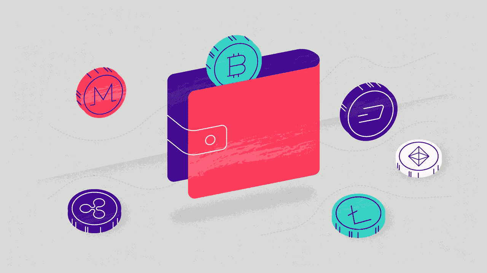
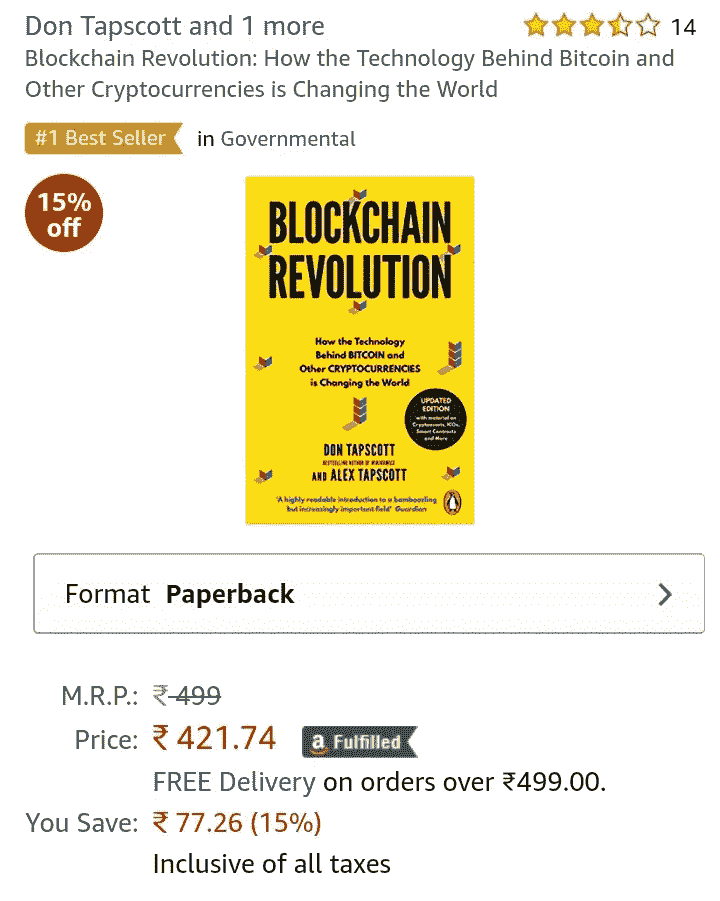
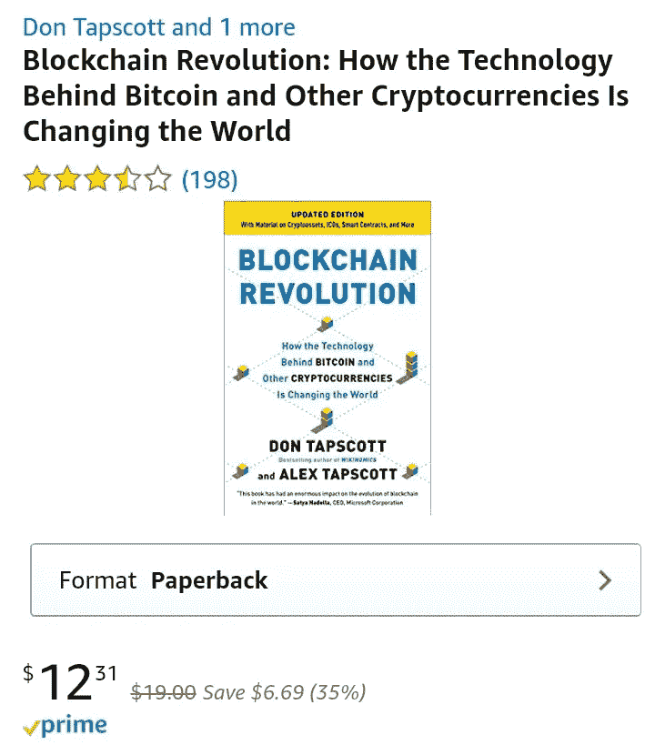
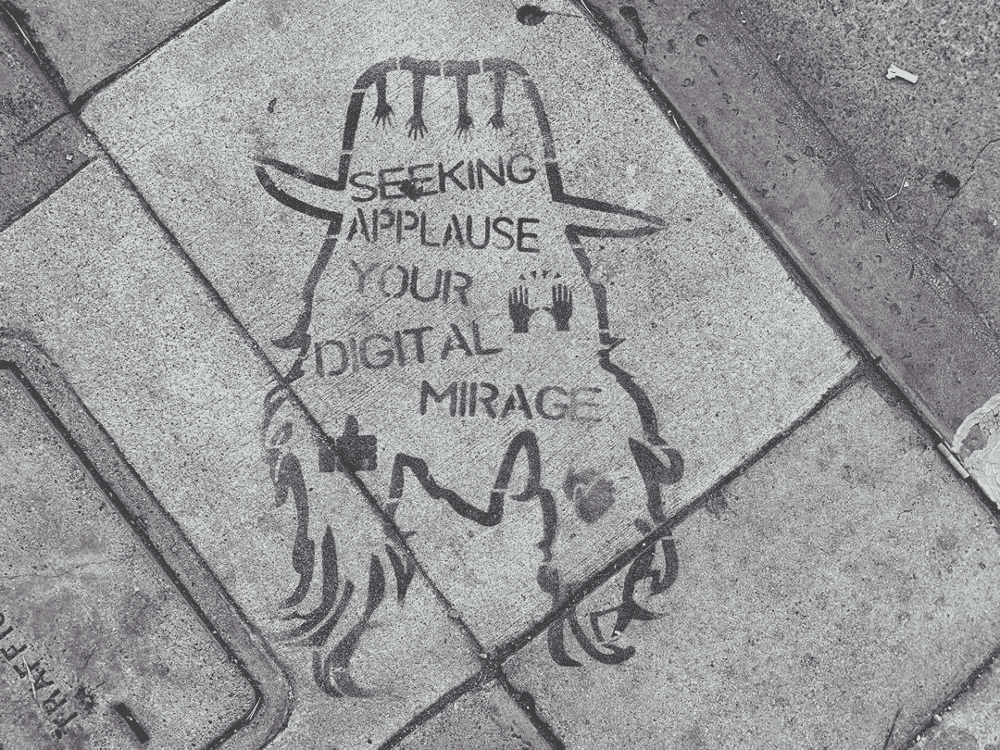

# 加密钱包的未来

> 原文：<https://medium.com/hackernoon/the-future-of-crypto-wallets-dbfe684e01a8>

[Source](https://www.digipulse.io/articles/cryptocurrency-wallets/)

## 问题

到 2018 年底，很明显“区块链会留下来。”在这个领域已经有了很多发展，企业现在正在积极研究利用区块链的优势来改善他们的业务。

在[区块链](http://hackernoon.com/blockchain)平台上创建一个令牌现在相对容易。通过遵守适当的令牌标准，我们可以轻松地创建令牌。例如，您可以在[以太坊](http://hackernoon.com/ethereum)平台上创建一个 ERC20 令牌。

在撰写本文时， [CoinMarketCap](https://coinmarketcap.com/) 列出了 2073 种加密货币。随着大型企业进入这一领域，这一数字在未来肯定会增加。

想象一下必须拥有和使用多种加密货币/代币。用户很难记住所有这些名称及其用例。由于这个原因，人们可能更喜欢使用法定货币，而使用加密货币的整个目的也就落空了。

在这篇文章中，我试图解决这个问题。

## 动机

2018 年 8 月去印度度假期间，我想购买一本书。打开亚马逊后，由于我所处的位置，我发现价格是以“印度卢比”(印度的法定货币)而不是美元列出的。

amazon.in(Amazon’s domain in India) list prices in Indian Rupees

amazon.com (Amazon’s domain in USA) list prices in US Dollars

由于我的地理位置发生了变化，货币也发生了变化。
通过绘制类似的关系，如果钱包中的加密货币根据正在使用的服务的位置自动变化，会怎么样。

找到了，我找到了！

## 解决办法

让我们展望未来。每个公司都将拥有自己的代币/硬币。您可能需要购买:

1.  一家受欢迎的咖啡店的“咖啡硬币”咖啡。
2.  熟食店的“三明治硬币”三明治。
3.  一家受欢迎的甜甜圈店的“甜甜圈硬币”甜甜圈。

为了简单起见，让我们假设所有这些硬币都是建立在以太坊区块链平台上的。作为消费者，你必须购买这些硬币，并把它们存在你的钱包里。

现在让我解释一下钱包的设计:

1.  如前所述，你将购买所有这些硬币，并将它们存放在钱包中。
2.  进入咖啡店的那一刻，借助移动设备/智能手机的位置，钱包会立即“弹出”在应用程序的主屏幕上，向您显示“咖啡币”。这意味着你必须用这枚硬币在这家商店购物。
3.  喝完咖啡后，你可能想去熟食店买个三明治。当你进入熟食店时，这个钱包会根据从 GPS 接收到的数据来感知位置。现在主界面会弹出“三明治币”。这将帮助你知道你必须使用这种加密货币支付你的三明治。
4.  现在让我们来看另一个场景，你在一个自助餐厅里，所有的商店都在同一个屋檐下。那么每个品牌都会有一个唯一的二维码。当从钱包中扫描这个二维码时，相应的硬币就会弹出，你就可以无缝地进行支付了。
5.  有些情况下，这些建议可能不准确。在此类事件中，用户可以发送详细说明错误的反馈。这将有助于建立一个更好的加密货币推荐系统。

因此，我们不必担心记住我们投资组合中的加密货币列表。此类应用将改善用户体验，吸引更广泛的用户群。

只有让加密货币更容易使用，Crypto 才能获得主流的成功。

走向安全光明的未来，干杯！

下面这段引语激励我写这篇文章:

> "谈到抚养孩子，你必须着眼于未来。"~艾美

感谢您阅读我的文章。

**注:**
本文来自莱特州立大学智能实验室在裴勇博士指导下完成的研究工作。

莱特州立大学:[https://www.wright.edu/](https://www.wright.edu/)计算机科学与工程系:[https://www . Wright . edu/degrees-and-programs/profile/Computer-Science](https://www.wright.edu/degrees-and-programs/profile/computer-science)
裴勇俊博士:[https://people.wright.edu/yong.pei](https://people.wright.edu/yong.pei)

*如有任何问题，欢迎随时给我发* [*邮件*](mailto:pamanalionline@gmail.com) *。也可以通过*[*Linkedin*](https://www.linkedin.com/in/amanali1/)*联系我。也可以关注我的* [*推特*](https://twitter.com/aliandco) *。*

*为了入门区块链阅读我的* [*文章*](https://hackernoon.com/blockchain-learning-path-2019-e54d6763dd6c) *发表于*[*hacker noon*](https://hackernoon.com/)*。*

