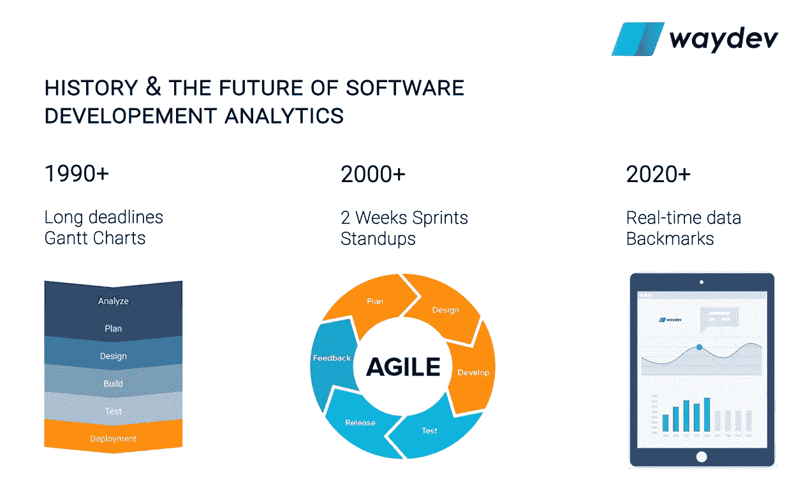
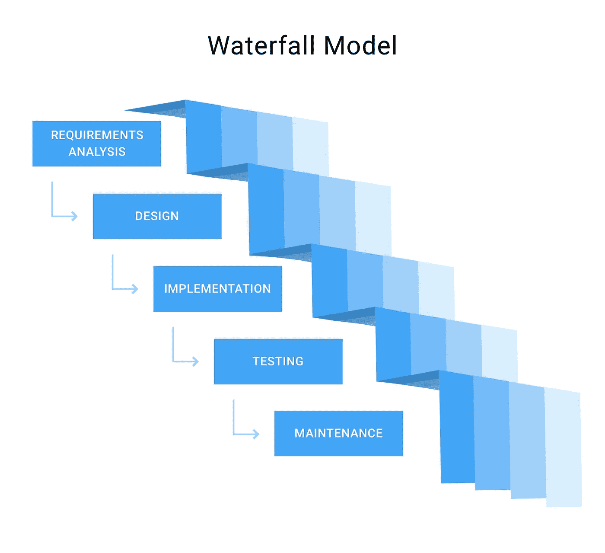
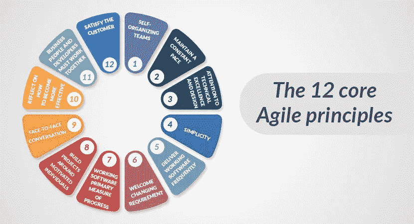
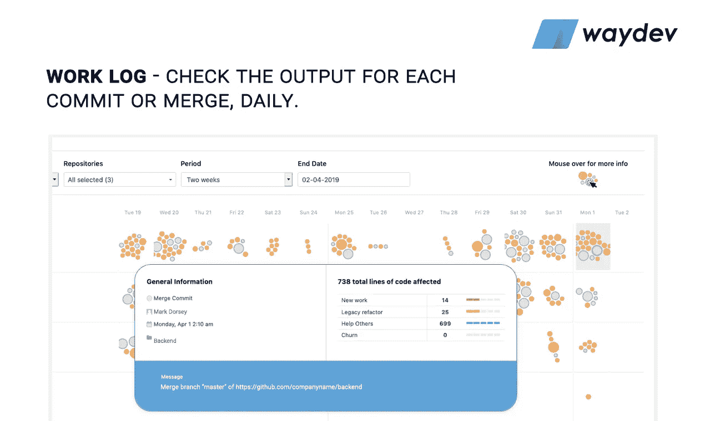

# 开发分析的未来

> 原文：<https://medium.com/hackernoon/the-future-of-dev-analytics-6e0e5bb91b1b>

## 瀑布 vs 敏捷 vs 数据驱动:工程领导者如何跟踪他们的团队

# 1990+瀑布法

> 什么是瀑布项目管理方法论？

瀑布式项目管理是一个连续的、线性的项目管理过程。它由几个不连续的阶段组成。在前一阶段完成之前，没有阶段开始，并且每个阶段的完成都是终结性的— **瀑布管理不允许您返回到前一阶段**。重温一个阶段的唯一方法是从第一阶段重新开始。

瀑布过程模型可能是最流行的软件开发方法。全世界的团队和公司都使用它来管理他们的项目。但是，还是有程序员想了解更多关于它的特性。

瀑布通常被称为软件开发的传统方法。它起源于上世纪 50 年代。该方法论最初用于硬件开发，但在软件开发发明后，应用于这个行业。今天，瀑布仍然是最流行的过程模型之一。它受到一些喜欢使用敏捷方法的程序员的强烈批评。然而，大多数软件开发公司仍然使用瀑布，因为它是众所周知的。

可以想象，在瀑布系统中，适当的规划是必须的。一个项目的需求必须在一开始就很清楚，而且参与项目的每个人都必须清楚地知道这些需求。每个团队成员还应该了解他们在项目中的角色以及这个角色需要什么。

# 瀑布项目管理的阶段

系统的具体阶段因来源不同而有所不同，但通常包括:

# 1.需求收集和文档记录

在这一阶段，你应该收集关于这个项目需要什么的全面信息。您可以通过各种方式收集这些信息，从采访到问卷调查到交互式头脑风暴。在这个阶段结束时，项目需求应该是清晰的，并且您应该有一个已经分发给团队的需求文档。

# 2.设计

使用建立的需求，你的团队设计系统。在这个阶段不需要编码，但是团队会建立规范，比如编程语言或者硬件需求。

# 3.履行

编码发生在这个阶段。程序员从前面的阶段获取信息，并创建一个功能产品。他们通常以小块的形式实现代码，这些代码在这个阶段结束时或下一个阶段开始时被集成。

# 5.测试

一旦所有的编码都完成了，产品的测试就可以开始了。测试人员有条不紊地发现并报告任何问题。如果出现严重的问题，您的项目可能需要返回到第一阶段进行重新评估。在这个阶段，产品是完整的，您的团队提交可交付成果以进行部署或发布。

# 6.维护

产品已经交付给客户，正在使用。随着问题的出现，您的团队可能需要创建补丁和更新来解决这些问题。同样，大问题可能需要回到第一阶段。

瀑布模型基于三个主要原则:低客户参与度、强大的文档和有序的结构。让我们更详细地看看它们。

# 赞成者

项目进度很容易衡量，因为所有相关人员在项目开始前都了解时间表和关键交付成果。
在开发周期的最早阶段，客户和项目开发人员就已经达成一致。因此，随着项目的进展，客户可以通过参与评审和状态更新来采取更加放手的方法，而不必继续与开发人员合作。
该方法允许一定的灵活性。例如，测试人员可以在开发过程中使用早期阶段创建的文档准备相关的脚本。
由于设计通常是一个独立的阶段，瀑布允许在开发开始之前对复杂项目的错综复杂之处进行适当的规划。
由于项目中的所有利益相关者都完全了解项目的需求以及在项目创建过程中使用的技术，因此减少了不得不花费时间修改代码以将其添加到大型项目应用程序中的风险。

# 坏处

瀑布，就其本质而言，要求项目规划者从一开始就收集具体的细节和文档，这对于那些在软件开发方面没有什么经验的客户来说是一种威胁。因此，这种方法在帮助客户理解他们实际得到什么以及所提供的信息如何帮助项目达到目标方面提出了挑战。项目需求的变更通常难以实施，尤其是在开发进行中，因为整个项目是基于早期阶段收集的文档和需求精心规划的。由于测试往往在开发生命周期的末尾作为一个单独的阶段出现，早期的错误没有被发现，潜在地影响了后来的代码，以至于它们产生了大问题。
如果某个特定阶段没有在预期的时间框架内完成，项目可能会被延迟，从而阻碍下一个阶段的进行。
·如果在使用瀑布方法时发现了问题，开发人员通常无法回到之前的阶段。在某些情况下，一个问题可能会导致整个项目回到第一阶段。

# 2000+敏捷方法

> 什么是敏捷项目管理方法论？

**敏捷软件开发**是一种[软件开发](https://en.wikipedia.org/wiki/Software_development)的方法，在这种方法下，需求和解决方案通过自组织和跨职能团队及其客户/最终用户的协作努力而发展。它提倡适应性计划、进化开发、早期交付和持续改进，并鼓励对变化做出快速灵活的反应。

术语*敏捷*(有时写为*敏捷*)在这种情况下因敏捷软件开发宣言而流行开来。这份宣言中的价值观和原则源自并支撑着广泛的软件开发框架，包括 [Scrum](https://en.wikipedia.org/wiki/Scrum_(software_development)) 和[看板](https://en.wikipedia.org/wiki/Kanban_(development))。

有重要的轶事证据表明，采用敏捷实践和价值观提高了软件专业人员、团队和组织的敏捷性；然而，一些实证研究**并没有发现科学证据。**

敏捷项目管理方法是一种迭代的、基于团队的开发方法。这种方法强调以完整的功能组件快速交付应用程序。不是创建任务和时间表，所有的时间都被“时间框”成称为“冲刺”的阶段每个 sprint 都有一个确定的持续时间(通常是几周),并有一个可交付成果的运行列表，在 sprint 开始时就计划好了。交付件根据客户确定的业务价值进行优先排序。如果 sprint 的所有计划工作都无法完成，那么工作的优先级会重新调整，这些信息将用于未来的 sprint 计划。

工作完成后，项目团队和客户可以通过每日构建和冲刺阶段结束时的演示对其进行审查和评估。敏捷在整个项目中依赖于非常高水平的客户参与，尤其是在这些评审期间。

敏捷宣言背后的原则

1.我们最优先考虑的是通过早期和持续交付有价值的软件来满足客户。

2.欢迎不断变化的需求，即使是在开发的后期。敏捷流程利用变化为客户带来竞争优势。

3.频繁地交付工作软件，从几个星期到几个月，优先选择较短的时间尺度。

4.业务人员和开发人员必须在整个项目中每天一起工作。

5.围绕有积极性的个人建立项目。给他们需要的环境和支持，相信他们能完成工作。

6.向开发团队传达信息的最有效的方法是面对面的交谈。

7.工作软件是进步的主要衡量标准。

8.敏捷过程促进可持续发展。发起人、开发人员和用户应该能够无限期地保持恒定的步调。

9.对技术优势和良好设计的持续关注增强了敏捷性。

10.简单——最大化未完成工作量的艺术——至关重要。

11.最好的架构、需求和设计来自自组织团队。

12.该团队定期反思如何变得更有效，然后相应地调整自己的行为。

让我们更详细地看看它们。

# **赞成者**

**客户参与整个开发生命周期，提供对交付工作的更好理解，并允许在需要时更快地做出决策。此外，这种参与允许客户对项目拥有更大的所有权，从而使他们对项目的成功投入更多。
**敏捷的灵活性允许更有效地实现项目需求的变更，从而防止这些变更阻碍开发周期的其他方面。
**敏捷的迭代性质允许开发人员创建更多可以通过后期开发工作增强的软件基础版本，从而允许客户更早地开始营销软件并更快地提供软件，随着时间的推移，后期开发可以为早期用户群增强产品，同时使其对后来者更具吸引力。
**敏捷核心的协作增加了客户和开发人员双方的透明度。测试通常被实施到每个敏捷 sprint 中，这意味着 bug 被更早地发现，因此不会在以后引起问题。********

# ********弊********

********并不是所有的客户都希望像敏捷所要求的那样频繁地参与开发过程，这会导致客户的失望，随着项目的进展，客户的兴趣会越来越小。
**敏捷方法有时更难解释瀑布模型，尤其是当涉及到冲刺的概念以及使用敏捷时各种传统开发阶段如何混合时。
**如果某些需求没有在指定的 sprint 内完成，成本会螺旋式上升，错过太多的需求会导致新的 sprint 产生，从而延误项目。此外，增加客户的参与可能会产生不断变化的负面影响，从而导致更高的成本。
**糟糕的项目管理和所有涉众的不完全承诺会破坏敏捷开发，因为脱离会导致延迟。例如，许多使用敏捷的项目发现，如果项目中涉及的各个团队彼此不在很近的范围内，他们就会遇到困难，从而使得处于方法核心的交流更加困难。专注于快速创建工作软件可能会导致最终用户实际需要知道什么来使用它的糟糕文档。**************

# ******2020+数据驱动方法******

> ******什么是数据驱动的项目管理方法论？******

> ******软件正在吞噬世界，但我们在理解软件开发时并不是数据驱动的。******

******在 Git 普及的帮助下，数据驱动方法在过去几年中得到了普及，当时 Github、Bitbucket 和 Gitlab 说服了数百万工程师将代码存储在 can 中，并为像 [Waydev](https://waydev.co) 、 [Gitprime](https://gitprime.com) 、 [Codeclimate](https://www.codeclimate.com) 这样的公司提供了跟踪工程师的产出并帮助经理基于真实数据而不是凭直觉做出决策的机会。******

******实际上，大多数工程经理跟踪他们团队的方式是敏捷方法或瀑布方法，但是数据驱动的方法不会取代任何一种方法，而是作为实际工作的实时视图的附加组件。******

******无论你使用敏捷方法还是瀑布方法，在冲刺阶段结束之前都不可能看到工作是如何执行的，至少一个星期，使用数据驱动的方法，你可以看到团队每天是如何执行的，并在你的日常冲刺中准备好团队实际工作的具体反馈。******

******下面是 Waydev 的一个例子，是他们的工作日志功能，你可以实时看到每个工程师的输出。******

************

******在这些功能的核心，他们使用核心指标，如新工作、流失、遗留重构、帮助他人和影响。******

******这个市场中的所有参与者都有不同的跟踪产出的功能，但他们都专注于拥有一个成功团队的最重要的方面。最常见的功能是每日站立，一对一的会议，工作的历史和基准你的行业开始。******

******我看不出一个工程经理如何不开始在他的决策中使用有价值的数据，我的建议是尝试任何产品，无论是 Waydev，Gitprime 还是 Codeclimate，并选择使用一个更适合你的需求的产品，就像这样你会看到生产力会增长多少。******