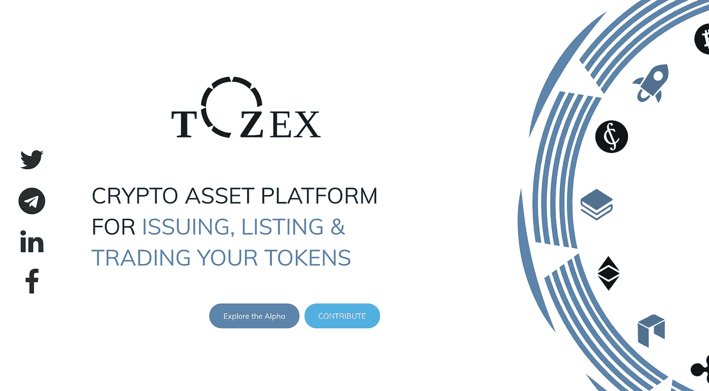
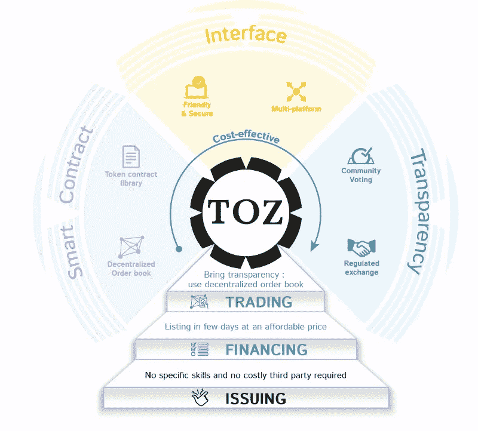

# 用于中小企业融资的金融和区块链技术的未来

> 原文：<https://medium.com/hackernoon/the-future-of-finance-and-blockchain-technologies-used-for-smes-financing-4f3f4ebefc46>

tozex.io

# 梦想、金融和成功

尽管中小企业在经济中发挥着重要作用，但它们仍然面临严重的资金短缺。传统金融无法为中小市值市场提供合适的答案。获得资金似乎是中小企业面临的最大挑战。

由于投资的非流动性，不可靠的公共信息和复杂的股份转让机制的结合并不能吸引投资者。投资者正在寻找安全的公司价值和足够的流动性来交换股票。对于中小企业来说，上市时间往往是一个重要的里程碑。融资期限必须跟随战略公司决策的节奏。

到目前为止，中小企业只有很少的融资工具，直到基于代币的融资机制出现，最广为人知的是**首次代币发行。**这种新方法是全球金融生态系统向金融去中心化迈出的重要一步。

2018 年，已经筹集了近[210 亿](https://www.coinschedule.com/stats/ALL?dates=Jan+01%2C+2018+to+Dec+31%2C+2018)美元来资助多达 900 个项目。虽然与其他传统方法相比，这种筹资方法仍然处于边缘地位，但由于其自身的创新特点，它代表了一种重要的发展潜力。事实上，基于代币的筹资机制通过提供容易转移的资产能力，提供了一种在公司生命周期的任何阶段吸引全球范围内 24/7/365 各类投资者(机构、公司和零售)的方式。此外，它允许分离融资和控制的公司和能力，使众所周知的公司在其成功之前。我们深信这是一个融资游戏的改变者。

然而，在服务提供商(代币设计提供商和加密资产交易平台)和主要利益相关方(企业家、投资者和交易商)之间，目前对这种新的强大筹资方式的访问仍然非常分散、昂贵和不透明。这些障碍阻碍了这种直接面向中小企业的新融资方式的大规模采用。

我们的主要目标是通过在该领域提供更多的信任和透明度，让企业家通过一系列基于代币的筹款活动(ICO*、STO*或 [**BRO***](https://hackernoon.com/viable-alternative-to-icos-introduction-of-the-believers-reward-offering-bro-7efbdbe0c25f) )来资助他们的创业梦想，从而带来一个交钥匙解决方案。我们将通过便利融资渠道和升级传统上流动性差、成本高的流程，实现融资的现代化。

# **什么是 TOZEX？**

TOZEX.IO

**TOZEX** 是一个整合了**“令牌卡”**的融资平台，允许建立一个基于令牌的众筹活动，专门为中小企业项目融资，并嵌入**交易市场。**现在的演员可以在 2 到 4 个月内提供**，** **TOZEX** 可以在几天内提供**而不需要任何特定技能。**

**TOZEX 的主要目标是通过使用区块链技术改善中小企业的融资渠道，并将企业家和投资者聚集在同一个可信任的生态系统中。**

> *****“我们建造了太多的墙，却没有足够的桥。”艾萨克·牛顿*****

**TOZEX 是一级市场和二级市场(T21)之间的独特门户。它消除了在一个独特的自动化和完全受监管的平台内管理与筹款活动相关的代币生命周期(**发行、融资和交易**)的所有现有障碍。**

**我们的开源智能合同库允许企业家选择最适合他们的项目和需求的基于令牌的筹资机制(ICO*、STO*或 [**BRO***](https://hackernoon.com/viable-alternative-to-icos-introduction-of-the-believers-reward-offering-bro-7efbdbe0c25f) )。此外，对于更有经验的用户来说，他们将能够在**以太坊、以太坊经典、RSK 或信用**之间选择自己的区块链网络来部署他们新发行的加密资产。**

**一旦筹资阶段成功完成，代币将在二级市场上交易。为此，该项目将首先提交给我们的内部控制委员会，然后通过投票阶段提交给机构群体。**

****TOZEX** 平台是通过可审计的分散订单簿在二级市场进行交易的完美场所，避免了市场操纵，确保了流动性需求。**

# ****谁是 TOZEX 用户？****

**TOZEX 是为这种特定筹资机制的所有关键利益相关者而设计的。他们将有机会在可信的生态系统内，在令牌生命周期的不同阶段交换价值。事实上， **TOZEX** 将提供一个独特的途径，为以下领域创造可持续的一级和二级市场:**

**1.寻求投资的企业家。他们可以发起一个基于令牌的筹款活动(ICO、STO 或[T3、BROT5)，而不需要知道一行代码，也不会承受巨大的成本。他们将能够通过使用友好的和以客户为中心的工具，在同一个平台上管理代币生命周期的所有阶段(发行、融资和交易)。通过我们的社区网络效应，企业家也将受益于巨大的营销和传播曝光。](https://hackernoon.com/viable-alternative-to-icos-introduction-of-the-believers-reward-offering-bro-7efbdbe0c25f)**

**2.**投资者**希望在早期阶段投资于中小企业，而不会遭受投资缺乏流动性之苦。他们将有机会比较项目的盈利能力和风险，以选择最佳的潜在有价值的项目。投资决策将根据可靠的信息和条件做出，投资将是透明和确定的。**

**3.**寻求新型加密资产交易平台的交易商**，该平台能够以透明、安全和有竞争力的费用交易有价值的资产。订单将基于可审计的&实时交易量(分散订单簿)和与加密资产相关的历史记录信息。**

**基于区块链基础设施的金融将为金融创新开辟新的可能性，特别是为中小企业融资。历史上第一次，中小企业拥有了可规划的融资机制，带来了更广泛的准入、透明度和流动性。企业家可以重新获得对其财务的主权。毫无疑问，这将是未来几年中小企业首选的融资渠道。**

**令牌之于区块链，就像电子邮件之于互联网，是一种代表和转移价值的工具。代币将是未来经济的核心，TOZEX 将是通向这一充满希望的未来的大门。**

# ****让我们让金融去中心化、民主化！****

**关注我们:**

****

**[脸书](https://www.facebook.com/Crypto4Allofficial/)，[推特](https://twitter.com/tozexofficial)， [Instagram](https://www.instagram.com/crypto4all_official/) ， [Linkedin](https://www.linkedin.com/company/crypto4all/) ，[网站](http://tozex.io)，[媒体](/@tozex)**

## **查看我们之前的文章:**

**[**ICOs 的可行替代方案——介绍“信徒报偿”(BRO)**](https://hackernoon.com/viable-alternative-to-icos-introduction-of-the-believers-reward-offering-bro-7efbdbe0c25f)**

## **在你走之前…**

***如果你喜欢这个故事，请随意*👏👏👏几次，这样其他人也可以享受。感谢:)**