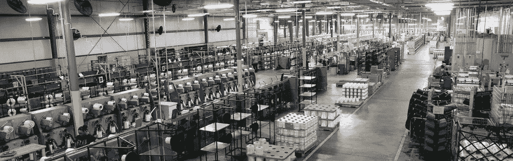

# 物联网的未来:2018 年回顾和 2019 年展望

> 原文：<https://medium.com/hackernoon/the-future-of-iot-2018-in-review-and-what-to-expect-in-2019-525eee7a04dc>

## 去年，物联网处于自动驾驶革命的边缘。它没有发生。下面是 2018 年实际发生的，以及 2019 年将要发生的。

2018 年初，人们感觉物联网行业正处于一场[技术](https://hackernoon.com/tagged/technology)革命的风口浪尖。自动驾驶是物联网中的一个巨大话题。

今天，我们似乎离实现自动驾驶更远了，因为事实证明自动驾驶汽车还没有准备好上路。在无人驾驶汽车可以部署之前，我们的[道路、城市和基础设施](https://thehill.com/opinion/technology/353034-self-driving-cars-are-coming-but-us-roads-arent-ready-for-the-change)的物流需要做更多的工作。最终，这些车辆背后的技术(传感器、激光雷达等。)将允许汽车做出比人类更好的决定，但我们还没有到那一步。

# 2018 惊喜

与此同时，这给我们留下了一个令人不安的现实，城市交通问题变得更加糟糕。Lyft 和优步本应让汽车*离开道路*，但他们却让交通变得更糟；我们将乘坐汽车而不是公共交通工具。更多的汽车意味着更多的交通。

进入 2018 年最大的物联网惊喜:联网滑板车和自行车。当交通变得更糟时，唯一的解决办法就是避开交通——事实证明，我们的自行车道没有得到充分利用。滑板车因其驾驶者的行为(不戴头盔、在人行道上骑行、在轮椅坡道前停放滑板车等)受到了很多指责。)，但它们的受欢迎程度(和大量资金)源于一个现实世界的问题:交通越来越糟糕，而且没有好转的迹象，除非我们进行一些大规模的技术变革。

# 2019 预测

这些联网汽车代表的更广泛的趋势是将连接性和商用硬件结合起来，为巨大的问题提供独特和创造性的解决方案。我预计我们将在 2019 年继续看到这种创造力，我们将继续对物联网创新者和企业家的创新思维感到惊讶。

这只是我预计在 2019 年看到的一个趋势。我预计明年物联网行业还会出现另外五种趋势:

# 1.物联网技术成为传统行业的筹码

“传统行业”——也就是已经存在了几十年的行业——是物联网的天然家园。如果你制造泵和阀门，你可以使用物联网来制造“智能”连接的泵和阀门，并因此创造新的业务线。在 2018 年的过程中，投资物联网从“可能是一个好主意”变成了在这些行业中入股。我们已经看到制造组织中的创新者利用物联网解决现实世界的问题，并定义清晰的用例。随着知识和技能的共享，我们将看到物联网在石油和天然气、制造业以及其他长期传统行业的更快采用。

# 2.大公司招聘物联网人才

众所周知，世界上最大的公司一直在投资物联网，但在大多数情况下，他们不具备大规模实施物联网计划的技术能力。这些公司将或者应该寻求收购拥有更深技术物联网专业知识的小型初创公司。我不认为我们会看到很多 30 亿美元的收购，而是许多较小规模的收购(～1 美元和规模(～1，000 万美元))，旨在建立团队，推动组织未来几年的物联网计划。

# 3.智能城市、不断发展的基础设施和交通

我们将在 2019 年看到更多的滑板车和自行车共享公司部署车队(更多的城市将尝试并淘汰它们)。随着更大的交通问题持续存在，预计还会看到其他令人惊讶的车辆。[微型汽车！](https://www.theverge.com/2018/11/13/18092198/lime-car-share-seattle-limepod-expansion-scooter) [悬停冰刀！](https://www.theverge.com/circuitbreaker/2018/6/28/17514004/eskates-segway-drift-w1-self-balancing-roller-skates)这也意味着城市管理者和当地政治家必须在基础设施方面变得更聪明，并与进入城市的技术保持一致。另一方面，预计将会看到快速扩张的踏板车和自行车共享公司与城市更加密切地合作，因此它们不会受到市场之外的监管。

# 4.新的物联网设备更加安全，但现有设备仍然容易受到攻击

该行业继续在物联网安全方面取得进展，新的物联网设备更有可能至少具备基本的安全性。然而，世界上仍有数以百万计的物联网设备不安全，这些设备不会去任何地方。这意味着现有的物联网业务很容易受到攻击，尽管业界尽了最大努力，但仍有可能继续出现重大违规行为。这些违规行为将在市场中造成不确定性，迫使物联网从业者加倍进行安全投资，并增加对安全和数据隐私价值的营销关注。

# 5.气候变化:关注自然灾害管理

2018 年，西海岸火，东海岸淹。多年来，我们已经看到公司建立连接的传感器网络来监测气候变化的影响。现在，气候变化的成本变得越来越明显，预计将会看到投资使用物联网来管理由于气候变化而变得越来越严重的自然灾害。防洪和灭火可能是明年及以后物联网的热门话题。