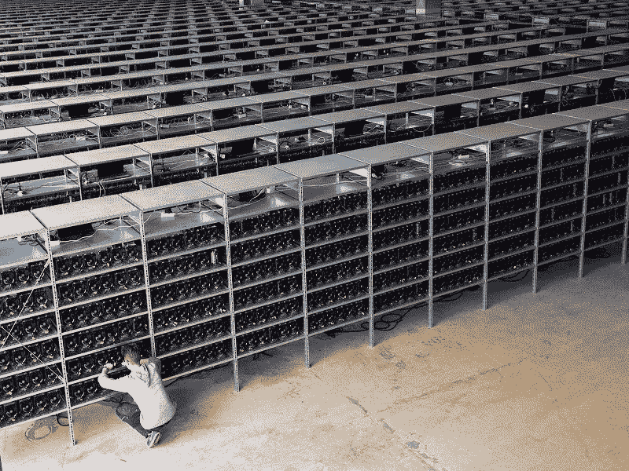
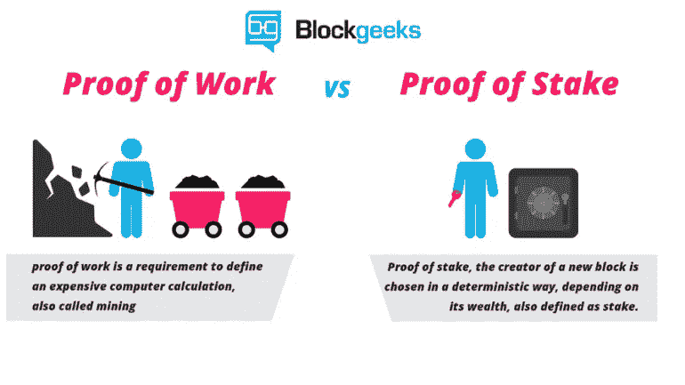

# 采矿的未来和 ASIC 电阻的重要性

> 原文：<https://medium.com/hackernoon/the-future-of-mining-and-the-importance-of-asic-resistance-5ffa544a0821>

Bitcoin Mining Farm; Source: Bitcoin.com

> 最新的[加密货币新闻](https://www.coincurb.com/news/)、[空投清单](https://www.coincurb.com/airdrop/?status=active)、[赏金清单](https://www.coincurb.com/bountyc/?cat_id=188)、 [IEO 清单](https://www.coincurb.com/category/active-ico/)，请访问 CoinCurb.com。

挖掘是比特币、以太坊、比特币现金等主要去中心化网络的主要方面..多年来，由于赚取大宗奖励的盈利能力，采矿已经成为一种商业运作，其中布满了像臭名昭著的比特大陆这样的亿万美元公司。由于采矿场的兴起，工作证明网络得到了发展:越来越少的独立节点为网络增加了散列能力。今天，在最大的分散式区块链上，网络散列率的绝大部分来自大型采矿场。正因为如此，一些区块链已经到了这样一个地步，采矿场已经成为一种必要的邪恶，因为网络现在依赖它们来维持保持网络安全所需的哈希速率水平。

这里有一个残酷的讽刺。

由于采矿场投入了令人难以置信的大量资金，工作证明系统实际上已经变成了股份证明区块链，因为网络的大部分是由实体保护的，这些实体购买资源的唯一目的是获得散列率。这是他们的利益所在，也是他们行动符合网络最佳利益的保证。此外，虽然像巨人一样的采矿场已经成为区块链网络的主要保护者，但它们在区块链不断增长的作用已经使权力下放的概念变成了泡影。

# **控制过多；手太少**

比特币散列率的绝大部分来自少数云合同提供商和私人采矿场。分散资金的目的是确保没有一个或少数几个实体可以串通起来获得资金的控制权。然而，矿业权力的集中正威胁着中本聪创造比特币的原因:分散对财富的控制权。

目前，许多农场拥有足够的网络哈希速率，他们的合作可以获得对比特币网络的完全控制。由于这个原因，Vitalik Buterin 已经提出将以太坊从电力网络发展到 PoS 网络。值得注意的是，由于向以太坊 ICO 投资者发行的 ETH 数量惊人，以太坊的很大一部分持有在不到 100 英镑的钱包中。因此，一个赌注的证明以太坊将权力集中在少数人手中。

由于这一点，以太坊基金会有一个难题需要解决:如何在 PoS 网络中保持分散化？

Simplified comparison of PoW and PoS; Source: Blockgeeks

**采用替代方法的替代区块链**

尽管区块链技术还处于萌芽阶段，但这个领域已经成功吸引了大量有才华的开发人员。许多项目正在整合新的共识机制，以创建一个网络，提供一个创新的解决方案来保持权力下放。

许多网络发展了利益相关者共识的证明，以创建提供更大程度的分散化的网络。例如，STEEM 和 EOS 通过允许每个节点投票选举验证者来使节点选择民主化。埃尔隆德网络使用安全的利害关系一致性证明，将信誉因素集成到节点选择中。虽然智能合同链正在寻求偏离某种形式的利益一致证明，但隐私币是一种特殊的硬币，人们正在探索各种各样的方法来对抗集中化采矿企业的力量。

# **分散隐私币**

最近，Monero 因其网络更新通过提高网络的 ASIC 抵抗能力打击农场而成为头条新闻。尽管 Monero 对抗采矿场的成功只是昙花一现，但它已经朝着正确的方向迈出了一大步。

尽管有许多替代区块链的创新方法，但事实仍然是，工作证明共识机制确保区块链保持真正的分权。它使任何人都有机会保护网络；保护他们的财富。同时，它让每个人都有公平的机会从整体奖励中获得金钱。确保采矿场不滥用该系统的关键是提高 ASIC 的抵抗力。

一个新的隐私链，面纱，正在进行反对哈希集中化的斗争。

VEIL 是一个新的隐私链，集成了 Zerocoin 协议，该协议被许多隐私币使用，包括 Zcoin 和 PIVX。

Zerocoin 协议不能提供基础硬币交易的隐私，这限制了使用该协议的网络的隐私能力。

领导 Veil 开发的基金会 Veil Labs 使用 Monero 的 RingCT 技术对 basecoin 交易进行匿名化，从而创建了有史以来第一个支持 Zerocoin 协议的网络，为所有交易提供强大的隐私，无论支付是以 zerocoins 还是 basecoins 完成。

为了确保网络保持分散但安全，VEIL 使用了混合的工作证明/利益一致证明。采矿的存在确保了每个人都可以通过成为网络的增值部分来获得硬币。由于采矿农场已被证明滥用此类网络，VEIL 推进了由 Raven Coin 首创的 X16R 哈希算法，并集成了 X16RT 算法。

ASICs 是为特定算法提供哈希速率而优化的设备。然而，X16RT 使用了 16 种不同的算法。在一轮中使用哪种算法是随机决定的；该随机化变量的来源在于先前开采的块。

这种随机化方法使得 ASIC 很难预测以哪个算法为目标。在挖掘 X16RT 时，没有哪台机器比另一台机器更有优势。

因此，购买昂贵的 ASIC 计算机并不会提供比具有典型 GPU 的家用计算机更大的优势。随着 X16RT 哈希算法的集成，任何人都可以在公平的竞争环境中挖掘 VEIL。

# **最佳隐私**

真正的隐私硬币的一个被忽视的方面是完全去中心化。为了保持交易的匿名性，最重要的是没有任何一个实体在矿业中获得集中的角色。

虽然隐私链一直专注于在验证时匿名化交易，但重要的是不要忘记验证者也不能访问交易源。Dash 对 masternodes 的使用有可能使验证者知道交易来源，而其他 PoW 采矿网络则依赖于采矿场对网络最有利的希望。另一方面，VEIL 开创了一个隐私链，由于区块链的高级抗 ASIC 特性，隐私是不可信的。

***免责声明:本文作者拥有面纱加密货币。***