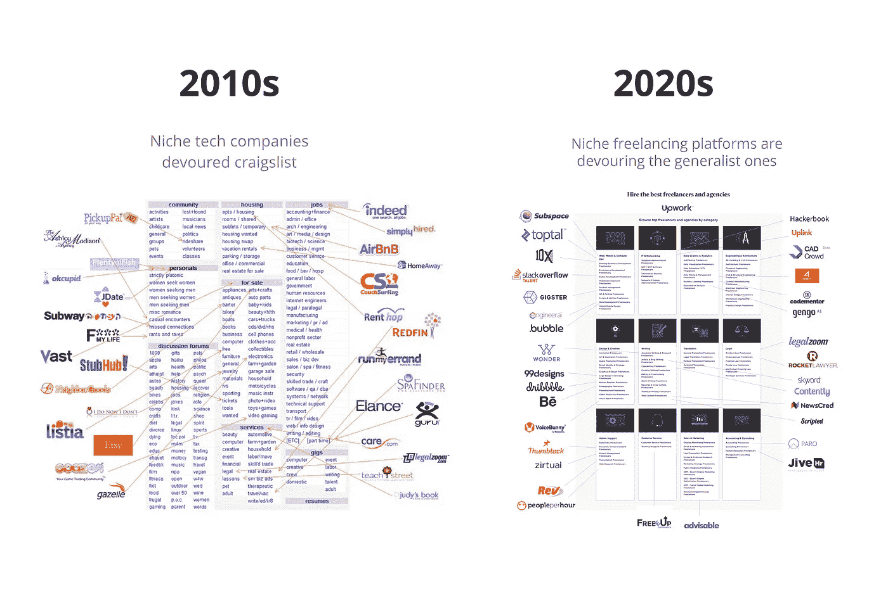

# 软件开发的未来:自由职业者，人工智能辅助，摇摇欲坠

> 原文：<https://medium.com/hackernoon/the-future-of-software-development-modular-intelligent-and-rickety-e24de6d5102f>

从埃及天文学家发明零的概念到英国数学家组装出第一台计算机，已经过去了将近 4000 年。但是一旦东西做好了，我们就去比赛了。电子计算机只用了 130 年，互联网用了 40 年，智能手机只用了 9 年。现在，计算机科学的进步就像从自动收报机中放出的一样。

但是并不是所有赢得媒体的事情都成功了——或者产生了影响。大多数发明都会随着其炒作周期而消亡，研究公司 Gartner 称之为[幻灭的低谷期](https://www.gartner.com/en/research/methodologies/gartner-hype-cycle)。在这篇文章中，我将在所有的噪音中分享三个信号，我认为它们表明了在未来几十年中将成为软件开发中最大力量的趋势。

# 1.很快，大多数软件将由自由职业者开发

今天铁板一块的通才自由职业平台将被下一波利基平台吞并，就像 Craigslist 被优步、Airbnb 和 OkCupid 吞并一样。这将迎来一场开发者根据合同远程构建软件的复兴。

UpWork(以前的 Elance-oDesk)可能将世界引入了零工经济，但它不再为它服务了。该平台因[不断提高费用](https://hackernoon.com/why-you-should-never-use-upwork-ever-5c62848bdf46)而激怒了用户，微软希望通过[与 UpWork](https://www.upwork.com/blog/2018/12/upwork-microsoft-freelance-teams-scale/) 合作获得的专家开发者正在逃离该平台。他们不想在薪酬方面竞争到底，也不想把所有的时间都花在向那些被申请淹没而无法一一分类的客户推销上。

相反，开发商正在探索各种替代的配对方式。他们使用像 TopTal 和 10X 这样的职业介绍所，尽管使用了像“审查简历”这样的老式技术来评估技能，但这些职业介绍所正在蓬勃发展。或者开发人员使用像 Gigster、Tara AI 和数百家初创公司这样的媒人，这些公司将机器学习算法应用于通过简历、电话筛选和招聘人员招聘的[著名的不确定性](https://subspace.net/the-future-of-hiring-diversity)过程。

我目前的项目，[子空间](https://subspace.net/)，使用一个声誉系统来进行匹配。这是一个招聘自由职业者的平台，也是一个软件开发工具，它允许我们评估每个开发人员的真实技能[作为真实工作发生的副产品](https://subspace.net/how-subspace-works)，并为他们匹配正确的公司和项目。

然后你有吉拉，Slack，Basecamp，Airtable，还有一整个项目管理-沟通-开发者工具类别，这些类别充斥着使远程工作变得简单的方法，并减少面对面时间的重要性。

所有这些都为自由职业者创造了一个[、价值 1.5 万亿美元的](https://advancedconsult.files.wordpress.com/2017/05/example-3.pdf)市场，为开发人员提供了基础设施，使他们能够高效地远程工作，并解决他们最大的抱怨:[找到一致的工作](https://blog.freelancersunion.org/2019/04/08/how-to-make-it-work-as-a-freelance-software-developer/)。根据 Stack Overflow 最近对 90，000 名开发人员的调查，已经有 35%的开发人员是兼职自由职业者，9.5%的开发人员是全职自由职业者。这是一个具有大量流动性的大市场，其自由将吸引越来越多的开发商放弃办公室，以便他们可以:

*   挑选他们的项目
*   选择他们的团队
*   做自己的老板
*   积极旅行
*   寻找避税天堂
*   节省通勤时间

所以，做好准备吧。

**此外，一个具体的预测**:自由职业还会造成不稳定，提供更少(或没有)的安全网，并消除全职员工享有的法律保护。我相信我们很快会看到自由开发者合作社的崛起，他们和工会在工业革命时期有着同样的目的。

# 2.人工智能辅助编码将很快成为标准

我们正接近峰值代码点。从那时起，我们每个人将开始写得越来越少，因为计算机将为我们做这件事。

“所有标准化的、重复性的编码工作都将消失，”未来学家大卫·塔尔在《量子运行》中写道。取而代之的将是一个庞大的预定义组件行为、用户界面和数据流操作库因为，嗯，干——不要重复自己。如果你不得不做两次以上，电脑会帮你做。

> 很多开发人员会从砌砖工(读作:代码猴)提升为工头。

让计算机自由编程的一个长期挑战是它们无法理解上下文。莱斯大学计算机科学副教授 Swarat Chaduri 是一个编写自己代码的系统的创造者，他告诉 [Futurity](https://www.futurity.org/artificial-intelligence-bayou-coding-1740702/) “你通常需要提供关于目标程序做什么的许多细节，写下这些细节的工作量可能与编写代码一样多。但算法在判断用户意图方面变得足够好，以至于一波无代码或低代码平台(如 Quick Base、Mendix 和 Zudy)正在用图形界面取代代码编辑器，以至于任何人都可以使用它们。

**无代码和低代码范例将产生三种影响:**

1.  专业开发人员将每天完成更多工作
2.  初级开发人员将更难找到工作
3.  一线经理将更早地参与开发过程

让一线经理更多地参与进来，必然会带来更好的软件。当产品经理不仅能模拟软件的线框，还能模拟基本的功能时，开发人员的工作就更具监管性，也更有针对性，而且[整个事情更具协作性。](https://www.invisionapp.com/inside-design/designer-dev-collaboration/)

很多开发人员会从砌砖工(读作:代码猴)提升为工头。“软件工程师的角色将不再是编码员，而是数据管理员，”桑迪·夏尔马在 Daskey Keyboard 中写道。

计算机将为质量保证和测试等非关键功能编写第一行代码，并帮助敏捷工程师估计完成任务所需的时间，但它很快就会变得不可替代。随着机器编写的代码通过智能编程助手、快速原型和自动重构增加了代码的总量，没有机器，人类将有太多的代码需要处理。这将需要更多的机器。谷歌的搜索算法已经过于复杂，人类开发者无法独自管理。想象一下十年后它会在哪里。

**一个具体的预测**:一个被称为“无代码修复者”的精英开发人员阶层的崛起:公司雇佣这些人来解决他们失控的无代码环境，因为他们不再了解它是如何工作的，也缺乏恢复的能力。

# 3.噩梦般的基础设施会让我们所有人都处于危险之中

未来似乎是光明的，除非你考虑到它所依赖的基础设施，这些基础设施正处于噩梦般的状态，而且还在恶化。“我们的现代社会依靠软件运行”Nadia Eghbal 在福特基金会一份名为[道路和桥梁](https://www.fordfoundation.org/about/library/reports-and-studies/roads-and-bridges-the-unseen-labor-behind-our-digital-infrastructure)的报告中指出。"但是我们用来构建软件的工具在不断增长的需求下正在崩溃."特别是开源部分。

Image credit: NPR

很少有开发者参与维护开源软件(OSS ),以使它像我们所需要的那样继续运行。只有 12.4%的开发者每月至少参与一次，然而 78%的公司广泛使用 OSS，超过一半的专利软件中都有开源组件，Michael Lockshin 在[世界银行博客](https://blogs.worldbank.org/opendata/quality-open-source-software-how-many-eyes-are-enough)中写道。这意味着很多公司使用了很多软件，却没有多少人仔细检查。

> 随着编写的代码量的增加，以及代码移交给机器，这些漏洞可能只会增加。

在 T4 的一项调查中，只有 8%的公司对开放源码软件的质量表示担忧。“一个可能的解释可以用莱纳斯定律来表达:‘人多眼杂。’”洛克申写道。然而，像 2014 年 OpenSSL 中的 Heartbleed 漏洞这样的漏洞暴露了 80 万个最受欢迎的 TLS 网站，谷歌的一个人花了近两年时间才发现。

随着编写的代码量的增加，以及代码被交给通过模仿人类来学习编码的机器，这些漏洞可能只会增加。毕竟，我们容易出错，易变，并且是否认的大师，对于编码机器来说，太像我们是一种耻辱。(偏颇[算法](https://www.theguardian.com/technology/2018/oct/10/amazon-hiring-ai-gender-bias-recruiting-engine)，有人吗？)

是什么让更多的人不为开源做贡献？任何参与过的人都知道，这可能是一种真正的痛苦。大多数操作系统都是在 GitHub 仓库中维护的，这些仓库缺乏高级用户许可、授权或解析功能，因此完全依赖于没有报酬的哲学家国王(或女王)来做任何事情。要体会这种感觉，你只需要读一读诺亚·劳森的一篇题为“做一个开源维护者是什么感觉”的文章:“在你的门外站着几百人的队伍。他们在耐心等待你回答他们的问题、投诉、拉取请求和功能请求。”队伍是无止境的。工具是有帮助的，“但是在某些时候…一个人是无法扩展的。”

营利性公司正在向 OSS 投入资源，但与它需要的相比，这只是沧海一粟。通过销售 OSS 服务赚钱的公司通常只关心他们自己的领地。微软、苹果和谷歌为一些 OSS 提供代码奖金，欧盟在 2019 年开始提供 OSS bug 奖金，但预算微不足道。在欧盟的例子中，它只分配给[100 万美元](https://www.welivesecurity.com/2019/01/07/eu-bounty-bugs-open-source-software/)给整个全球项目。

> OSS 完全依赖于没有报酬的哲学家国王(或女王)去做和成为一切。

如果发达国家实际的、有形的道路和桥梁的状况有任何迹象的话，那么我们并没有走向一个好的地方。美国土木工程师协会在他们的 [2017 年基础设施成绩单](https://www.infrastructurereportcard.org/)中给了美国一个 D+。当然，ASCE 有利益冲突，但是许多其他组织给美国的基础设施打了相似的分数(根据世界卫生组织的数据，我们在道路安全方面排名第 60 位)。大多数发达国家都以类似的方式投资不足。毫无疑问，这是一个人的问题——惯性是很难克服的，我们的 OSS commons 的巨大悲剧是它帮助赚了很多钱，但是没有人特别被付钱来保护它的安全。

此外，如果为网络中立而战给了我们任何指导，这是我在玩世不恭，在延续 OSS 问题上有既得利益的大公司将会突然出现，使找到一个解决方案变得几乎不可能。

**一个具体的预测**:问马克·扎克伯格[脸书如何赚钱的同一个美国参议员委员会](https://www.vox.com/policy-and-politics/2018/4/10/17222062/mark-zuckerberg-testimony-graham-facebook-regulations)(嗯，广告，先生)将参与并通过一项法案，授予一家公司独家 OSS 维护权——比如说，与[推出 healthcare.gov](https://www.washingtonpost.com/national/health-science/hhs-failed-to-heed-many-warnings-that-healthcaregov-was-in-trouble/2016/02/22/dd344e7c-d67e-11e5-9823-02b905009f99_story.html?utm_term=.e8858695b07c)的人相同——它可能会将所有工作外包给自由职业者……少付他们钱。

# 这是我们想要的未来吗？

这三种未来的潜在不利之处是巨大的:主要是自由软件开发经济，监管不力，大公司对开发者的成果有太大的影响力。失控的代码创建一旦开始，就再也不能被人类减慢或维护。一个建立在数字道路和桥梁上的软件世界，随时可能崩溃。这是一个潜在的未来——但这是我们想要的未来吗？也许这是我的天性，但我持谨慎乐观的态度。套用温斯顿·丘吉尔的话，作为一个社会，我们总是会做正确的事情——但可能只有在尝试了所有其他选择之后。

如果你对这些话题感兴趣并有想法，让我们来谈谈吧。在 Twitter 上通过 [@SubspaceNet](https://twitter.com/subspacenet) 与我联系。