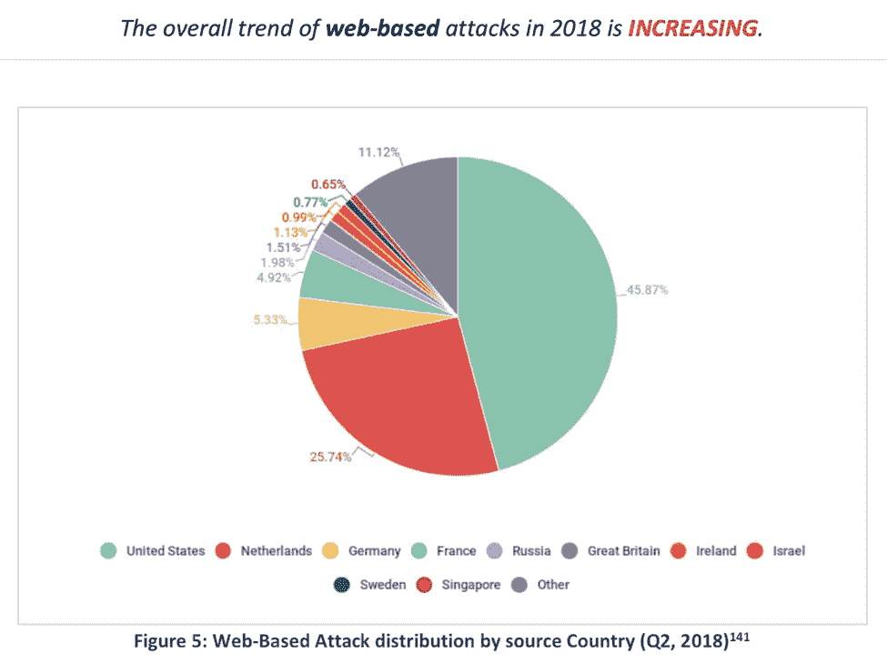
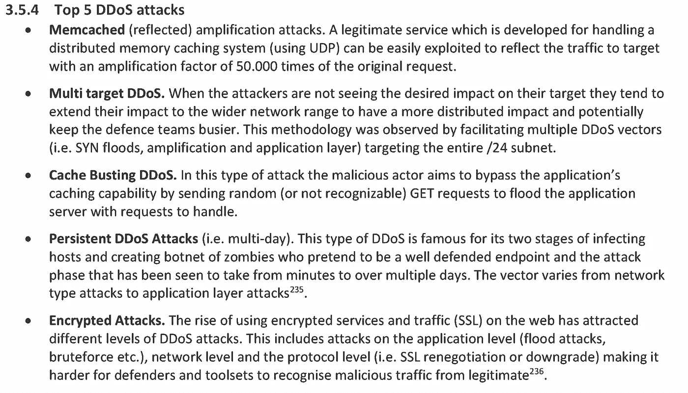
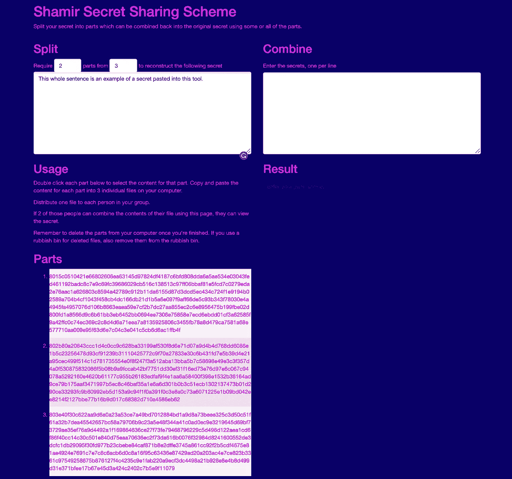
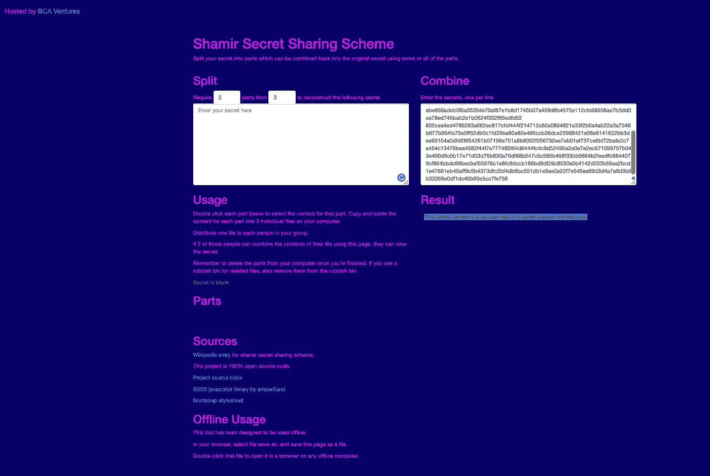
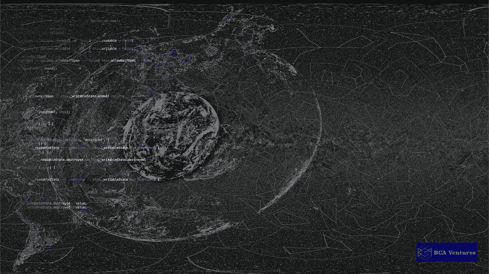

# 👉现在保持在线安全的未来🚀

> 原文：<https://medium.com/hackernoon/the-future-of-staying-safe-online-now-c078e740e0f>

## 史蒂文·哈扎基斯

# 🌐 👭👫👬

T 他的文章探究了为什么消费者会不可避免地寻求变得更加自力更生💪当保护自己免受网络安全风险时，帮助我们黑暗的网络带来光明。

Source: Steven Hatzakis art, celestial constellation map of north polar projection

考虑到万维网面临的日益增长的威胁，😇在线网络用户及其💻设备面临的风险越来越大。坏演员潜伏在黑暗的网络中👿意图造成伤害并获得强大的工具🛠.

虽然这些工具可能被坏人用作攻击性武器，造成伤害，但消费者有了新的选择和方法来保持⚡️.的安全

Photo source: [Unsplash](https://unsplash.com?utm_source=medium&utm_medium=referral)

这篇文章的目的地是消费者可以用信息和强大的工具武装自己，并在途中学习(跳到文章末尾查看工具或阅读下面的内容)。🍿

> 文章高级主题🐶

*   ✅:现代网络挑战的快照
*   ✅风险和不断变化的威胁格局
*   ✅消费者如何在网上更好地保护自己
*   ✅获得强大而复杂的网络安全工具
*   ❗️并不打算成为一个完整的指南，而是要提高认识

## 互联网不是变得更安全了，而是变得更糟糕了 ⚠️

自从第一款互联网浏览器问世以来，我们已经走过了漫长的道路。2019 年 3 月，标志着互联网诞生 30 周年，万维网的创始人蒂姆·伯纳斯·李提出了对网络阴暗面的担忧。

Source: [Unsplash](https://unsplash.com?utm_source=medium&utm_medium=referral)

网络仍然是一个危险的地方，它从字面上窃取了光明网络的亮度，在那里人们试图保持安全，而企业继续无法保护这些相同的消费者。

以下是蒂姆·伯纳斯·李爵士最近发来的消息:

Source: YouTube

**【另见:**[**https://cdn . the guardian . TV/main website/2015/02/19/150119 timbernerslee 01 beginning sreex v3 _ FromGLabs-16x 9 . MP4**](https://cdn.theguardian.tv/mainwebsite/2015/02/19/150119TIMBERNERSLEE01BEGINNINGSREEXv3_FromGLabs-16x9.mp4)**】**

ENISA 最近在 2019 年 1 月发布的一份[报告显示，基于网络的攻击正在增加，其中近一半针对美国的 IP 地址。](https://www.enisa.europa.eu/publications/enisa-threat-landscape-report-2018/at_download/fullReport)

**Source: ENISA**

ENISA 报告强调，尽管垃圾邮件有所减少，但其他攻击也在增加。

域名抢注仍然是另一个主要风险，正如最近的 RSA 年会所概述的:

Source: YouTube

威胁形势已经发生了变化，出现了新的攻击媒介，包括恶意广告、加密劫持、勒索软件以及对互联网用户的许多其他威胁，包括可以使整个 web 服务离线的分布式拒绝服务(DDoS)攻击。

Source: ENISA, using 2018 data

## **症状更大的问题，网有疾病⛔️**

J 就在几天前写这篇文章的时候，我读到一个标题，WhatsApp 的最初联合创始人 Brian Acton 以 180 亿美元的价格将他的公司卖给了脸书，他再次敦促消费者[删除所有相关的脸书应用](https://www.theverge.com/2019/3/17/18269515/whatsapp-co-founder-brian-acton-urged-users-to-delete-their-faceboo)。(注:他的加密消息应用[信号](https://signal.org/)是竞争对手)

Photo source: [Unsplash](https://unsplash.com?utm_source=medium&utm_medium=referral)

马克·扎克伯格刚刚[宣布计划](https://newsroom.fb.com/news/2019/03/a-note-from-mark-zuckerberg/)让脸书转向更注重隐私的服务，然而就在几天前[脸书宣布未能妥善保护其数百万用户的密码](https://newsroom.fb.com/news/2019/03/keeping-passwords-secure/)。脸书公司未能妥善保护他们数据库中的密码，因为那些明文秘密在应该加密时却没有加密。😲

即使选择了强密码，由于疏忽的加密缺失，它们也没有得到适当的保护(正如[加密/解密密码和算法🔐㊙️ 🔓](https://medium.com/u/3126f7dd42c1#️⃣</li><li id=)

*   [零知识证明👽](https://medium.com/u/3126f7dd42c1#️⃣</li><li id=)

[Photo source:](https://medium.com/u/3126f7dd42c1#️⃣</li><li id=) [Unsplash](https://unsplash.com?utm_source=medium&utm_medium=referral)

## **研究问题❓** ❓❓

对于消费者来说，网络安全的前景如何？消费者可以做些什么来保护自己，而不需要依赖他人，而是更加自力更生地防御这些风险？

这些是我思考的问题类型，并导致我对即将到来的趋势的必然结论👉**自力更生的互联网用户👊**我们将在下面讨论如何让网络变得更加光明。

> 示例并非详尽无遗:

*   📱使用双因素身份验证(2FA)和多因素身份验证(MFA)(但请确保在同步前备份恢复密钥)
*   ✉️保护主电子邮件帐户上作为恢复地址列出的任何辅助电子邮件地址
*   📪禁用任何安全相关服务的两步验证(2SV ),以降低 SIM 端口黑客攻击的风险
*   结合使用 VPN 和手动设置 DNS(即[万维网联盟(W3C)有一个加密 API](https://medium.com/u/a00e599743a7#RandomSource-method-getRandomValues) (注意:我是 Github 上 W3C 加密库[的贡献者](https://github.com/w3c/webcrypto)🤓).

    Photo source: [Unsplash](https://unsplash.com?utm_source=medium&utm_medium=referral)

    诸如“getRandomValues ”(相当于使用 Python 中的“secrets”库或 Linux 终端上的“Dev(Random)”命令)之类的可信命令被无数的互联网应用所依赖，以获得足够安全的熵(即抗预镜像的熵),从而产生在比特(即 256 比特数)方面加密安全的伪随机数生成器。🙀

    这些技术细节可能会让普通消费者昏昏欲睡😴 💤，但人们不需要了解哈希函数的内部工作原理(除非好奇，或者追求更高的教育)，而是需要了解它们如何与更大的网络安全图景联系起来。🖼

    换句话说，许多人相信这些过程在密码上是安全的，因为如果有人可以可行地重新创建熵(前映像)，这将打破安全假设，并将用户数据置于风险之中。

    

    Photo source: [Unsplash](https://unsplash.com?utm_source=medium&utm_medium=referral)

    ## 信任还不能从软件中消除

    所有级别都需要一定程度的信任，而这种信任往往会成为一种商品，被用户在互联网上挥霍掉，他们给予的太多太自由(然后成为违规行为的受害者)。

    在我们[或许]有一天拥有一个不可信的互联网之前，通过不可信的应用程序，消费者现在仍然有巨大的机会来最小化他们被迫拥有/接受的信任量，并减少他们数字足迹的风险和攻击面。

    > 以下是一些例子:

    *   ☑️学习如何使用密码原语(加密算法散列函数)
    *   ☑️ **生成各种长度/强度的随机加密安全密码**
    *   ☑️选择了更简单的工具，可以在一个文件中检查整个代码
    *   ☑️ ️Learn 将在**冷藏环境**中使用设备(即禁用 wifi 的旧笔记本电脑)📴

    ## 练习，练习，练习..让事情变得简单

    我想将讨论转移到轻网络，以及随着越来越多的数据泄露事件继续发生，以及对第三方的信任受到侵蚀，在一个自力更生成为保护自己在线安全的必要手段的世界里，消费者可能会如何行事。

    ⚡️ ⚡️⚡️ I 拥有一些这样的开源网络安全工具，如[高级加密标准(AES)](https://www.stevenhatzakis.com/SJCL_tool.html) 算法，作为一种可以手动使用的工具。⚡️⚡️⚡️

    

    **Source**: [https://StevenHatzakis.com](https://StevenHatzakis.com)

⚡️ **AES** 是一种加密算法(通常使用 128 位或 256 位密钥)，广泛应用于互联网上消费者日常信任的自动化服务的幕后。⚡️

然而，普通用户可能从来没有手动运行过 AES，因为它仍然很复杂。

我托管的工具版本即使在没有连接到互联网的情况下也可以独立工作，允许用户在本地安全地加密和解密他们的数据(如果正确使用并且禁用插件，并且在离线环境下)。

我托管的这个版本的 AES 应用程序的美妙之处在于，所有代码都包含在一个文件中，就像其他独立的工具一样。与包含大量(可能几十或几百个)源代码文件和文件夹的典型应用程序相比，用户可以更容易地检查该文件。

Photo source: [Unsplash](https://unsplash.com?utm_source=medium&utm_medium=referral)

## 其他用于学习/实验和实际使用的高级工具

我在 StevenHatzakis.com 主持的另一个这样的工具是 Shamir 秘密共享方案工具，你可以在下面看到秘密字符串“这整个句子是一个粘贴到这个工具中的秘密的例子”加密成 3 份(密文/密钥),其中至少需要 3 份中的 2 份来重建(解密)回原始明文秘密消息。

Source: StevenHatzakis.com

Shamir 秘密共享工具允许将纯文本秘密(即个人文档、密码或其他要备份的个人/私人数据)加密成选定数量的份额，其中需要最小数量的那些份额来解密回原始数据。

在上面的屏幕截图中，选择了 2/3 的比例，其中五份中的每一份都成为密文/加密数据，但也是解密/解锁数据所需的密钥/密码的一部分(当三份中的至少两份被组合并粘贴到工具中时)。

下面是一个示例，将三个共享中的至少两个粘贴回“合并”字段，在该字段中，原来的秘密显示在下面突出显示的深色文本中:

Source: StevenHatzakis.com

虽然这些工具对普通用户来说仍然太难，但我希望这种情况会改变。

消费者被迫变得更加自力更生，因为他们的数据价值随着我们面临的风险增加以及网络上新的不断变化的威胁形势而增加。

Photo source: [Unsplash](https://unsplash.com?utm_source=medium&utm_medium=referral)

高级网络安全工具(包括开放的公共区块链网络)允许使用时间戳来证明出处或验证某个特定文档在某个时间点存在，这是另一个用例(如法律协议或遗嘱等..).

对文档进行哈希处理，将文档的哈希以数字指纹的形式公开记录，这不仅有助于增强用户的能力，还将帮助 echelon 成为下一代公司服务和解决方案的新典范。

Photo source: [Unsplash](https://unsplash.com?utm_source=medium&utm_medium=referral)

现在还为时过早，因为一般用户不知道如何散列一个文件，除非使用第三方服务，这就是为什么我认为最好自己从命令行学习，同时查看源代码以了解“幕后”是什么

> **提示**:像启用拼写检查插件这样简单的事情可能会带来数据泄露的风险，这就是为什么这些工具被设计为在独立的基础上离线工作，最理想的是在寒冷的环境中(空气间隙)。

## 哇，我们快到了🔜

目标是通过将开源应用程序包装在一个易于访问的平台内，帮助用户获得这些工具，这将使他们“惊叹”强大的网络安全工具(目前还没有)。

与此同时，这里有一个免费的“哇”:

source: medium.com

> 采取行动

如果你喜欢这篇文章和它的目的，请给它一个或多个掌声👏 **关于 Medium.com 和 Hackernoon.com 社区的**点击👏带有➕标志的图标！

谢谢~

注:史蒂文·哈扎基斯是史蒂文·哈扎基斯公司的创始人。作为金融科技研究和咨询中心，请关注[Twitter.com/shatzakis](https://twitter.com/shatzakis)和[Medium.com/shatzakis](https://Medium.com/shatzakis)([史蒂文·哈扎基斯](https://medium.com/u/4bae759daabc?source=post_page-----c078e740e0f--------------------------------))并联系我以了解更多信息。

[2020 年 8 月 15 日:本故事从其原始版本进行了修改，以反映关于转移到 StevenHatzakis 的 BCAVentures(现已关闭)上托管的资产的更新信息。]

