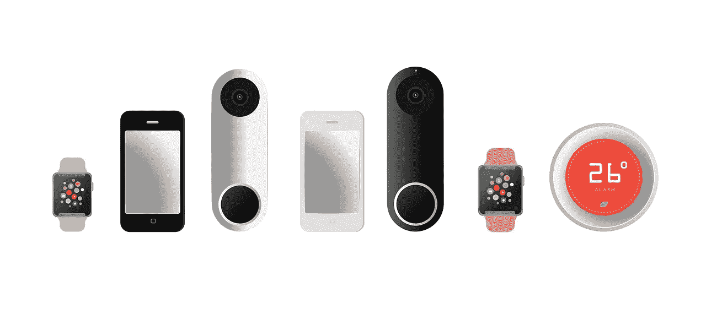

# Web 开发的未来

> 原文：<https://medium.com/hackernoon/the-future-of-web-development-8da936743d5c>

## 剧透:写代码会变得容易得多

预言不是一件容易的事情——当观察社会现象时(web 开发是一种社会现象),人们很清楚不要期望从当前事件到未来的简单线性投影。

收集数据和观察趋势总是会留下一些未被注意的事实，一些被忽略的趋势，并且很可能包括本应被忽略的无关数据。话虽如此，做出一个有根据的猜测可能比选择对未来保持完全的冷漠和遗忘更有益。

作为软件开发人员，我们有责任预测未来，并相应地提供长期解决方案。

Web 开发，作为一套技术、实践和机构，主要由两种力量形成:硬件，或者更具体地说，消费设备，以及同样古老的对财务收益的永恒追求。当承担预测 web 开发未来的任务时，对这两者的调查应该是我们的起点。

# 消费设备多样化的增加

在过去的几年里，我们已经看到了消费设备多样性的爆炸式增长——智能手表、智能眼镜、智能扬声器、智能电视、可折叠智能手机等。—在这个物联网的[时代，当一个新的‘东西’戴上‘智能’的帽子加入这个俱乐部时，我们几乎不会感到惊讶。](https://blog.bitsrc.io/10-javascript-iot-libraries-to-use-in-your-next-projects-bef5f9136f83)

作为 web 开发人员，这一切对我们意味着什么？设备的更大多样性意味着平台以及输入和输出的类型和形状的更大多样性。为有限范围的设备提供单一网络应用程序(或网站)的日子已经一去不复返了，所有这些设备都配备了一个方形的大屏幕和一个网络浏览器。

如果我们的目标是最大限度地利用我们的网络应用，我们必须提前计划，让它们在大量不可预测的设备上可用。这意味着，以这样一种方式构建它们，使我们能够轻松地将它们定制到任何现有的设备上，同时也为下一个新事物做好准备。

# 网站开发太贵了

软件开发商很贵。优秀的开发人员短缺，对他们的需求不断上升。[据预测](https://www.techrepublic.com/article/good-news-programmers-there-will-be-253000-new-software-developer-jobs-by-2026/)到 2026 年，仅在美国就将创造超过 253，000 个新的软件开发职位。这意味着更多的钱花在非常昂贵的劳动力上。

迄今为止，市场做出了一些有限的反应。我们已经看到了面向低技能程序员或实现者的拖放式低代码平台的兴起。Google App Maker、微软 Power Apps 和 Wix 等网页设计平台只是其中的几个例子。

显然，尽管这些平台很好，但它们远不是问题的完整解决方案，因为它们的局限性太大，无法广泛使用。如果当前的趋势不改变，我们不仅会遇到昂贵软件的问题，而且我们还可能会看到不合格的开发人员编写的糟糕代码，这些代码最终会被证明是糟糕的软件。

# 写代码太难了

到目前为止，我们已经讨论了两个主要问题:

1.  越来越难跟上设备日益多样化的趋势
2.  就像任何其他自然资源一样，我们正在耗尽开发人员😃

这两个问题有一个共同的原因——写代码太难了！正因为如此，没有“代码机械师”，只有工程师。每项工作都需要专家，每项任务都需要处理脆弱和晦涩的代码——即使对专家来说，这也是一件可怕的事情。

谈到基于 JavaScript 的 web 开发的未来，我们面对的是一个丰富、复杂且快速变化的生态系统。因此，每项工作都需要掌握大量的工具、技术和架构。

# 为什么构建 web 应用程序如此困难？

编写 web 应用程序需要大量的工作。有很多不同的部分需要考虑，每一个都有可能导致整个应用程序失败。正如彼得·张在他精彩的[博客文章](/the-node-js-collection/modern-javascript-explained-for-dinosaurs-f695e9747b70)(“现代 JavaScript 为恐龙解释”):

> “我们从普通的 HTML 和 JS 发展到使用**一个包管理器**来自动下载第三方包，**一个模块捆绑器**来创建一个脚本文件，**一个传输器**来使用未来的 JavaScript 特性，以及**一个任务运行器**来自动化构建过程的不同部分。”

“组件”和“模块化”这两个词最近被频繁使用。web 开发领域的局外人可能会被愚弄，认为现代 web 应用程序就像乐高一样——由原子代码块组成，每个都能够独立运行，每个都可以轻松替换。

事实上，虽然我们的应用程序是以模块化的方式构建的，但它们只是表面上的模块化。模块或组件依赖于其宿主项目中的许多其他代码，它们依赖于项目的编译器，它们依赖于项目的一个或多个存储库。

**在网络应用中移动棋子——不像乐高，更像堆垛机。**

# 组件，组件，组件

我的朋友们，未来在于组件——真正的组件。如前所述，“组件”和“模块化”是 web 开发领域备受推崇的概念。

这方面的证据随处可见，无论是 React 等组件驱动的前端框架的巨大成功，标准组件模型(也称为“web 组件”)的概念，为组件构建的[工具](https://github.com/teambit/bit)的增长，微服务等后端架构的普及，更模块化的存储库(如 Lerna)的发展，甚至是最近对函数式编程的大力强调。

在我们继续单向讨论组件的优点之前，让我们暂停一下，来清楚地定义一下组件实际上应该是什么样子。为此，让我引用《自由人》、《TodoMVC》和《材料设计简装》的作者 Addy Osmani 的[话:](https://addyosmani.com/first/)

> 组件应该是集中的、独立的、可重用的、小的和可测试的

而且—

> “如果你正在构建与社区甚至仅仅是你的团队共享的组件，问问你自己，你的 API 中的特性是否会被 90%的用户使用。如果是这样，它可能是非常核心的功能，应该保留。如果一个特性会被 10%的人使用，那么它应该是一个独立的组件或者模块。避免代码膨胀。”

太好了。既然我们已经解决了这个问题——让我们回顾一下编写组件化代码的所有好处:

*   **组件易于共享和重用:**这一点不用多说。如果你以组件优先的心态编写代码，你将更容易在其他项目中重用它，甚至与你的团队和社区中的其他人分享它。具有清晰 API 且没有副作用的定义良好的组件是一件值得处理的事情。
*   组件允许关注点的分离:把你的代码写成组件使得关注点的分离成为一件很自然的事情。每个组件负责一项任务或功能。这样可以更频繁地推送更新，让您更加安心。它还将允许在项目的业务方面和 It 的开发方面之间有一个共同的语言，因为两者都是面向特性的。
*   **组件让你的代码更容易测试&保持:**这也是一个不用动脑筋的问题。编写单一用途的小而简单的代码，使理解、测试、更改和替换你的代码变得轻而易举。
*   **组件允许更抽象和友好的编码:**最后但肯定不是最不重要的是以更抽象的方式处理代码的能力。这意味着——组件不需要理解代码的一点一滴就可以使用。一个好的组件是一个抽象的实体，可以以类似 API 的方式使用。

# **更简单的编码**

组件允许更健壮的开发。代码片段可以很容易地共享、重用、更改和替换。这意味着，让你的应用适应任何情况都要容易得多。在一个由组件统治的开发世界中，一个应用程序更像是一组乐高零件，每一个都可以重复使用，而不是一个巨大的可怕的野兽。

# 从工程师到建筑师？

组件甚至可以在行业中扮演新的角色——不仅是工程师，还有组件架构师。前一个小组将处理具体的代码——它将确保代码编写正确并得到充分优化，而后一个小组则负责编写新的应用程序或分子组件。这是双赢的局面。**以更快的速度和更低的成本制作出优秀的代码。**

# 我们时代的先知

几年之内，web 开发的历史经历了 JQuery 的“页面时代”, Angularjs 和 Backbone 的“mvc 时代”,以及 React、Angular 和 Vue 的组件时代。Web 组件就要出现了。

当想到我们即将完全组件化的开发世界的预见者时，许多技术浮现在脑海中——但是，为了使这篇文章简明扼要，我将跳过购物清单，只列出几项，以我个人的拙见，它们在将组件概念推向未来的方式上是非常出色的。还有很多同样重要的事情。

## 和朋友反应

[React](https://reactjs.org/) 当然不需要介绍，但如果我不在“推进组件概念”的技术列表中提及它，我会很不公平。React it 是一个超轻量级的前端框架。它是如此的轻量级，以至于很难将其视为一个完整的框架。

引用 React 的官方博客:

> “React 不是一个 MVC 框架。
> 
> React 是一个用于构建可组合用户界面的库。它鼓励创建可重用的 UI 组件，这些组件呈现随时间变化的数据。"

为什么这很重要？好吧，任何真正推动封装和可重用组件使用的技术都不能是笨重的框架，否则，它就达不到目的。

React 的设计方式将 web 开发中的两种不同的实践分离开来:构建和组合。

> " **React 不使用模板。**(着重部分由作者标明)
> 
> 传统上，web 应用程序 ui 是使用模板或 HTML 指令构建的。这些模板规定了您可以用来构建 UI 的全套抽象。
> 
> React 通过将用户界面分解成组件来构建不同的用户界面。"

而且—

> "构建管理自身状态的封装组件，然后将它们组合成复杂的用户界面."

展望新的未来， **web 组件**将带来不可避免的净化，[将围绕**框架无关组件**巩固 web 开发](https://blog.bitsrc.io/prototyping-with-web-components-build-an-rss-reader-5bb753508d48)。我们已经可以看到它正在发生([工具](https://blog.bitsrc.io/7-tools-for-developing-web-components-in-2019-1d5b7360654d)、[库](https://blog.bitsrc.io/9-web-component-ui-libraries-you-should-know-in-2019-9d4476c3f103))。

## 少量

> “在 Bit 的理念中，组件是构建模块，而您是架构师。Bit 只是消除了实现这一点的障碍……”

[Bit](https://bit.dev) 实现了从表面上的模块化到完全意义上的模块化的向前跳跃。这是一个[开源工具](https://github.com/teambit/bit),让您可以轻松地在不同的项目和应用程序之间共享和管理您的组件。

它独立地跟踪你的组件，并把它们和它们的依赖项、编译器和测试器封装在一起输出。然后，组件可以被包管理器使用，或者直接用于新的项目。

Bit 允许您控制和管理跨多个项目和应用程序的源代码更改和组件依赖关系更新，因此存储库不再限制模块性或它们之间共享的代码量。

Bit 还确保每个组件都可以通过其组件中心 UI 和搜索引擎轻松发现。您可以在组织甚至整个开源社区中搜索组件。当你找到你要找的东西时，Bit 的 live playground 会把它呈现给你，这样你就可以亲自尝试了。

 [## 将可重用的代码组件作为团队成员共享

### 轻松地在项目和应用程序之间共享可重用组件，以更快地作为一个团队进行构建。合作开发…

bit.dev](https://bit.dev) 

## **成帧器**

对于设计者来说，Framer 是一个很好的原型工具。它的独特之处在于它允许你设计用真正的 JS/TS 编写的实际组件。它把新发现的模块化带入了 web 设计世界，巧妙地利用组件时代为应用程序设计带来了新的可能性。

有了开发者端的 Bit 和设计者端的 Framer，对于那些希望看到应用程序构建更像是组件的组合，从 idea 到全功能应用程序的人来说，这似乎是一个非常有前途的未来。

> Framer X 中的组件是真正的交易。从产品中引入它们，或者从设计或代码中创建自己的产品。让每一个动画和微交互都恰到好处。为每个组件创建自定义 UI，并在多个项目中重用。

 [## 闪电般的交互式设计工具。

### Framer 是您为任何平台创建交互式设计所需的唯一工具。为 Dropbox 的产品团队提供动力…

www.framer.com](https://www.framer.com/) 

## 结论

回顾过去，我们已经从 JQuery 一路发展到了 web 组件和 ES 模块时代的边缘。

想象一下，拥有强大的模块化应用程序会有多棒。永远不用写两遍相同的代码。能够以更简单、更友好的方式处理代码。更加关注逻辑和组合，而不是我们正在构建的实现和集成细节。

这是一个软件开发不断加速的世界的未来。

## 点击此处了解有关 indepnet 组件的更多信息:

 [## 独立组件:网络的新构件

### 为什么你所知道的关于微服务、微前端、monorepos 甚至普通的旧组件库的一切…

blog.bitsrc.io](https://blog.bitsrc.io/independent-components-the-webs-new-building-blocks-59c893ef0f65)  [## 为采用和扩展构建一个反应式设计系统

### 通过独立组件和可组合架构实现 DS 扩展和采用——附示例。

blog.bitsrc.io](https://blog.bitsrc.io/building-a-react-design-system-for-adoption-and-scale-1d34538619d1)