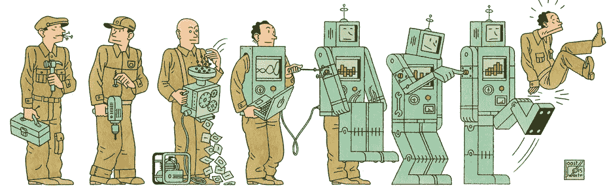

# 未来的工作变化很快

> 原文：<https://medium.com/hackernoon/the-future-of-work-is-changing-fast-dfd4f12cfe69>

**我尝试更持续地写我觉得有趣或花时间思考的事情。我希望今年能写 10-12 篇作品。**

即使在我工作的最初几年，我也感觉到了逐渐远离中心的转变(这里我们不是在谈论政治)。优步司机现在从萨克拉门托通勤到三藩市工作，萨克拉门托是最近的经济适用房堡垒。朋友们搬出了城市，寻找新鲜空气、新的机会、更好的教育和住房。这里的主要潜流是新的经济机会正在取代旧的机会。这里有许多分支，但最令人兴奋和担忧的方面之一是变化的速度似乎在加快

这些宏观和中观层面的转变告诉了我们公司和员工会如何反应或适应？展望未来五年，我认为我们将看到新工具的影响越来越大，这反映了日益分散的劳动力、对数据收集和自动化的进一步重视、更加集成的服务以及核心任务需要人工参与的变化。

# **自动化**

工作传统上根据技能分为四类:非熟练、半熟练、熟练和高技能。

然而，我认为工作更好理解为一组通常执行的核心任务。这些核心任务可以越来越多地被归类为“已经自动化”、“通过自动化增强”或“还不能自动化”。一份 [2017 年麦肯锡报告](https://www.mckinsey.com/featured-insights/employment-and-growth/technology-jobs-and-the-future-of-work.)发现，60%的工作至少有 30%的任务可以使用当前的技术自动化。受自动化影响的工作将不仅限于低技能和低工资的工作。事实上，我们已经看到了放射学的进步，传统上这是报酬最高的工作之一，在这里，强大的数据集被用于实现类似或优于人工审查的结果。

只要人力资本成本继续超过替代技术的感知价格，自动化已经并将继续是一个主题。这意味着相对复杂的低工资任务将继续蓬勃发展，因为开发自动化解决方案的成本相对较高，例如修剪树篱和种植花卉的园林设计师。另一方面，涉及创造性、复杂性和灵活性的任务传统上被证明对自动化具有弹性，但可能不会在同一时间框架内下降。我们将看到传统上安全的白领工作“因自动化而增强”，尤其是在医疗保健领域。从历史上看，我们经常看到宣传和采用之间有 2-5 年的滞后，所以我很高兴看到像 [Project Ronin](https://www.projectronin.com/) 、 [Canvas Medical](https://canvasmedical.com/) 和 [Epharmix](https://www.epharmix.com/) 这样的公司看到了对肿瘤学、初级保健和患者拓展的进一步渗透。

在光谱的另一端，可能证明最抵制自动化的任务将是那些人们对人类互动有习得偏好的任务。虽然我更愿意与护士交谈，而不是与机器交谈，但即使是这些偏好也可能会随着时间的推移而改变；人口的转变和技术的进步可能会看到这一点。

## 新技能，新工具

随着更多的角色通过工作场所的变化被合并和淘汰，对新技能的需求将会出现。公司和工人都将受到激励去获得额外的技能。从历史上看，这可能是由职业学校填补的，最近则由在线课程和编码训练营填补。我认为我们看到了对教授人们新技能的新服务的持续需求。

随着员工技能的提高，我们应该会看到工作场所使用的工具在硬件和软件方面的变化。在硬件方面，我预计免提 AR 设备的使用将会增加，这将有助于经常用手完成任务的专业人士。在软件领域，我们将会看到灵活的、集成的、技术性更强的界面的使用越来越多，因为工作人员在工作中会变得更具技术性和分析性。我们还应该看到，用户对自动化工具的好处有了更好的认识，这些工具将机械的任务从他们的盘子中移除。为此，我很高兴看到像[重组](https://tryretool.com/)、[观念](https://www.notion.so/)、[空中桌](https://airtable.com/)、[扎皮尔](https://zapier.com)和 [X.ai](https://x.ai) 这样的工具在组织中被更广泛地采用。

# **数据功率**

获取海量数据集的能力，同时成为未来五年工作开展方式的主要驱动力之一。数据的涌入将来自数十年的数据数字化、人工收集的集中努力和传感器。传感器将无处不在，在家里，工厂，运输，商店，仓库，街道，以及两者之间的任何地方。我认为未来五年将会出现利用机器学习来利用这些专用数据的新技术。我们将会看到这一技术在所有行业中的应用，但我认为我们将会看到制造业、卫生、零售业和运输业的最大变化。

先关注一下制造，我期待看到迭代速度的加速。在时尚行业，我们已经看到供应链的优化缩短了创意储存的时间。其他行业将受益于本地化增材制造等优化措施。依靠像[伏都教制造](https://voodoomfg.com/)和[起源](https://www.origin.io/)这样的供应商，公司可以从他们的产品开发周期中节省数周时间。公司可以在内部/附近构建和迭代样品，从而将交付时间从数周缩短到数小时，而不必将设计发送到世界各地进行测试，然后再运回。

## 数据共享

我们目前开始看到一个新的关于数据聚合的思想流派出现。以前，主要趋势是将数据聚合到单独的数据仓库中。Segment 帮助公司在内部跨服务连接数据。谷歌和阿里巴巴(以及它们投资的公司)有接触点来收集每次线上和线下互动的数据。现在，我们看到了这种在不同实体间共享数据的逆向运动。我并不期望普遍看到这一点，因为许多现有公司有太多的动机放弃他们的宝贵数据，但我确实看到了金融、保险和医疗提供商从共享数据中受益的机会，以降低(合规)成本并提高(交易)速度。我们首先必须看到 POC 的持续成功，如日本的支付卡联盟(Payment Card Consortium )( T1 ),它将在处理器之间共享数据，以减少欺诈事件，然后才能看到落后的采用者在 5 年内更广泛地采用。

# **新的工作环境**

## **远程工作**

受到工作灵活性增加的长期变化的鼓舞，我认为我们将看到人们越来越多地在偏远地区作为个人工作。越来越多的人将扮演随需应变的角色，利用新的个性化商业模式，如社交媒体，并权衡集中式商业设施以获得更大的灵活性。这将导致对协作、创造、管理、分配和货币化的新工具和组织流程的需求。此外，任何未来的衰退都会加速这种转变，因为公司希望降低成本，导致更多的人被困在家里，寻找替代的收入来源。

## 通勤时间:0

我真的对自主通勤的潜力感到兴奋。根据最近的美国人口普查，一个普通人每天花大约一个小时在通勤上。每年有 36 亿个工作日花在交通上。想象一下，与其坐在方向盘后面，不如花这些时间去处理其他任务。公司也可以通过多种不同的方式将这些游乐设施货币化。我对广告和定制移动工作空间的潜力特别感兴趣。

有人可能会认为，日益自动化的交通和远程工作之间存在矛盾。更多的远程工作者是否意味着更少的人通勤，或者远程工作者是否会抑制自动交通的使用？实际上，我认为这两种趋势有一个共同的主题，即以增加灵活性的名义打破传统的 5 天/ 8 小时工作制。已经有[大量的](https://www.oxfordeconomics.com/when-the-walls-come-down) [研究](https://royalsocietypublishing.org/doi/full/10.1098/rstb.2017.0239)表明当前的开放式办公室是如何抑制生产力的，使得集中办公成为协同工作的理想场所，但也许不适合个人工作。很容易想象这样一个世界:员工可以灵活地为他们给定的任务选择最佳的工作环境。

## 综合服务

在工作的福利方面，我相信我们会看到雇主越来越多地提供更综合的服务，以吸引和留住人才。最大的公司已经为他们的员工提供了一些金融、娱乐、儿童保育和医疗保健服务的组合。综合医疗保健是显而易见的。

> 医疗保健是仅次于员工工资的第二大支出，并且仍然是雇主增长最快的运营支出。

我认为，我们将看到大型公司集中努力，提供更加集成的医疗服务，如现场诊所、远程员工的远程医疗访问，以及利用预测分析和可穿戴数据来提高利润率。WeWork 正在为他们的成员走上这条道路，而像 Collective Health 这样的公司正在帮助小公司实现转型。我也期待看到在精神和情感健康方面投入更多的资源，这是一个继续与耻辱和人员短缺作斗争的领域。

自动化、工具和分发是重复出现的主题，我们已经在过去的许多迭代中看到过。对我来说，我认为每一两年重新审视这些主题是一种有用的做法，既可以产生新产品创意，也可以了解提升技能可能有价值的领域。

你怎么想呢?你是否不同意或认为有更重要的主题将定义未来五年的工作？

## **脚注**

我在这里的想法大多适用于美国，在那里我有最多的接触和经验。虽然 2018 年我在中国度过了 20%的时间，但我可能会花一些时间思考中国的工作如何在邻近但有些重叠的道路上发生变化。

非熟练工人的例子有出纳员、清洁工、建筑工人和农场工人。半熟练工人完成重复性任务，但需要一些培训和监督。例子包括卡车司机，餐馆服务员和厨师，以及客户服务代表。技术工人包括教师、电工、销售代表和执法人员。任务需要决策，但培训可以在相对较短的时间内完成。高技能工人包括医生、律师、建筑师、科学家、工程师和财务经理，他们经常必须在各种不确定的情况下做出决策或产生新的想法。

与此相关的是，对于收入分配差距扩大的影响，我还没有一个明确的论点。