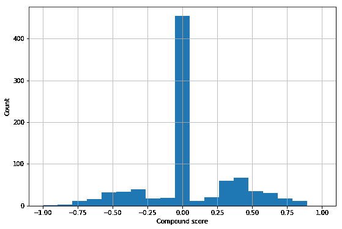
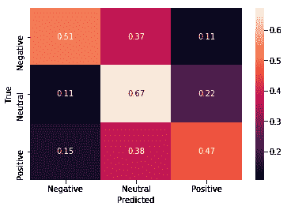
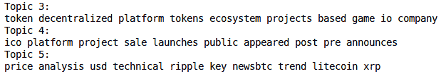
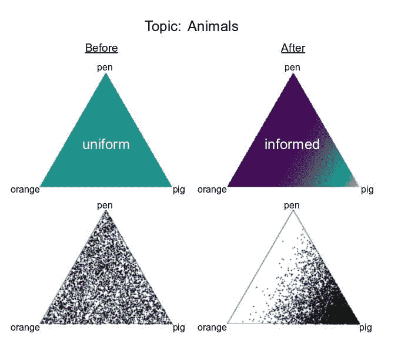
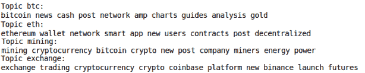
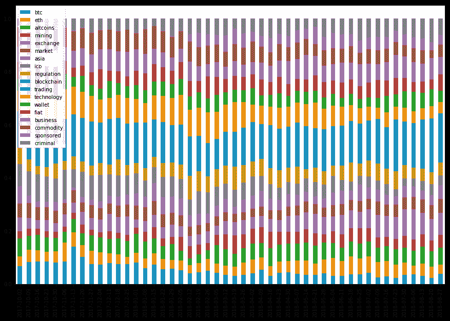
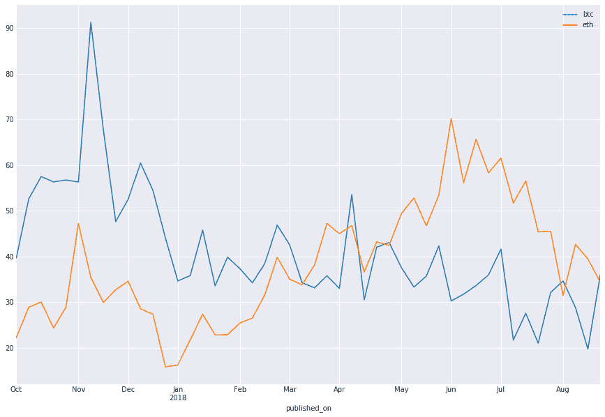
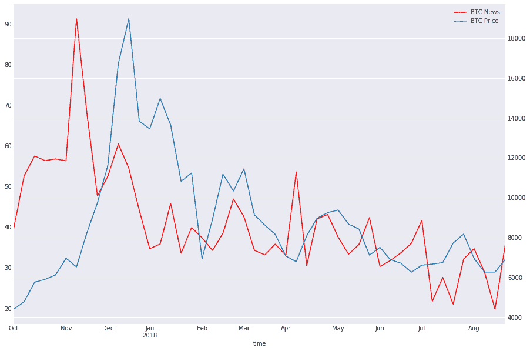

# 游戏改变因素——加密货币的情感分析

> 原文：<https://medium.com/hackernoon/the-game-changing-factors-sentiment-analysis-for-cryptocurrencies-e18d79899a20>

情绪是加密货币市场的一个巨大驱动因素。但这是一个很难衡量的指标。过去几年，情感分析一直在兴起。随着新软件包的引入，情感分析可以比以往任何时候都更快更有效地完成。在这篇文章中，你会看到为什么在社交媒体上观察情绪对于情绪分析来说不是一个好主意。此外，你将了解人们对话题的兴趣是如何随着时间的推移而变化的。

使用社交媒体的情感分析

使用[社交媒体分析结果](https://www.netbase.com/blog/20-free-social-media-analytics-tools/)预测市场情绪是很棘手的。从分析中发现，当加密价格上涨时，人们会通过他们的社交媒体账号分享积极的信息。当价格下跌时，人们变得消极，并在社交媒体平台上分享负面帖子。

VADER 是[简化情绪分析](/analytics-vidhya/simplifying-social-media-sentiment-analysis-using-vader-in-python-f9e6ec6fc52f)的一个伟大工具。使用它和 NLTK Python 包，我们在 Reddit 上做了情绪分析。使用的脚本是 Jupyter 笔记本的形式。

该脚本将从 Reddit 的 API 中提取数据。然后，它会为每个帖子分配一个复合分数。现在，这个分数预测了帖子里的情绪。分数介于-1(非常负面)和 1(非常正面)之间。下面给出了情感得分的分布:

连续光谱被分类如下:正柱、负柱和中性柱。要做到这一点，确定每个标签对应的分数是很重要的。此外，有必要提出一个适当的分类界限。因此，使用[逻辑回归](https://www.statisticssolutions.com/what-is-logistic-regression/)对数据子集训练分类器。帖子是手动标注的。在标记了几百个之后，得出了一些结论:

*   这些帖子大多是中立的，或者是困惑的密码初学者写的。
*   情绪和它的潜在含义是不同的，当你把这两者作为一个人来标记时，很难把它们分开。

结果如下所示。很明显，计算机标签和人工标签的结果是不一样的。

在给标题加标签时，很难区分上下文和情绪。问题是人们押注于加密货币的任何一方。对你来说一件快乐的事情对其他人来说可能是一件悲伤的事情。考虑以下两种说法:

*   “比特币市场崩盘留下了一片初创公司的墓地”
*   “比特币崩盘对投资者来说是个好消息”

现在这两种说法都是关于同一个主题，但是观点是相反的。因此，在预测加密货币价格时，很难使用情绪来分析情绪。

那么，估算加密货币价格的另一种方法是什么呢？在人们对虚拟货币产生浓厚兴趣的时候，与加密相关的帖子数量会增加。量的增加会导致价格上涨吗？两者有什么联系吗？

为了获得更好的想法，查看某些主题的帖子数量会很好。不同主题的帖子会对加密价格产生不同的影响。关于加密漏洞的帖子会对价格产生负面影响。另一方面，像比特币的高安全性这样的帖子会涨价。

我们在社交媒体平台上看到的帖子，如 [reddit](http://reddit.com) 、 [mamby](https://mamby.com) 、 [twitter](https://twitter.com/login) 等。非常短，并且它们不能为情感分析提供一个好的集合。有一个[新闻 API](https://min-api.cryptocompare.com/) 综合了所有主要新闻渠道关于加密的文章。这些文章有正文和标题，可以用于更好的分析。这也省去了大量内容抓取的麻烦。

现在的问题是，如何将这些文章归入不同的主题？嗯，这个可以借助[潜狄利克雷分配](/@lettier/how-does-lda-work-ill-explain-using-emoji-108abf40fa7d)。

LDA 背后的基本概念是从文本中找到的不同单词中学习主题，然后确定文档是关于哪个主题的。

**LDA 的阶段如下:**

*   为每个主题创建一个分布，告诉你对它所包含的单词的理解。此外，为每个文档创建一个分发包，定义您对其中包含的主题的理解。
*   通过从初始分发中随机抽取每个主题，为每个文档分配主题。对单词也做同样的操作。
*   做一个优化，把最自然的单词分组安排到那些主题，把主题安排到文档。

LDA 不受监管。人们无法知道一个主题将包含哪些特定的单词，或者一个文档将具有哪些主题。为了简单起见，最好指定“均匀分布”作为先验。此外，很难预测文档中的主题数量。所以，这个数字只是一个猜测。

LDA 系统在 27 个主题的大约 48，000 篇新闻文章上实施。以下是我们发现的一些话题:

可以得出结论，题目 4 是关于 ICOs 的。然而，不可能用它来预测所有的主题。目标是使用这些主题预测价格。但是这些话题并不容易解释。因此，使用 LDA 进行价格预测有点困难。

每天都有大量关于加密货币的新闻通过[小册子印刷](https://www.55printing.com/cheap-brochure-printing/)、新闻文章或社交媒体传播。还有一些主要的话题。为了对价格做出正确的估计，最好确定一些主题，而不是随机选择一些主题。当有一些共同的主题时，告诉算法什么单词应该属于哪个类别会更容易。因此，没有必要使用统一的先验。

Example topics from pre-defined topic LDA

我们可以指定一些在特定主题中可能出现的单词。例如，我们可以指定比特币可能包含 BTC、Satoshi 等词。

这里有一些使用这些主题的初步设想。

Topic allocations over time as a percentage of all articles published.

Bitcoin vs Ethereum news articles over the last year

或许与价格有某种关联。在社交媒体上做了一些情绪分析，以及一些无监督的话题分类之后。使用 LDA，可以对价格做出合理的预测。研究得出结论，通过社交媒体进行情绪分析不如 LDA 方法有效。