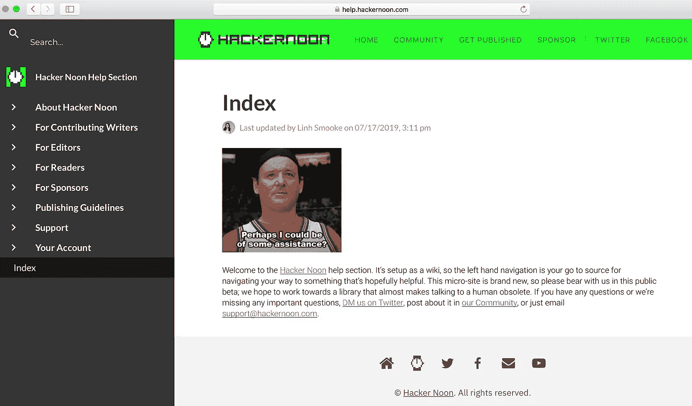
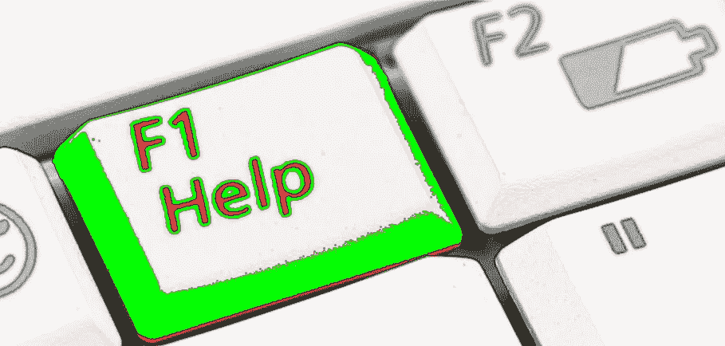

# HTTPS://救命。HACKERNOON.COM

> 原文：<https://medium.com/hackernoon/the-hacker-noon-help-section-new-via-support-hackernoon-com-b86265a9509b>

## [Help.HackerNoon.com](http://Help.HackerNoon.com)

查看 [**黑客午间帮**章节](http://help.hackernoon.com)。它被设置成一个 wiki，所以左边的导航是你找到有用信息的来源。您也可以在左上角搜索文档。这个微型网站是全新的，所以请在这个公共测试中容忍我们——还有更多的资源要添加。我们希望开发一个几乎让与人类对话变得过时的库(但是人类可以通过[support@hackernoon.com](mailto:support@hackernoon.com)联系到我们，或者可以在 Twitter 上联系到我们 [DM us，或者在](http://twitter.com/hackernoon)[我们的社区](https://community.hackernoon.com/) …)上发布相关信息)。

## 这个帮助部分是用[你需要一个 wiki](http://youneedawiki.com) 创建的，在这里任何人都可以用你的团队想要使用的 Google Docs 创建一个 wiki。

# 最受欢迎的页面:

## [**1。你所需要知道的关于黑客正午的过渡介质的软件**](https://help.hackernoon.com/app/page/1uNH9LJ9-2lFUukcceNjYeguF3QgT4RZhhMP0XZFktpk)

## [②**。一步一步的指导连接你的介质帐户到你的黑客中午帐户**](https://help.hackernoon.com/app/page/1lDCt9BDTNOQDV7XsOchDBXsmnicvdwa8hw5EFopkDS4)

## [**3。我应该如何重新命名我在 Hacker Noon 上发布的帖子？**](https://help.hackernoon.com/app/page/1TrwS7NQ87YMClYuAff65OUNWKkt8r935kHxOgMApEtM)

## [**4。账户创建疑难解答**](https://help.hackernoon.com/app/page/1fWmAG6zSc-EuxBhHYt-tUIR0wfefRxkmpVRD46byKTw)

## [5。通过作家广告](https://help.hackernoon.com/app/page/1SbI75hPiZa1lK13KpL_1ZmaYQ9IFBKXBtjmJDe5w5M4)发出自己的行动号召

## [6。黑客午间常见问题只有 6 个字的答案](https://help.hackernoon.com/app/page/1QwJn28fApYXrJD8ur5iAWVysQoqN10PDMMo9_CIIHJQ)

## [7。通过 LunaPic 技巧制作黑客正午绿色精选图像](https://help.hackernoon.com/app/page/13ySMEdnR4pct6IiV6zlbyXAxtV_Xq2g2NDZ4WsW_LMQ)

## [8。黑客正午](https://help.hackernoon.com/app/page/1gRbkfKlrfqztzZDQzHGp4v2U0G36alVmE7iODP4d9rg)发布你的完整指南

*我们遗漏了什么重要的* [*帮助帖*](http://help.hackernoon.com) *或者你还有什么更具体的问题吗？* [*在社区发帖*](http://community.hackernoon.com) *或发邮件给我们:*[*Support@HackerNoon.com。*](mailto:Support@HackerNoon.com)

# 帮助部分的更多信息:

# [关于黑客正午](https://help.hackernoon.com/app/page/1XSdUKcTTXYRRtpgjTdv0Irl30ejLj7cP):

# [常见问题解答](https://help.hackernoon.com/app/page/11lMs1TTjs6y119cC5DDhaSOsE2CMpyPX)

# [供稿作家](https://help.hackernoon.com/app/page/15lmUtOWKyEDWUQJky9uWSMuL-ozFLgWF)

# [供编辑使用](https://help.hackernoon.com/app/page/1YneRst1EutHWqgiT1BfNwqE-Ae3gxp5Z)

# [给读者](https://help.hackernoon.com/app/page/1YneRst1EutHWqgiT1BfNwqE-Ae3gxp5Z)

# [为赞助商](https://help.hackernoon.com/app/page/1lG3bQoYboOXQe-xXZ8H9T44gtK9m7sI8)

# [出版指南](https://help.hackernoon.com/app/page/1FE72rYW0GnFSGeM7G1CFI3GI2umdoF4V)

# [支持](https://help.hackernoon.com/app/page/1_-fdOMIUAx-Rh8zx2o_QSXxUrlLkqIgc)

# [你的账户](https://help.hackernoon.com/app/page/1-v29I7uYy_1mSZxdZIMcQmz_GtIBicNu)