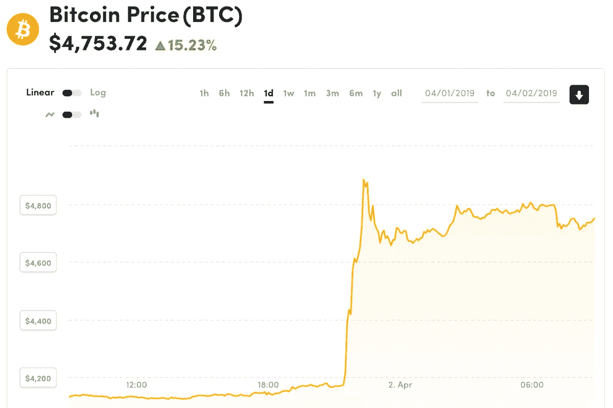

# 比特币价格一夜暴涨的潜在影响

> 原文：<https://medium.com/hackernoon/the-hidden-implications-of-bitcoins-overnight-price-jump-61b541dcc2bb>

就寝前，我做了一件正常人不该做的事。

我查了推特。

[马蒂·本特](https://twitter.com/MartyBent)，我的#比特币追随者之一，发布了一条间接但积极的关于比特币价格的微博……*某事*。

我查看了 Coindesk，看到 BTC 的价格在攀升——然后花了 30 分钟，冰毒瘾君子在 Twitter 和加密图表之间切换，看着数字从 8%飙升到 13%到近 20%。我感到甜蜜的满足感，既高兴市场正在好转，又希望自己在低迷时期买了更多的比特币。

幸运的是，对我的家人来说，我对交易一无所知，只知道我太情绪化了。因此，我没有在深夜购买 FOMO，而是在 twitter 上浏览了足够多的 OMG-gif 图片，然后上床睡觉。

# 到早上，灰尘已经(半)落了...

价格出现了大幅上涨，随后随着机会主义卖家获利而略有回落，价格(暂时)比昨天同期高出约 14%。更重要的是，新的平台期代表着比特币在过去几个月里小幅、不确定的价格变动的巨大转变。

但随着这一小时的大幅上涨，我有机会抓住了一个困扰我一段时间的好奇之痒:**比特币市场的流动性如何影响其价格？**

换句话说——可能有更熟悉市场的术语来表达这种想法——比特币的价格波动有多少是愿意购买或出售它的人数的函数，而不是长期的？

> 比特币术语“**hodl**”**有人说是代表“ **h** 老 **o** n 代表 **d** 耳**l**ife”——这是不正确的。其实是酒后错字。由罗马剧作家塔西佗创作。但是我跑题了。但不管 hodl 的起源如何，它表达了铁杆比特币玩家的一种共同情绪:除非在可怕的情况下(战争、饥荒、扑克失败)，否则就不卖。**

**在昨天暴涨之前，比特币的总市值约为 710 亿美元。现在已经达到 830 亿美元了。**

**众所周知，比特币受供求关系的支配——甚至比其他商品更甚——因为它有一个固定的、预定的、无情的供应时间表。最终这将达到 2100 万比特币；今天大约是 1760 万，一个街区一个街区地增加。(这种工作方式很有趣，但是[在别处已经有很好的解释了](https://en.bitcoinwiki.org/wiki/Bitcoin_Emission)，我在这里就不做解释了。)**

# **让我们做一些餐巾数学。**

**在这一行动发生的一个小时里，比特币区块链增加了大约五个“区块”，因此 62.5 个新比特币进入了世界。相对于 1700 万的供应量来说，那是微不足道的。**

**价格上涨——相当于 120 亿美元的市值——是因为出售现有的比特币。(我知道，“咄”，对吧？但是和我在一起。)**

***要卖出多少个*比特币才能这样推高价格？据 BCB 集团的奥利弗·冯·兰德斯伯格-萨迪(美国消费者新闻与商业频道在此引用[的话)称，这一动力是三个 7000 比特币的购买订单分散在三个交易交易所。](https://www.cnbc.com/2019/04/02/reuters-america-update-3-bitcoin-jumps-20-percent-mystery-order-seen-as-catalyst.html)**

**这种大规模购买的原因有待猜测，但许多人怀疑是“空头挤压”——一位之前一直押注*比特币不会出现*比特币的大型交易员改变主意，购买必要的比特币来“弥补”他的金融风险。由于没有足够多的愿意卖的人，这位匿名买家被迫抬高价格来平仓。**

**就像在任何市场一样，当你需要匆忙买很多东西时，人们会注意到…并很容易给你一个蹩脚的交易。在与道德无关的货币交易世界里，这样的诱惑总是会胜出。**

**让我们假设冯·兰德斯伯格-萨迪的数字是正确的，正是购买的 21000 个比特币将 BTC 的价格从 4170 美元推高到 4885 美元。**

**这意味着“只有”9500 万美元的采购。**

# **想想——这有多奇怪？**

**实际花费的 9500 万美元相当于 120 亿美元的市场价值增长。**

**如果你和我一样，不从事金融工作，这类事情会让你暂停、眨眼、核对数字、再眨眼等等。**

**因为这些数字显示了实际发生的对*的影响是*看起来发生的*的 125 倍。***

**在一个小时的时间里，当这个大买家透露他的意图时，市场每卖出一个比特币获得 0.034 美元。**

**这种价格飙升之所以可能，只是因为比特币市场的“流动性不足”。目前全球有 1760 万个比特币。据估计，由于早期用户不小心保管他们的数字钱包的“钥匙”，有 300-400 万个数字钱包永远丢失了。**

**这意味着，实际上，今天只有 1400 万比特币可供购买。**

**而*那个*意味着这个有着 21000 BTC 胃口的鲸鱼般大的买家，试图买下现存所有比特币*的 0.15%。*一小时后。***

> **很酷，这甚至是可能的。在其他商品中，这在技术上是不可行的。如果某个中国皇帝想要购买世界大米供应量的 0.15%——尽管他有资金和士兵这样做——他不可能在一个小时内做出决定，谈判价格，进行实际监管，并确信他成功了。技术就是不存在。**

**让我们考虑一下金融市场的流动性。比特币的价格上涨是因为有愿意出售的卖家——这些卖家意识到他们可以收取溢价并逃脱惩罚。**

**但大多数拥有比特币的人不会将他们的数字资产存放在交易发生的交易所。这条鲸鱼可以购买的实际*人*只有一小部分: **A x B x C** ，其中…**

*   **拥有比特币的人数**
*   **鲸鱼挨饿的那一小时，在交易市场上持有比特币的人所占的百分比**
*   **C =B**B**中确定了销售价格的人的百分比**

****这样的人有多少，他们代表了多少比特币？****

**我们不知道这些答案——除了他们至少可以支付 21000 个 BTC，而且让他们这样做的增量成本是每一个 BTC 比以前的市场价格多 3.4 美分*。***

# **我们来举一反三。**

**接下来的是松散的、粗略的数学，但这一点很重要。**

**昨晚的价格变动意味着，如果一只鲸鱼今天进入比特币市场*寻求购买 445，000 BTC——这一数量仅是全球最终流通供应量的 2.5% *—**这将推高比特币的价格，使其超过 20，000 美元的历史高点**。***

> ****当前硬币，减去假定丢失的硬币，加上所有未来待开采的硬币。***

***现在，回到现实:如果在接下来的几天里，一些比特币所有者从这一突然的价格上涨中获利，而比特币的市值略有下降，没有人会感到惊讶。***

***但是更大的教训应该让我们停下来反思…***

***如果一些非常富有的实体——一个民族国家，一个主权财富基金，等等。—认定市场低估了一种*被证明稀缺、不可膨胀、可数字化交付的*商品的价值，并希望购买全球比特币供应量的 2.5%……今天的价格翻了两番。***

***然后考虑:当*另一个*富有的实体 FOMOs 并决定收购*另一个*百分之一时会发生什么？***