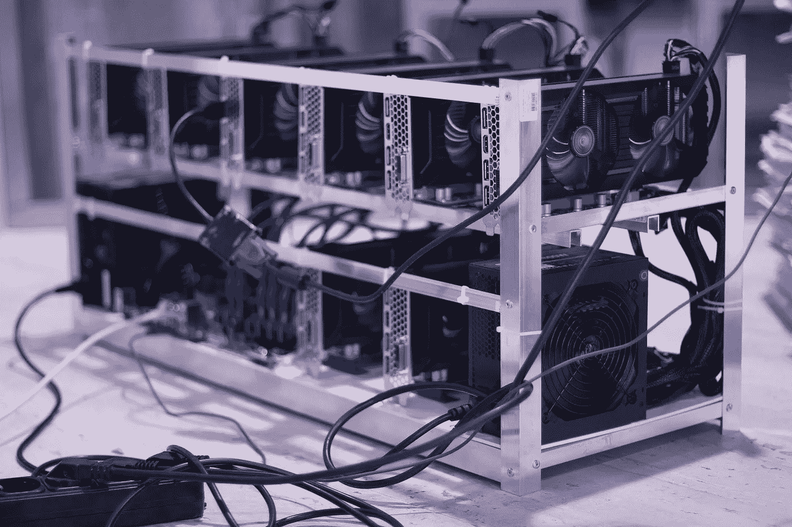

# 51%攻击的历史以及对比特币的影响

> 原文：<https://medium.com/hackernoon/the-history-of-51-attacks-and-the-implications-for-bitcoin-ec1aa0f20b94>

ASICs mining bitcoin. Source: [rebcenter-moscow](https://pixabay.com/users/rebcenter-moscow-6351207/)

在基于工作证明的区块链世界中，没有比 51%攻击更大的安全威胁了。这一直是比特币网络安全的最大担忧，迄今为止，没有黑客事件对比特币网络构成任何重大风险。自然，那些采用比特币首创的工作证明共识算法某种变体的区块链也必须考虑到这种可能性，altcoins 中 51%的成功攻击表明，这远远不只是一种假设场景。在这篇文章中，我们更深入地研究了 51%攻击的性质，它们在现实中是如何表现的，比特币可能被攻破的场景，以及最后一个简单的问题:比特币遭受 51%的攻击值得吗？

**什么是 51%攻击？**

在区块链的工作证明中，矿工们使用强大的计算机来解决数学问题，并发现“哈希”，这是生产下一个区块所需的一个大的十六进制数。这些计算机通常是专门构建的图形处理单元或 GPU，其外观肯定会引起 TSA 代理的相当大的怀疑。鉴于目前比特币和以太坊的巨大规模，即使有一个这样的处理巨兽，首先获得哈希的几率也是微乎其微。因此，个体矿工通常会加入矿池，贡献自己的力量，以换取矿池相应的回报。

这必然导致哈希功能集中到少数几个池中。当这种集中足够严重时，一个池在给定的时间内可以接近拥有所有散列能力的一半。这时，51%的攻击就成了一个问题。如果一个矿池确实设法占据了一半以上的开采权，他们就可能开始制造恶意区块。他们将无法创造新的硬币，但他们可以尝试双倍花费硬币，进行“自私的挖掘”——阻止其他矿工生产区块，或生产空区块，以完全停止网络。所有这些都可以与其他受利润驱动的行动结合起来进行，例如在预期后果的情况下利用杠杆做空交易所。

双重支出仍然是这种情况下的主要威胁，迄今为止 51%的攻击都使用了双重支出。即使在没有检查站的区块链，干扰或重组已经确认的街区也要困难得多，尽管我们将会看到有涉及重组最近街区的实例。

**51%攻击简史**

一些替代硬币遭受了成功的 51%攻击，结果通常是双倍花费。在这些情况下，攻击者将资金发送到多个交易所，然后广播一个秘密挖掘的新块，逆转这些交易。这使得他们可以重复地将相同的硬币兑换成另一种加密货币。

到目前为止，最臭名昭著的例子是针对 BTC hardfork 比特币黄金的，上演于 2018 年 5 月 16 日至 19 日之间，当时 BTG 市值徘徊在 1 亿美元左右。攻击者开始在交易所双倍消费，[从许多交易所带走了价值 1800 万美元的加密](https://www.ccn.com/bitcoin-gold-hit-by-double-spend-attack-exchanges-lose-millions)——比特币和其他东西。这对比特币硬分叉来说是灾难性的，并导致其从那些对结果感到失望的交易所退市，这是可以理解的。它现在的交易价格约为 20 美元，尽管流通供应量几乎与比特币相同。

Source: Wikimedia Commons

以太坊经典在今年 1 月遭受了 51%的攻击，攻击者[重新组织街区](https://www.theblockcrypto.com/tiny/ethereum-classic-has-experienced-multiple-100-reorg-attack/)并开始双倍消费。比特币基地估计总共有 15 次攻击，其中 12 次是双重花费，总计超过 20 万欧元或 110 万美元。比特币基地和其他交易所很快暂停了该货币的交易，之后价格大幅下跌(但 ETC 没有像 BTG 那样从交易所退市)。

2018 年，Verge (XVG)多次受到这些攻击，其中最大的事件导致了价值 3500 万 XVG 令牌的[巨大自私采矿攻击](https://blockexplorer.com/news/verge-blockchain-exploited-again-hackers-steal-1-7-million-in-tokens/)。Verge 的目标阻塞时间是 30 秒，但在去年 5 月成功控制网络的 hashrate 后，攻击者开始以每分钟 25 个块的速度挖掘空块，将块奖励收入囊中。

最后，51%的攻击没有成功。黑客爱好者 Geocold51 承诺在 2018 年 10 月对爱因斯坦进行 51%的攻击，甚至承诺在 Twitch 上直播该事件。爱因斯坦社区通过从 Nicehash 租用额外的 hashrate 击退了这种攻击，nice hash 是最初计划在攻击中使用的 hash 租用服务，使得这种尝试不可行。

成功的 51%攻击的严重性取决于许多因素。当然，硬币的价值还取决于流动性和活跃交易的数量。如果可以在众多交易所同时进行双重支出的扩散，并在此过程中抹去它们的订单记录，那么效率会高得多。51%的成功攻击大多数发生在 2018 年，这背后可能有明显的推理。加密货币市场正在缓慢但持续地下滑，自然，开采受到严重影响的货币的盈利能力也在下降。随着越来越多的矿工退出更小的战俘硬币，他们通过积累大部分哈希力量和攻击这些网络，为机会主义的个人和团体敞开了赌博的大门。正如我们在比特币黄金上看到的那样，这当然带来了回报，并轻松偿还了发动攻击的成本。

**比特币的风险，它值得吗？**

鉴于比特币的成功与其替代品之间的密切相关性，如果 51%的攻击能够成功地对比特币产生影响，其结果将对比特币以及整个市场造成巨大损害。有鉴于此，鉴于目前 BTC 矿业的巨大规模，对比特币网络发起这样的攻击要困难得多。假设条件完美，每小时大约需要[50 万美元](https://www.crypto51.app)来积累开始开采邪恶区块所需的散列能量。由于社区可能会做出快速响应，随着越来越多的哈希功能被添加来抵御攻击，这一成本将会快速上升。此外，该成本仅考虑了电力需求，并假设用户“租用”了这部分电力。为了独立和秘密地建立自己的矿池，光是硬件[就要花费你大约 14 亿美元](https://cryptoslate.com/analysis-bitcoin-costs-1-4-billion-to-51-attack-consumes-as-much-electricity-as-morocco/)(250 万 ASIC 处理器的成本)。

比特币是目前流动性最高的加密货币，也是所有加密交易所的支柱。在这些交易所开始冻结交易之前，将任何重复花费的硬币分散到多个交易所，并带走相当于数亿美元的资金，这将是极其简单的。当然，一旦攻击为人所知，市场可能会迅速萎缩，因此攻击者必须确保在他们可以带走的任何货币受到打击之前，成本会很快收回。

考虑到所有这些，有一个共识是，无论从短期还是长期来看，发动 51%的攻击都不如诚实采矿有利可图。事实上，已经接近比特币散列能力 50%股份的矿池在过去已经自愿收回了这一点，现在已经解散的 GHash [公开宣布，在他们对网络总量的主导地位引发担忧后，他们将把散列总量限制在 40%](https://techcrunch.com/2014/07/16/popular-bitcoin-mining-pool-promises-to-restrict-its-compute-power-to-prevent-feared-51-fiasco/) 。

**如果利润不是驱动因素呢？**

我们知道 51%的攻击在任何工作证明货币中都是可能的，并且我们知道当一个货币成功安装时的主要风险是什么——即双重花费和自私的开采。尽管这仍将对比特币构成威胁，但这种严重攻击发生的可能性似乎相当低，更不用说成功了。然而，这是假设驱动力是利润。跟踪比特币安全性的研究人员定期指出[政府与矿池的合作，无论是通过贿赂、胁迫还是其他方式](https://static.zebpay.com/web/pdf/Bitcoin-Security-White-Paper.pdf)，都是比现金抢夺更有可能导致 51%攻击的动机。这种动机在现实中是否存在尚不清楚，更不清楚的是实现这种攻击的假设目标的现实。当然，比特币的市值和加密货币的总市值将受到极大影响，但这种影响会持续多久谁也说不准。

Viewnodes 编辑拜伦·墨菲的文章。所有观点均为作者个人观点。有关 Viewnodes 提供的一些服务的信息，包括我们的 Tezos 委托，请单击[此处](https://www.viewfin.com/viewnode/tezos/#aboutus)。